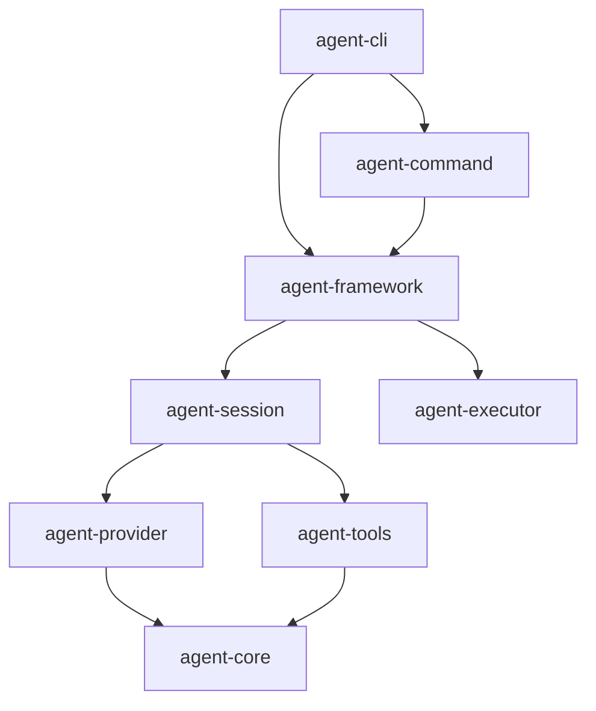

## Background

웹 디자이너 분석 결과: Playground 첫 화면이 "Loading Playground…" 텍스트만 있고 WS 연결 실패 시 사용자가 무엇을 해야 하는지 알 수 없다. 또한 아키텍처 문서의 다이어그램이 ASCII 텍스트로만 표현되어 시각적 이해가 어렵다.

분석 보고서: `.design/planning/agent-web-designer.md`

## Scope

### 1. Playground 상태별 온보딩 UI (`apps/agent-web/`)

연결 상태에 따라 3가지 UI를 제공:

**연결 중:**

```
Connecting to Robota server at ws://localhost:7070…
```

**연결 실패:**

```
⚠  Could not connect to Robota server.

To use the playground locally:
$ npx @robota-sdk/agent-cli serve

Or try the hosted demo: [Open Demo Playground →]
```

**첫 연결 성공:**

```
✓  Connected. Try these starter prompts:
→ "Explain what you can do"
→ "Write a TypeScript function that..."
→ "List files in the current directory"
```

PlaygroundApp 컴포넌트(또는 래퍼)에서 WebSocket 연결 상태를 추적하고, 위 3가지 상태를 명확한 UI로 렌더링한다.

### 2. Mermaid 아키텍처 다이어그램 (`content/guide/architecture.md`)

현재 ASCII 블록 다이어그램을 VitePress Mermaid 플러그인을 통한 flowchart로 교체.

VitePress에 `vitepress-plugin-mermaid` 또는 내장 mermaid 지원 추가 후:



## Acceptance Criteria

- Playground 진입 시 연결 중 상태가 명확히 표시된다.
- WS 연결 실패 시 "robota serve 실행" 안내 메시지가 표시된다.
- 연결 성공 시 starter prompt 제안이 표시된다.
- `content/guide/architecture.md`에 Mermaid 기반 시각적 다이어그램이 있다.
- `pnpm docs:build`가 Mermaid 포함 후에도 성공한다.

## Test Plan

- `pnpm --filter robota-web build` — Next.js 빌드 성공 확인
- `pnpm docs:build` — VitePress + Mermaid 빌드 확인
- Playground 컴포넌트 유닛 테스트: 각 연결 상태(connecting/failed/connected)별 UI 렌더링 확인
- WS URL을 잘못된 주소로 설정했을 때 에러 UI가 나타나는지 수동 확인

## User Execution Test Scenarios

**Scenario 1: Playground 에러 상태 UI**

Prerequisites: `apps/agent-web` 로컬 실행 중, WS 서버 미실행

Steps:

1. `http://localhost:3000/playground` 접속
2. WS 연결 실패 상태 UI 확인
3. "$ npx @robota-sdk/agent-cli serve" 안내 메시지가 표시되는지 확인

Expected: "Could not connect" 메시지와 실행 안내가 표시된다. 빈 화면 또는 로딩 스피너만 있지 않다.

Evidence: (to be filled after implementation)

**Scenario 2: Mermaid 다이어그램 렌더링**

Prerequisites: `pnpm docs:dev` 실행 중

Steps:

1. `http://localhost:5173/guide/architecture` 접속
2. 아키텍처 섹션에서 Mermaid 플로우차트가 SVG로 렌더링되는지 확인
3. ASCII 텍스트 박스가 남아있지 않은지 확인

Expected: 패키지 레이어를 보여주는 시각적 플로우차트가 렌더링된다.

Evidence: (to be filled after implementation)
