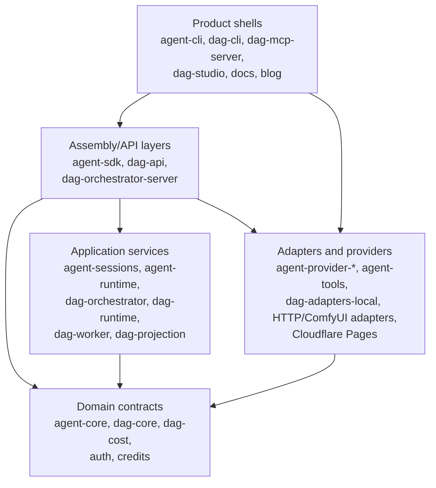
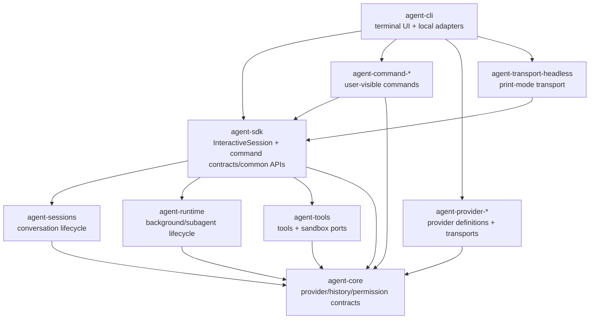
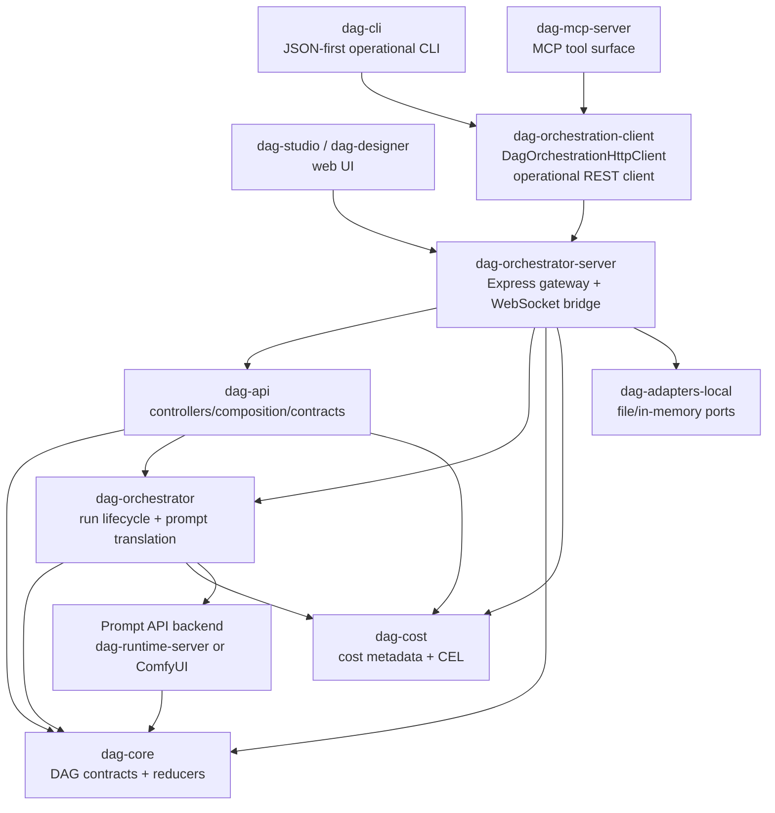
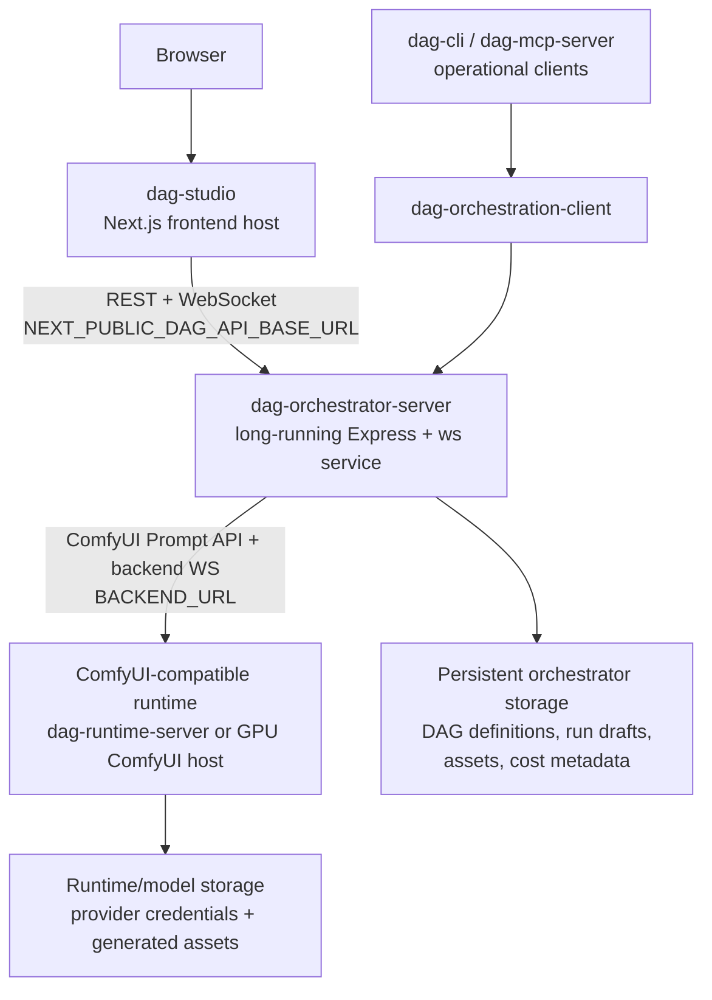
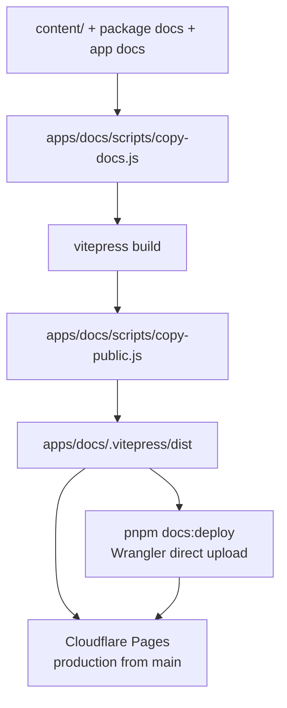

# System Architecture Map

Source-verified against `develop` commit `eeaf047de` on 2026-05-05.

This is the repository-wide master architecture map. It should contain the complete repository
structure at a level an LLM can scan before changing package boundaries, product shells, deployment
flows, or cross-package contracts. Package `docs/SPEC.md` files remain the owner contracts for each
package. Existing package-local `docs/ARCHITECTURE-MAP.md` files are companion detail maps, not
separate ownership silos.

## Reading Order

1. Start with [System Layers](#system-layers) for the top-level dependency model.
2. Read [Agent Product Stack](#agent-product-stack) before changing `agent-cli`, `agent-sdk`,
   command modules, providers, runtime, sessions, or transports.
3. Read [DAG Orchestration Stack](#dag-orchestration-stack) before changing `dag-cli`,
   `dag-mcp-server`, `dag-api`, `dag-orchestrator-server`, or ComfyUI-facing runtime boundaries.
4. Read [DAG Service Deployment Stack](#dag-service-deployment-stack) before changing DAG frontend,
   orchestrator, runtime, storage, or hosting boundaries.
5. Read [Documentation Deployment Stack](#documentation-deployment-stack) before changing docs
   build, release, or deploy behavior.
6. Use [Target Architecture](#target-architecture) and [Architecture Audit](#architecture-audit)
   before introducing a new package edge or moving a contract.
7. Use [Document Distribution Policy](#document-distribution-policy) before adding another
   architecture file.

## Document Distribution Policy

Keep architecture documentation centralized by default:

- This file is the master map and may include all major repository structures.
- Split into a companion file only when a section becomes too large to scan or needs dense
  package-internal inventories.
- Prefer one companion per genuinely large subsystem over many small fragments.
- Every companion file must be linked from this master map and from the owning package `SPEC.md` or
  docs index.
- Do not split documentation merely to mirror package boundaries; keep cross-package structure here
  unless scanability is already degraded.

## System Layers

Layer rules:

| Layer                | Owns                                                                       | Must not own                                         |
| -------------------- | -------------------------------------------------------------------------- | ---------------------------------------------------- |
| Product shells       | UI, CLI flags, process entrypoints, concrete host adapters                 | Domain rules, reusable contracts, provider semantics |
| Assembly/API layers  | Session assembly, command contracts, HTTP/API composition, request mapping | Product-specific rendering, vendor SDK behavior      |
| Application services | Use cases, lifecycle state machines, orchestration policies                | UI, HTTP routing details, persistence technology     |
| Domain contracts     | Types, pure rules, ports, error shapes                                     | Concrete I/O, runtime process management             |
| Adapters/providers   | Vendor transports, filesystem/network implementations                      | Cross-package contracts they merely implement        |

## Agent Product Stack

The agent stack is part of this master map. The existing
`packages/agent-cli/docs/ARCHITECTURE-MAP.md` remains a companion detail map for the CLI startup
path, class inventory, TUI hooks, and command-layer audit.

Agent stack ownership:

| Concern                                           | Owner                                             | Notes                                                    |
| ------------------------------------------------- | ------------------------------------------------- | -------------------------------------------------------- |
| Terminal input/rendering and host adapters        | `agent-cli`                                       | Thin product shell only.                                 |
| Command contracts/common APIs                     | `agent-sdk`                                       | Command packages consume these like third-party modules. |
| User-visible built-in command behavior            | `agent-command-*`                                 | CLI composes default modules; SDK must not import them.  |
| Provider defaults, setup metadata, model catalogs | `agent-provider-*` through `agent-core` contracts | CLI must not hardcode provider branches.                 |
| Session lifecycle and compaction                  | `agent-sessions`                                  | CLI consumes through SDK facades, not direct imports.    |
| Background/subagent lifecycle ports               | `agent-runtime`                                   | CLI keeps concrete local process/worktree adapters.      |

## DAG Orchestration Stack

DAG stack ownership:

| Concern                                                           | Current owner                                | Target owner                                                        |
| ----------------------------------------------------------------- | -------------------------------------------- | ------------------------------------------------------------------- |
| DAG domain types, reducers, ports, error contracts                | `dag-core`                                   | Same.                                                               |
| Prompt translation and run lifecycle services                     | `dag-orchestrator`                           | Same.                                                               |
| API controller request/response mapping                           | `dag-api`                                    | Same.                                                               |
| Shared operational REST client for `dag-cli` and `dag-mcp-server` | `dag-orchestration-client`                   | Dedicated thin client package.                                      |
| Full orchestrator REST endpoint contract inventory                | Documented in `dag-orchestrator-server` SPEC | Extract blocked endpoint groups before new client tools.            |
| Run draft operational HTTP contracts                              | `dag-orchestration-client` + `dag-core`      | Exposed by CLI/MCP through the shared client only.                  |
| Published workflow operational HTTP contracts                     | `dag-orchestration-client` + `dag-core`      | Exposed by CLI/MCP through the shared client only.                  |
| Asset operational HTTP contracts                                  | `dag-orchestration-client` + `dag-core`      | JSON metadata through the shared client; binary bytes by transport. |
| Cost metadata operational HTTP contracts                          | `dag-orchestration-client` + `dag-cost`      | Exposed by CLI/MCP through the shared client only.                  |
| HTTP routing, WebSocket bridge, persistence adapter wiring        | `dag-orchestrator-server`                    | Same imperative shell.                                              |
| Human operational CLI                                             | `dag-cli`                                    | Same thin client.                                                   |
| Agent/MCP operational surface                                     | `dag-mcp-server`                             | Same thin client.                                                   |

Operational clients must use `dag-orchestration-client` instead of importing `dag-api` for HTTP
client behavior. `dag-api` remains responsible for controller contracts and composition; the client
package remains thin and depends on endpoint domain owners such as `dag-core` and `dag-cost` for
payload domain types.

## DAG Service Deployment Stack

The DAG service deploys as three independent units. Keep this topology centralized here; app-local
docs only record the environment variables and runtime constraints owned by each app.

Deployment ownership:

| Deploy unit                 | Runtime shape                                             | Required contract                                                                                                       |
| --------------------------- | --------------------------------------------------------- | ----------------------------------------------------------------------------------------------------------------------- |
| `dag-studio`                | Next.js frontend host                                     | Browser-visible `NEXT_PUBLIC_DAG_API_BASE_URL` points at `dag-orchestrator-server`; generic `API_CONFIG` remains local. |
| `dag-orchestrator-server`   | Long-running Node process or container with WebSocket I/O | `ORCHESTRATOR_PORT`, `BACKEND_URL`, `CORS_ORIGINS`, and persistent storage roots are configured by the host.            |
| `dag-runtime-server`        | Local/dev ComfyUI-compatible Node runtime                 | Serves the Prompt API on `DAG_PORT` and owns node provider API keys for bundled node execution.                         |
| External ComfyUI/GPU host   | Managed or self-hosted GPU runtime                        | Must expose the ComfyUI Prompt API and compatible WebSocket surface used by the orchestrator.                           |
| Operational CLI/MCP clients | Local or agent-hosted processes                           | Use `dag-orchestration-client`; never import server route modules or route-local contracts.                             |

Deployment decision:

- Keep `dag-studio` deployable on a frontend platform such as Vercel or Cloudflare's Next.js
  hosting path.
- Keep `dag-orchestrator-server` off serverless function-only runtimes. It owns WebSocket upgrade
  handling, ComfyUI proxying, and local/cloud persistence adapter wiring, so it belongs on a
  long-running process/container host such as Railway, Fly.io, ECS, or an equivalent Node service
  platform.
- Do not collapse the orchestrator into Next.js API routes merely to share a deployment target with
  `dag-studio`. That would move WebSocket, proxy, and persistence concerns into the frontend shell.
- Keep `dag-runtime-server` or an external ComfyUI-compatible GPU backend separate from the
  orchestrator. Production image/video workloads should choose a runtime host based on GPU,
  cold-start, model-storage, and private-networking requirements.
- When the frontend is served from HTTPS, run progress must use `wss://` to the orchestrator origin.
  `dag-designer` derives this from `NEXT_PUBLIC_DAG_API_BASE_URL`.
- Verify external ComfyUI compatibility locally with `docker-compose.dag-comfyui.yml` and
  `pnpm dag:comfyui:verify`. This check is opt-in because the Docker build, model files, and GPU
  policy are host-dependent.

## Documentation Deployment Stack

Docs deployment ownership:

| Concern                        | Owner                                               |
| ------------------------------ | --------------------------------------------------- |
| Documentation source content   | `content/`, package docs, app docs                  |
| Static site build pipeline     | `apps/docs`                                         |
| Production deploy              | Cloudflare Pages Git integration from `main`        |
| Manual direct upload           | `scripts/docs/deploy-cloudflare-pages.mjs`          |
| Release workflow docs behavior | Build verification only; no GitHub Pages deployment |

## Target Architecture

Recommended target ownership:

1. Keep `.agents/specs/ARCHITECTURE-MAP.md` as the repo-wide master map. It may include all major
   repository structures; companion maps are only for dense package-internal details.
2. Keep `agent-cli` and DAG operational clients separate. `agent-cli` must not import `dag-cli` or
   `dag-mcp-server`; future integration should be through MCP, ordinary tools, or a dedicated
   command module that consumes SDK command contracts.
3. Split the operational orchestration HTTP client out of `dag-api` when endpoint coverage grows
   beyond the current first slice.
4. Centralize orchestrator REST contracts before exposing additional DAG mutation, asset,
   cost-metadata, or published-workflow operations through CLI/MCP clients.
5. Keep `dag-orchestrator-server` as the imperative shell. Domain rules stay in `dag-core`,
   orchestration use cases stay in `dag-orchestrator`, controller mapping stays in `dag-api`, and
   persistence/runtime technology stays behind adapters.
6. Keep DAG deployment split into frontend, long-running orchestrator, and ComfyUI-compatible
   runtime units. The frontend may move between frontend hosts, but WebSocket/proxy/persistence
   ownership stays out of `dag-studio`.
7. Keep docs deployment free of source-branch artifacts. Cloudflare Pages owns production deploy
   from `main`; manual direct upload is explicit and credential-gated.

## Architecture Audit

### SYS-AUDIT-001: No repository-wide master architecture map existed

Status: resolved by this document.

Problem:

`packages/agent-cli/docs/ARCHITECTURE-MAP.md` was the only scan-friendly map, but recent work spans
CLI, SDK, DAG operational clients, orchestration HTTP APIs, MCP, and docs deployment. The repository
needed one master map that can include all major structures instead of treating the CLI map as the
implicit architecture root.

Resolution:

This master map owns repository-wide architecture. The CLI map remains a companion detail map for
terminal product composition.

### SYS-AUDIT-002: `dag-api` owns both server-side composition and operational HTTP client

Status: resolved by `ORCH-BL-006`.

Current source:

- `packages/dag-orchestration-client/src/orchestration-http-client.ts`
- `packages/dag-cli/src/runner.ts`
- `packages/dag-mcp-server/src/runner.ts`

Problem:

`dag-cli` and `dag-mcp-server` need one shared endpoint caller, but must not depend on server-side
controller composition packages for that caller.

Resolution:

`@robota-sdk/dag-orchestration-client` owns `DagOrchestrationHttpClient`, operational payload
types, and the injectable fetch port. `dag-api` owns server-side controller contracts and
composition.

Follow-up:

- `.agents/tasks/ORCH-BL-007-orchestrator-rest-contract-coverage.md` tracks full endpoint contract inventory.

### SYS-AUDIT-003: Orchestrator REST contract coverage is split across owners

Status: resolved by `ORCH-BL-007` inventory, with extraction follow-ups.

Current source:

- `apps/dag-orchestrator-server/src/routes/*`
- `packages/dag-api/src/contracts/*`
- `packages/dag-orchestration-client/src/orchestration-http-client.ts`
- `packages/dag-mcp-server/src/tool-definitions.ts`

Problem:

Definition, node catalog, run lifecycle, run draft, published workflow run, asset metadata, and
cost metadata endpoints are reusable through the shared client. Other server-owned endpoints such
as admin and ComfyUI proxy routes have explicit ownership classifications in the server SPEC.

Resolution:

`apps/dag-orchestrator-server/docs/SPEC.md` is the source-backed endpoint inventory. CLI/MCP
expansion is allowed only for endpoint groups marked package-owned/active. Blocked groups are split
into follow-up extraction tasks.

Resolved extraction guardrail:

- Run progress WebSocket events keep `TRunProgressEvent` ownership in `dag-core`; the
  server-owned route envelope is `{ event: TRunProgressEvent }` and is covered by
  `apps/dag-orchestrator-server/src/__tests__/ws-routes.test.ts`.
- Run draft CLI and MCP operations are exposed through `dag-orchestration-client` only; the product
  shells do not import server route modules or route-local types.
- Published workflow run starts are exposed through `dag-orchestration-client` only; CLI/MCP accept
  optional version and JSON request bodies without duplicating route validation.
- Asset upload and metadata operations are exposed through `dag-orchestration-client`; binary
  content uses `getAssetContentDownloadInfo()` and remains outside the JSON client abstraction.
- Cost metadata CRUD, validation, and preview operations are exposed through
  `dag-orchestration-client` only; CLI/MCP parse product-shell arguments without importing route
  modules or route-local cost metadata types.

### SYS-AUDIT-004: DAG operational tools are not part of `agent-cli`

Status: resolved by documentation boundary.

`dag-cli` and `dag-mcp-server` are separate product shells. They should not be documented as
`agent-cli` sublayers unless the CLI product explicitly composes them. Future agent-driven DAG
control should prefer MCP or SDK command-module integration over direct TUI ownership.

### SYS-AUDIT-005: Docs deploy still referenced GitHub Pages

Status: resolved by `INFRA-BL-006`.

The source tree now points docs production deployment to Cloudflare Pages. `docs:deploy` is a
manual Wrangler direct upload helper, and release workflow docs handling is build verification only.

### SYS-AUDIT-006: DAG deployment topology was not centrally documented

Status: resolved by `DAG-BL-012`.

Problem:

The local DAG stack spans `dag-studio`, `dag-orchestrator-server`, and a ComfyUI-compatible runtime,
but deployment ownership was described only in an active backlog note and stale app-local
deployment notes. That made it unclear whether the orchestrator should be deployed with the
frontend, rewritten as Next.js API routes, or hosted as its own process.

Resolution:

The master map now records the three-unit deployment topology and the app-local docs record only
owned environment variables and runtime constraints. `dag-orchestrator-server` remains a
long-running Express/WebSocket service, while `dag-studio` remains a thin frontend host.

### SYS-AUDIT-007: External ComfyUI verification was only a backlog note

Status: resolved by `DAG-BL-004`.

Problem:

The orchestrator is intended to work with native ComfyUI through the Prompt API, but the repository
did not provide a reproducible local verification path for replacing `dag-runtime-server` with a
real ComfyUI process.

Resolution:

The repository now includes a local Docker Compose template that builds ComfyUI from the official
source repository and an opt-in integration test that validates runtime route availability,
orchestrator proxying, WebSocket upgrade capability, node catalog envelope behavior, and asset
upload forwarding.

## Governance and Update Policy

Update this document in the same PR whenever a change affects any of these:

- cross-package dependency direction among agent, DAG, app, or docs packages;
- a new product shell, transport, CLI, MCP server, HTTP client, or deployment boundary;
- movement of an owner contract between packages;
- an architecture decision that cannot be described accurately inside one package `SPEC.md`;
- package-local architecture maps that need a master-map parent pointer.

Before merging a system architecture change:

- Check package manifests for new dependency edges.
- Check source imports with `rg -n "from '@robota-sdk|from \"@robota-sdk" packages apps`.
- Check package `docs/SPEC.md` files for owner drift.
- Run `pnpm harness:scan:deps`, `pnpm harness:scan:specs`, and any affected package checks.
- Add follow-up backlog for any confirmed contradiction that is too large for the current PR.
