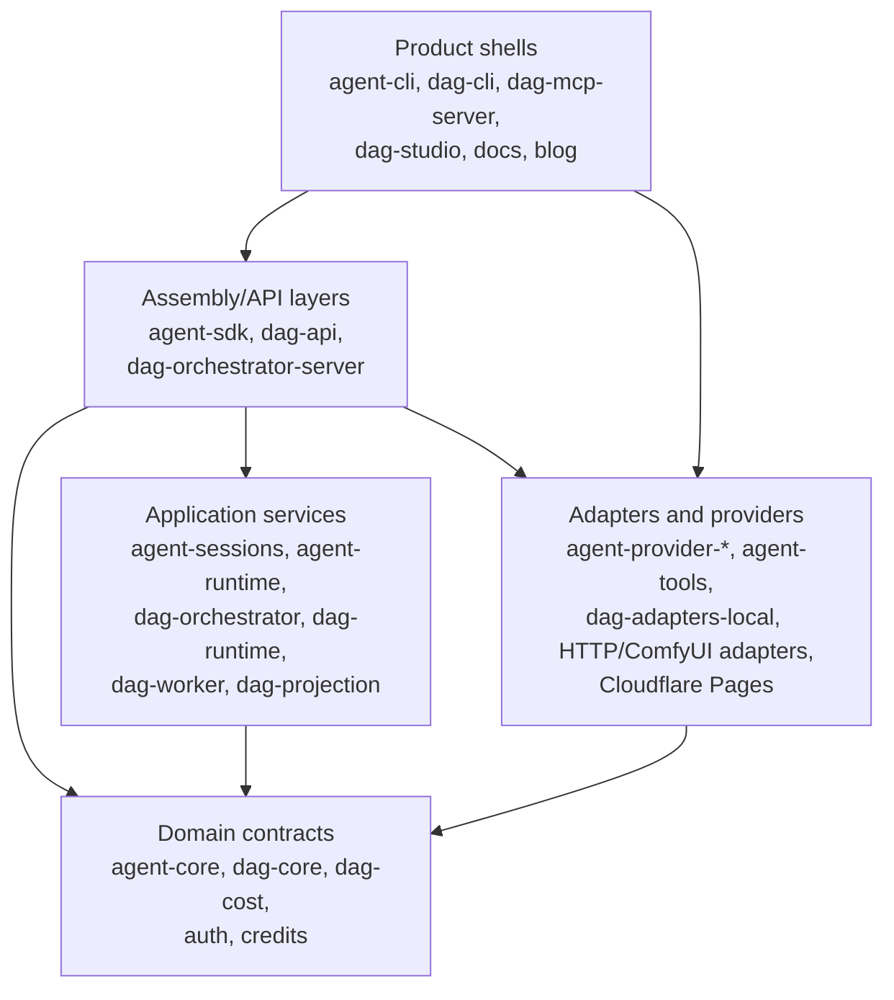
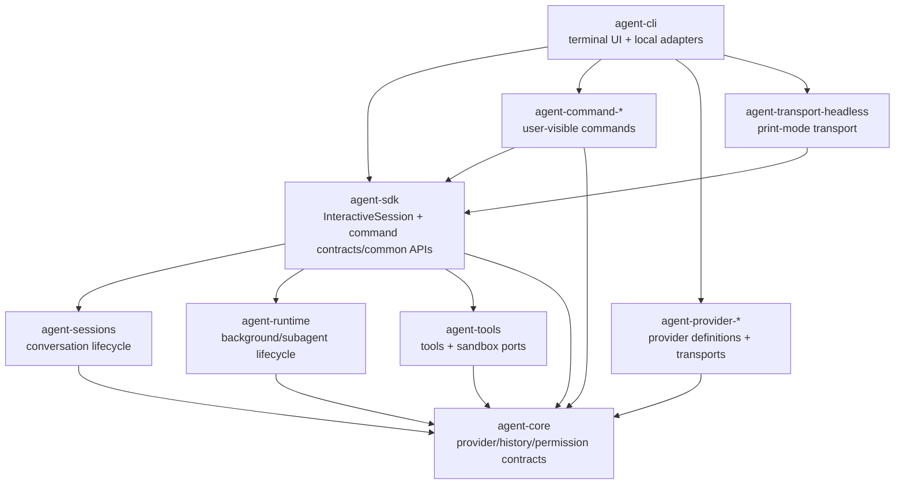
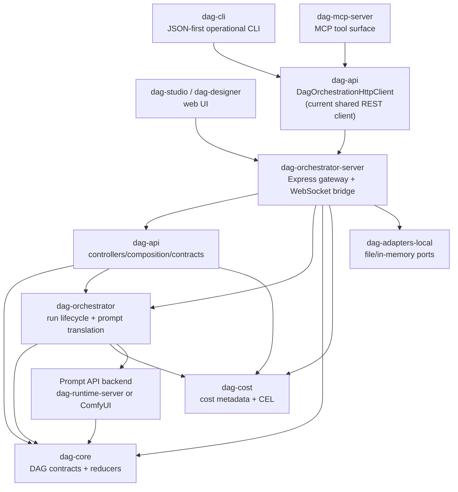
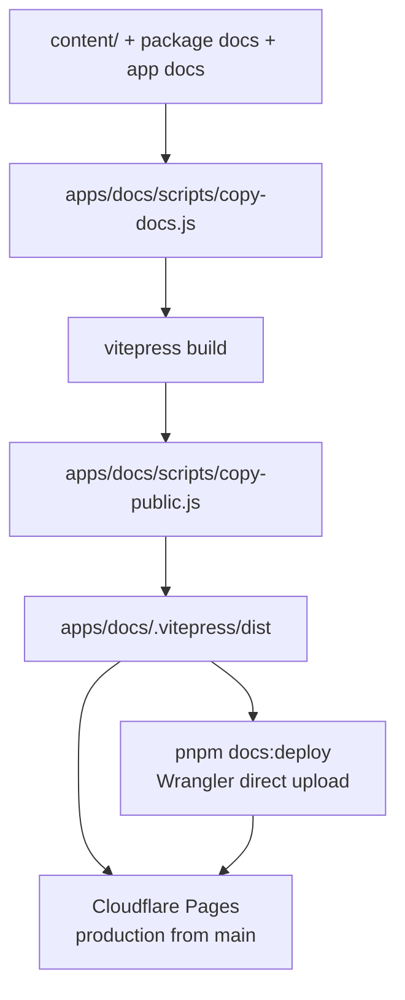

# System Architecture Map

Source-verified against `develop` commit `f9e388fd7` on 2026-05-05.

This is the repository-wide master architecture map. It should contain the complete repository
structure at a level an LLM can scan before changing package boundaries, product shells, deployment
flows, or cross-package contracts. Package `docs/SPEC.md` files remain the owner contracts for each
package. Existing package-local `docs/ARCHITECTURE-MAP.md` files are companion detail maps, not
separate ownership silos.

## Reading Order

1. Start with [System Layers](#system-layers) for the top-level dependency model.
2. Read [Agent Product Stack](#agent-product-stack) before changing `agent-cli`, `agent-sdk`,
   command modules, providers, runtime, sessions, or transports.
3. Read [DAG Orchestration Stack](#dag-orchestration-stack) before changing `dag-cli`,
   `dag-mcp-server`, `dag-api`, `dag-orchestrator-server`, or ComfyUI-facing runtime boundaries.
4. Read [Documentation Deployment Stack](#documentation-deployment-stack) before changing docs
   build, release, or deploy behavior.
5. Use [Target Architecture](#target-architecture) and [Architecture Audit](#architecture-audit)
   before introducing a new package edge or moving a contract.
6. Use [Document Distribution Policy](#document-distribution-policy) before adding another
   architecture file.

## Document Distribution Policy

Keep architecture documentation centralized by default:

- This file is the master map and may include all major repository structures.
- Split into a companion file only when a section becomes too large to scan or needs dense
  package-internal inventories.
- Prefer one companion per genuinely large subsystem over many small fragments.
- Every companion file must be linked from this master map and from the owning package `SPEC.md` or
  docs index.

## System Layers

Layer rules:

| Layer                | Owns                                                                       | Must not own                                         |
| -------------------- | -------------------------------------------------------------------------- | ---------------------------------------------------- |
| Product shells       | UI, CLI flags, process entrypoints, concrete host adapters                 | Domain rules, reusable contracts, provider semantics |
| Assembly/API layers  | Session assembly, command contracts, HTTP/API composition, request mapping | Product-specific rendering, vendor SDK behavior      |
| Application services | Use cases, lifecycle state machines, orchestration policies                | UI, HTTP routing details, persistence technology     |
| Domain contracts     | Types, pure rules, ports, error shapes                                     | Concrete I/O, runtime process management             |
| Adapters/providers   | Vendor transports, filesystem/network implementations                      | Cross-package contracts they merely implement        |

## Agent Product Stack

The agent stack is part of this master map. The existing
`packages/agent-cli/docs/ARCHITECTURE-MAP.md` remains a companion detail map for the CLI startup
path, class inventory, TUI hooks, and command-layer audit.

Agent stack ownership:

| Concern                                           | Owner                                             | Notes                                                    |
| ------------------------------------------------- | ------------------------------------------------- | -------------------------------------------------------- |
| Terminal input/rendering and host adapters        | `agent-cli`                                       | Thin product shell only.                                 |
| Command contracts/common APIs                     | `agent-sdk`                                       | Command packages consume these like third-party modules. |
| User-visible built-in command behavior            | `agent-command-*`                                 | CLI composes default modules; SDK must not import them.  |
| Provider defaults, setup metadata, model catalogs | `agent-provider-*` through `agent-core` contracts | CLI must not hardcode provider branches.                 |
| Session lifecycle and compaction                  | `agent-sessions`                                  | CLI consumes through SDK facades, not direct imports.    |
| Background/subagent lifecycle ports               | `agent-runtime`                                   | CLI keeps concrete local process/worktree adapters.      |

## DAG Orchestration Stack

DAG stack ownership:

| Concern                                                           | Current owner                                 | Target owner                                                       |
| ----------------------------------------------------------------- | --------------------------------------------- | ------------------------------------------------------------------ |
| DAG domain types, reducers, ports, error contracts                | `dag-core`                                    | Same.                                                              |
| Prompt translation and run lifecycle services                     | `dag-orchestrator`                            | Same.                                                              |
| API controller request/response mapping                           | `dag-api`                                     | Same.                                                              |
| Shared operational REST client for `dag-cli` and `dag-mcp-server` | `dag-api`                                     | Dedicated client/contracts package; see `ORCH-BL-006`.             |
| Full orchestrator REST endpoint contract inventory                | Split between `dag-api` and server route code | Central contract owner before new client tools; see `ORCH-BL-007`. |
| HTTP routing, WebSocket bridge, persistence adapter wiring        | `dag-orchestrator-server`                     | Same imperative shell.                                             |
| Human operational CLI                                             | `dag-cli`                                     | Same thin client.                                                  |
| Agent/MCP operational surface                                     | `dag-mcp-server`                              | Same thin client.                                                  |

The current `dag-api` client placement is acceptable for the first beta slice because it avoided
duplicating endpoint calls between `dag-cli` and `dag-mcp-server`. It should not become permanent:
operational clients should not depend on a package that also owns server-side controller composition
and pulls runtime/projection/worker dependencies into the client boundary.

## Documentation Deployment Stack

Docs deployment ownership:

| Concern                        | Owner                                               |
| ------------------------------ | --------------------------------------------------- |
| Documentation source content   | `content/`, package docs, app docs                  |
| Static site build pipeline     | `apps/docs`                                         |
| Production deploy              | Cloudflare Pages Git integration from `main`        |
| Manual direct upload           | `scripts/docs/deploy-cloudflare-pages.mjs`          |
| Release workflow docs behavior | Build verification only; no GitHub Pages deployment |

## Target Architecture

Recommended target ownership:

1. Keep `.agents/specs/ARCHITECTURE-MAP.md` as the repo-wide master map. It may include all major
   repository structures; companion maps are only for dense package-internal details.
2. Keep `agent-cli` and DAG operational clients separate. `agent-cli` must not import `dag-cli` or
   `dag-mcp-server`; future integration should be through MCP, ordinary tools, or a dedicated
   command module that consumes SDK command contracts.
3. Split the operational orchestration HTTP client out of `dag-api` when endpoint coverage grows
   beyond the current first slice.
4. Centralize orchestrator REST contracts before exposing additional DAG mutation, cost, asset, or
   published-workflow operations through CLI/MCP clients.
5. Keep `dag-orchestrator-server` as the imperative shell. Domain rules stay in `dag-core`,
   orchestration use cases stay in `dag-orchestrator`, controller mapping stays in `dag-api`, and
   persistence/runtime technology stays behind adapters.
6. Keep docs deployment free of source-branch artifacts. Cloudflare Pages owns production deploy
   from `main`; manual direct upload is explicit and credential-gated.

## Architecture Audit

### SYS-AUDIT-001: No repository-wide master architecture map existed

Status: resolved by this document.

Problem:

`packages/agent-cli/docs/ARCHITECTURE-MAP.md` was the only scan-friendly map, but recent work spans
CLI, SDK, DAG operational clients, orchestration HTTP APIs, MCP, and docs deployment. The repository
needed one master map that can include all major structures instead of treating the CLI map as the
implicit architecture root.

Resolution:

This master map owns repository-wide architecture. The CLI map remains a companion detail map for
terminal product composition.

### SYS-AUDIT-002: `dag-api` owns both server-side composition and operational HTTP client

Status: accepted debt.

Current source:

- `packages/dag-api/src/orchestration-http-client.ts`
- `packages/dag-cli/src/runner.ts`
- `packages/dag-mcp-server/src/runner.ts`

Problem:

`dag-cli` and `dag-mcp-server` depend on `dag-api` to reuse `DagOrchestrationHttpClient`. That keeps
endpoint calls consistent, but it also couples thin operational clients to a package that owns
server-side controller composition and production dependencies on runtime/projection/worker layers.

Target:

Move operational endpoint contracts and the REST client to a dedicated thin package after the API
surface stabilizes.

Follow-up:

- `.agents/tasks/ORCH-BL-006-orchestration-client-contract-package.md`

### SYS-AUDIT-003: Orchestrator REST contract coverage is split across owners

Status: accepted debt.

Current source:

- `apps/dag-orchestrator-server/src/routes/*`
- `packages/dag-api/src/contracts/*`
- `packages/dag-api/src/orchestration-http-client.ts`
- `packages/dag-mcp-server/src/tool-definitions.ts`

Problem:

Definition, node catalog, and run lifecycle endpoints are reusable through the shared client. Other
server-owned endpoints such as run drafts, published workflows, assets, cost metadata, admin, and
ComfyUI proxy routes still have local route-level contracts. Adding CLI/MCP operations for those
without a central contract owner would duplicate request/response semantics.

Target:

Create a complete orchestrator REST contract inventory before expanding operational clients.

Follow-up:

- `.agents/tasks/ORCH-BL-007-orchestrator-rest-contract-coverage.md`

### SYS-AUDIT-004: DAG operational tools are not part of `agent-cli`

Status: resolved by documentation boundary.

`dag-cli` and `dag-mcp-server` are separate product shells. They should not be documented as
`agent-cli` sublayers unless the CLI product explicitly composes them. Future agent-driven DAG
control should prefer MCP or SDK command-module integration over direct TUI ownership.

### SYS-AUDIT-005: Docs deploy still referenced GitHub Pages

Status: resolved by `INFRA-BL-006`.

The source tree now points docs production deployment to Cloudflare Pages. `docs:deploy` is a
manual Wrangler direct upload helper, and release workflow docs handling is build verification only.

## Governance and Update Policy

Update this document in the same PR whenever a change affects any of these:

- cross-package dependency direction among agent, DAG, app, or docs packages;
- a new product shell, transport, CLI, MCP server, HTTP client, or deployment boundary;
- movement of an owner contract between packages;
- an architecture decision that cannot be described accurately inside one package `SPEC.md`;
- package-local architecture maps that need a master-map parent pointer.

Before merging a system architecture change:

- Check package manifests for new dependency edges.
- Check source imports with `rg -n "from '@robota-sdk|from \"@robota-sdk" packages apps`.
- Check package `docs/SPEC.md` files for owner drift.
- Run `pnpm harness:scan:deps`, `pnpm harness:scan:specs`, and any affected package checks.
- Add follow-up backlog for any confirmed contradiction that is too large for the current PR.
