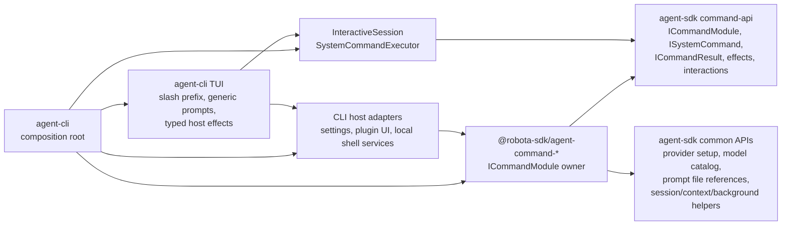
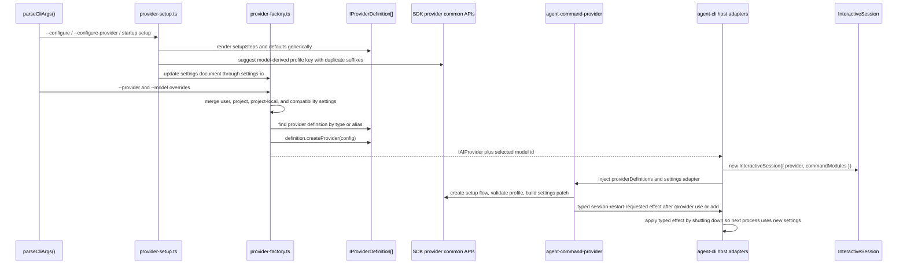

# Agent CLI Commands and Provider Flow

Source-verified against `develop` on 2026-05-09.

This document owns command-layer boundaries, provider setup, profile switching, and model catalog
flow for the CLI product shell.

## Built-in Command Layer

Built-in commands are product-default command modules. They are not SDK-owned
business logic and they are not CLI/TUI feature code.

| Responsibility                                                         | Owner                                                       |
| ---------------------------------------------------------------------- | ----------------------------------------------------------- |
| Slash prefix detection and unknown-command rendering                   | `agent-cli`                                                 |
| Command metadata, subcommands, lifecycle policy, interactions, effects | Owning `agent-command-*` package                            |
| Command contracts, registry, executor, effect/interactions types       | `agent-sdk`                                                 |
| Reusable command common APIs and ports                                 | `agent-sdk/src/command-api/*`                               |
| Prompt `@file` parsing, workspace-bound resolution, diagnostics        | `agent-sdk/src/context/prompt-file-reference-*.ts`          |
| Context reference inventory and manual reference state                 | `agent-sdk/src/context/context-reference-inventory.ts`      |
| Host persistence, local process actions, UI shell actions              | `agent-cli` host adapters and TUI effect handlers           |
| Provider setup semantics for `/provider`                               | `agent-command-provider` consuming SDK provider common APIs |
| Model-change request semantics for `/model`                            | `agent-command-model` consuming SDK model common APIs       |

Forbidden shortcuts:

- A command package must not import `agent-cli` or React/Ink code.
- `agent-sdk` must not import or special-case `agent-command-*` packages.
- CLI hooks must not reimplement command-specific setup flows when a command module can own them.
- Provider packages must not know slash commands, command names, TUI behavior, or Robota workflow semantics.

## Provider and Model State Flow

Settings ownership:

- `agent-cli` owns concrete settings file paths and provider instance construction.
- `agent-command-provider` owns `/provider` command semantics and settings patches.
- `agent-sdk` owns common provider settings/setup/probe APIs used by command modules, including
  generated profile-key suggestions for interactive setup.
- Provider packages own defaults, setup metadata, validation requirements, aliases, probes, options, and `createProvider()`.
- Profile identity is the settings profile key. It must not be inferred from provider type/model
  uniqueness because multiple profiles may share both fields.
- `--provider <profile>` is a one-shot startup override unless paired with `--set-current`.
- Status rendering may show profile key, provider type, and model, but it must not own switching or
  setup semantics.

Current model catalog state:

- `/model` is supplied by `@robota-sdk/agent-command-model`.
- The command consumes SDK model command common APIs.
- Active-provider model choices resolve through provider-owned `IProviderDefinition.modelCatalog`
  fallback metadata and optional provider-owned `refreshModelCatalog` hooks orchestrated by the SDK
  model command common API.
- Provider definitions include conservative fallback catalog metadata with source URLs and
  verification timestamps where the provider has known defaults.
- Live/generated catalog refresh adapters are provider-package responsibilities. The CLI/TUI must
  only render freshness state returned by command results.
