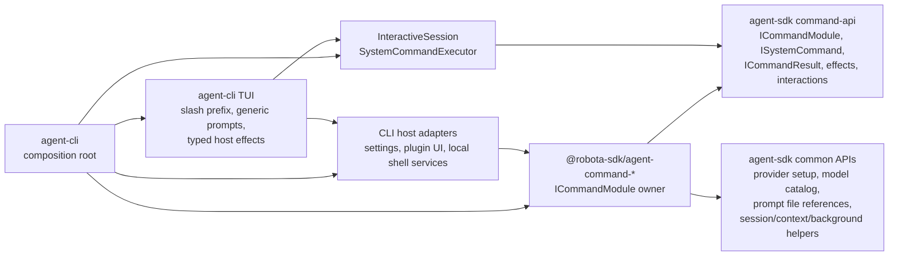
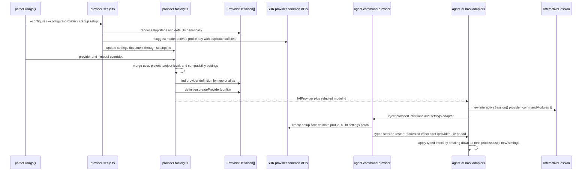

# Agent CLI Commands and Provider Flow

Source-verified against `develop` on 2026-05-15.

Command-layer boundaries, provider setup, profile switching, and model catalog flow.

## Built-in Command Layer

| Responsibility                                                         | Owner                                                       |
| ---------------------------------------------------------------------- | ----------------------------------------------------------- |
| Slash prefix detection and unknown-command rendering                   | `agent-cli`                                                 |
| Command metadata, subcommands, lifecycle policy, interactions, effects | Owning `agent-command-*` package                            |
| Command contracts, registry, executor, effect/interaction types        | `agent-sdk`                                                 |
| Reusable command common APIs and ports                                 | `agent-sdk/src/command-api/*`                               |
| Prompt `@file` parsing, workspace-bound resolution, diagnostics        | `agent-sdk/src/context/prompt-file-reference-*.ts`          |
| Context reference inventory and manual reference state                 | `agent-sdk/src/context/context-reference-inventory.ts`      |
| Host persistence, local process actions, UI shell actions              | `agent-cli` host adapters and TUI effect handlers           |
| Provider setup semantics for `/provider`                               | `agent-command-provider` consuming SDK provider common APIs |
| Model-change request semantics for `/model`                            | `agent-command-model` consuming SDK model common APIs       |

Forbidden: command packages must not import `agent-cli` or React/Ink code; `agent-sdk` must not
import `agent-command-*`; CLI hooks must not reimplement command-specific setup flows; provider
packages must not know slash commands or TUI behavior.

## Provider and Model State Flow

Settings ownership:

- `agent-cli` owns concrete settings file paths and provider instance construction.
- `agent-command-provider` owns `/provider` command semantics and settings patches.
- `agent-sdk` owns common provider settings/setup/probe APIs and generated profile-key suggestions.
- Provider packages own defaults, setup metadata, validation, aliases, probes, options, and `createProvider()`.
- Profile identity is the settings profile key — not provider type/model uniqueness.
- Model catalog refresh: provider packages own `refreshModelCatalog` and `modelCatalogCacheTtlSeconds`; SDK model command common APIs orchestrate TTL-based auto-refresh; CLI/TUI renders freshness state only.
