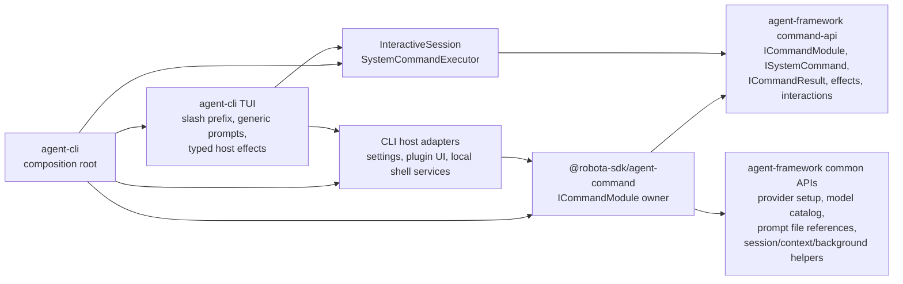
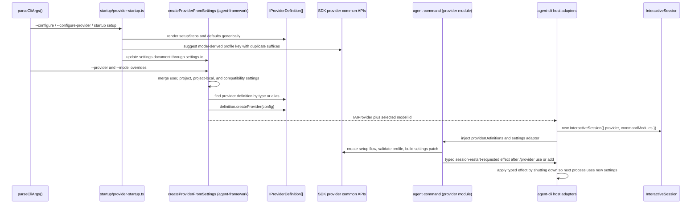
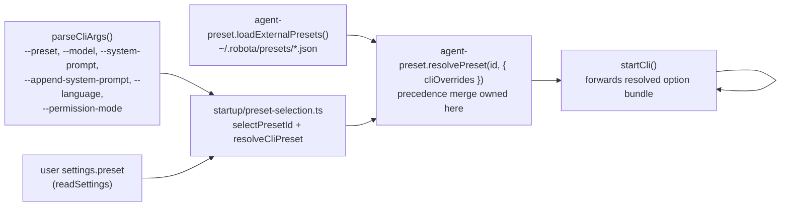

# Agent CLI Commands and Provider Flow

Part of the [agent-cli composition map](../agent-cli-composition.md).

Source-verified against `develop` on 2026-06-14.

Command-layer boundaries, provider setup, profile switching, model catalog flow, and
preset selection glue.

## Built-in Command Layer

| Responsibility                                                         | Owner                                                               |
| ---------------------------------------------------------------------- | ------------------------------------------------------------------- |
| Slash prefix detection and unknown-command rendering                   | `agent-cli`                                                         |
| Command metadata, subcommands, lifecycle policy, interactions, effects | Owning `agent-command` package                                      |
| Command contracts, registry, executor, effect/interaction types        | `agent-framework`                                                   |
| Reusable command common APIs and ports                                 | `agent-framework/src/command-api/*`                                 |
| Prompt `@file` parsing, workspace-bound resolution, diagnostics        | `agent-framework/src/context/prompt-file-reference-*.ts`            |
| Context reference inventory and manual reference state                 | `agent-framework/src/context/context-reference-inventory.ts`        |
| Host persistence, local process actions, UI shell actions              | `agent-cli` host adapters and TUI effect handlers                   |
| Provider setup semantics for `/provider`                               | `agent-command` (provider module) consuming framework provider APIs |

Forbidden: command packages must not import `agent-cli` or React/Ink code; `agent-framework` must not
import `agent-command`; CLI hooks must not reimplement command-specific setup flows; provider
packages must not know slash commands or TUI behavior.

## Provider and Model State Flow

Settings ownership:

- `agent-cli` owns concrete settings file paths and provider instance construction.
- `agent-command` (provider module) owns `/provider` command semantics and settings patches.
- `agent-framework` owns common provider settings/setup/probe APIs and generated profile-key suggestions.
- Provider packages own defaults, setup metadata, validation, aliases, probes, options, and `createProvider()`.
- Profile identity is the settings profile key — not provider type/model uniqueness.
- Model catalog refresh: provider packages own `refreshModelCatalog` and `modelCatalogCacheTtlSeconds`; `agent-framework` model command common APIs orchestrate TTL-based auto-refresh; CLI/TUI renders freshness state only.

## Preset Selection Flow

The CLI is a thin shell over `@robota-sdk/agent-preset` (PRESET-002/004/007/011). It selects a
preset id and forwards CLI-flag overrides; the precedence merge, posture mapping, and external
preset loading all live in agent-preset, and preset application to a session lives in
`agent-framework` (`applyPresetToSession`).

Preset ownership:

- `agent-cli` owns selection glue only: `selectPresetId(args, settingsPreset)` (`--preset` > `settings.preset` > `'default'`) and forwarding `buildPresetCliOverrides(args)` to `resolvePreset`. It owns no merge, posture, or default logic.
- `agent-preset` owns preset profile data, `resolvePreset()` precedence merge, `loadExternalPresets()` validation, and `DEFAULT_AGENT_NAME`. Unknown preset ids throw; the CLI surfaces the error and exits.
- `agent-framework` owns `applyPresetToSession` and applies the resolved option bundle (model, persona, agentName, permissionMode, enable/disable command modules, enableParallelSubagents, selfVerification) to the session.
- Model precedence: the resolved preset model (`resolvedPreset.model`) overrides `providerSettings.model`; an explicit `--model` flag is folded into the preset overrides upstream, so the preset result is the single model source the CLI forwards.
- Command-module selection: `resolvedPreset.enabledCommandModules` / `disabledCommandModules` are passed into `buildCommandSetup` so the preset can prune the default module set (deny > allow).
