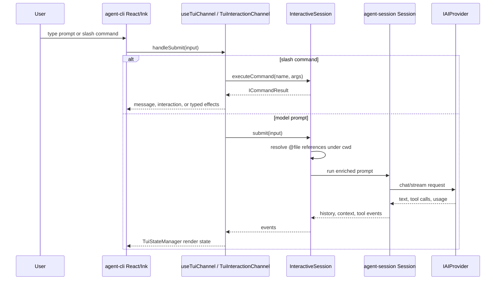
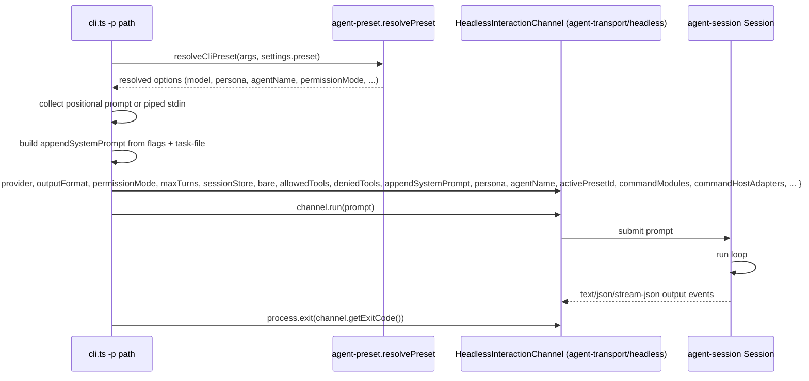
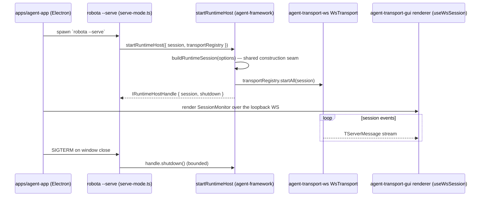

# Agent CLI Execution Modes

Part of the [agent-cli composition map](../agent-cli-composition.md).

Source-verified against `develop` on 2026-07-12.

Interactive TUI, non-interactive print-mode, and headless runtime-host (`--serve`) execution paths.

## Interactive TUI

See [packages/agent-cli/docs/SPEC.md](../../../../packages/agent-cli/docs/SPEC.md) for supported interactive flags.

## Non-Interactive Print Mode

Flags: `-p`, piped stdin, `--output-format`, `--permission-mode`, `--max-turns`, `--bare`,
`--allowed-tools`, `--denied-tools`, `--no-session-persistence`, `--system-prompt`,
`--append-system-prompt`, `--task-file`, `--model`, `--preset`, `--json-schema`.

Print-mode permission mode resolves as `args.permissionMode ?? presetOptions.permissionMode ??
'bypassPermissions'`; the model resolves as `resolvedPreset.model ?? providerSettings.model`. The
CLI forwards the preset's `persona`, `agentName`, `activePresetId`, `enableParallelSubagents`, and
`selfVerification` into the channel without re-applying any preset logic.

## Runtime Host Mode (`robota --serve`)

> **[Landed — RUNTIME-001 / GUI-005]** `robota --serve` (`packages/agent-cli/src/modes/serve-mode.ts`)
> is a headless runtime host: it builds the session via `startRuntimeHost` (`agent-framework`) — sharing
> the `buildRuntimeSession` construction seam with TUI and print modes — and serves the loopback WS
> sidecar. It renders NO ink; it is the backend the desktop Electron shell `apps/agent-app` spawns, and
> it stays alive until `SIGTERM`/`SIGINT`, then shuts the runtime down cleanly.

> **Superseded design.** The earlier `--web` / `--web-port` flags and
> `startWebSidecarServer(interactiveSession, port)` were never built — neither the flags nor that
> function (nor `agent-cli/src/web-sidecar/`) exist in the codebase. The landed path is
> `robota --serve` → `startRuntimeHost`, supervised by the desktop GUI (`apps/agent-app`) rather than a
> browser opened from a TUI session.

See [packages/agent-cli/docs/SPEC.md](../../../../packages/agent-cli/docs/SPEC.md) for supported flags.
