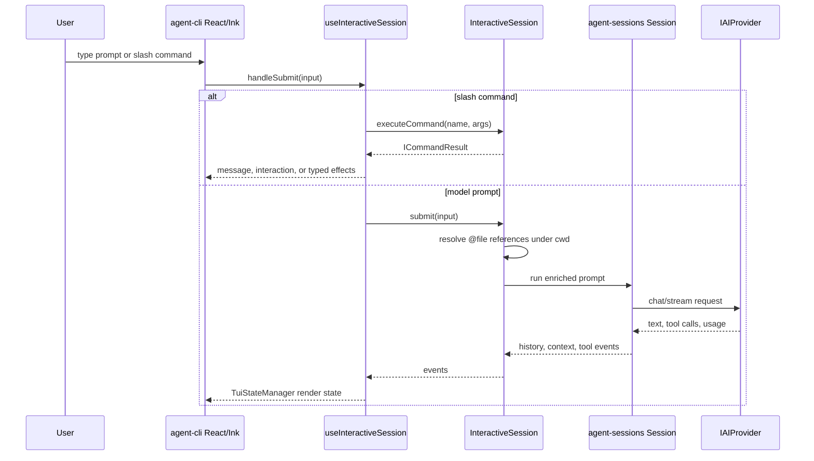
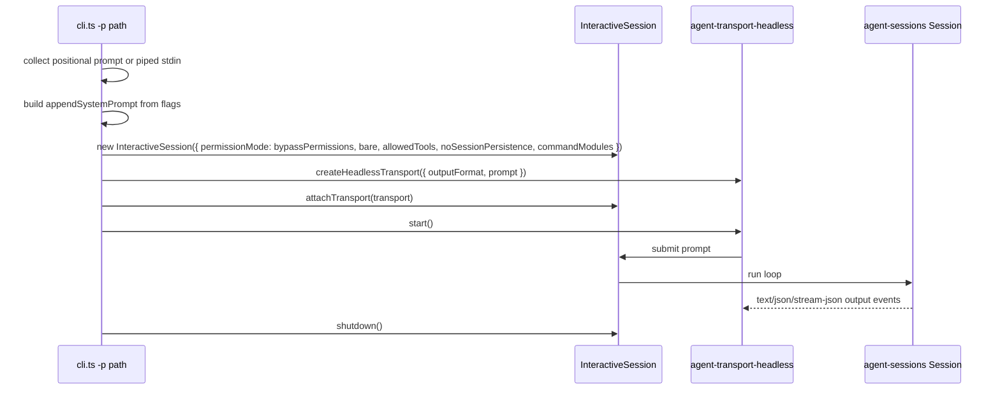

# Agent CLI Execution Modes

Source-verified against `develop` on 2026-05-07.

This document owns the interactive TUI and non-interactive print-mode execution paths.

## Execution Modes

### Interactive TUI

Interactive mode currently supports:

- permission prompts through CLI React state and SDK permission handler injection;
- `/` command execution through `InteractiveSession.executeCommand()`;
- generic `ICommandInteraction` rendering;
- typed `TCommandEffect` application;
- skill and plugin command discovery through SDK command sources;
- prompt `@file` references through SDK-owned preprocessing, with CLI only passing submitted text;
- session resume/fork/name flows through SDK-owned session persistence facade and summaries.

### Non-Interactive Print Mode

Current `develop` print mode supports `-p`, piped stdin, `--output-format`,
`--permission-mode`, `--max-turns`, `--bare`, `--allowed-tools`,
`--no-session-persistence`, `--append-system-prompt`, and `--json-schema`.

`--task-file` is not present in current `develop`; if that flag is merged from another branch,
this section must be updated in the same PR.
