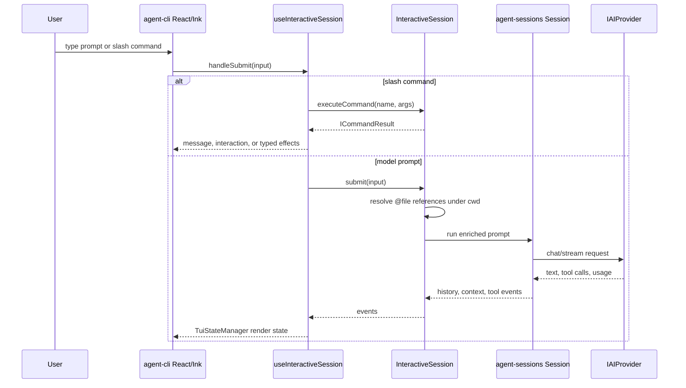
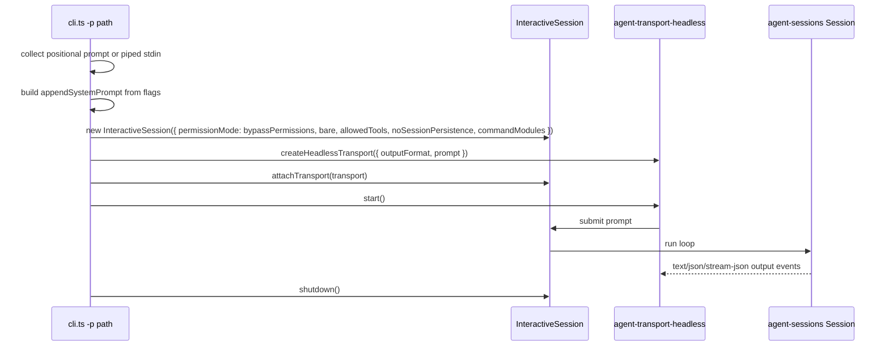
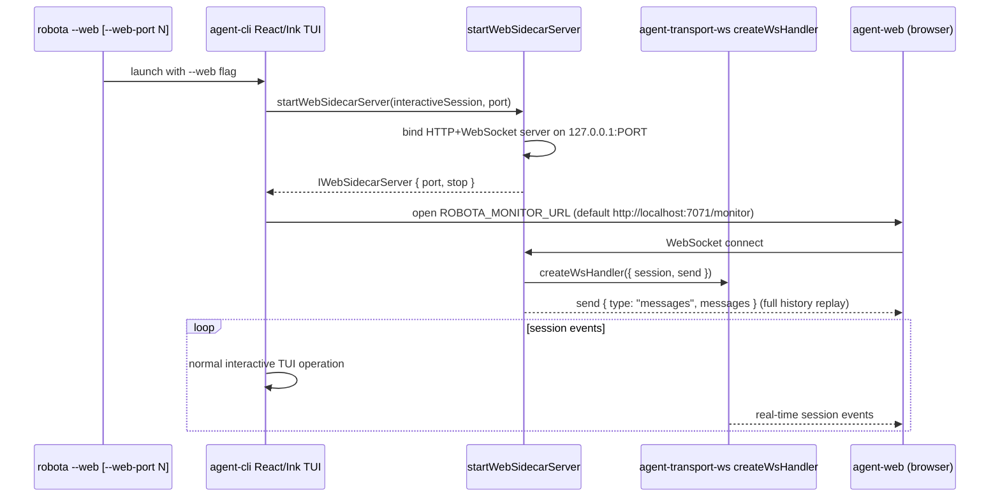

# Agent CLI Execution Modes

Source-verified against `develop` on 2026-05-09.

This document owns the interactive TUI and non-interactive print-mode execution paths.

## Execution Modes

### Interactive TUI

Interactive mode currently supports:

- permission prompts through CLI React state and SDK permission handler injection;
- `/` command execution through `InteractiveSession.executeCommand()`;
- generic `ICommandInteraction` rendering;
- typed `TCommandEffect` application;
- skill and plugin command discovery through SDK command sources;
- prompt `@file` references through SDK-owned preprocessing, with CLI only passing submitted text;
- session resume/fork/name flows through SDK-owned session persistence facade and summaries.

### Non-Interactive Print Mode

Current `develop` print mode supports `-p`, piped stdin, `--output-format`,
`--permission-mode`, `--max-turns`, `--bare`, `--allowed-tools`,
`--no-session-persistence`, `--append-system-prompt`, and `--json-schema`.

`--task-file` is not present in current `develop`; if that flag is merged from another branch,
this section must be updated in the same PR.

### WebSocket Sidecar Mode

WebSocket sidecar mode starts a local HTTP and WebSocket server alongside the interactive TUI when
the `--web` flag is set. Each browser client receives all session events in real-time through the
`agent-transport-ws` protocol and gets full message-history replay on connect.

Supported flags:

| Flag                 | Default                       | Description                                     |
| -------------------- | ----------------------------- | ----------------------------------------------- |
| `--web`              | false                         | Enable WebSocket sidecar server                 |
| `--web-port N`       | 7070                          | Port to bind the sidecar server                 |
| `--no-open`          | false                         | Skip auto-opening the browser monitor           |
| `ROBOTA_NO_OPEN`     | —                             | Environment variable; also suppresses auto-open |
| `ROBOTA_MONITOR_URL` | http://localhost:7071/monitor | Override monitor URL auto-opened in browser     |

Sidecar bind failure is non-fatal. The interactive TUI continues if the sidecar server cannot bind
to the requested port. The browser monitor (`agent-web`) connects to the sidecar independently; it
is not embedded in or owned by the CLI.

Source path: `agent-cli/src/web-sidecar/web-sidecar-server.ts`  
React bridge: sidecar is started inside `useInteractiveSession` via a `useEffect` — it does not
block TUI initialization.
