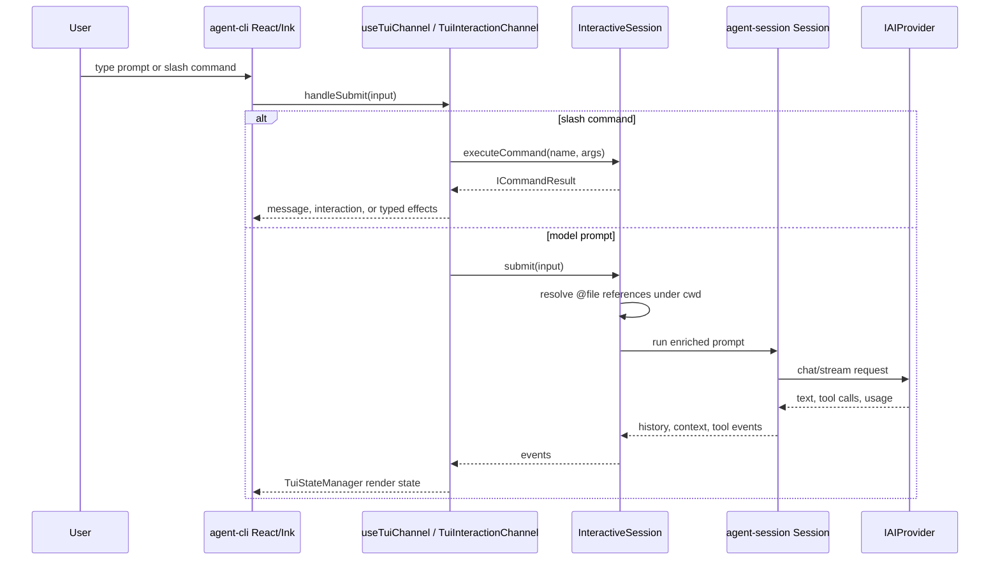
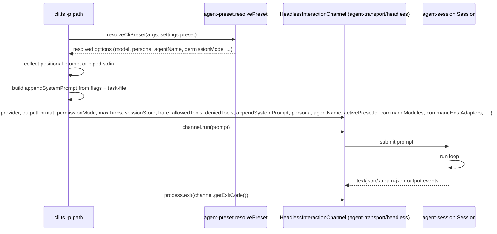
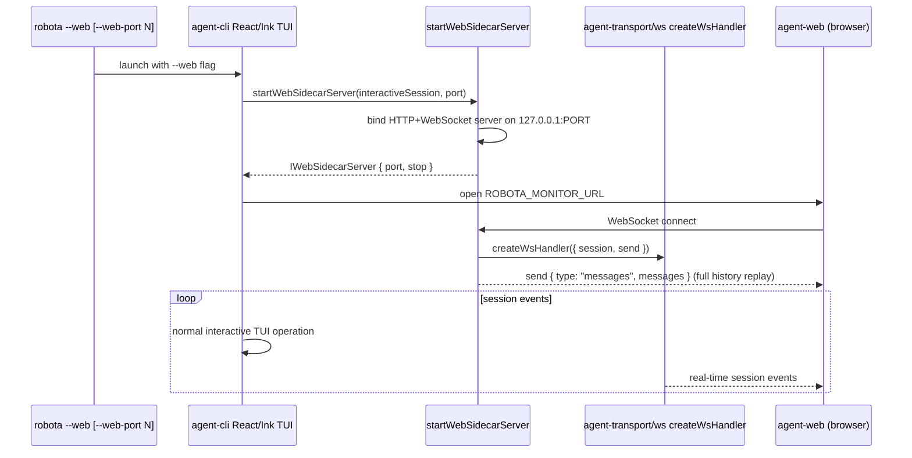

# Agent CLI Execution Modes

Source-verified against `develop` on 2026-06-14.

Interactive TUI and non-interactive print-mode execution paths.

## Interactive TUI

See [packages/agent-cli/docs/SPEC.md](../../../../packages/agent-cli/docs/SPEC.md) for supported interactive flags.

## Non-Interactive Print Mode

Flags: `-p`, piped stdin, `--output-format`, `--permission-mode`, `--max-turns`, `--bare`,
`--allowed-tools`, `--denied-tools`, `--no-session-persistence`, `--system-prompt`,
`--append-system-prompt`, `--task-file`, `--model`, `--preset`, `--json-schema`.

Print-mode permission mode resolves as `args.permissionMode ?? presetOptions.permissionMode ??
'bypassPermissions'`; the model resolves as `resolvedPreset.model ?? providerSettings.model`. The
CLI forwards the preset's `persona`, `agentName`, `activePresetId`, `enableParallelSubagents`, and
`selfVerification` into the channel without re-applying any preset logic.

## WebSocket Sidecar Mode

> **[Planned — not yet implemented]** The `--web` / `--web-port` flags and `startWebSidecarServer()` described below do not exist in the codebase. This section documents the planned design intent referenced in `agent-web-ui/docs/SPEC.md`. Do not rely on it as a current implementation reference.

Sidecar bind failure is intended to be non-fatal. Planned source path:
`agent-cli/src/web-sidecar/web-sidecar-server.ts` — this file does not exist in the codebase yet
(verified 2026-06-14; `src/web-sidecar/` is absent). Treat this section as design intent only.
See [packages/agent-cli/docs/SPEC.md](../../../../packages/agent-cli/docs/SPEC.md) for supported flags.
