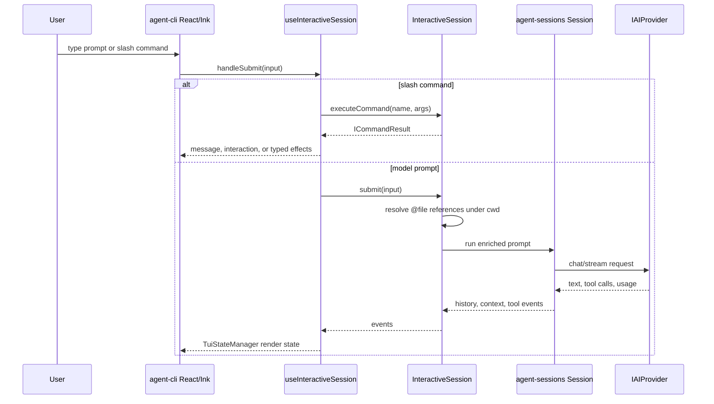
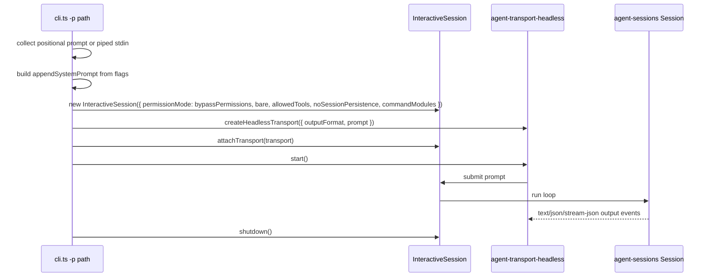
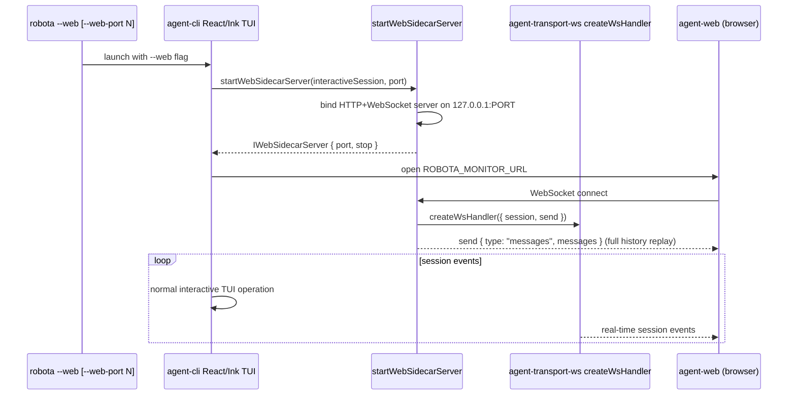

# Agent CLI Execution Modes

Source-verified against `develop` on 2026-05-15.

Interactive TUI and non-interactive print-mode execution paths.

## Interactive TUI

See [packages/agent-cli/docs/SPEC.md](../../../../packages/agent-cli/docs/SPEC.md) for supported interactive flags.

## Non-Interactive Print Mode

Flags: `-p`, piped stdin, `--output-format`, `--permission-mode`, `--max-turns`, `--bare`,
`--allowed-tools`, `--no-session-persistence`, `--append-system-prompt`, `--json-schema`.

## WebSocket Sidecar Mode

Sidecar bind failure is non-fatal. Source: `agent-cli/src/web-sidecar/web-sidecar-server.ts`.
See [packages/agent-cli/docs/SPEC.md](../../../../packages/agent-cli/docs/SPEC.md) for supported flags.
