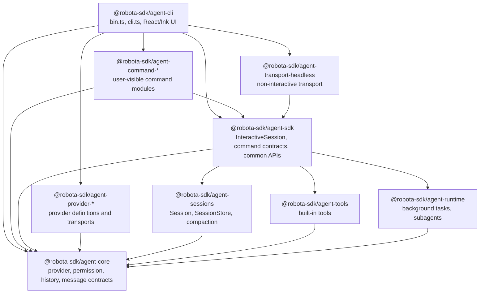

# Agent CLI Target Architecture and Dependencies

Source-verified against `develop` on 2026-05-09.

This document owns the target CLI ownership model and dependency graph. Use it before adding,
removing, or moving package edges around `@robota-sdk/agent-cli`.

## Target Architecture

The CLI target is a thin product shell around SDK-hosted session orchestration and command
contracts. `agent-cli` may compose product defaults and own terminal-specific adapters, but reusable
runtime behavior, command behavior, provider semantics, and persistence contracts must be owned by
the package whose public API describes that behavior.

### Non-Negotiable CLI Boundary

`agent-cli` is a TUI and runtime-host shell, not a feature owner.

When a behavior is visible through the CLI, that does not make the behavior CLI-owned. Any capability
that changes product behavior, durable state, lifecycle, retention, task spawning, task grouping,
permission policy, persistence, logging, transport-visible semantics, command semantics, provider
semantics, or SDK-visible data contracts must be implemented in `agent-sdk`, `agent-runtime`, an
`agent-command-*` package, a provider package, or another lower reusable owner first.

`agent-cli` may own only:

- terminal layout and rendering;
- terminal input handling and keyboard navigation;
- ephemeral UI selection state such as the currently highlighted panel or menu entry;
- concrete local host adapters for terminal-specific I/O, process spawning, IPC, Git/filesystem
  worktree operations, and settings-file access;
- composition of product-default command modules, provider definitions, transports, and SDK
  factories.

If a TUI feature needs data or behavior that no reusable package exposes, implementation must stop
and add the SDK/runtime/command/provider capability before adding CLI UI. React/Ink components must
render SDK-owned state and invoke SDK-owned controls; they must not infer lifecycle, policy, or
retention from raw events when a reusable projection API should exist.

```text
agent-cli
  owns terminal input/rendering, CLI flags, provider definition composition,
  product-default command module selection, and concrete local host adapters
      |
      v
agent-sdk
  owns InteractiveSession, command contracts/common APIs, provider-neutral facades,
  host adapter ports, prompt file-reference preprocessing, session orchestration,
  and SDK-specific safety layers
      |
      +--> agent-sessions   owns conversation run loop, persistence, compaction
      +--> agent-runtime    owns reusable background/subagent lifecycle ports and state
      +--> agent-tools      owns generic tools and tool schemas
      +--> agent-core       owns provider, history, permission, hook, and model catalog contracts

agent-command-*
  owns user-visible command descriptors and execution; consumes SDK contracts as a third-party
  command module would

agent-provider-*
  owns provider definitions, defaults, setup metadata, fallback model catalogs, probes, transport
  translation, and provider-specific options
```

Target ownership rules:

| Concern                                                      | Target owner                                  | CLI role                                                               |
| ------------------------------------------------------------ | --------------------------------------------- | ---------------------------------------------------------------------- |
| Slash prefix detection, command autocomplete, prompt UI      | `agent-cli`                                   | Render and route generic command requests.                             |
| TUI layout, keyboard navigation, selected panel/menu state   | `agent-cli`                                   | Keep view state ephemeral; do not define product behavior.             |
| Command descriptors, command execution, lifecycle effects    | `agent-command-*`                             | Select default modules and render returned interactions/effects.       |
| Command contracts, result/effect types, host adapter ports   | `agent-sdk`                                   | Consume SDK contracts without defining parallel command shapes.        |
| Skill activation semantics and audit events                  | `agent-sdk`                                   | Render `skill_activation`; never infer activation from prompt text.    |
| Skill-spawned agent/task behavior                            | `agent-sdk` + `agent-runtime`                 | Render task entries only; skills must consume SDK task-spawning ports. |
| Provider settings/profile setup common APIs                  | `agent-sdk` + provider packages               | Provide concrete settings adapters and provider definitions.           |
| Prompt `@file` parsing, file reads, diagnostics, records     | `agent-sdk`                                   | Pass ordinary prompt text through `InteractiveSession.submit()`.       |
| Provider-specific defaults, probes, model fallback data      | `agent-provider-*` via `agent-core` contracts | Compose definitions, never branch on provider names in TUI hooks.      |
| Session persistence facade                                   | `agent-sdk`                                   | Request project-local store and display SDK-owned summaries.           |
| Reusable background/subagent state machines and ports        | `agent-runtime`                               | Supply local process/worktree adapters when they are terminal-hosted.  |
| Background task workspace/read model and retention semantics | `agent-sdk` + `agent-runtime`                 | Render SDK projection; keep only selected-entry UI state.              |
| Execution workspace task switching                           | `agent-sdk` read model, `agent-cli` TUI       | SDK owns entries/details/events; CLI owns Ctrl+B menu and selection.   |
| Terminal process spawning, Ink rendering, local settings I/O | `agent-cli`                                   | Keep concrete I/O at the outer shell.                                  |
| Core provider/history/permission/model contracts             | `agent-core`                                  | Import public contracts only.                                          |

Target migration order:

1. Remove implicit command effect transport through mutable `InteractiveSession` fields.
2. Retire CLI command compatibility shims so consumers import command infrastructure from the SDK
   owner directly.
3. Keep local runtime adapters classified: reusable lifecycle, log pagination, and worktree
   contracts stay behind SDK/runtime-owned ports; CLI keeps only terminal-host I/O.
4. Add provider model catalog live/generated refresh adapters on top of the existing provider-owned
   fallback catalog contract.
5. Audit the SDK public export surface so owned APIs and compatibility re-exports are explicit and
   do not hide package ownership.
6. For richer background-task UI, consume SDK/runtime workspace projections, origin metadata, task
   spawning ports, and retention policy from the CLI switcher surface. Do not add a CLI-owned task
   registry or retention policy.

## Package Dependency Graph



| Edge                                     | Status                | Rule                                                                                                                                        |
| ---------------------------------------- | --------------------- | ------------------------------------------------------------------------------------------------------------------------------------------- |
| CLI -> SDK                               | Allowed               | CLI consumes `InteractiveSession`, command registries, command contracts, SDK path helpers, and SDK-owned session persistence facade types. |
| CLI -> command packages                  | Allowed               | Product composition root selects default command modules.                                                                                   |
| CLI -> provider packages                 | Allowed               | CLI owns provider definition composition and provider instance creation.                                                                    |
| CLI -> agent-core public types           | Allowed               | CLI may use public provider, permission, history, and message types.                                                                        |
| CLI -> headless transport                | Allowed               | Print mode attaches a transport to `InteractiveSession`.                                                                                    |
| CLI -> agent-sessions                    | Forbidden by CLI SPEC | No production source or package dependency should exist; harness command layering scan enforces this edge.                                  |
| SDK -> command packages                  | Forbidden             | SDK owns contracts/common APIs and must not import command implementations. No source edge found.                                           |
| command packages -> CLI/TUI              | Forbidden             | Commands consume SDK contracts and host adapters only. No source edge found.                                                                |
| provider packages -> Robota commands/TUI | Forbidden             | Providers translate provider wire formats only. No source edge found in this audit.                                                         |
