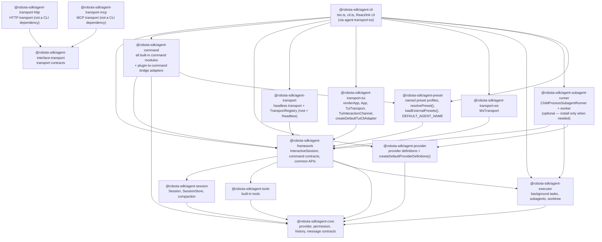

# Agent CLI Target Architecture and Dependencies

Part of the [agent-cli composition map](../agent-cli-composition.md).

Source-verified against `develop` on 2026-06-14.

Target CLI ownership model and dependency graph.

## CLI Boundary

`agent-cli` is a TUI and runtime-host shell. It may own:

- terminal layout, rendering, input handling, keyboard navigation;
- ephemeral UI selection state (highlighted panel/menu entry);
- concrete local host adapters: terminal I/O, process spawning, IPC, Git/filesystem worktree, settings-file access;
- composition of product-default command modules, provider definitions, transports, and optional runtime packages;
- preset selection glue only: pick the active preset id (`--preset` flag > `settings.preset` > `'default'`) and forward CLI-flag overrides; it owns none of the preset merge, posture-mapping, or `applyPresetToSession` application logic.

It must not own: lifecycle transitions, durable task registries, command behavior, provider semantics,
persistence formats, permission policy, retention policy, or any framework-visible data contracts.

When a TUI feature needs data or behavior that no reusable package exposes, add the
framework/executor/command/provider capability first. React/Ink components must render
framework-owned state and invoke framework-owned controls.

```text
agent-cli
  owns terminal input/rendering, CLI flags, provider definition composition,
  product-default command module selection, preset id selection glue,
  and concrete local host adapters
      |
      +--> agent-preset
      |      owns named preset profiles (data), resolvePreset() precedence merge,
      |      loadExternalPresets() (~/.robota/presets/*.json), DEFAULT_AGENT_NAME;
      |      CLI selects an id + forwards CLI overrides — owns no merge logic
      |
      v
agent-framework  [React-free — React hooks belong in agent-transport/tui only]
  owns InteractiveSession, command contracts/common APIs, provider-neutral facades,
  host adapter ports, prompt file-reference preprocessing, session orchestration
      |
      +--> agent-session    owns conversation run loop, persistence, compaction
      +--> agent-executor   owns reusable background/subagent lifecycle ports and state
      +--> agent-tools      owns generic tools and tool schemas
      +--> agent-core       owns provider, history, permission, hook, and model catalog contracts

agent-command
  owns user-visible command descriptors and execution; plugin-to-command bridge adapters;
  consumes agent-framework contracts as a third-party command module would

agent-provider
  owns provider definitions, defaults, setup metadata, fallback model catalogs, probes, transport
  translation, and provider-specific options

agent-subagent-runner  [OPTIONAL — install only when child-process subagent support is needed]
  owns ChildProcessSubagentRunner, child-process-subagent-worker, IPC types,
  getDefaultSubagentWorkerPath();
  depends on: agent-framework + agent-provider
```

Target ownership rules:

| Concern                                                               | Target owner                                  | CLI role                                                              |
| --------------------------------------------------------------------- | --------------------------------------------- | --------------------------------------------------------------------- |
| Slash prefix detection, command autocomplete, prompt UI               | `agent-cli`                                   | Render and route generic command requests.                            |
| TUI layout, keyboard navigation, selected panel/menu state            | `agent-cli`                                   | Keep view state ephemeral.                                            |
| Command descriptors, execution, lifecycle effects                     | `agent-command`                               | Select default modules; render returned interactions/effects.         |
| Plugin-to-command bridge adapters                                     | `agent-command`                               | Compose plugin adapter; CLI is not the owner.                         |
| Command contracts, result/effect types, host adapter ports            | `agent-framework`                             | Consume without defining parallel command shapes.                     |
| Skill activation semantics and audit events                           | `agent-framework`                             | Render `skill_activation`; never infer activation from prompt text.   |
| Skill-spawned agent/task behavior                                     | `agent-framework` + `agent-executor`          | Render task entries only.                                             |
| Provider settings/profile setup common APIs                           | `agent-framework` + provider packages         | Provide concrete settings adapters and provider definitions.          |
| Prompt `@file` parsing, file reads, diagnostics                       | `agent-framework`                             | Pass ordinary prompt text through `InteractiveSession.submit()`.      |
| Provider-specific defaults, probes, model fallback data               | `agent-provider` via `agent-core`             | Compose definitions; never branch on provider names in TUI hooks.     |
| Session persistence facade                                            | `agent-framework`                             | Request project-local store; display framework-owned summaries.       |
| Reusable background/subagent state machines and ports                 | `agent-executor`                              | Supply local process/worktree adapters via agent-subagent-runner.     |
| Child-process subagent runner + worker                                | `agent-subagent-runner` (opt-in)              | Import factory; pass workerPath from getDefaultSubagentWorkerPath().  |
| Background task workspace/read model and retention                    | `agent-framework` + `agent-executor`          | Render framework projection; keep only selected-entry UI state.       |
| Execution workspace task switching                                    | `agent-framework` read model, `agent-cli` TUI | Framework owns entries/details/events; CLI owns Ctrl+B and selection. |
| Preset profile data, `resolvePreset()` merge, external preset loading | `agent-preset`                                | Select preset id + forward CLI overrides; never merge or map posture. |
| Preset application to a session (`applyPresetToSession`)              | `agent-framework`                             | Forward resolved option bundle; never apply preset semantics in TUI.  |
| Terminal process spawning, Ink rendering, local settings I/O          | `agent-cli`                                   | Keep concrete I/O at the outer shell.                                 |
| Core provider/history/permission/model contracts                      | `agent-core`                                  | Import public contracts only.                                         |

## Package Dependency Graph



| Edge                                   | Status    | Rule                                                                                                             |
| -------------------------------------- | --------- | ---------------------------------------------------------------------------------------------------------------- |
| CLI → agent-framework                  | Allowed   | CLI consumes `InteractiveSession`, command registries, framework path helpers, session persistence facade types. |
| CLI → agent-command                    | Allowed   | Product composition root selects default command modules and plugin adapters.                                    |
| CLI → agent-provider                   | Allowed   | CLI owns provider definition composition and provider instance creation.                                         |
| CLI → agent-transport                  | Allowed   | CLI uses headless transport (print mode), `TransportRegistry`, `PrintTerminal`, `promptInput`.                   |
| CLI → agent-transport-tui              | Allowed   | CLI imports `renderApp`, `createDefaultTuiCliAdapter` (TuiTransport / App / TuiInteractionChannel live here).    |
| CLI → agent-transport-ws               | Allowed   | CLI imports `WsTransport` and registers it via the local `createDefaultTransportRegistry` helper.                |
| CLI → agent-subagent-runner            | Allowed   | CLI wires child-process subagent factory; subagent support is opt-in.                                            |
| CLI → agent-preset                     | Allowed   | CLI calls `resolvePreset()`, `loadExternalPresets()`, `DEFAULT_AGENT_NAME`; selection glue only, no merge logic. |
| CLI → agent-core public types          | Allowed   | CLI may use public provider, permission, history, and message types.                                             |
| CLI → agent-session                    | Forbidden | No production source or package dependency; harness command layering scan enforces.                              |
| CLI → agent-executor                   | Allowed   | CLI imports `createDefaultBackgroundTaskRunners()` directly from agent-executor.                                 |
| agent-framework → agent-command        | Forbidden | Framework owns contracts/common APIs; must not import command implementations.                                   |
| agent-command → CLI/TUI                | Forbidden | Commands consume framework contracts and host adapters only.                                                     |
| agent-provider → commands/TUI          | Forbidden | Providers translate provider wire formats only.                                                                  |
| agent-subagent-runner → agent-command  | Forbidden | Runner is below CLI in the opt-in layer; it must not import from command packages.                               |
| agent-preset → agent-cli/agent-command | Forbidden | Preset data + merge stay framework-level; must not import CLI or command implementations.                        |
