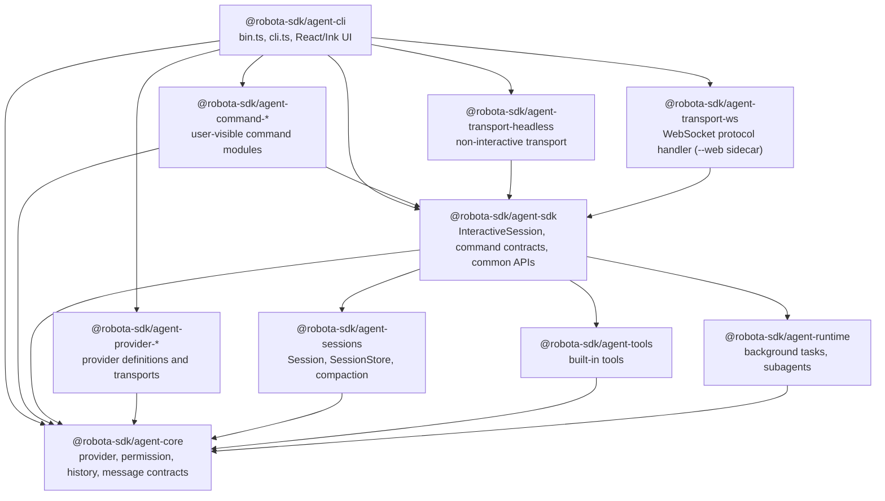

# Agent CLI Target Architecture and Dependencies

Source-verified against `develop` on 2026-05-15.

Target CLI ownership model and dependency graph.

## CLI Boundary

`agent-cli` is a TUI and runtime-host shell. It may own:

- terminal layout, rendering, input handling, keyboard navigation;
- ephemeral UI selection state (highlighted panel/menu entry);
- concrete local host adapters: terminal I/O, process spawning, IPC, Git/filesystem worktree, settings-file access;
- composition of product-default command modules, provider definitions, transports, and SDK factories.

It must not own: lifecycle transitions, durable task registries, command behavior, provider semantics,
persistence formats, permission policy, retention policy, or any SDK-visible data contracts.

When a TUI feature needs data or behavior that no reusable package exposes, add the
SDK/runtime/command/provider capability first. React/Ink components must render SDK-owned state
and invoke SDK-owned controls.

```text
agent-cli
  owns terminal input/rendering, CLI flags, provider definition composition,
  product-default command module selection, and concrete local host adapters
      |
      v
agent-sdk  [React-free — React hooks belong in CLI packages only]
  owns InteractiveSession, command contracts/common APIs, provider-neutral facades,
  host adapter ports, prompt file-reference preprocessing, session orchestration
      |
      +--> agent-sessions   owns conversation run loop, persistence, compaction
      +--> agent-runtime    owns reusable background/subagent lifecycle ports and state
      +--> agent-tools      owns generic tools and tool schemas
      +--> agent-core       owns provider, history, permission, hook, and model catalog contracts

agent-command-*
  owns user-visible command descriptors and execution; consumes SDK contracts as a third-party
  command module would

agent-provider-*
  owns provider definitions, defaults, setup metadata, fallback model catalogs, probes, transport
  translation, and provider-specific options
```

Target ownership rules:

| Concern                                                      | Target owner                            | CLI role                                                             |
| ------------------------------------------------------------ | --------------------------------------- | -------------------------------------------------------------------- |
| Slash prefix detection, command autocomplete, prompt UI      | `agent-cli`                             | Render and route generic command requests.                           |
| TUI layout, keyboard navigation, selected panel/menu state   | `agent-cli`                             | Keep view state ephemeral.                                           |
| Command descriptors, execution, lifecycle effects            | `agent-command-*`                       | Select default modules; render returned interactions/effects.        |
| Command contracts, result/effect types, host adapter ports   | `agent-sdk`                             | Consume without defining parallel command shapes.                    |
| Skill activation semantics and audit events                  | `agent-sdk`                             | Render `skill_activation`; never infer activation from prompt text.  |
| Skill-spawned agent/task behavior                            | `agent-sdk` + `agent-runtime`           | Render task entries only.                                            |
| Provider settings/profile setup common APIs                  | `agent-sdk` + provider packages         | Provide concrete settings adapters and provider definitions.         |
| Prompt `@file` parsing, file reads, diagnostics              | `agent-sdk`                             | Pass ordinary prompt text through `InteractiveSession.submit()`.     |
| Provider-specific defaults, probes, model fallback data      | `agent-provider-*` via `agent-core`     | Compose definitions; never branch on provider names in TUI hooks.    |
| Session persistence facade                                   | `agent-sdk`                             | Request project-local store; display SDK-owned summaries.            |
| Reusable background/subagent state machines and ports        | `agent-runtime`                         | Supply local process/worktree adapters.                              |
| Background task workspace/read model and retention           | `agent-sdk` + `agent-runtime`           | Render SDK projection; keep only selected-entry UI state.            |
| Execution workspace task switching                           | `agent-sdk` read model, `agent-cli` TUI | SDK owns entries/details/events; CLI owns Ctrl+B menu and selection. |
| Terminal process spawning, Ink rendering, local settings I/O | `agent-cli`                             | Keep concrete I/O at the outer shell.                                |
| Core provider/history/permission/model contracts             | `agent-core`                            | Import public contracts only.                                        |

## Package Dependency Graph



| Edge                             | Status    | Rule                                                                                                                          |
| -------------------------------- | --------- | ----------------------------------------------------------------------------------------------------------------------------- |
| CLI → SDK                        | Allowed   | CLI consumes `InteractiveSession`, command registries, command contracts, SDK path helpers, session persistence facade types. |
| CLI → command packages           | Allowed   | Product composition root selects default command modules.                                                                     |
| CLI → provider packages          | Allowed   | CLI owns provider definition composition and provider instance creation.                                                      |
| CLI → agent-core public types    | Allowed   | CLI may use public provider, permission, history, and message types.                                                          |
| CLI → headless transport         | Allowed   | Print mode attaches a transport to `InteractiveSession`.                                                                      |
| CLI → agent-transport-ws         | Allowed   | `--web` sidecar mode: CLI creates `IWebSidecarServer` via `startWebSidecarServer`.                                            |
| CLI → agent-sessions             | Forbidden | No production source or package dependency; harness command layering scan enforces.                                           |
| SDK → command packages           | Forbidden | SDK owns contracts/common APIs; must not import command implementations.                                                      |
| command packages → CLI/TUI       | Forbidden | Commands consume SDK contracts and host adapters only.                                                                        |
| provider packages → commands/TUI | Forbidden | Providers translate provider wire formats only.                                                                               |
