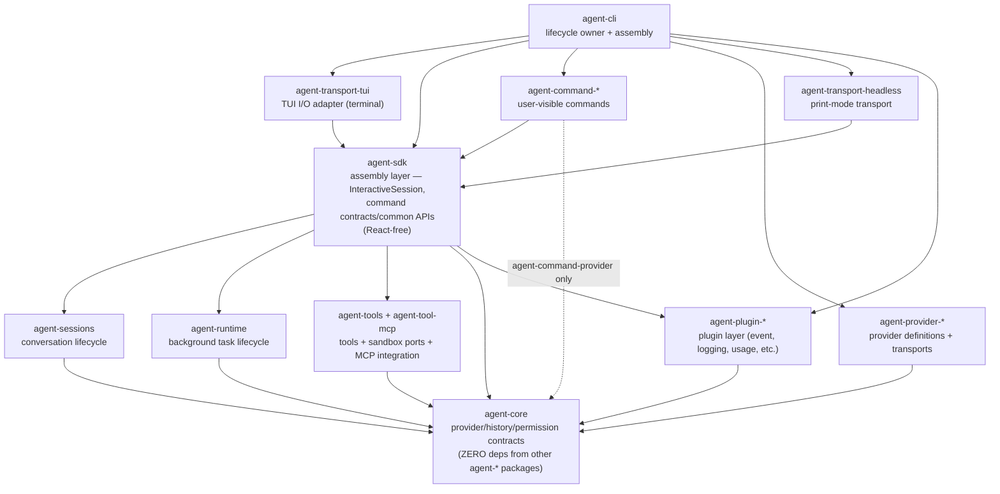
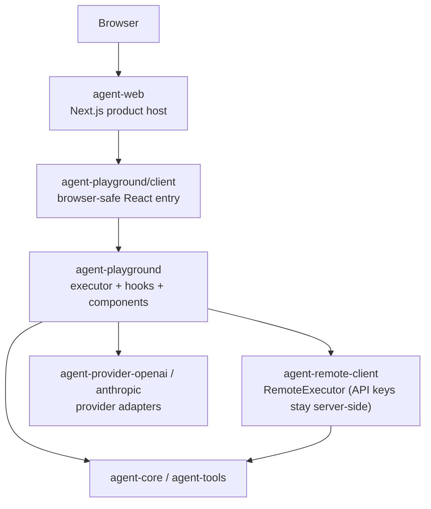

# Agent System Architecture

Agent product stack, playground stack, command/provider/runtime ownership, and profile identity rules.

Back to [System Architecture Map](../ARCHITECTURE-MAP.md).

## Agent Product Stack

Agent stack ownership:

| Concern                                           | Owner                               | Contract                                                              |
| ------------------------------------------------- | ----------------------------------- | --------------------------------------------------------------------- |
| Terminal input/rendering                          | `agent-transport-tui`               | I/O adapter only — implements `IConfigurableTransport`.               |
| CLI lifecycle + assembly                          | `agent-cli`                         | Composes transports, providers, commands; owns `process.exit()`.      |
| SDK assembly layer                                | `agent-sdk`                         | Composes sessions/runtime/tools/core. React-free.                     |
| Command contracts/common APIs                     | `agent-sdk`                         | Command packages consume these as third-party modules.                |
| User-visible built-in command behavior            | `agent-command-*`                   | CLI composes defaults; SDK must not import them.                      |
| Provider defaults, setup metadata, model catalogs | `agent-provider-*` via `agent-core` | CLI must not hardcode provider branches.                              |
| Session lifecycle and compaction                  | `agent-sessions`                    | CLI consumes through SDK facades only.                                |
| Background/subagent lifecycle ports               | `agent-runtime`                     | CLI keeps concrete local process/worktree adapters.                   |
| Background workspace/read model                   | `agent-sdk` + `agent-runtime`       | CLI renders SDK projections; keeps only ephemeral UI selection state. |

Provider profile identity is the settings profile key, not provider `type` or model uniqueness. See [commands-and-provider-flow.md](agent-cli/commands-and-provider-flow.md) for profile switching semantics.

## API Boundary

| Surface          | Owner    | Mutability | Purpose                                              |
| ---------------- | -------- | ---------- | ---------------------------------------------------- |
| Runtime API      | External | Immutable  | ComfyUI-compatible prompt API. Must not be modified. |
| Orchestrator API | Robota   | Modifiable | Cost, auth, retry, and routing policies live here.   |

## Agent CLI Detail Map

See [agent-cli-composition.md](agent-cli-composition.md) and [agent-cli/](agent-cli/) for the concrete CLI startup path, TUI hooks, command-layer inventory, and CLI audits.

## Agent Playground Stack

Playground ownership:

| Concern                                | Owner                     | Contract                                                                                                                                                |
| -------------------------------------- | ------------------------- | ------------------------------------------------------------------------------------------------------------------------------------------------------- |
| Product route and deployment host      | `agent-web`               | Imports browser-safe playground entry only.                                                                                                             |
| Browser-safe React package entry       | `agent-playground/client` | Must not expose Node-only services.                                                                                                                     |
| Executor, hooks, components, context   | `agent-playground`        | Internal modules under `src/lib/` and `src/components/`; see [packages/agent-playground/docs/SPEC.md](../../../packages/agent-playground/docs/SPEC.md). |
| Secure provider execution from browser | `agent-remote-client`     | API keys stay server-side through `RemoteExecutor`.                                                                                                     |
