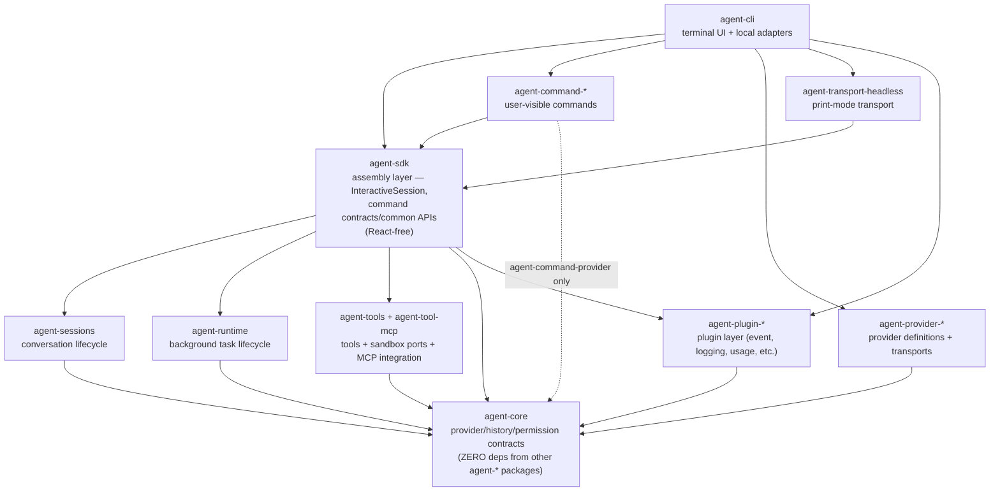
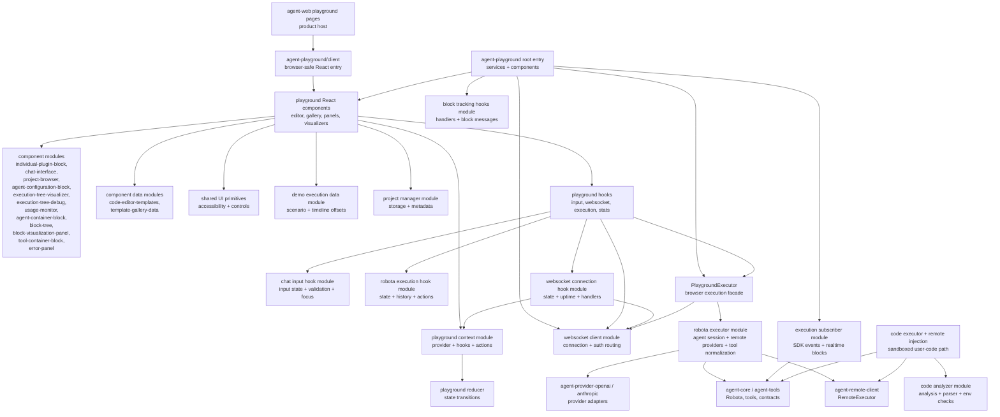

# Agent System Architecture

Agent product stack, playground stack, command/provider/runtime ownership, and profile identity rules.

Back to [System Architecture Map](../ARCHITECTURE-MAP.md).

## Agent Product Stack

The agent stack is part of the routed architecture map. The package-local
`packages/agent-cli/docs/ARCHITECTURE-MAP.md` remains a stable entrypoint that routes to the
grouped CLI startup path, class inventory, TUI hooks, and command-layer audit.

Diagram notes:

- `AgentCLI` does not depend on `agent-plugin-*` packages directly. Plugins are composed by SDK or by
  end-user application code, not by the CLI shell.
- The dashed `Commands --> Core` edge represents only `agent-command-provider`, the single command
  package that imports `agent-core` contracts directly. All other `agent-command-*` packages consume
  SDK APIs only.

Agent stack ownership:

| Concern                                            | Owner                                             | Notes                                                                                                                                                               |
| -------------------------------------------------- | ------------------------------------------------- | ------------------------------------------------------------------------------------------------------------------------------------------------------------------- |
| Terminal input/rendering and host adapters         | `agent-cli`                                       | Thin product shell only; visible CLI features still need reusable SDK/runtime/command/provider ownership for non-UI behavior.                                       |
| SDK assembly layer                                 | `agent-sdk`                                       | Assembly layer — composes sessions, runtime, tools, and core into one SDK surface. Not a re-export layer. React-free; React hooks belong in CLI packages only.      |
| Command contracts/common APIs                      | `agent-sdk`                                       | Command packages consume these like third-party modules.                                                                                                            |
| Model command tool projection                      | `agent-sdk`                                       | Projects model-invocable command descriptors into provider-safe `robota_command_*` tools and reverse maps them to slash-free command ids.                           |
| User-visible built-in command behavior             | `agent-command-*`                                 | CLI composes default modules; SDK must not import them.                                                                                                             |
| Skill discovery, activation, and audit events      | `agent-sdk` common APIs + `agent-command-skills`  | `skills` command activation and `skill_activation` distinguish real activation from prompt-only mimicry; `/skills` is UI input/display syntax only.                 |
| Skill-spawned agents and background task spawning  | `agent-sdk` + `agent-runtime`                     | Skills consume SDK-owned spawning ports; CLI renders resulting task/workspace projections only.                                                                     |
| Provider profile settings/setup helpers            | `agent-sdk` command-api                           | Includes profile validation, setup flow, generated profile-name suggestions, and probe helpers.                                                                     |
| Provider defaults, setup metadata, model catalogs  | `agent-provider-*` through `agent-core` contracts | CLI must not hardcode provider branches.                                                                                                                            |
| Session lifecycle and compaction                   | `agent-sessions`                                  | CLI consumes through SDK facades, not direct imports.                                                                                                               |
| Background/subagent lifecycle ports                | `agent-runtime`                                   | CLI keeps concrete local process/worktree adapters.                                                                                                                 |
| Background workspace/read model                    | `agent-sdk` + `agent-runtime`                     | CLI keeps only ephemeral selected-entry UI state and renders SDK-owned projections.                                                                                 |
| AI workflow manifest/evidence/review control plane | `agent-sdk` + lower harness owner contract        | CLI may render workflow dashboards and review UI only after lower reusable contracts exist; see [../ai-workflow-control-plane.md](../ai-workflow-control-plane.md). |

Provider profile identity is the settings profile key, not provider `type` or model uniqueness.
Generated interactive setup keys are model-derived SDK suggestions with numeric duplicate suffixes;
credential details must stay out of profile names. `agent-cli` may display the active profile key,
provider type, and model in the status area, but profile creation and switching semantics stay in SDK
common APIs and the `agent-command-provider` module.

## API Boundary

The agent system has two distinct API surfaces with different ownership and mutability rules.

| Surface          | Owner    | Mutability | Purpose                                                                              |
| ---------------- | -------- | ---------- | ------------------------------------------------------------------------------------ |
| Runtime API      | External | Immutable  | ComfyUI-compatible prompt API. Robota must not modify or break this contract.        |
| Orchestrator API | Robota   | Modifiable | Robota-owned orchestration layer. Cost, auth, retry policies, and routing live here. |

Rules:

- **Never modify the Runtime API.** It mirrors the ComfyUI prompt API contract. Any breaking change here breaks third-party compatibility.
- **Only the Orchestrator API is Robota-owned.** All product-specific additions (cost controls, auth, retry) belong in the orchestration layer, not the runtime.
- When adding a new policy or capability, verify which API surface it belongs to before choosing the owning package. Policy logic goes to the orchestrator layer; runtime-surface changes require external coordination.

## Agent CLI Detail Map

The concrete `agent-cli` startup path, TUI hooks, execution modes, class inventory, and CLI layer
audit are routed through [agent-cli-composition.md](agent-cli-composition.md) and split under
[agent-cli/](agent-cli/). The package-local entrypoint at
[../../../packages/agent-cli/docs/ARCHITECTURE-MAP.md](../../../packages/agent-cli/docs/ARCHITECTURE-MAP.md)
routes readers to that detail map while preserving the package docs link.

## Agent Playground Stack

Playground ownership:

| Concern                                            | Owner                      | Notes                                                                                        |
| -------------------------------------------------- | -------------------------- | -------------------------------------------------------------------------------------------- |
| Product route and deployment host                  | `agent-web`                | Imports the browser-safe playground entry only.                                              |
| Browser-safe React package entry                   | `agent-playground/client`  | Must not expose Node-only services to browser consumers.                                     |
| Reusable playground services and public root API   | `agent-playground` root    | Owns executor and service exports for runtime consumers.                                     |
| React composition, panels, visualizers, UI state   | `agent-playground`         | Hooks and context remain package-internal unless explicitly exported.                        |
| Playground component modules                       | `agent-playground`         | Keep repeated/complex component internals split behind stable directory `index.ts` modules.  |
| Static template/example catalogs                   | `agent-playground`         | Keep import paths stable through directory `index.ts` modules.                               |
| Shared UI primitives                               | `agent-playground`         | Keep import paths stable through directory `index.ts` modules.                               |
| Playground project storage and metadata            | `agent-playground`         | LocalStorage-backed service; keep import path stable through `index.ts`.                     |
| Block tracking hook factories                      | `agent-playground`         | Keep hook factories thin; handlers and block messages stay internal.                         |
| SDK event subscription and real-time block updates | `agent-playground`         | Keep event guards and handlers internal to the execution subscriber module.                  |
| Playground WebSocket client                        | `agent-playground`         | Keep connection state in the client class; message/auth helpers stay internal.               |
| Playground chat input hook                         | `agent-playground`         | Keep input state calculation, validation, focus wiring, and constants internal.              |
| Playground Robota execution hook                   | `agent-playground`         | Keep execution state, history metrics, timeout, and action wiring behind `index.ts`.         |
| Playground WebSocket connection hook               | `agent-playground`         | Keep state math, uptime effects, constants, and handler registry internal.                   |
| Playground context provider                        | `agent-playground`         | Keep provider composition thin; lifecycle, refs, actions, and result shaping stay internal.  |
| Playground executor facade                         | `agent-playground`         | Keep agent session, remote provider wiring, tool normalization, and result shaping internal. |
| User-code diagnostics and config parsing           | `agent-playground`         | Code analyzer remains package-internal and feeds playground execution.                       |
| Secure provider execution from browser playground  | `agent-remote-client` edge | API keys stay server-side through `RemoteExecutor`/remote injection.                         |
