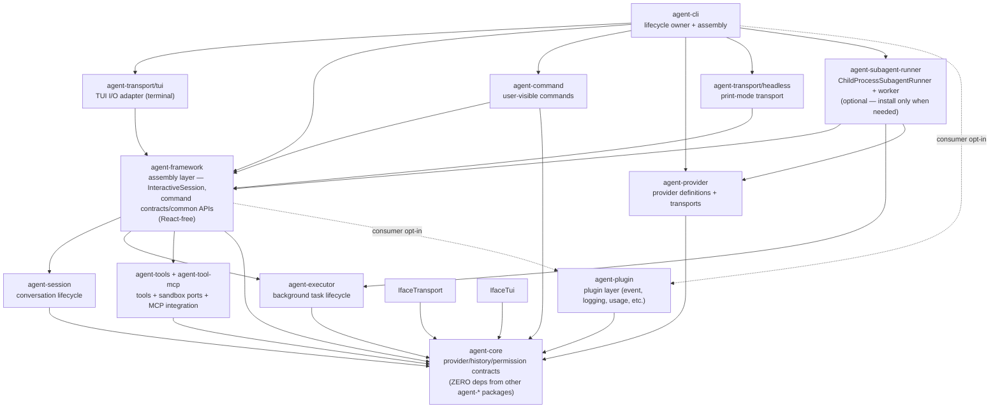
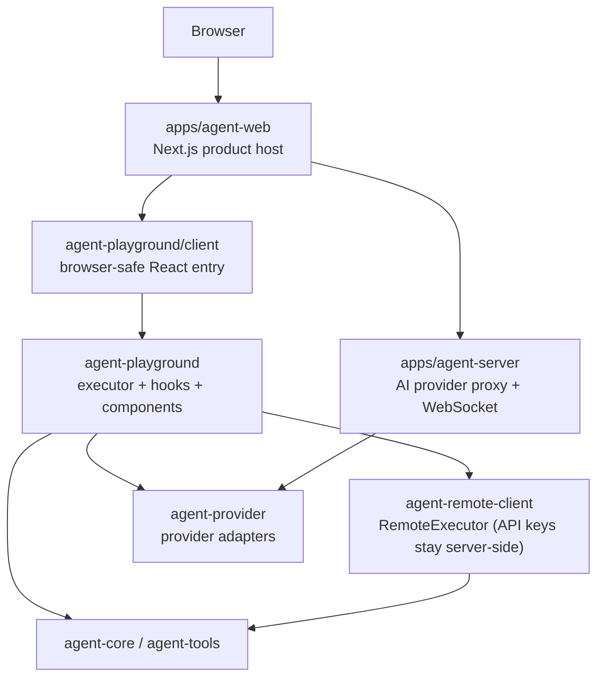

# Agent System Architecture

Agent product stack, playground stack, command/provider/runtime ownership, and profile identity rules.

Back to [System Architecture Map](../ARCHITECTURE-MAP.md).

## Agent Product Stack

Agent stack ownership:

| Concern                                           | Owner                                | Contract                                                                    |
| ------------------------------------------------- | ------------------------------------ | --------------------------------------------------------------------------- |
| Terminal input/rendering                          | `agent-transport/tui`                | I/O adapter only — implements `IConfigurableTransport`.                     |
| CLI lifecycle + assembly                          | `agent-cli`                          | Composes transports, providers, commands; owns `process.exit()`.            |
| Framework assembly layer                          | `agent-framework`                    | Composes sessions/executor/tools/core. React-free.                          |
| Command contracts/common APIs                     | `agent-framework`                    | Command packages consume these as third-party modules.                      |
| User-visible built-in command behavior            | `agent-command`                      | CLI composes defaults; framework must not import them.                      |
| Provider defaults, setup metadata, model catalogs | `agent-provider` via `agent-core`    | CLI must not hardcode provider branches.                                    |
| Session lifecycle and compaction                  | `agent-session`                      | CLI consumes through framework facades only.                                |
| Background/subagent lifecycle ports               | `agent-executor`                     | CLI keeps concrete local process/worktree adapters.                         |
| Child-process subagent runner + worker            | `agent-subagent-runner` (opt-in)     | CLI imports factory; pass workerPath from getDefaultSubagentWorkerPath().   |
| Background workspace/read model                   | `agent-framework` + `agent-executor` | CLI renders framework projections; keeps only ephemeral UI selection state. |

Provider profile identity is the settings profile key, not provider `type` or model uniqueness. See [commands-and-provider-flow.md](agent-cli/commands-and-provider-flow.md) for profile switching semantics.

**Plugin consumer opt-in**: `agent-plugin` packages are not imported by `agent-cli` or `agent-framework` production source. Plugins are registered by consuming applications at composition time. The dashed edges above (`consumer opt-in`) reflect this: no plugin imports exist in the CLI or framework assembly paths. Application consumers pass plugin instances to the framework assembly API.

## API Boundary

| Surface          | Owner    | Mutability | Purpose                                              |
| ---------------- | -------- | ---------- | ---------------------------------------------------- |
| Runtime API      | External | Immutable  | ComfyUI-compatible prompt API. Must not be modified. |
| Orchestrator API | Robota   | Modifiable | Cost, auth, retry, and routing policies live here.   |

## Agent CLI Detail Map

See [agent-cli-composition.md](agent-cli-composition.md) and [agent-cli/](agent-cli/) for the concrete CLI startup path, TUI hooks, command-layer inventory, and CLI audits.

## Agent Playground Stack

Data flow: `Browser → apps/agent-web → apps/agent-server → agent-provider → AI provider`. The
browser never holds API keys — all provider calls are proxied through `apps/agent-server`. The
playground package itself is a lightweight client UI; session management and server-side policy
live in `apps/agent-server`.

Playground ownership:

| Concern                                | Owner                     | Contract                                                                                                                                                |
| -------------------------------------- | ------------------------- | ------------------------------------------------------------------------------------------------------------------------------------------------------- |
| Product route and deployment host      | `apps/agent-web`          | Imports browser-safe playground entry only.                                                                                                             |
| AI provider proxy + WebSocket host     | `apps/agent-server`       | API keys and server-side provider policy stay here; never in browser.                                                                                   |
| Browser-safe React package entry       | `agent-playground/client` | Must not expose Node-only services.                                                                                                                     |
| Executor, hooks, components, context   | `agent-playground`        | Internal modules under `src/lib/` and `src/components/`; see [packages/agent-playground/docs/SPEC.md](../../../packages/agent-playground/docs/SPEC.md). |
| Secure provider execution from browser | `agent-remote-client`     | API keys stay server-side through `RemoteExecutor`.                                                                                                     |

**No agent-framework session stack (intentional)**: `agent-playground` does not depend on
`agent-framework`, `agent-session`, or `agent-executor`. Session management and all server-side
policy run in `apps/agent-server`; the playground is a lightweight client UI only.
See [packages/agent-playground/docs/SPEC.md](../../../packages/agent-playground/docs/SPEC.md).

## WebSocket Sidecar Mode [Planned]

> **[Planned — not yet implemented]** The `--web` / `--web-port` flags and `startWebSidecarServer()` do not exist in the codebase. This section documents the intended design only.

When implemented, sidecar mode will span four packages:

| Package              | Role                                                                        |
| -------------------- | --------------------------------------------------------------------------- |
| `agent-cli`          | Launch `--web` flag; host `startWebSidecarServer(interactiveSession, port)` |
| `agent-transport/ws` | `createWsHandler({ session, send })` — real-time session event relay        |
| `agent-web-ui`       | Browser React components; `useWsSession(url)` hook for WebSocket connection |
| `apps/agent-web`     | Deployment host; opens monitor URL in browser                               |

For the intended sequence diagram see [agent-cli/execution-modes.md](agent-cli/execution-modes.md).

## Multi-Agent Orchestration

The `agent-subagent-runner` package handles child-process subagent execution (opt-in, CLI only).

| Concern                          | Owner                   | Contract                                                                                  |
| -------------------------------- | ----------------------- | ----------------------------------------------------------------------------------------- |
| Child-process subagent runner    | `agent-subagent-runner` | Opt-in. CLI imports factory; forks worker via `child_process.fork()`.                     |
| Agent Command (spawn + delegate) | `agent-command`         | `robota_command_agent` tool — spawns background agent job via `agent-executor` contracts. |
