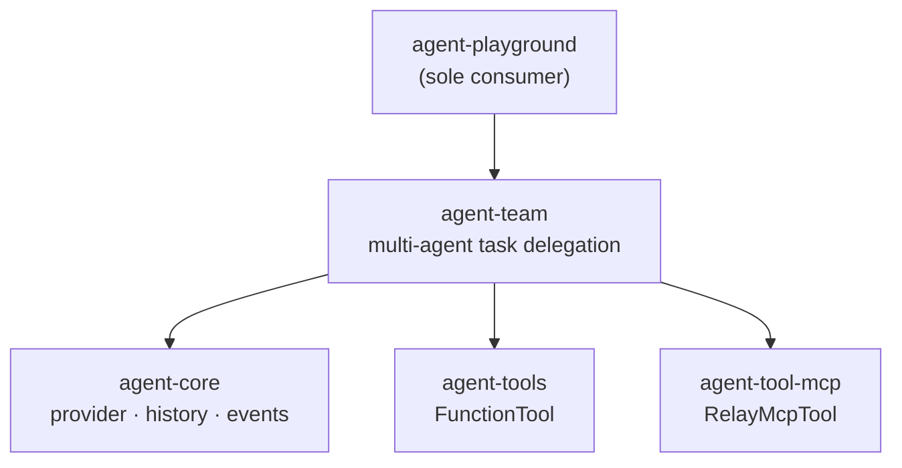

# Agent Team Architecture

Source-verified against `develop` on 2026-05-18.

Multi-agent task delegation and coordination. Sole consumer: `agent-playground`.

Back to [System Architecture Map](../ARCHITECTURE-MAP.md) | [agent-system.md](agent-system.md)

## Scope

`agent-team` owns same-process multi-agent task delegation. It provides:

- A **template registry** of pre-configured agent archetypes (provider, model, system prompt).
- **Tool-as-capability delegation**: relay tools that a parent agent can call to spawn and delegate work to a child agent.
- **Owner-path propagation**: child agents inherit a scoped `IEventService` with an extended `ownerPath`, ensuring all events are traceable back to the originating agent tree.

`agent-team` does NOT own:

- Session persistence or conversation history — those live in `agent-session`.
- UI or CLI behavior — no TUI or terminal deps.
- Child-process isolation — that is `agent-subagent-runner` (opt-in package).
- Provider creation logic — provider definitions come from `agent-provider`; profiles from `agent-core` infrastructure.

## Layer Position



`agent-team` sits in the **Orchestration layer** — below `agent-framework` and `agent-session`,
above `agent-core`. It must not import from `agent-framework`, `agent-session`, `agent-executor`,
`agent-command`, or `agent-cli`.

## Dependency Boundary

| Allowed imports              | Rationale                                                           |
| ---------------------------- | ------------------------------------------------------------------- |
| `@robota-sdk/agent-core`     | Provider contracts, event service, `Robota` agent class, owner path |
| `@robota-sdk/agent-tools`    | `FunctionTool` for template inspection tools                        |
| `@robota-sdk/agent-tool-mcp` | `RelayMcpTool` for async task delegation                            |

| Prohibited imports           | Reason                                                             |
| ---------------------------- | ------------------------------------------------------------------ |
| `agent-framework`            | Assembly layer — orchestration must not depend upward              |
| `agent-session`              | Session services — orchestration does not own persistence          |
| `agent-executor`             | Runtime services — orchestration has no background task lifecycle  |
| `agent-command`, `agent-cli` | Product shells / command layer — strictly upward dependencies only |

## Delegation Model

Template-based delegation: a parent agent calls the `assignTask` relay tool with a `templateId`
and `jobDescription`. The relay tool:

1. Looks up the template in the static `templates.json` registry.
2. Constructs a child `Robota` agent with template-derived config (provider, model, temperature,
   system message) and optional per-call overrides.
3. Binds an owner-path-scoped `IEventService` to the child agent so all child events are
   identifiable within the parent's event tree.
4. Runs the job description prompt and returns the result.

```text
Parent agent
  └─ calls assignTask tool (templateId, jobDescription)
       └─ createAssignTaskRelayTool()
            ├─ looks up template in templates.json
            ├─ bindWithOwnerPath(ctx.baseEventService, agentOwnerPath)
            ├─ new Robota({ aiProviders, defaultModel, eventService })
            └─ agent.run(jobDescription) → IToolResult
```

Delegation is **synchronous within the parent's turn** — child agent runs to completion before
returning the relay tool result. No background task, no process fork.

## Owner-Path Propagation

Each `assignTask` invocation extends the caller's `ownerPath` with a new `{ type: 'agent', id: ctx.agentId }` segment. The child agent receives a scoped `IEventService` created via `bindWithOwnerPath()` (imported from `@robota-sdk/agent-core`). This allows the event system to trace execution through multi-level delegation trees.

```text
parent  → ownerPath: [{ type: 'agent', id: 'parent-id' }]
  child → ownerPath: [{ type: 'agent', id: 'parent-id' }, { type: 'agent', id: 'child-id' }]
```

## Template Registry

Templates are defined in `src/assign-task/templates.json` — a static file compiled into the
package. Each template specifies: `id`, `name`, `description`, `provider`, `model`, `temperature`,
and `systemMessage`.

Built-in templates:

| ID                 | Name             | Provider | Model       |
| ------------------ | ---------------- | -------- | ----------- |
| `general`          | General Purpose  | openai   | gpt-4o-mini |
| `task_coordinator` | Task Coordinator | openai   | gpt-4o-mini |

Templates cannot be extended at runtime. To add templates, modify `templates.json` at the source
level.

## Public API Surface

| Export                       | Kind         | Description                                                                       |
| ---------------------------- | ------------ | --------------------------------------------------------------------------------- |
| `listTemplateCategoriesTool` | FunctionTool | Returns available template categories.                                            |
| `listTemplatesTool`          | FunctionTool | Returns templates, optionally filtered by `categoryId`.                           |
| `getTemplateDetailTool`      | FunctionTool | Returns full template details for a given `templateId`.                           |
| `createAssignTaskRelayTool`  | factory      | `(eventService, aiProviders) => RelayMcpTool`. Creates the delegation relay tool. |

## Composition Entry Points

`agent-team` is consumed exclusively by `agent-playground`. No `agent-cli`, `agent-framework`,
or any Assembly-layer package imports `agent-team`. This is the `Playground → Orchestration`
edge in [dependency-direction.md](dependency-direction.md).

Composition wiring:

```typescript
// Inside agent-playground composition
import { createAssignTaskRelayTool, listTemplatesTool, ... } from '@robota-sdk/agent-team';

const assignTaskTool = createAssignTaskRelayTool(eventService, aiProviders);
// Pass to parent agent's tool registry
```

## Distinction from agent-subagent-runner

| Concern         | `agent-team`                              | `agent-subagent-runner`                                                                 |
| --------------- | ----------------------------------------- | --------------------------------------------------------------------------------------- |
| Execution model | Same process — runs `Robota.run()` inline | Child process — forks via `child_process.fork()`                                        |
| Isolation       | Shared memory and event loop              | Isolated Node.js process + optional git worktree                                        |
| IPC             | Direct function call                      | JSON-over-IPC protocol (`TSubagentWorkerParentMessage` / `TSubagentWorkerChildMessage`) |
| Provider deps   | Receives `IAIProvider[]` from caller      | Reconstructs provider from serialized profile                                           |
| Layer           | Orchestration                             | Optional runners (opt-in)                                                               |
| Consumer        | `agent-playground`                        | `agent-cli` (composition root)                                                          |
| Background task | None — synchronous within parent's turn   | Yes — runs in background with lifecycle handle                                          |
