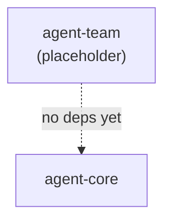

# Agent Team Architecture

Source-verified against `develop` on 2026-05-22.

Reserved for future multi-agent coordination capabilities.

Back to [System Architecture Map](../ARCHITECTURE-MAP.md) | [agent-system.md](agent-system.md)

## Current State

`agent-team` is a placeholder package with no exported symbols.

The `assignTask` relay tool pattern that previously lived here was removed (TOOL-002) in favour of
the Agent Command pattern (`robota_command_agent` via `@robota-sdk/agent-command`).

## What Was Removed (TOOL-002)

| Symbol                       | Kind         | Reason for removal                                                |
| ---------------------------- | ------------ | ----------------------------------------------------------------- |
| `assignTask`                 | relay tool   | Replaced by `robota_command_agent` in `@robota-sdk/agent-command` |
| `listTemplateCategoriesTool` | FunctionTool | Part of assignTask flow — no longer needed                        |
| `listTemplatesTool`          | FunctionTool | Part of assignTask flow — no longer needed                        |
| `getTemplateDetailTool`      | FunctionTool | Part of assignTask flow — no longer needed                        |
| `createAssignTaskRelayTool`  | factory      | Part of assignTask flow — no longer needed                        |

## Future Direction

When multi-agent coordination features are designed, they will be added to this package.
New capabilities must go through the spec-first workflow before implementation.

## Layer Position

## Dependency Boundary

No current dependencies. When new features are added, dependency rules must be defined in
`packages/agent-team/docs/SPEC.md` first.
