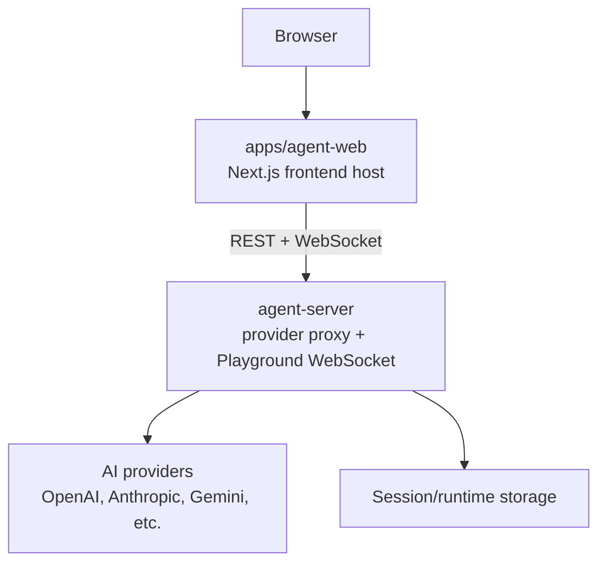
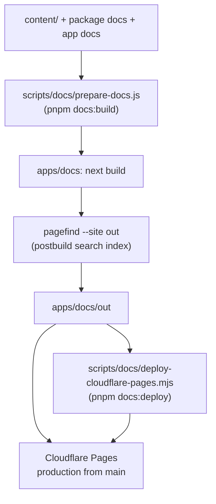

# Apps and Deployment Architecture

Application deployment topology, service boundaries, and documentation deployment flow.

Back to [System Architecture Map](../ARCHITECTURE-MAP.md).

## Agent App Deployment Stack

The agent web app and API service deploy independently. Keep browser-visible UI concerns in the
frontend shell and provider/API-key work in the server-side service.

Deployment ownership:

| Deploy unit           | Runtime shape                                           | Deploy platform                                  | Required contract                                                                                                                                                                                                                               |
| --------------------- | ------------------------------------------------------- | ------------------------------------------------ | ----------------------------------------------------------------------------------------------------------------------------------------------------------------------------------------------------------------------------------------------- |
| `apps/agent-web`      | Next.js frontend host                                   | Vercel (frontend) + Firebase/Firestore (backend) | Browser UI imports `agent-playground/client` and keeps provider secrets server-side. Ships `vercel.json` + `firebase.json`/`firestore.rules`. Routes: `/` (→ `/playground`), `/playground`, `/playground/demo`, `/monitor` (CLI second-screen). |
| `apps/agent-server`   | Node service with WebSocket support                     | Firebase Functions                               | Owns provider proxying, Playground WebSocket, CORS, and process lifecycle handling.                                                                                                                                                             |
| `apps/docs`           | Next.js static docs site                                | Cloudflare Pages                                 | Builds from repository docs/content (`next build` + `pagefind`) and deploys through Cloudflare Pages.                                                                                                                                           |
| `apps/blog`           | Static blog site                                        | Cloudflare Pages                                 | Deploys automatically from `main` branch alongside docs.                                                                                                                                                                                        |
| `apps/www`            | Next.js marketing site (`robota-www`)                   | Cloudflare Pages                                 | Marketing/landing site; `wrangler.toml`, `pages_build_output_dir = "out"`.                                                                                                                                                                      |
| `apps/starter-nextjs` | Next.js starter template (`@robota-sdk/starter-nextjs`) | Template (not a deployed service)                | Reference AI-chat starter that consumers copy; built with `next build`.                                                                                                                                                                         |
| `apps/action`         | GitHub Action (`@robota-sdk/action`)                    | GitHub Marketplace (`tsc` build)                 | Official Robota GitHub Action; not a hosted web service.                                                                                                                                                                                        |

`packages/agent-web-ui` vs `apps/agent-web` disambiguation:

| Item                     | Kind                  | Role                                                                                                                                                                                                                         |
| ------------------------ | --------------------- | ---------------------------------------------------------------------------------------------------------------------------------------------------------------------------------------------------------------------------- |
| `apps/agent-web`         | Next.js host app      | Full Playground web application; consumes `agent-playground`; its `/monitor` route mounts `SessionMonitor` from the shared GUI core `@robota-sdk/agent-transport-gui`.                                                       |
| `apps/agent-web-monitor` | Vite SPA (CLI-served) | The CLI-served web GUI: `index.html` monitor (`SessionMonitor`) + `remote.html` Stage-D page (`RemoteClient` from `agent-transport-webrtc-web`), over the shared GUI core. `agent-cli` builds + serves its `dist` (GUI-006). |

The former `packages/agent-web-ui` library was retired in GUI-006: its `SessionMonitor` moved to the shared GUI
core (`@robota-sdk/agent-transport-gui`), its browser WebRTC peer to `@robota-sdk/agent-transport-webrtc-web`,
and its CLI-served SPA to `apps/agent-web-monitor`. Do not import `apps/agent-web` from anywhere; consume the
shared GUI surface from `@robota-sdk/agent-transport-gui`.

Deployment decision:

- Keep `apps/agent-web` deployable on a frontend platform.
- Keep provider credentials, provider API calls, and long-running WebSocket handling out of the
  frontend shell.
- Keep reusable Playground behavior in `agent-playground`; `apps/agent-web` owns only the product
  route and deployment host.
- Remote execution contract ownership stays in `agent-remote-client` and reusable Playground
  execution behavior stays in `agent-playground`; `apps/agent-web` and `apps/agent-server` compose
  those packages without owning their contracts.

## Documentation Deployment Stack

Docs deployment ownership:

| Concern                        | Owner                                               |
| ------------------------------ | --------------------------------------------------- |
| Documentation source content   | `content/`, package docs, app docs                  |
| Static site build pipeline     | `apps/docs`                                         |
| Production deploy              | Cloudflare Pages Git integration from `main`        |
| Manual direct upload           | `scripts/docs/deploy-cloudflare-pages.mjs`          |
| Release workflow docs behavior | Build verification only; no GitHub Pages deployment |

Docs preservation rules:

- **`content/v2.0.0/` must never be deleted.** This directory is permanently preserved. Any cleanup
  script or deploy pipeline must explicitly exclude it.
- **Three-layer sync required on every app change.** When any app or SDK change affects
  user-visible behavior, update all three documentation layers in the same PR:
  `packages/*/docs/SPEC.md` → `packages/*/README.md` → `content/` site pages.
