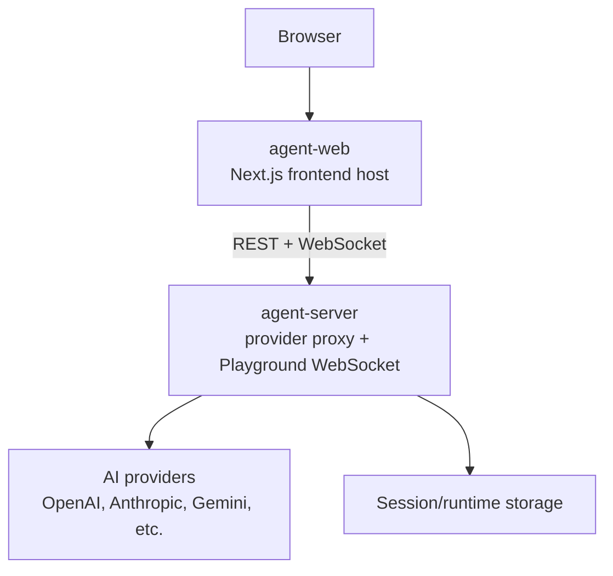
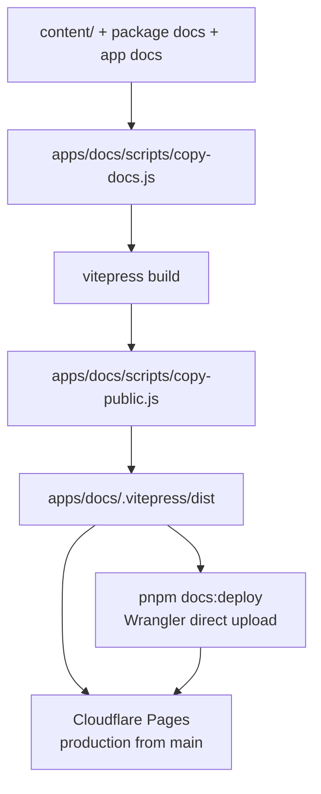

# Apps and Deployment Architecture

Application deployment topology, service boundaries, and documentation deployment flow.

Back to [System Architecture Map](../ARCHITECTURE-MAP.md).

## Agent App Deployment Stack

The agent web app and API service deploy independently. Keep browser-visible UI concerns in the
frontend shell and provider/API-key work in the server-side service.

Deployment ownership:

| Deploy unit      | Runtime shape                       | Deploy platform    | Required contract                                                                    |
| ---------------- | ----------------------------------- | ------------------ | ------------------------------------------------------------------------------------ |
| `apps/agent-web` | Next.js frontend host               | Vercel             | Browser UI imports `agent-playground/client` and keeps provider secrets server-side. |
| `agent-server`   | Node service with WebSocket support | Firebase Functions | Owns provider proxying, Playground WebSocket, CORS, and process lifecycle handling.  |
| `apps/docs`      | Static docs site                    | Cloudflare Pages   | Builds from repository docs/content and deploys through Cloudflare Pages.            |
| `apps/blog`      | Static blog site                    | Cloudflare Pages   | Deploys automatically from `main` branch alongside docs.                             |

`packages/agent-web` vs `apps/agent-web` disambiguation:

| Item                 | Kind              | Role                                                                                   |
| -------------------- | ----------------- | -------------------------------------------------------------------------------------- |
| `packages/agent-web` | Published npm lib | Browser React components for monitoring a CLI session over `--web` WebSocket sidecar.  |
| `apps/agent-web`     | Next.js host app  | Full Playground web application; consumes `agent-playground` and `packages/agent-web`. |

They share the `agent-web` name prefix but are different layers: the package is a reusable library;
the app is the deployment host. Do not import `apps/agent-web` from anywhere; use
`@robota-sdk/agent-web` for the published library surface.

Deployment decision:

- Keep `agent-web` deployable on a frontend platform.
- Keep provider credentials, provider API calls, and long-running WebSocket handling out of the
  frontend shell.
- Keep reusable Playground behavior in `agent-playground`; `agent-web` owns only the product route
  and deployment host.
- Remote execution contract ownership stays in `agent-remote-client` and reusable Playground
  execution behavior stays in `agent-playground`; `agent-web` and `agent-server` compose those
  packages without owning their contracts.

## Documentation Deployment Stack

Docs deployment ownership:

| Concern                        | Owner                                               |
| ------------------------------ | --------------------------------------------------- |
| Documentation source content   | `content/`, package docs, app docs                  |
| Static site build pipeline     | `apps/docs`                                         |
| Production deploy              | Cloudflare Pages Git integration from `main`        |
| Manual direct upload           | `scripts/docs/deploy-cloudflare-pages.mjs`          |
| Release workflow docs behavior | Build verification only; no GitHub Pages deployment |

Docs preservation rules:

- **`content/v2.0.0/` must never be deleted.** This directory is permanently preserved. Any cleanup
  script or deploy pipeline must explicitly exclude it.
- **Three-layer sync required on every app change.** When any app or SDK change affects
  user-visible behavior, update all three documentation layers in the same PR:
  `packages/*/docs/SPEC.md` → `packages/*/README.md` → `content/` site pages.
