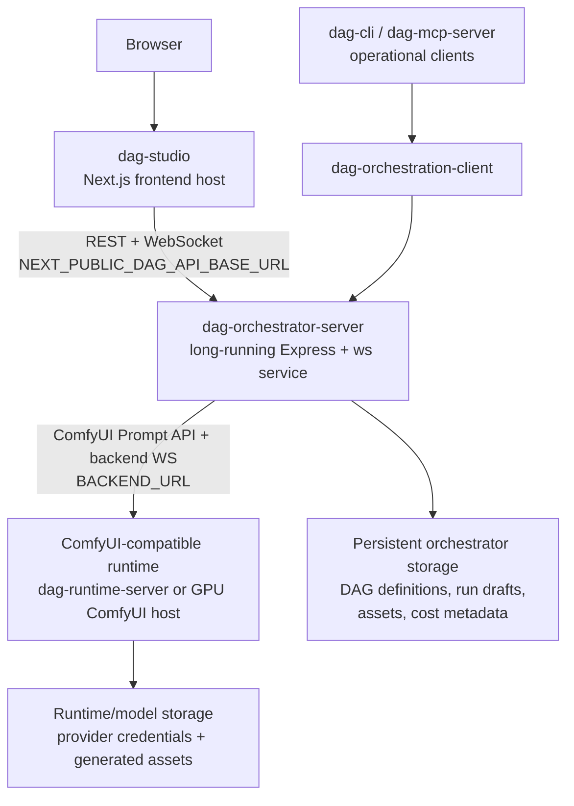
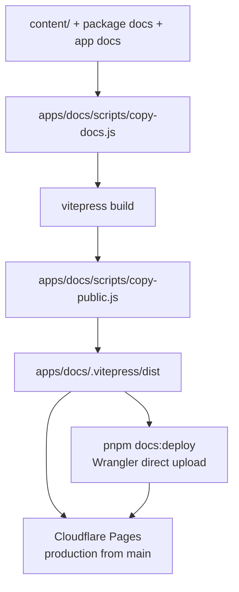

# Apps and Deployment Architecture

Application deployment topology, service boundaries, and documentation deployment flow.

Back to [System Architecture Map](../ARCHITECTURE-MAP.md).

## DAG Service Deployment Stack

The DAG service deploys as three independent units. Keep this topology in this architecture slice;
app-local docs only record the environment variables and runtime constraints owned by each app.

Deployment ownership:

| Deploy unit                 | Runtime shape                                             | Required contract                                                                                                       |
| --------------------------- | --------------------------------------------------------- | ----------------------------------------------------------------------------------------------------------------------- |
| `dag-studio`                | Next.js frontend host                                     | Browser-visible `NEXT_PUBLIC_DAG_API_BASE_URL` points at `dag-orchestrator-server`; generic `API_CONFIG` remains local. |
| `dag-orchestrator-server`   | Long-running Node process or container with WebSocket I/O | `ORCHESTRATOR_PORT`, `BACKEND_URL`, `CORS_ORIGINS`, and persistent storage roots are configured by the host.            |
| `dag-runtime-server`        | Local/dev ComfyUI-compatible Node runtime                 | Serves the Prompt API on `DAG_PORT` and owns node provider API keys for bundled node execution.                         |
| External ComfyUI/GPU host   | Managed or self-hosted GPU runtime                        | Must expose the ComfyUI Prompt API and compatible WebSocket surface used by the orchestrator.                           |
| Operational CLI/MCP clients | Local or agent-hosted processes                           | Use `dag-orchestration-client`; never import server route modules or route-local contracts.                             |

Deployment decision:

- Keep `dag-studio` deployable on a frontend platform such as Vercel or Cloudflare's Next.js
  hosting path.
- Keep `dag-orchestrator-server` off serverless function-only runtimes. It owns WebSocket upgrade
  handling, ComfyUI proxying, and local/cloud persistence adapter wiring, so it belongs on a
  long-running process/container host such as Railway, Fly.io, ECS, or an equivalent Node service
  platform.
- Do not collapse the orchestrator into Next.js API routes merely to share a deployment target with
  `dag-studio`. That would move WebSocket, proxy, and persistence concerns into the frontend shell.
- Keep `dag-runtime-server` or an external ComfyUI-compatible GPU backend separate from the
  orchestrator. Production image/video workloads should choose a runtime host based on GPU,
  cold-start, model-storage, and private-networking requirements.
- When the frontend is served from HTTPS, run progress must use `wss://` to the orchestrator origin.
  `dag-designer` derives this from `NEXT_PUBLIC_DAG_API_BASE_URL`.
- Verify external ComfyUI compatibility locally with `docker-compose.dag-comfyui.yml` and
  `pnpm dag:comfyui:verify`. This check is opt-in because the Docker build, model files, and GPU
  policy are host-dependent.

## Documentation Deployment Stack

Docs deployment ownership:

| Concern                        | Owner                                               |
| ------------------------------ | --------------------------------------------------- |
| Documentation source content   | `content/`, package docs, app docs                  |
| Static site build pipeline     | `apps/docs`                                         |
| Production deploy              | Cloudflare Pages Git integration from `main`        |
| Manual direct upload           | `scripts/docs/deploy-cloudflare-pages.mjs`          |
| Release workflow docs behavior | Build verification only; no GitHub Pages deployment |
