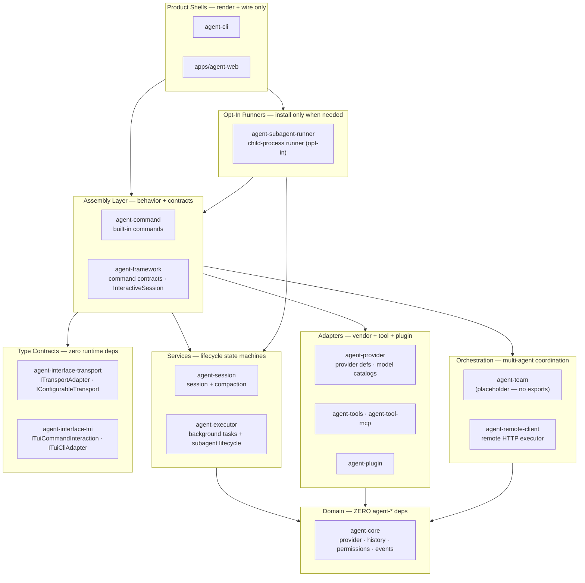

# Capability Placement

Owner-selection rules for new product-visible capabilities.

Back to [System Architecture Map](../ARCHITECTURE-MAP.md).

Use this document when adding a user-visible feature, background activity, command, provider
behavior, transport projection, session behavior, or shared policy. For spec-first workflow and
document authority rules, see [../../rules/documentation-sync.md](../../rules/documentation-sync.md)
and [../../rules/spec-workflow.md](../../rules/spec-workflow.md).

## Ownership Layer Map

New capability ownership follows the **lowest reusable boundary**: if two shells or packages need it,
it belongs in the layer below both of them.

## Owner Selection Table

| Capability concern                                      | Owner first                                                                                      | Product shell responsibility                                                      |
| ------------------------------------------------------- | ------------------------------------------------------------------------------------------------ | --------------------------------------------------------------------------------- |
| Terminal/browser UI, navigation, selection, key binding | `agent-cli`, `apps/agent-web`, `apps/docs`, `apps/blog`                                          | Render owner projections and hold ephemeral UI state only.                        |
| Command behavior, descriptors, host effects             | `agent-command` for built-ins; `agent-framework` for command contracts/common APIs               | Register default command modules and render command UI.                           |
| Background task lifecycle and subagent lifecycle        | `agent-executor` state machines and runner ports; `agent-framework` facades/projections          | Provide concrete local adapters and render framework/executor projections.        |
| Child-process subagent runner + worker                  | `agent-subagent-runner` (opt-in package)                                                         | Import factory; pass workerPath from getDefaultSubagentWorkerPath().              |
| Execution workspace/read model                          | `agent-framework` + `agent-executor`                                                             | Keep selected-entry UI state and request reads through framework APIs.            |
| Session lifecycle, history, compaction                  | `agent-session` through `agent-framework` facades                                                | Display session state and invoke framework operations.                            |
| Provider definitions, setup metadata, model catalogs    | `agent-provider` through `agent-core` contracts                                                  | Compose selected providers and display provider/profile state.                    |
| Provider transport and vendor SDK behavior              | `agent-provider`, `agent-transport` subpaths, or server-side service packages                    | Supply credentials through allowed adapters; never hardcode vendor logic.         |
| Tool contracts, sandbox policy, MCP integration         | `agent-tools`, `agent-tool-mcp`, and `agent-core` contracts                                      | Render tool progress/results and pass host adapters.                              |
| Auth and credits policy                                 | TBD — packages not yet created; policy lives in orchestrator layer for now                       | Collect product-specific input and call orchestrator APIs.                        |
| Multi-agent task delegation and coordination            | `agent-team` (placeholder — future) or `agent-command` (Agent Command pattern)                   | Use `robota_command_agent` for agent delegation; `agent-team` has no exports yet. |
| Orchestration policies (cost, auth, retry, routing)     | Orchestrator layer — not the runtime API surface                                                 | Call orchestrator APIs; never add policy to the immutable Runtime API.            |
| Transport adapter type contracts                        | `agent-interface-transport`                                                                      | Use `ITransportAdapter` / `IConfigurableTransport` from this package only.        |
| TUI interaction type contracts                          | `agent-interface-tui`                                                                            | Use `ITuiCommandInteraction` / `ITuiCliAdapter` from this package only.           |
| Playground reusable behavior                            | `agent-playground`, `agent-remote-client`, `agent-framework`, `agent-core`                       | `apps/agent-web` owns routes and deployment host only.                            |
| Server provider proxy, WebSocket, CORS, process host    | `apps/agent-server` with contracts from provider, remote-client, playground, and framework specs | Frontend shells call the API; they do not own server-side provider policy.        |
| Documentation build/deploy                              | `apps/docs`, `apps/blog`, Cloudflare deployment docs                                             | Product docs render generated/source content and deploy through owner flow.       |

## Stop Conditions

Stop and move ownership lower when a product shell implementation needs any of:

- durable task registries, retention policy, log aggregation, or lifecycle state transitions;
- command behavior, descriptor semantics, or host-effect contracts;
- provider setup metadata, model catalog logic, vendor request shaping, or vendor response parsing;
- permission policy, auth scope evaluation, credit reservation, or settlement rules;
- persistence formats, session compaction, or transport-visible protocol contracts;
- reusable background grouping, workspace snapshots, or completed-task retention;
- server-side provider secrets or long-running execution ownership in a browser shell.

## Composition-Root Adapter Rule

A product shell may import a concrete adapter only when: the reusable contract is owned by a lower
package; the adapter is passed into an owner API rather than becoming shell business logic; the shell
does not persist or reinterpret owner state; the shell does not export the adapter as a reusable API.

If an adapter behavior must be reused by another shell, transport, test harness, or service, move the
contract and default implementation below the product shell.
