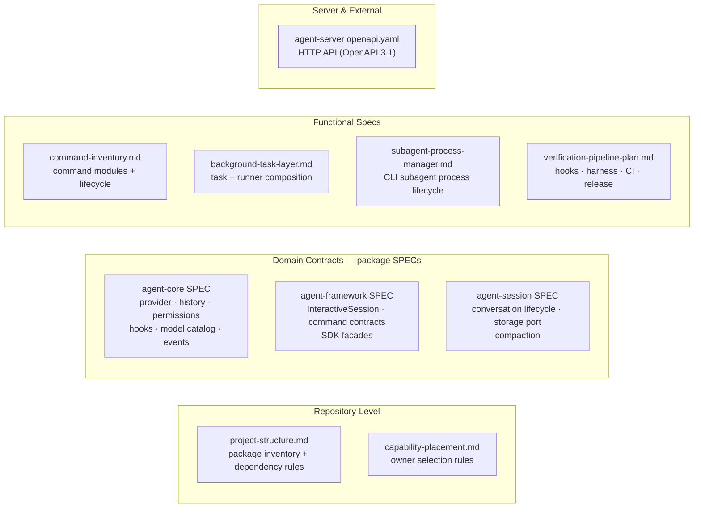

# Cross-Cutting Contracts

Repository-wide contract owners that span product shells or package families.

Back to [System Architecture Map](../ARCHITECTURE-MAP.md).

Detail lives in the owner document. Update the owner SPEC/spec first, then update the smallest
relevant architecture-map subdocument. See [capability-placement.md](capability-placement.md) before
adding product-shell UI for a new capability.

## Contract Landscape

## Contract Owner Index

| Contract area                          | Owner document                                                                                   | Notes                                                                       |
| -------------------------------------- | ------------------------------------------------------------------------------------------------ | --------------------------------------------------------------------------- |
| Package inventory and dependency rules | [../../project-structure.md](../../project-structure.md)                                         | Package list and dependency direction rules.                                |
| Capability placement                   | [capability-placement.md](capability-placement.md)                                               | Owner-first path for new product-visible behavior.                          |
| Built-in command ownership             | [../command-inventory.md](../command-inventory.md)                                               | Command modules, lifecycle, model visibility, and host effects.             |
| Agent invocation routing               | [../agent-invocation-router.md](../agent-invocation-router.md)                                   | Deterministic agent command descriptors and routing claim guards.           |
| AI workflow control plane              | [../ai-workflow-control-plane.md](../ai-workflow-control-plane.md)                               | Workflow manifest, command registry, artifacts, hooks, review, and CLI UI.  |
| Background task lifecycle              | [../background-task-layer.md](../background-task-layer.md)                                       | Generic background task composition, runners, projection, and CLI boundary. |
| Subagent process management            | [../subagent-process-manager.md](../subagent-process-manager.md)                                 | CLI subagent process execution and parallel lifecycle.                      |
| Verification pipeline                  | [../verification-pipeline-plan.md](../verification-pipeline-plan.md)                             | Local hooks, harness, CI, build, and release verification.                  |
| Agent core contracts                   | [../../../packages/agent-core/docs/SPEC.md](../../../packages/agent-core/docs/SPEC.md)           | Provider, history, permission, hooks, and model catalog contracts.          |
| Agent SDK contracts                    | [../../../packages/agent-framework/docs/SPEC.md](../../../packages/agent-framework/docs/SPEC.md) | InteractiveSession, command contracts/common APIs, and SDK facades.         |
| Event contracts                        | [../../../packages/agent-core/docs/SPEC.md](../../../packages/agent-core/docs/SPEC.md)           | Agent lifecycle events owned by `agent-core`.                               |
| Session contracts                      | [../../../packages/agent-session/docs/SPEC.md](../../../packages/agent-session/docs/SPEC.md)     | Conversation lifecycle, persistence, and compaction contracts.              |
| Storage port contracts                 | [../../../packages/agent-session/docs/SPEC.md](../../../packages/agent-session/docs/SPEC.md)     | Storage port interfaces owned by `agent-session`.                           |
| Agent server HTTP API                  | [../../../apps/agent-server/openapi.yaml](../../../apps/agent-server/openapi.yaml)               | OpenAPI 3.1 spec for all HTTP endpoints.                                    |
