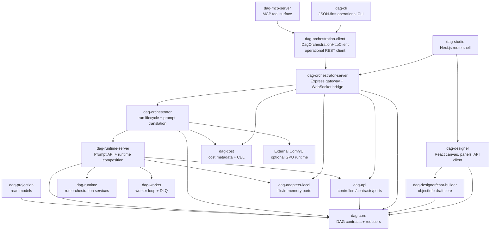

# DAG System Architecture

DAG orchestration packages, shared operational clients, controller/runtime split, and authoring boundaries.

Back to [System Architecture Map](../ARCHITECTURE-MAP.md).

## DAG Orchestration Stack

DAG stack ownership:

| Concern                                                              | Current owner                                | Target owner                                                        |
| -------------------------------------------------------------------- | -------------------------------------------- | ------------------------------------------------------------------- |
| DAG domain types, reducers, ports, error contracts                   | `dag-core`                                   | Same.                                                               |
| Prompt translation and run lifecycle services                        | `dag-orchestrator`                           | Same.                                                               |
| API controller request/response mapping and controller service ports | `dag-api`                                    | Same. Concrete runtime/projection/worker services are injected.     |
| Shared operational REST client for `dag-cli` and `dag-mcp-server`    | `dag-orchestration-client`                   | Dedicated thin client package.                                      |
| Full orchestrator REST endpoint contract inventory                   | Documented in `dag-orchestrator-server` SPEC | Extract blocked endpoint groups before new client tools.            |
| Run draft operational HTTP contracts                                 | `dag-orchestration-client` + `dag-core`      | Exposed by CLI/MCP through the shared client only.                  |
| Published workflow operational HTTP contracts                        | `dag-orchestration-client` + `dag-core`      | Exposed by CLI/MCP through the shared client only.                  |
| Asset operational HTTP contracts                                     | `dag-orchestration-client` + `dag-core`      | JSON metadata through the shared client; binary bytes by transport. |
| Cost metadata operational HTTP contracts                             | `dag-orchestration-client` + `dag-cost`      | Exposed by CLI/MCP through the shared client only.                  |
| Chat-assisted DAG draft generation                                   | `dag-designer/chat-builder`                  | Deterministic objectInfo-based authoring helper; no provider calls. |
| DAG Assistant panel placement                                        | `dag-studio`                                 | Thin route-shell state only; does not own draft planning.           |
| HTTP routing, WebSocket bridge, persistence adapter wiring           | `dag-orchestrator-server`                    | Same imperative shell.                                              |
| Human operational CLI                                                | `dag-cli`                                    | Same thin client.                                                   |
| Agent/MCP operational surface                                        | `dag-mcp-server`                             | Same thin client.                                                   |

Operational clients must use `dag-orchestration-client` instead of importing `dag-api` for HTTP
client behavior. `dag-api` owns server-side controller contracts, API response mapping, and narrow
controller service ports. It must not instantiate or production-depend on runtime, worker,
scheduler, or projection packages. Concrete runtime/projection/worker wiring belongs in an app or
runtime composition root such as `dag-runtime-server`.

`dag-designer/chat-builder` is a functional core for local authoring assistance. It consumes the
runtime `TObjectInfo` catalog and current `IDagDefinition`, then emits a draft definition without
runtime-owned node port snapshots. `dag-studio` may place or hide the Assistant panel, but provider
setup, model selection, credentials, and provider-backed planning must not move into the frontend
shell. A future LLM planner needs an explicit planner port before it can replace or augment the
deterministic draft core.
