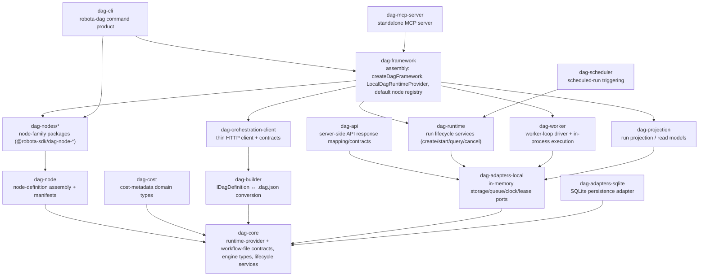

# DAG System Architecture

DAG workflow engine: node-graph definition, in-process runtime execution, run lifecycle/persistence, and the CLI / MCP / scheduler surfaces (absorbed via WORKFLOW-001, decoupled from the external workflow runtime).

Back to [System Architecture Map](../ARCHITECTURE-MAP.md).

## Layer Map

## Layers and boundary contracts

| Layer          | Packages                                                                             | Owns / boundary contract                                                                                                                                                                    |
| -------------- | ------------------------------------------------------------------------------------ | ------------------------------------------------------------------------------------------------------------------------------------------------------------------------------------------- |
| Foundation     | `dag-core`                                                                           | Zero dag-deps. Runtime-provider (`IDagRuntimeProvider`, `IDagNodeManifest`, `INodePortSpec`), workflow-file format, engine types, lifecycle services. SSOT for DAG domain contracts.        |
| Domain / nodes | `dag-node`, `dag-cost`, `dag-builder`                                                | Node-definition assembly + manifests; cost-metadata types; `IDagDefinition` ↔ `.dag.json` conversion. Depend only on core.                                                                  |
| Adapters       | `dag-adapters-local`, `dag-adapters-sqlite`                                          | Concrete storage/queue/clock/lease ports (in-memory; SQLite). Injected at the composition root; no domain logic.                                                                            |
| Runtime / API  | `dag-runtime`, `dag-worker`, `dag-projection`, `dag-api`, `dag-orchestration-client` | Run lifecycle services; worker-loop execution; read-model projection; server-side API contracts; thin HTTP client.                                                                          |
| Assembly       | `dag-framework`                                                                      | Composition layer: `createDagFramework`, the local in-process `IDagRuntimeProvider`, default node registry. The only place ports wire to adapters.                                          |
| Surfaces       | `dag-cli`, `dag-mcp-server`, `dag-scheduler`                                         | Product shells: `robota-dag` CLI; standalone MCP server; scheduled-run triggering. Assemble framework + selected nodes.                                                                     |
| Nodes          | `dag-nodes/*` (`@robota-sdk/dag-node-*`)                                             | Node-family packages: llm-text providers, image edit, http, file r/w, mcp-tool, router, instant-node, utility-text. Depend on `dag-core`/`dag-node`; consumed by `dag-framework`/`dag-cli`. |

## Provider model (native)

The runtime is provider-abstracted via `IDagRuntimeProvider` (catalog `listNodes()` + `execute()`),
with a detachable variant `IDetachableRunProvider` (submit/watch/status/cancel/list). The local
in-process provider (`LocalDagRuntimeProvider` in `dag-framework`) is the default and currently only
provider — the external-runtime provider was excluded on absorption; a native runtime-server provider is
deferred to **WORKFLOW-002**. The agent-cli `/workflows` command surface is **WORKFLOW-003**.

## Owner SPECs

Relationship + boundary detail lives here; per-package contracts are owned by each package's SPEC:
[`dag-core`](../../../packages/dag-core/docs/SPEC.md) ·
[`dag-framework`](../../../packages/dag-framework/docs/SPEC.md) ·
[`dag-runtime`](../../../packages/dag-runtime/docs/SPEC.md) ·
[`dag-cli`](../../../packages/dag-cli/docs/SPEC.md) ·
[`dag-mcp-server`](../../../packages/dag-mcp-server/docs/SPEC.md) ·
[`dag-orchestration-client`](../../../packages/dag-orchestration-client/docs/SPEC.md).
