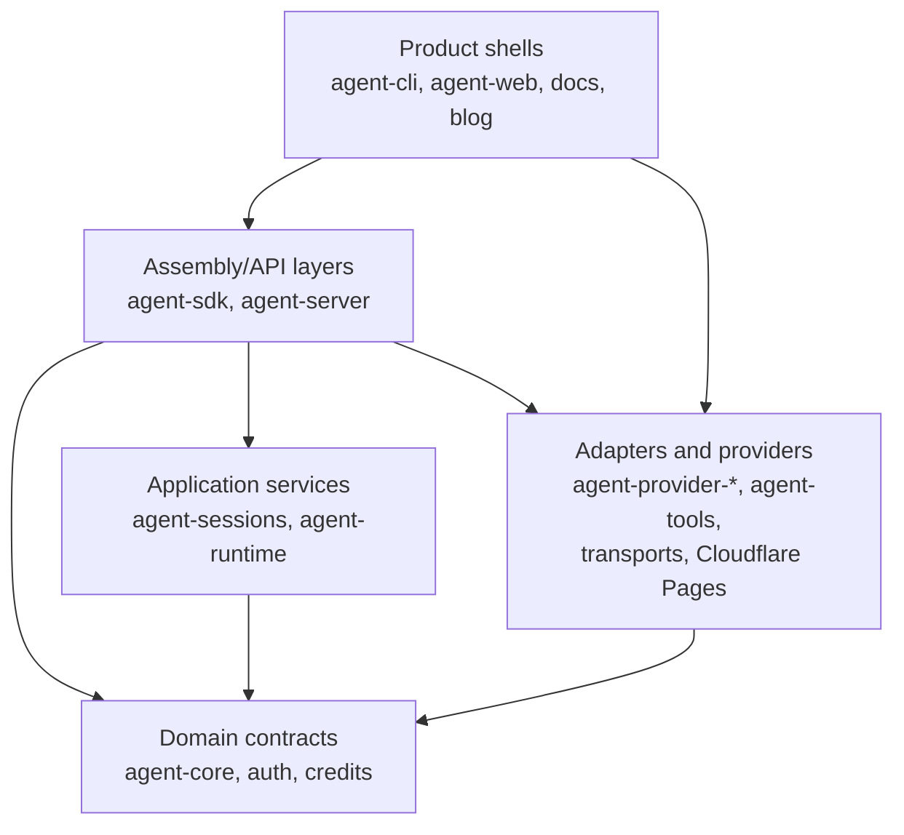

# Dependency Direction

Layer ownership, dependency direction, and target ownership rules for cross-package changes.

Back to [System Architecture Map](../ARCHITECTURE-MAP.md).

## System Layers

Layer rules:

| Layer                | Owns                                                                       | Must not own                                         |
| -------------------- | -------------------------------------------------------------------------- | ---------------------------------------------------- |
| Product shells       | UI, CLI flags, process entrypoints, concrete host adapters                 | Domain rules, reusable contracts, provider semantics |
| Assembly/API layers  | Session assembly, command contracts, HTTP/API composition, request mapping | Product-specific rendering, vendor SDK behavior      |
| Application services | Use cases, lifecycle state machines, orchestration policies                | UI, HTTP routing details, persistence technology     |
| Domain contracts     | Types, pure rules, ports, error shapes                                     | Concrete I/O, runtime process management             |
| Adapters/providers   | Vendor transports, filesystem/network implementations                      | Cross-package contracts they merely implement        |

## Target Architecture

Recommended target ownership:

1. Keep `.agents/specs/ARCHITECTURE-MAP.md` as the repo-wide router. Put detailed repository
   structures in focused `.agents/specs/architecture-map/*.md` subdocuments.
2. Keep `agent-cli` as a product shell. It may own terminal rendering, input, ephemeral selection
   state, and concrete host adapters only.
3. Put reusable behavior below the CLI. Background task lifecycle, command contracts, spawning
   ports, persistence, permissions, and provider semantics must live in `agent-sdk`,
   `agent-runtime`, `agent-command-*`, provider packages, transports, or another lower reusable
   owner before the CLI renders them.
4. Keep docs deployment free of source-branch artifacts. Cloudflare Pages owns production deploy
   from `main`; manual direct upload is explicit and credential-gated.
