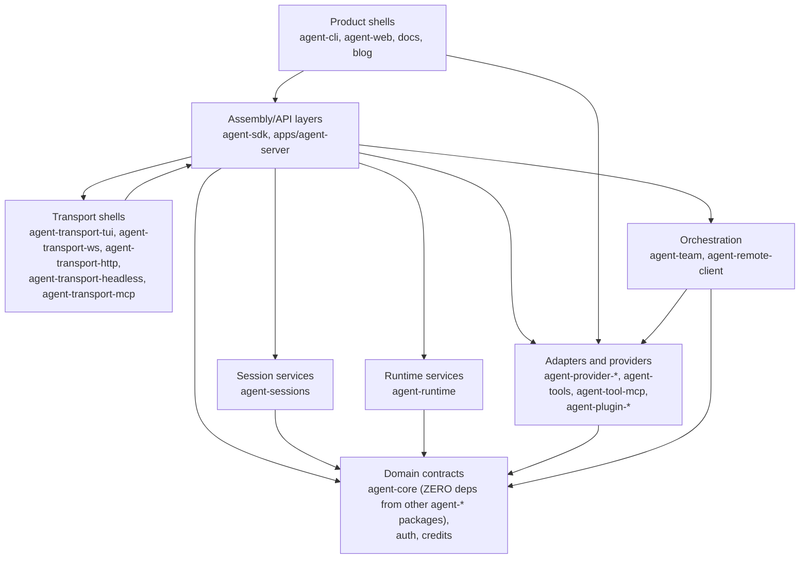

# Dependency Direction

Layer ownership, dependency direction, and target ownership rules.

Back to [System Architecture Map](../ARCHITECTURE-MAP.md).

## System Layers

`ProductShells → Adapters` is composition-root wiring only. A product shell may construct or select
a concrete local adapter; reusable contract and behavior must be owned by a lower layer.
See [capability-placement.md](capability-placement.md).

`TransportShells ↔ Assembly` is bidirectional: Assembly exposes `InteractiveSession` (an
assembly-level object) which transports consume, while Assembly registers transport adapters.

Layer rules:

| Layer               | Owns                                                              | Must not own                                                              |
| ------------------- | ----------------------------------------------------------------- | ------------------------------------------------------------------------- |
| Product shells      | UI, CLI flags, process entrypoints, concrete host adapters        | Domain rules, reusable contracts, provider semantics                      |
| Assembly/API layers | Session assembly, command contracts, HTTP/API composition         | Product-specific rendering, vendor SDK behavior                           |
| Transport shells    | Protocol framing, WebSocket/HTTP exposure of `InteractiveSession` | Session state, domain logic, provider semantics                           |
| Orchestration       | Multi-agent task delegation, remote-agent HTTP client             | Session persistence, UI, provider semantics                               |
| Session services    | Conversation lifecycle, persistence, compaction                   | UI, command contracts, provider semantics                                 |
| Runtime services    | Background task state machines, subagent lifecycle ports          | Session persistence, UI, command contracts                                |
| Domain contracts    | Types, pure rules, ports, error shapes                            | Concrete I/O, runtime process management, deps on other agent-\* packages |
| Adapters/providers  | Vendor implementations, filesystem/network adapters, plugins      | Cross-package contracts they merely implement                             |

## Target Architecture

1. Keep `.agents/specs/ARCHITECTURE-MAP.md` as the repo-wide router. Put detail in focused `.agents/specs/architecture-map/*.md` subdocuments.
2. Keep `agent-cli` as a product shell: terminal rendering, input, ephemeral selection state, and concrete host adapters only.
3. Put reusable behavior below the CLI. Background task lifecycle, command contracts, spawning ports, persistence, permissions, and provider semantics live in `agent-sdk`, `agent-runtime`, `agent-command-*`, provider packages, transports, or another lower reusable owner.
4. Apply the same owner-first rule to every product shell. `agent-web`, docs, blog, and future shells may render or host capabilities; reusable contracts and state live in owning service/SDK/runtime/command/provider/transport/domain packages.
