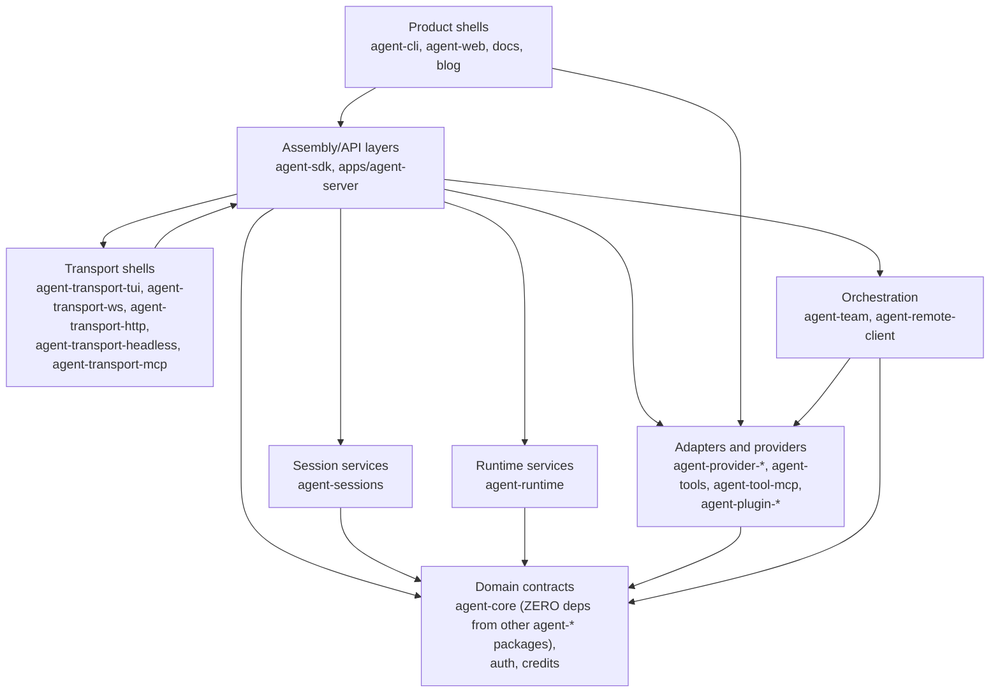

# Dependency Direction

Layer ownership, dependency direction, and target ownership rules for cross-package changes.

Back to [System Architecture Map](../ARCHITECTURE-MAP.md).

## System Layers

The `ProductShells --> Adapters` edge is composition-root wiring only. A product shell may construct
or select a concrete local adapter, but the reusable contract and behavior must be owned by a lower
layer. See [capability-placement.md](capability-placement.md) for owner-first feature placement.

Layer rules:

| Layer               | Owns                                                                       | Must not own                                                              |
| ------------------- | -------------------------------------------------------------------------- | ------------------------------------------------------------------------- |
| Product shells      | UI, CLI flags, process entrypoints, concrete host adapters                 | Domain rules, reusable contracts, provider semantics                      |
| Assembly/API layers | Session assembly, command contracts, HTTP/API composition, request mapping | Product-specific rendering, vendor SDK behavior                           |
| Transport shells    | Protocol framing, WebSocket/HTTP exposure of InteractiveSession            | Session state, domain logic, provider semantics                           |
| Orchestration       | Multi-agent task delegation, remote-agent HTTP client                      | Session persistence, UI, provider semantics                               |
| Session services    | Conversation lifecycle, persistence, compaction                            | UI, command contracts, provider semantics                                 |
| Runtime services    | Background task state machines, subagent lifecycle ports                   | Session persistence, UI, command contracts                                |
| Domain contracts    | Types, pure rules, ports, error shapes                                     | Concrete I/O, runtime process management, deps on other agent-\* packages |
| Adapters/providers  | Vendor implementations, filesystem/network adapters, plugins               | Cross-package contracts they merely implement                             |

`Transport shells` may depend on `Assembly/API layers` because they expose `InteractiveSession`
(an assembly-level object) over a protocol. This is bidirectional: `Assembly` registers transport
adapters; `TransportShells` consume the session API. Do not move `InteractiveSession` to a lower
layer to satisfy a spurious no-upward-dep rule — the current direction is correct.

## Composition Root Rule

Product shells may import concrete adapters only to wire a process entrypoint. That import must not
turn into durable behavior ownership. If a shell starts defining lifecycle transitions, retention,
provider semantics, command contracts, persistence formats, or transport-visible data, move that
contract to the lower reusable owner before adding product UI.

## Target Architecture

Recommended target ownership:

1. Keep `.agents/specs/ARCHITECTURE-MAP.md` as the repo-wide router. Put detailed repository
   structures in focused `.agents/specs/architecture-map/*.md` subdocuments.
2. Keep `agent-cli` as a product shell. It may own terminal rendering, input, ephemeral selection
   state, and concrete host adapters only.
3. Put reusable behavior below the CLI. Background task lifecycle, command contracts, spawning
   ports, persistence, permissions, and provider semantics must live in `agent-sdk`,
   `agent-runtime`, `agent-command-*`, provider packages, transports, or another lower reusable
   owner before the CLI renders them.
4. Apply the same owner-first rule to every product shell. `agent-web`, docs, blog, and future
   shells may render or host capabilities, but reusable contracts and state live in the owning
   service, SDK, runtime, command, provider, transport, or domain package.
5. Keep docs deployment free of source-branch artifacts. Cloudflare Pages owns production deploy
   from `main`; manual direct upload is explicit and credential-gated.
