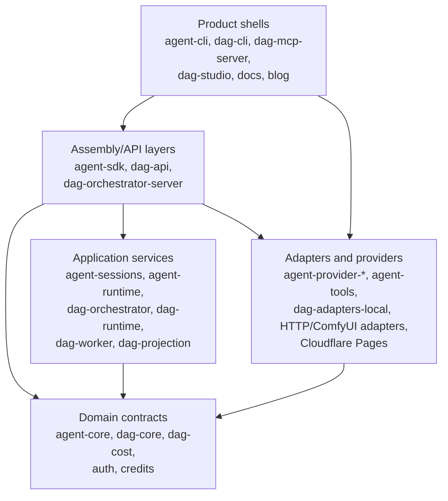

# Dependency Direction

Layer ownership, dependency direction, and target ownership rules for cross-package changes.

Back to [System Architecture Map](../ARCHITECTURE-MAP.md).

## System Layers

Layer rules:

| Layer                | Owns                                                                       | Must not own                                         |
| -------------------- | -------------------------------------------------------------------------- | ---------------------------------------------------- |
| Product shells       | UI, CLI flags, process entrypoints, concrete host adapters                 | Domain rules, reusable contracts, provider semantics |
| Assembly/API layers  | Session assembly, command contracts, HTTP/API composition, request mapping | Product-specific rendering, vendor SDK behavior      |
| Application services | Use cases, lifecycle state machines, orchestration policies                | UI, HTTP routing details, persistence technology     |
| Domain contracts     | Types, pure rules, ports, error shapes                                     | Concrete I/O, runtime process management             |
| Adapters/providers   | Vendor transports, filesystem/network implementations                      | Cross-package contracts they merely implement        |

## Target Architecture

Recommended target ownership:

1. Keep `.agents/specs/ARCHITECTURE-MAP.md` as the repo-wide router. Put detailed repository
   structures in focused `.agents/specs/architecture-map/*.md` subdocuments.
2. Keep `agent-cli` and DAG operational clients separate. `agent-cli` must not import `dag-cli` or
   `dag-mcp-server`; future integration should be through MCP, ordinary tools, or a dedicated
   command module that consumes SDK command contracts.
3. Keep operational orchestration HTTP clients out of `dag-api`; `dag-orchestration-client` owns
   that surface.
4. Centralize orchestrator REST contracts before exposing additional DAG mutation, asset,
   cost-metadata, or published-workflow operations through CLI/MCP clients.
5. Keep `dag-orchestrator-server` as the imperative shell. Domain rules stay in `dag-core`,
   orchestration use cases stay in `dag-orchestrator`, controller mapping and narrow controller
   ports stay in `dag-api`, and persistence/runtime technology stays behind adapters or app-level
   composition roots.
6. Keep DAG deployment split into frontend, long-running orchestrator, and ComfyUI-compatible
   runtime units. The frontend may move between frontend hosts, but WebSocket/proxy/persistence
   ownership stays out of `dag-studio`.
7. Keep docs deployment free of source-branch artifacts. Cloudflare Pages owns production deploy
   from `main`; manual direct upload is explicit and credential-gated.
