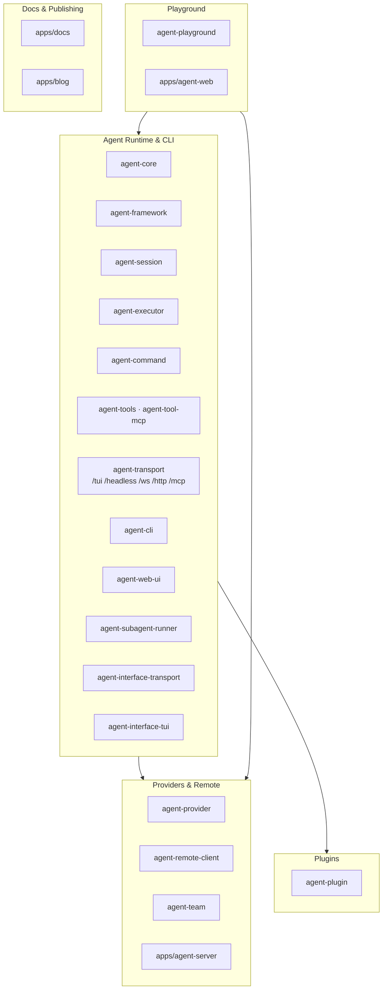

# Repository Architecture Overview

Top-level orientation for package families, product shells, and architecture-map routing.

Back to [System Architecture Map](../ARCHITECTURE-MAP.md).

## Package Families

The repository is a TypeScript pnpm monorepo. Detailed package inventory lives in
[../../project-structure.md](../../project-structure.md); package-specific contracts live in each
`packages/<name>/docs/SPEC.md`.

| Family                               | Packages/apps                                                                                                                                                                                                                                                                                                                                                     | Architecture route                                                                           |
| ------------------------------------ | ----------------------------------------------------------------------------------------------------------------------------------------------------------------------------------------------------------------------------------------------------------------------------------------------------------------------------------------------------------------- | -------------------------------------------------------------------------------------------- |
| Agent runtime and CLI                | `agent-core`, `agent-framework`, `agent-session`, `agent-executor`, `agent-tools`, `agent-tool-mcp`, `agent-command`, `agent-cli`, `agent-web-ui` (browser monitor), `agent-transport` (subpaths: /tui, /headless, /ws, /http, /mcp), `agent-subagent-runner`, `agent-interface-transport` (transport type contracts), `agent-interface-tui` (TUI type contracts) | [agent-system.md](agent-system.md), [agent-cli-composition.md](agent-cli-composition.md)     |
| Agent providers and remote execution | `agent-provider`, `agent-remote-client`, `agent-team`, `apps/agent-server`                                                                                                                                                                                                                                                                                        | [agent-system.md](agent-system.md), [cross-cutting-contracts.md](cross-cutting-contracts.md) |
| Agent plugins                        | `agent-plugin` (single package — event, logging, usage, etc. modules)                                                                                                                                                                                                                                                                                             | [agent-system.md](agent-system.md)                                                           |
| Agent playground                     | `agent-playground` (package), `apps/agent-web`                                                                                                                                                                                                                                                                                                                    | [agent-system.md](agent-system.md), [apps-and-deployment.md](apps-and-deployment.md)         |
| Documentation and publishing         | `apps/docs`, `apps/blog`, `content/`, package docs                                                                                                                                                                                                                                                                                                                | [apps-and-deployment.md](apps-and-deployment.md)                                             |
| Cross-cutting contracts              | shared command/provider/session specs                                                                                                                                                                                                                                                                                                                             | [cross-cutting-contracts.md](cross-cutting-contracts.md)                                     |

For new product-visible capabilities, read [capability-placement.md](capability-placement.md) before
choosing an owner package. Product visibility is not ownership; architecture ownership follows the
lowest reusable contract, lifecycle, policy, or adapter boundary.

## Stable Entrypoints

- Repository architecture router: [../ARCHITECTURE-MAP.md](../ARCHITECTURE-MAP.md)
- Architecture map folder index: [README.md](README.md)
- Package inventory and dependency rules: [../../project-structure.md](../../project-structure.md)
- Cross-cutting specs index: [../README.md](../README.md)
