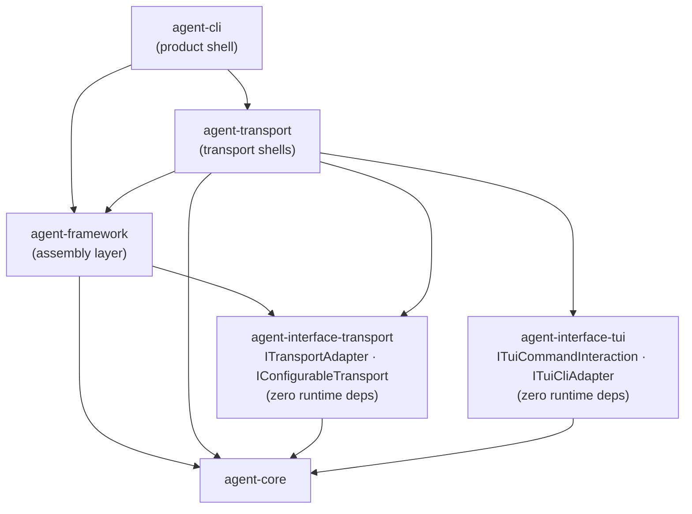

# Transport Architecture

Source-verified against `develop` on 2026-06-14.

`agent-transport` subpaths, protocol semantics, React isolation, MCP roles, and type contract ownership.

Back to [System Architecture Map](../ARCHITECTURE-MAP.md) | [agent-system.md](agent-system.md)

## Subpath Inventory

`@robota-sdk/agent-transport` exports 5 production subpaths. Each subpath is a distinct protocol
adapter. Sub-modules must never cross-import.

| Subpath     | Protocol / Purpose                                                     | React/Ink              | Consumers                                                       |
| ----------- | ---------------------------------------------------------------------- | ---------------------- | --------------------------------------------------------------- |
| `/headless` | Non-interactive print mode — text/JSON/stream output                   | No                     | `agent-cli` print mode (`runPrintMode`), provider setup prompts |
| `/http`     | Hono-based REST adapter                                                | No                     | `apps/agent-server` HTTP composition                            |
| `/ws`       | WebSocket real-time adapter                                            | No                     | `agent-web-ui` (`useWsSession`), sidecar server (planned)       |
| `/mcp`      | MCP **server** adapter — exposes `InteractiveSession` as an MCP server | No                     | External MCP clients connecting to a Robota session             |
| `/tui`      | Ink/React terminal TUI — full interactive CLI                          | Yes (React 19 + Ink 7) | `agent-cli` interactive mode (`runTuiMode`)                     |

The root export (`.`) re-exports `TransportRegistry` and `createDefaultTransportRegistry` shared
across subpaths. Application code should import from the specific subpath, not the root.

## Diamond Dependency Pattern

`agent-transport` and `agent-framework` both depend on `agent-interface-transport` for shared
transport contracts. They must never import each other directly.

**Assembly ↔ Transport bidirectional edge**: `agent-framework` exposes `InteractiveSession` (an
assembly-level object) which transports consume. `agent-framework` also registers transport
adapters. This bidirectional relationship is intentional and documented in
[dependency-direction.md](dependency-direction.md) (`TransportShells ↔ Assembly`). It does NOT
mean the packages import each other — they share contracts through `agent-interface-transport`.

**No circular import**: `agent-transport` depends on `agent-framework` (for `InteractiveSession`
and command contracts); `agent-framework` depends on `agent-interface-transport` (for the contract
type). There is no back-edge from `agent-framework` into `agent-transport`.

## React Isolation Contract

React (19.x) and Ink (7.x) exist only in the `/tui` subpath. All other subpaths are pure
TypeScript with no React dependency. This means:

- Server-side or non-terminal consumers can import `/headless`, `/http`, `/ws`, or `/mcp` without
  bundling React.
- `agent-framework` must not import `/tui` — it has no TUI dependency.
- `agent-cli` imports `/tui` only at the product shell layer (composition root).
- Any new transport subpath must maintain React isolation unless it is explicitly a TUI extension.

## MCP Disambiguation

`agent-transport/mcp` and `agent-tool-mcp` are two distinct MCP roles. They must not be confused.

| Aspect          | `agent-transport/mcp`                              | `agent-tool-mcp`                                |
| --------------- | -------------------------------------------------- | ----------------------------------------------- |
| MCP role        | **Server** — Robota acts as an MCP server          | **Client** — Robota consumes external MCP tools |
| Direction       | External MCP clients → Robota session              | Robota session → external MCP tool servers      |
| What it exposes | `InteractiveSession` as an MCP-compatible server   | MCP tool calls as `IToolResult` values          |
| Layer           | Transport shell                                    | Tool adapter                                    |
| Owner           | `agent-transport` (subpath `/mcp`)                 | `agent-tool-mcp` (separate package)             |
| Consumer        | Hosts that want to expose a Robota session via MCP | Agents that need to call external MCP servers   |
| SDK import      | `@modelcontextprotocol/sdk` (server-side)          | `@modelcontextprotocol/sdk` (client-side)       |

**Rule**: When a developer needs to call external MCP tool servers from within a Robota agent, they
use `agent-tool-mcp`. When they need to expose a Robota session to external MCP clients, they use
`agent-transport/mcp`.

## Type Contract Ownership

Transport and TUI interface contracts live in dedicated zero-runtime-dep packages. Neither
`agent-transport` nor `agent-framework` owns these contracts — they consume them.

| Contract package            | Owns                                                                                      | Consumed by                                         |
| --------------------------- | ----------------------------------------------------------------------------------------- | --------------------------------------------------- |
| `agent-interface-transport` | `ITransportAdapter`, `IConfigurableTransport`, `ITransportConfig`                         | `agent-transport`, `agent-framework`, `agent-cli`   |
| `agent-interface-tui`       | `ITuiCommandInteraction`, `ITuiCliAdapter`, `ITuiPickerItem`, `TAnyTuiCommandInteraction` | `agent-transport/tui`, `agent-command`, `agent-cli` |

Both interface packages have **zero runtime dependencies** — not even `agent-core`. See
[cross-cutting-contracts.md](cross-cutting-contracts.md) for the full contract index.

## When to Read This Document

Read `transport-architecture.md` before:

- Adding a new transport subpath or protocol adapter.
- Changing the `ITransportAdapter` or `IConfigurableTransport` contracts.
- Wiring a new shell (product or app) to the session transport API.
- Working on MCP server exposure (`/mcp`) or MCP tool integration (`agent-tool-mcp`).
- Debugging React bundling issues in non-TUI consumers (React isolation boundary).
