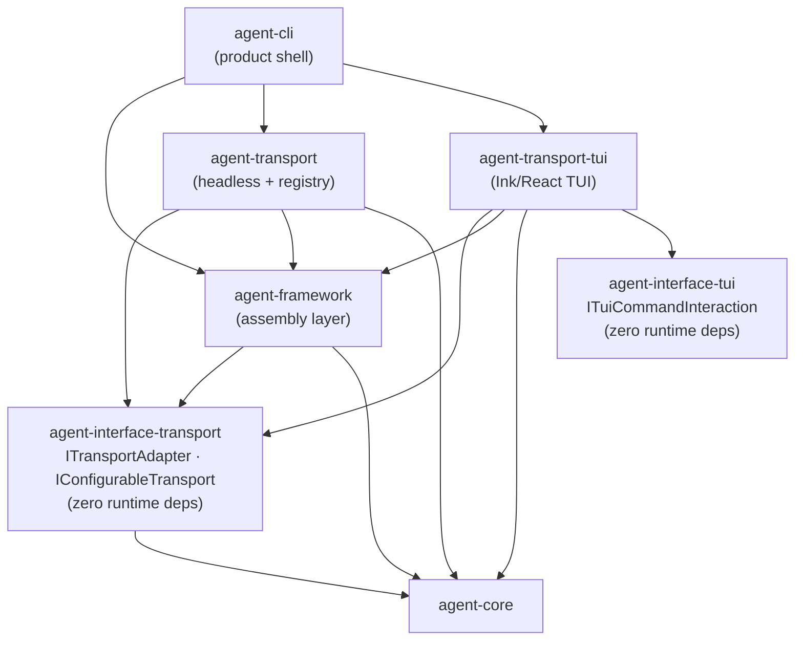

# Transport Architecture

Source-verified against `develop` on 2026-06-14.

Transport packages, protocol semantics, React isolation, MCP roles, and type contract ownership.

Back to [System Architecture Map](../ARCHITECTURE-MAP.md) | [agent-system.md](agent-system.md)

## Package Inventory

The transport layer is **five separate packages**, not one package with subpaths. `agent-transport`
itself exports only `.`, `./headless`, `./testing`, and `./programmatic`; each protocol adapter (TUI, WS, HTTP, MCP)
is its own `@robota-sdk/agent-transport-*` package. Packages must never cross-import each other.

| Package                | Subpath / Entry   | Protocol / Purpose                                                                      | React/Ink              | Consumers                                                       |
| ---------------------- | ----------------- | --------------------------------------------------------------------------------------- | ---------------------- | --------------------------------------------------------------- |
| `agent-transport`      | `./headless`      | Non-interactive print mode — text/JSON/stream output                                    | No                     | `agent-cli` print mode (`runPrintMode`), provider setup prompts |
| `agent-transport`      | `.` / `./testing` | `TransportRegistry` contract surface + testing doubles                                  | No                     | Shared registry/testing imports                                 |
| `agent-transport`      | `./programmatic`  | Programmatic agent driver (`createProgrammaticAgent`, `ProgrammaticInteractionChannel`) | No                     | Non-interactive programmatic session consumers                  |
| `agent-transport-http` | `.`               | Hono-based REST adapter                                                                 | No                     | `apps/agent-server` HTTP composition                            |
| `agent-transport-ws`   | `.`               | WebSocket real-time adapter                                                             | No                     | `agent-web-ui` (`useWsSession`), sidecar server (planned)       |
| `agent-transport-mcp`  | `.`               | MCP **server** adapter — exposes `InteractiveSession` as an MCP server                  | No                     | External MCP clients connecting to a Robota session             |
| `agent-transport-tui`  | `.`               | Ink/React terminal TUI — full interactive CLI                                           | Yes (React 19 + Ink 7) | `agent-cli` interactive mode (`runTuiMode`)                     |

The `agent-transport` root export (`.`) surfaces the `TransportRegistry` contract. Application code
imports the specific transport package (`@robota-sdk/agent-transport-{tui,ws,http,mcp}`) or the
`agent-transport/headless` subpath for print mode.

## Diamond Dependency Pattern

`agent-transport` and `agent-framework` both depend on `agent-interface-transport` for shared
transport contracts. They must never import each other directly.

**Assembly ↔ Transport bidirectional edge**: `agent-framework` exposes `InteractiveSession` (an
assembly-level object) which transports consume. `agent-framework` also registers transport
adapters. This bidirectional relationship is intentional and documented in
[dependency-direction.md](dependency-direction.md) (`TransportShells ↔ Assembly`). It does NOT
mean the packages import each other — they share contracts through `agent-interface-transport`.

**No circular import**: the transport packages depend on `agent-framework` (for `InteractiveSession`
and command contracts); `agent-framework` depends on `agent-interface-transport` (for the contract
type). There is no back-edge from `agent-framework` into any transport package.

## React Isolation Contract

React (19.x) and Ink (7.x) exist only in `agent-transport-tui`. All other transport packages are
pure TypeScript with no React dependency. This means:

- Server-side or non-terminal consumers can import `agent-transport/headless`, `agent-transport-http`,
  `agent-transport-ws`, or `agent-transport-mcp` without bundling React.
- `agent-framework` must not import `agent-transport-tui` — it has no TUI dependency.
- `agent-cli` imports `agent-transport-tui` only at the product shell layer (composition root).
- Any new transport package must maintain React isolation unless it is explicitly a TUI extension.

## MCP Disambiguation

`agent-transport-mcp` and `agent-tool-mcp` are two distinct MCP roles. They must not be confused.

| Aspect          | `agent-transport-mcp`                              | `agent-tool-mcp`                                |
| --------------- | -------------------------------------------------- | ----------------------------------------------- |
| MCP role        | **Server** — Robota acts as an MCP server          | **Client** — Robota consumes external MCP tools |
| Direction       | External MCP clients → Robota session              | Robota session → external MCP tool servers      |
| What it exposes | `InteractiveSession` as an MCP-compatible server   | MCP tool calls as `IToolResult` values          |
| Layer           | Transport shell                                    | Tool adapter                                    |
| Owner           | `agent-transport-mcp` (separate package)           | `agent-tool-mcp` (separate package)             |
| Consumer        | Hosts that want to expose a Robota session via MCP | Agents that need to call external MCP servers   |
| SDK import      | `@modelcontextprotocol/sdk` (server-side)          | `@modelcontextprotocol/sdk` (client-side)       |

**Rule**: When a developer needs to call external MCP tool servers from within a Robota agent, they
use `agent-tool-mcp`. When they need to expose a Robota session to external MCP clients, they use
`agent-transport-mcp`.

## Type Contract Ownership

Transport and TUI interface contracts live in dedicated interface packages with no emitted-JS
runtime dependencies. Neither `agent-transport` nor `agent-framework` owns these contracts — they
consume them.

| Contract package            | Owns                                                                    | Consumed by                                                                          |
| --------------------------- | ----------------------------------------------------------------------- | ------------------------------------------------------------------------------------ |
| `agent-interface-transport` | `ITransportAdapter`, `IConfigurableTransport`, `ITransportConfig`       | `agent-transport`, `agent-framework` (transitive: `agent-cli` via `agent-transport`) |
| `agent-interface-tui`       | `ITuiCommandInteraction`, `ITuiPickerItem`, `TAnyTuiCommandInteraction` | `agent-transport-tui` (transitive: `agent-cli` via `agent-transport-tui`)            |

`ITuiCliAdapter` is **not** an interface-package contract — it is owned by `agent-transport-tui`
(`packages/agent-transport-tui/src/tui-cli-adapter.ts`).

`agent-interface-tui` has **zero workspace dependencies** — not even `agent-core`.
`agent-interface-transport` has a **type-only** dependency on `agent-core`
(zero emitted-JS runtime deps), consistent with the diamond diagram above
(`IfaceTransport --> Core`). See
[cross-cutting-contracts.md](cross-cutting-contracts.md) for the full contract index.

## When to Read This Document

Read `transport-architecture.md` before:

- Adding a new transport package or protocol adapter.
- Changing the `ITransportAdapter` or `IConfigurableTransport` contracts.
- Wiring a new shell (product or app) to the session transport API.
- Working on MCP server exposure (`agent-transport-mcp`) or MCP tool integration (`agent-tool-mcp`).
- Debugging React bundling issues in non-TUI consumers (React isolation boundary).
