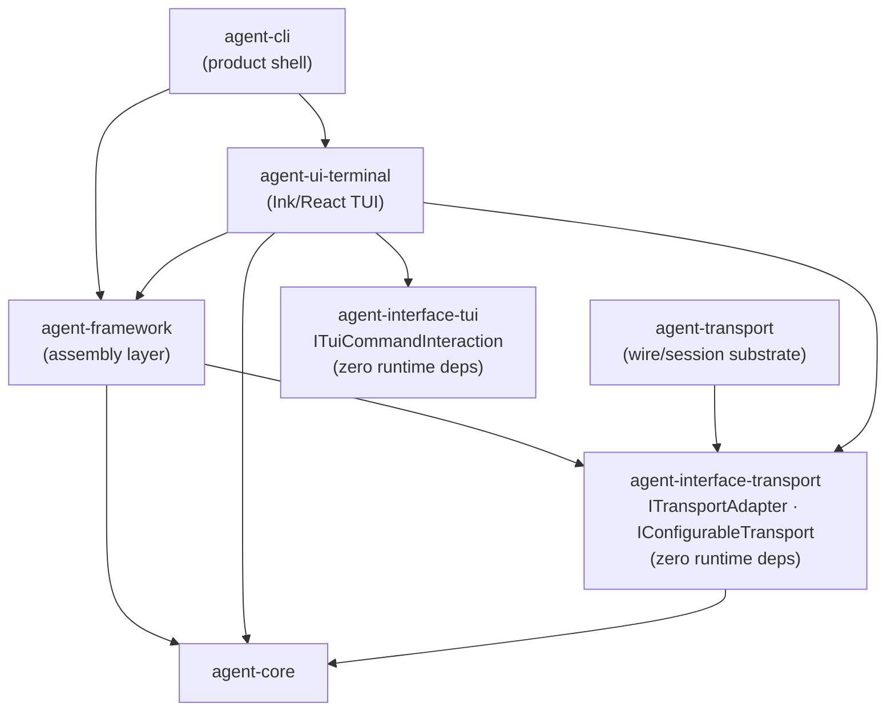

# Transport Architecture

Source-verified on 2026-08-22.

Transport packages, protocol semantics, React isolation, MCP roles, and type contract ownership.

Back to [System Architecture Map](../ARCHITECTURE-MAP.md) | [agent-system.md](agent-system.md)

## Package Inventory

Runtime hosts live in `agent-framework/src/transport-host`; terminal I/O lives in `agent-cli`.
The `agent-transport` parent owns the transport-neutral wire/session substrate. Each concrete adapter
(WS, HTTP, MCP, node WebRTC) and presentation (TUI, GUI, browser WebRTC) remains in its own package;
the old protocol package was absorbed into the parent and removed by STRUCT-012 S5. Sibling
packages must not cross-import each other.

| Package                      | Subpath / Entry             | Protocol / Purpose                                                                                    | React/Ink              | Consumers                                                                             |
| ---------------------------- | --------------------------- | ----------------------------------------------------------------------------------------------------- | ---------------------- | ------------------------------------------------------------------------------------- |
| `agent-framework`            | `.`                         | Non-interactive print mode — text/JSON/stream output                                                  | No                     | `agent-cli` print mode (`runPrintMode`), headless host execution                      |
| `agent-framework`            | `.`                         | `TransportRegistry` runtime implementation                                                            | No                     | Shared registry/testing imports                                                       |
| `agent-framework`            | `.`                         | Programmatic agent driver (`createProgrammaticAgent`, `ProgrammaticInteractionChannel`)               | No                     | Non-interactive programmatic session consumers                                        |
| `agent-transport`            | `.` / `./client` / `./node` | Transport-neutral session bridge, wire protocol, browser decoders, and Node admission/handoff helpers | No                     | Transport implementations and presentation clients                                    |
| `agent-transport-http`       | `.`                         | Hono-based REST adapter                                                                               | No                     | `apps/agent-server` HTTP composition                                                  |
| `agent-transport-ws`         | `.`                         | WebSocket real-time adapter                                                                           | No                     | `agent-ui-web` (`useWsSession`); the loopback WS sidecar served by `startRuntimeHost` |
| `agent-transport-mcp`        | `.`                         | MCP **server** adapter — exposes `InteractiveSession` as an MCP server                                | No                     | External MCP clients connecting to a Robota session                                   |
| `agent-transport-webrtc`     | `.`                         | Node-side WebRTC P2P **host** transport — data-channel session bridge (REMOTE-001)                    | No                     | CLI remote-control host                                                               |
| `agent-ui-terminal`          | `.`                         | Ink/React terminal TUI — full interactive CLI                                                         | Yes (React 19 + Ink 7) | `agent-cli` interactive mode (`runTuiMode`)                                           |
| `agent-ui-web`               | `.` / `./client`            | React DOM GUI presentation core — `SessionMonitor`, `useWsSession` reducer, view components           | Yes (React ≥18)        | `apps/agent-app` (desktop), `apps/agent-web-monitor`, `agent-transport-webrtc-web`    |
| `agent-transport-webrtc-web` | `.`                         | Browser WebRTC **peer** — `RemoteClient`, `useRtcSession` over the GUI core (REMOTE-009)              | Yes (React ≥18)        | `apps/agent-web-monitor` remote page                                                  |

The `agent-framework` root export (`.`) surfaces its `TransportRegistry` implementation. Application
code imports the transport-neutral substrate from `@robota-sdk/agent-transport`, a specific adapter
(`@robota-sdk/agent-transport-ws`, `-http`, `-mcp`, `-webrtc`, or `-webrtc-web`), a presentation
package (`@robota-sdk/agent-ui-terminal` or `-web`), or the `agent-framework` root for print mode.

Session-owning transport entry points that accept `cwd` also carry
`projectAccess?: TWorkspaceProjectAccess`: headless, programmatic, and TUI rendering/channel options
forward the host's decision unchanged to `InteractiveSession`. Omission is Restricted; `cwd` is not
project authority. The `public-project-authority` AST guard checks these published option surfaces.

## Diamond Dependency Pattern

`agent-transport` and `agent-framework` both depend on `agent-interface-transport` for shared
transport contracts. They must never import each other directly.

```mermaid
flowchart TD
  CLI["agent-cli\n(product shell)"]
  FW["agent-framework\n(assembly layer)"]
  Transport["agent-transport\n(wire/session substrate)"]
  TransportTui["agent-ui-terminal\n(Ink/React TUI)"]
  IfaceTransport["agent-interface-transport\nITransportAdapter · IConfigurableTransport\n(zero runtime deps)"]
  IfaceTui["agent-interface-tui\nITuiCommandInteraction\n(zero runtime deps)"]
  Core["agent-core"]

  CLI --> FW
  CLI --> TransportTui
  FW --> IfaceTransport
  FW --> Core
  Transport --> IfaceTransport
  TransportTui --> IfaceTransport
  TransportTui --> FW
  TransportTui --> Core
  TransportTui --> IfaceTui
  IfaceTransport --> Core
```

**Assembly ↔ Transport bidirectional edge**: `agent-framework` exposes `InteractiveSession` (an
assembly-level object) which transports consume. `agent-framework` also registers transport
adapters. This bidirectional relationship is intentional and documented in
[dependency-direction.md](dependency-direction.md) (`TransportShells ↔ Assembly`). It does NOT
mean the packages import each other — they share contracts through `agent-interface-transport`.

**No circular import**: framework runtime hosts consume interface-owned session and transport
contracts. The transport parent has no framework dependency. Protocol adapters retain
their contract-only dependency direction; presentation shells may compose framework runtime values.
There is no back-edge from `agent-framework` into a presentation or protocol transport package.

## React Isolation Contract

React lives in the **presentation UI** packages — `agent-ui-terminal` (Ink/terminal, React 19 + Ink 7)
and `agent-ui-web` (React DOM GUI core, React ≥18) plus `agent-transport-webrtc-web` (browser
peer, React ≥18). The **protocol/wire** transports — `agent-transport` core, `agent-transport-ws`,
`agent-transport-http`, `agent-transport-mcp`, and the node-side
`agent-transport-webrtc` host — stay React-free. This means:

- Server-side or non-terminal consumers can import `agent-framework`, `agent-transport-http`,
  `agent-transport-ws`, `agent-transport-mcp`, or `agent-transport` without bundling React.
- `agent-framework` must not import any presentation UI package (`agent-ui-terminal`,
  `agent-ui-web`, `agent-transport-webrtc-web`) — it has no React dependency.
- `agent-cli` imports `agent-ui-terminal` only at the product shell layer (composition root); the
  GUI presentation packages are consumed by the desktop/browser shells (`apps/agent-app`,
  `apps/agent-web-monitor`), not by the CLI's terminal path.
- Any new protocol/wire transport package must stay React-free; React belongs only in a presentation
  UI package (TUI or GUI).

## MCP Disambiguation

`agent-transport-mcp` and `agent-mcp` are two distinct MCP roles. They must not be confused.

| Aspect          | `agent-transport-mcp`                              | `agent-mcp`                                     |
| --------------- | -------------------------------------------------- | ----------------------------------------------- |
| MCP role        | **Server** — Robota acts as an MCP server          | **Client** — Robota consumes external MCP tools |
| Direction       | External MCP clients → Robota session              | Robota session → external MCP tool servers      |
| What it exposes | `InteractiveSession` as an MCP-compatible server   | MCP tool calls as `IToolResult` values          |
| Layer           | Transport shell                                    | Tool adapter                                    |
| Owner           | `agent-transport-mcp` (separate package)           | `agent-mcp` (separate package)                  |
| Consumer        | Hosts that want to expose a Robota session via MCP | Agents that need to call external MCP servers   |
| SDK import      | `@modelcontextprotocol/sdk` (server-side)          | `@modelcontextprotocol/sdk` (client-side)       |

**Rule**: When a developer needs to call external MCP tool servers from within a Robota agent, they
use `agent-mcp`. When they need to expose a Robota session to external MCP clients, they use
`agent-transport-mcp`.

## Type Contract Ownership

Transport and TUI interface contracts live in dedicated interface packages with no emitted-JS
runtime dependencies. Neither `agent-transport` nor `agent-framework` owns these contracts — they
consume them.

| Contract package            | Owns                                                                    | Consumed by                                                                          |
| --------------------------- | ----------------------------------------------------------------------- | ------------------------------------------------------------------------------------ |
| `agent-interface-transport` | `ITransportAdapter`, `IConfigurableTransport`, `ITransportConfig`       | `agent-transport`, `agent-framework` (transitive: `agent-cli` via `agent-framework`) |
| `agent-interface-tui`       | `ITuiCommandInteraction`, `ITuiPickerItem`, `TAnyTuiCommandInteraction` | `agent-ui-terminal` (transitive: `agent-cli` via `agent-ui-terminal`)                |

`ITuiCliAdapter` is **not** an interface-package contract — it is owned by `agent-ui-terminal`
(`packages/agent-ui-terminal/src/tui-cli-adapter.ts`).

`agent-interface-tui` has **zero workspace dependencies** — not even `agent-core`.
`agent-interface-transport` has a **type-only** dependency on `agent-core`
(zero emitted-JS runtime deps), consistent with the diamond diagram above
(`IfaceTransport --> Core`). See
[cross-cutting-contracts.md](cross-cutting-contracts.md) for the full contract index.

## When to Read This Document

Read `transport-architecture.md` before:

- Adding a new transport package or protocol adapter.
- Changing the `ITransportAdapter` or `IConfigurableTransport` contracts.
- Wiring a new shell (product or app) to the session transport API.
- Working on MCP server exposure (`agent-transport-mcp`) or MCP tool integration (`agent-mcp`).
- Debugging React bundling issues in protocol/wire consumers (React isolation boundary).
