# Orchestration Map

The single, at-a-glance registry of every orchestration structure in this repo — the
**orchestrator → worker → guardian** pipelines defined by
[enforcement-architecture.md](../rules/enforcement-architecture.md). Keep it current: this map is
**mechanically enforced** — `scripts/harness/scan-orchestration-map.mjs` (`pnpm harness:scan` →
`orchestration-map`) FAILs if any `.claude/agents/*.md` agent is not listed here, so a new agent cannot land
without being mapped. Audit, improve, and change the structure from here.

## Roles (recap)

- **Orchestrator** — routes the pipeline + rewinds on a verdict. No domain work, no quality judgment.
- **Worker** — produces one thing (writes a spec, researches, posts, fixes). Never judges.
- **Guardian** — judges only, emits a machine-readable verdict. Never does the work.
- **Floor** — a `scripts/harness` scan or `.claude/hooks` check behind a guardian so the machine signal, not
  the model, is the reliability floor.

Loop-back is hybrid: **auto** (re-drive to a convergence signal, bounded, then escalate) for completeness gates;
**halt** (stop for the user) for human-decision gates.

## Pipelines

```mermaid
flowchart TD
  subgraph SpecGate["Spec-gate (request → backlog → implement)"]
    URG[user-request-gate<br/>orchestrator] --> BW[backlog-writer<br/>worker]
    URG --> PAR[prior-art-researcher<br/>worker · PRIOR_ART_RESEARCH]
    BW --> BP[backlog-pipeline<br/>orchestrator]
    BP --> BGG[backlog-gate-guard<br/>guardian · PASS/FAIL/NON-COMPLIANCE]
    BGG -. halt-for-user .-> BP
  end
  subgraph ArchRefresh["Architecture refresh"]
    AR[architecture-refresh<br/>orchestrator] --> AA[architecture-auditor<br/>guardian · ACTIONABLE FINDINGS]
    AR --> ACA[architecture-conformance-auditor<br/>guardian · ACTIONABLE FINDINGS]
    AA --> AF[architecture-fixer<br/>worker]
    ACA --> AI[architecture-implementer<br/>worker]
    AF -. auto-loop → 0 .-> AR
  end
  subgraph DocRefresh["Documentation refresh"]
    DR[documentation-refresh<br/>orchestrator] --> DA[doc-auditor<br/>guardian · ACTIONABLE FINDINGS]
    DA --> DF[doc-fixer<br/>worker]
    DF -. auto-loop → 0 .-> DR
  end
  subgraph CapExt["Capability extraction (build new agents/skills)"]
    CE[capability-extraction<br/>orchestrator] --> CS[capability-scout<br/>worker · DECOMPOSITION]
    CS --> PR[proposal-reviewer<br/>guardian · REVIEW VERDICT]
    PR --> ASA[agent-skill-author<br/>worker]
    ASA --> ADC[agent-def-convention<br/>floor]
  end
  subgraph PRReview["PR review (HARNESS-018)"]
    PRO[pr-review-orchestration<br/>orchestrator] --> PRR[pr-review-reviewer<br/>guardian · ACTIONABLE FINDINGS]
    PRR --> PRW[pr-review-writer<br/>worker]
    PRW --> PRF[pr-review-fixer<br/>worker]
    PRF -. auto-loop → 0, bounded .-> PRO
    PRO --> MV[merge-verifier<br/>guardian · MERGE VERIFIED]
  end
```

| Pipeline                    | Orchestrator (skill)                     | Worker(s)                                                     | Guardian(s) → signal                                                             | Loop-back                                      | Floor (scan/hook)                                                     |
| --------------------------- | ---------------------------------------- | ------------------------------------------------------------- | -------------------------------------------------------------------------------- | ---------------------------------------------- | --------------------------------------------------------------------- |
| **Spec-gate**               | `user-request-gate` → `backlog-pipeline` | `backlog-writer`, `prior-art-researcher` (PRIOR_ART_RESEARCH) | `backlog-gate-guard` → PASS/FAIL/NON-COMPLIANCE                                  | halt-for-user                                  | spec-doc-frontmatter, spec-research, backlog-placement, done-evidence |
| **Architecture refresh**    | `architecture-refresh`                   | `architecture-fixer`, `architecture-implementer`              | `architecture-auditor`, `architecture-conformance-auditor` → ACTIONABLE FINDINGS | auto → 0                                       | conformance, check-architecture-conformance                           |
| **Documentation refresh**   | `documentation-refresh`                  | `doc-fixer`                                                   | `doc-auditor` → ACTIONABLE FINDINGS                                              | auto → 0                                       | doc-examples, docs-structure                                          |
| **Capability extraction**   | `capability-extraction`                  | `capability-scout` (DECOMPOSITION), `agent-skill-author`      | `proposal-reviewer` → REVIEW VERDICT                                             | gated on ENDORSE                               | agent-def-convention                                                  |
| **PR review** (HARNESS-018) | `pr-review-orchestration`                | `pr-review-writer`, `pr-review-fixer`                         | `pr-review-reviewer` → ACTIONABLE FINDINGS; `merge-verifier` → MERGE VERIFIED    | auto → 0, bounded (max 3 + progress detection) | scan-review-findings (018e, pending)                                  |
| **Backlog execution**       | `backlog-execution-orchestrator`         | (impl agents)                                                 | recommendation + user-execution-scenario gates                                   | halt-for-user                                  | done-evidence, backlog-placement                                      |

## Agent roster

Every agent below MUST appear in this map (enforced by `scan-orchestration-map.mjs`).

| Agent                              | Role               | Signal              | Tool-scope      |
| ---------------------------------- | ------------------ | ------------------- | --------------- |
| `architecture-auditor`             | guardian           | ACTIONABLE FINDINGS | read-only       |
| `architecture-conformance-auditor` | guardian           | ACTIONABLE FINDINGS | read-only       |
| `doc-auditor`                      | guardian           | ACTIONABLE FINDINGS | read-only       |
| `proposal-reviewer`                | guardian           | REVIEW VERDICT      | read-only       |
| `merge-verifier`                   | guardian           | MERGE VERIFIED      | read-only       |
| `pr-review-reviewer`               | guardian           | ACTIONABLE FINDINGS | read-only       |
| `capability-scout`                 | worker (discovery) | DECOMPOSITION       | read-only       |
| `prior-art-researcher`             | worker (research)  | PRIOR_ART_RESEARCH  | read-only       |
| `architecture-fixer`               | worker (edit)      | —                   | edit (docs)     |
| `architecture-implementer`         | worker (edit)      | —                   | edit (code)     |
| `doc-fixer`                        | worker (edit)      | —                   | edit (docs)     |
| `agent-skill-author`               | worker (edit)      | —                   | edit            |
| `pr-review-fixer`                  | worker (edit)      | —                   | edit            |
| `pr-review-writer`                 | worker (post)      | —                   | Read, Bash (gh) |

## How to change the structure

1. Add/modify an agent or orchestrator skill → **update this map in the same change** (the scan blocks otherwise).
2. New terminal signal → add it to `CLOSED_SIGNAL_VOCAB` in `check-agent-def-convention.mjs` and record it here.
3. Reuse an existing signal (e.g. `ACTIONABLE FINDINGS`) before inventing one — SSOT.
4. Every guardian needs a floor (a scan/hook); note it in the table.
