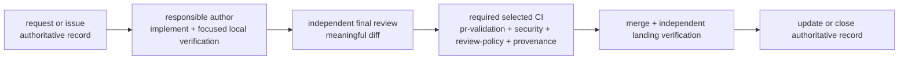

# Orchestration Map

Registry of available specialist routes. It is an inventory, not a mandatory chain: ordinary work has one
responsible author, one entry boundary, and one integrated completion boundary. Dispatch a specialist only
when it contributes a distinct decision or capability.

## Normal route

```mermaid
flowchart LR
  R[request or issue<br/>authoritative record] --> A[responsible author<br/>implement + focused local verification]
  A --> RV[independent final review<br/>meaningful diff]
  RV --> CI[required selected CI<br/>pr-validation + security + review-policy + provenance]
  CI --> M[merge + independent landing verification]
  M --> C[update or close authoritative record]
```

There is no required proposal-reviewer → finding-depth-triager → scenario-author → writer/fixer sequence.
Direct applicability decisions replace N/A dispatches. A conflict-free target advance does not restart the
route. PR repair review covers the meaningful delta; a clean review is not repeated.

## Optional specialist routes

| Need                        | Route                                                                                                                                                                                         | Stop condition                                       |
| --------------------------- | --------------------------------------------------------------------------------------------------------------------------------------------------------------------------------------------- | ---------------------------------------------------- |
| Broad architecture coverage | `architecture-refresh` may call `architecture-audit-fanout`, the four dimensional auditors, conformance/synthesis/verifier roles, and an applier selected for real findings                   | zero material findings, no progress, or three rounds |
| Focused documentation sweep | `documentation-refresh` may use `doc-auditor` and `doc-fixer`; depth help is optional for ambiguous/foundational findings                                                                     | claims corrected or residuals reported               |
| PR repair                   | `pr-finding-resolution-loop` uses one `pr-review-reviewer` verdict; direct replies/fixes are allowed, while `pr-review-writer` or `pr-review-fixer` remain optional helpers                   | zero actionable findings on the current head         |
| Release                     | `release-orchestration` sequences `source-stabilization`, `version-bump`, and `npm-otp-publish`; `ci-gate-watch`, `ci-failure-triager`, and `merge-verifier` serve distinct remote boundaries | phase result or explicit user boundary               |
| Wiring                      | `wiring-orchestration` may use `wiring-worker` and `wiring-guardian` when an authored artifact needs registrations                                                                            | registrations reachable and verified                 |
| Worktree isolation          | `worktree-traffic-control` may use `worktree-entry-gate` and `worktree-exit-gate` when work actually runs in a worktree                                                                       | named hazard cleared                                 |
| Mechanical delegation       | `delegated-refactor-green-gate` may use `mechanical-refactor-worker` and `pr-review-reviewer` for one independent review                                                                      | focused verification and review green                |
| Capability authoring        | `capability-extraction` may use `capability-scout`, `proposal-reviewer`, and `agent-skill-author`                                                                                             | proposed capability endorsed and wired               |

The following specialists are optional helpers, not universal dispatch requirements:
`finding-depth-triager`, `finding-reconciler`, `finding-verifier`,
`architecture-conformance-auditor`, `architecture-audit-synthesizer`, `architecture-fixer`, and
`architecture-implementer`.

## Agent roster

Every agent definition appears here so reachability can be audited without converting availability into a
mandatory workflow.

| Agent                              | Role                       | Signal              | Tool scope                  |
| ---------------------------------- | -------------------------- | ------------------- | --------------------------- |
| `architecture-structure-auditor`   | specialist reviewer        | AUDIT-DIM-COMPLETE  | read-only                   |
| `architecture-design-auditor`      | specialist reviewer        | AUDIT-DIM-COMPLETE  | read-only                   |
| `architecture-runtime-auditor`     | specialist reviewer        | AUDIT-DIM-COMPLETE  | read-only                   |
| `architecture-gate-auditor`        | specialist reviewer        | AUDIT-DIM-COMPLETE  | read-only                   |
| `architecture-conformance-auditor` | specialist reviewer        | ACTIONABLE FINDINGS | read-only                   |
| `architecture-audit-synthesizer`   | specialist reviewer        | SYNTH               | read-only                   |
| `finding-verifier`                 | specialist reviewer        | VERIFY              | read-only                   |
| `finding-reconciler`               | specialist reviewer        | RECONCILE           | read-only                   |
| `finding-depth-triager`            | optional classifier        | DEPTH               | read-only                   |
| `doc-auditor`                      | specialist reviewer        | ACTIONABLE FINDINGS | read-only                   |
| `proposal-reviewer`                | optional design reviewer   | REVIEW VERDICT      | read-only                   |
| `merge-verifier`                   | landing verifier           | MERGE VERIFIED      | read-only                   |
| `pr-review-reviewer`               | independent final reviewer | ACTIONABLE FINDINGS | read-only                   |
| `wiring-guardian`                  | specialist verifier        | GATE VERDICT        | read-only                   |
| `wiring-worker`                    | worker                     | none                | registrations only          |
| `capability-scout`                 | discovery worker           | DECOMPOSITION       | read-only                   |
| `prior-art-researcher`             | research worker            | PRIOR_ART_RESEARCH  | read-only                   |
| `architecture-fixer`               | worker                     | none                | docs                        |
| `architecture-implementer`         | worker                     | none                | code                        |
| `doc-fixer`                        | worker                     | none                | docs                        |
| `agent-skill-author`               | worker                     | none                | agent and skill definitions |
| `pr-review-fixer`                  | optional repair worker     | none                | code                        |
| `pr-review-writer`                 | optional publishing worker | none                | PR comments/reviews         |
| `ci-failure-triager`               | remote-failure specialist  | CI TRIAGE           | read-only                   |
| `worktree-entry-gate`              | worktree verifier          | GATE VERDICT        | read-only                   |
| `worktree-exit-gate`               | worktree verifier          | GATE VERDICT        | read-only                   |
| `user-execution-scenario-author`   | optional scenario author   | SCENARIO DRAFTED    | work records                |
| `mechanical-refactor-worker`       | worker                     | none                | code                        |

## Change rule

When an agent or orchestration skill is added or removed, update this inventory in the same coherent change.
New terminal tokens belong in the agent-definition signal vocabulary. Do not add a new gate, ledger, or
receipt merely to prove that this map was read.
