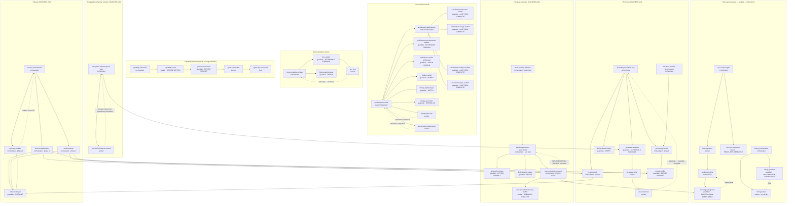

# Orchestration Map

The single, at-a-glance registry of every orchestration structure in this repo — the
**orchestrator → worker → guardian** pipelines defined by
[enforcement-architecture.md](../rules/enforcement-architecture.md). Keep it current: this map is
**mechanically enforced** — `scripts/harness/scan-orchestration-map.mjs` (`pnpm harness:scan` →
`orchestration-map`) FAILs if any `.claude/agents/*.md` agent is not listed here, so a new agent cannot land
without being mapped. Audit, improve, and change the structure from here.

## Roles (recap)

- **Orchestrator** — routes the pipeline + rewinds on a verdict. No domain work, no quality judgment.
- **Worker** — produces one thing (writes a spec, researches, posts, fixes). Never judges.
- **Guardian** — judges only, emits a machine-readable verdict. Never does the work.
- **Floor** — a `scripts/harness` scan or `.claude/hooks` check behind a guardian so the machine signal, not
  the model, is the reliability floor.

Loop-back is hybrid: **auto** (re-drive to a convergence signal, bounded, then escalate) for completeness gates;
**halt** (stop for the user) for human-decision gates.

## Pipelines

```mermaid
flowchart TD
  subgraph SpecGate["Spec-gate (request → backlog → implement)"]
    URG[user-request-gate<br/>orchestrator] --> BW[backlog-writer<br/>worker]
    URG --> PAR[prior-art-researcher<br/>worker · PRIOR_ART_RESEARCH]
    BW --> BP[backlog-pipeline<br/>orchestrator]
    BP --> BGG[backlog-gate-guard<br/>guardian · PASS/FAIL/NON-COMPLIANCE]
    BGG -. halt-for-user .-> BP
    WO[wiring-orchestration<br/>orchestrator] --> WW[wiring-worker<br/>worker · no verdict]
    WO --> WG[wiring-guardian<br/>guardian · PASS/FAIL/NON-COMPLIANCE]
    WG -. FAIL .-> WW
  end
  subgraph ArchRefresh["Architecture refresh"]
    AR[architecture-refresh<br/>outer orchestrator] --> AAF[architecture-audit-fanout<br/>nested orchestrator]
    AAF --> ASAUD[architecture-structure-auditor<br/>guardian · AUDIT-DIM-COMPLETE]
    AAF --> ADAUD[architecture-design-auditor<br/>guardian · AUDIT-DIM-COMPLETE]
    AAF --> ARAUD[architecture-runtime-auditor<br/>guardian · AUDIT-DIM-COMPLETE]
    AAF --> AGAUD[architecture-gate-auditor<br/>guardian · AUDIT-DIM-COMPLETE]
    AR --> ACA[architecture-conformance-auditor<br/>guardian · ACTIONABLE FINDINGS]
    AR --> AAS[architecture-audit-synthesizer<br/>guardian · SYNTH draft/final]
    AR --> FV[finding-verifier<br/>guardian · VERIFY]
    AR --> ARD[finding-depth-triager<br/>guardian · DEPTH]
    AR --> FR[finding-reconciler<br/>guardian · RECONCILE]
    AR --> AF[architecture-fixer<br/>worker]
    AR --> AI[architecture-implementer<br/>worker]
    AF -. corrected / contained .-> AR
    AI -. corrected / contained .-> AR
  end
  subgraph DocRefresh["Documentation refresh"]
    DR[documentation-refresh<br/>orchestrator] --> DA[doc-auditor<br/>guardian · ACTIONABLE FINDINGS]
    DR --> DRD[finding-depth-triager<br/>guardian · DEPTH]
    DA --> DF[doc-fixer<br/>worker]
    DF -. auto-loop → resolved .-> DR
  end
  subgraph CapExt["Capability extraction (build new agents/skills)"]
    CE[capability-extraction<br/>orchestrator] --> CS[capability-scout<br/>worker · DECOMPOSITION]
    CS --> PR[proposal-reviewer<br/>guardian · REVIEW VERDICT]
    PR --> ASA[agent-skill-author<br/>worker]
    ASA --> ADC[agent-def-convention<br/>floor]
  end
  subgraph PRReview["PR review (HARNESS-018)"]
    PRO[pr-finding-resolution-loop<br/>orchestrator] --> PRR[pr-review-reviewer<br/>guardian · ACTIONABLE FINDINGS]
    PRO --> PRD[finding-depth-triager<br/>guardian · DEPTH]
    PRR --> PRW[pr-review-writer<br/>worker]
    PRW --> PRF[pr-review-fixer<br/>worker]
    PRF -. auto-loop → resolved, bounded .-> PRO
    PRO --> CGW
    PRO --> PMC[post-merge-cycle<br/>orchestrator · shared]
    PMC --> MV[merge-verifier<br/>guardian · MERGE VERIFIED]
    WPO[worktree-parallel-orchestration<br/>orchestrator] --> PMC
  end
  subgraph DelegRefactor["Delegated mechanical refactor (HARNESS-049)"]
    DRG[delegated-refactor-green-gate<br/>orchestrator] --> MRW[mechanical-refactor-worker<br/>worker]
    DRG --> PRR
    MRW -. blocked / green not reproduced, bounded .-> DRG
  end
  subgraph BacklogExec["Backlog execution (HARNESS-049)"]
    MBI[multi-backlog-initiative<br/>orchestrator · outer loop] --> BEO[backlog-execution-orchestrator<br/>orchestrator · one item]
    BEO --> PR2[proposal-reviewer<br/>guardian · REVIEW VERDICT]
    BEO --> BED[finding-depth-triager<br/>guardian · DEPTH]
    BEO --> UES[user-execution-scenario<br/>orchestrator · PLAN + GATE]
    UES --> UESA[user-execution-scenario-author<br/>worker · SCENARIO DRAFTED]
    UES --> BGG
    UES -. IMPLEMENTATION-DEFECT, bounded .-> BEO
  end
  subgraph Release["Release (HARNESS-049)"]
    RO[release-orchestration<br/>orchestrator] --> SS[source-stabilization<br/>orchestrator · phase 1]
    RO --> VB[version-bump<br/>orchestrator · phase 2]
    RO --> NOP[npm-otp-publish<br/>orchestrator · phase 3]
    SS --> CGW[ci-gate-watch<br/>orchestrator · shared]
    VB --> CGW
    CGW --> CFT[ci-failure-triager<br/>guardian · CI TRIAGE]
    SS --> CFT
    VB --> CFT
    NOP --> CFT
    SS --> MV
    VB --> MV
    NOP -. halt-for-user OTP .-> RO
  end
```

| Pipeline                                        | Orchestrator (skill)                                                                                           | Worker(s)                                                     | Guardian(s) → signal                                                                                                                                                                               | Loop-back                                                                                                                                             | Floor (scan/hook)                                                                                                                             |
| ----------------------------------------------- | -------------------------------------------------------------------------------------------------------------- | ------------------------------------------------------------- | -------------------------------------------------------------------------------------------------------------------------------------------------------------------------------------------------- | ----------------------------------------------------------------------------------------------------------------------------------------------------- | --------------------------------------------------------------------------------------------------------------------------------------------- |
| **Worktree traffic**                            | `worktree-traffic-control`                                                                                     | (the work itself — any worker)                                | `worktree-entry-gate`, `worktree-exit-gate` → PASS/FAIL/NON-COMPLIANCE                                                                                                                             | fix the named hazard, re-ask the same gate                                                                                                            | worktree-cwd-guard (hook), worktree-gate.mjs                                                                                                  |
| **Wiring**                                      | `wiring-orchestration`                                                                                         | `wiring-worker`                                               | `wiring-guardian` → PASS/FAIL/NON-COMPLIANCE                                                                                                                                                       | FAIL → worker with the absent touchpoints; NON-COMPLIANCE → escalate, never re-run the worker                                                         | agent-def-convention (registration), fixture-floor (falsifiability)                                                                           |
| **Spec-gate**                                   | `user-request-gate` → `backlog-pipeline`                                                                       | `backlog-writer`, `prior-art-researcher` (PRIOR_ART_RESEARCH) | `backlog-gate-guard` → PASS/FAIL/NON-COMPLIANCE                                                                                                                                                    | halt-for-user; research re-drive escape: no-progress                                                                                                  | spec-doc-frontmatter, spec-research, backlog-placement, done-evidence                                                                         |
| **Architecture audit fanout** (nested)          | `architecture-audit-fanout`                                                                                    | (none)                                                        | `architecture-structure-auditor`, `architecture-design-auditor`, `architecture-runtime-auditor`, `architecture-gate-auditor` → AUDIT-DIM-COMPLETE                                                  | auto → complete target×criterion coverage; redispatch uncovered cells only; escape: no-progress; bounded per owning skill                             | architecture-refresh-signals, agent-def-convention, loop-run-records                                                                          |
| **Architecture refresh**                        | `architecture-refresh` → nested `architecture-audit-fanout`                                                    | `architecture-fixer`, `architecture-implementer`              | `architecture-conformance-auditor` → ACTIONABLE FINDINGS; `architecture-audit-synthesizer` → SYNTH; `finding-verifier` → VERIFY; `finding-depth-triager` → DEPTH; `finding-reconciler` → RECONCILE | auto → resolved material findings (corrected / contained / invalid), Low retained but non-blocking; escape: no-progress                               | architecture-refresh-signals, retired-agent-references, conformance, check-architecture-conformance, depth-verdict-reachable (`harness:test`) |
| **Documentation refresh**                       | `documentation-refresh`                                                                                        | `doc-fixer`                                                   | `doc-auditor` → ACTIONABLE FINDINGS; `finding-depth-triager` → DEPTH                                                                                                                               | auto → resolved (fixed / contained / invalid), not fixed; escape: no-progress                                                                         | doc-examples, docs-structure; depth-verdict-reachable (`harness:test`, not a scan)                                                            |
| **Capability extraction**                       | `capability-extraction`                                                                                        | `capability-scout` (DECOMPOSITION), `agent-skill-author`      | `proposal-reviewer` → REVIEW VERDICT                                                                                                                                                               | gated on ENDORSE; escape: no-progress                                                                                                                 | agent-def-convention                                                                                                                          |
| **PR review** (HARNESS-018)                     | `pr-finding-resolution-loop` (waits via `ci-gate-watch`, hands off to `post-merge-cycle`)                      | `pr-review-writer`, `pr-review-fixer`                         | `pr-review-reviewer` → ACTIONABLE FINDINGS; `finding-depth-triager` → DEPTH; `merge-verifier` → MERGE VERIFIED                                                                                     | auto → resolved, bounded (progress detection; NO round cap — owner directive 2026-08-03)                                                              | scan-review-findings (018e, pending); depth-verdict-reachable (`harness:test`)                                                                |
| **Post-merge cycle** (HARNESS-049)              | `post-merge-cycle` (shared; called by `pr-finding-resolution-loop` and `worktree-parallel-orchestration`)      | (deletion + base-reset run in the skill)                      | `merge-verifier` → MERGE VERIFIED                                                                                                                                                                  | auto → bounded (base re-cuts; the cap is the skill's); halt on a FAIL landing verdict or an exhausted cap                                             | branch-guard hook (remote delete requires a merged PR); husky pre-commit (lessons-churn block)                                                |
| **Backlog execution** (HARNESS-049)             | `multi-backlog-initiative` → `backlog-execution-orchestrator` → `user-execution-scenario`                      | `user-execution-scenario-author` (SCENARIO DRAFTED)           | `proposal-reviewer` → REVIEW VERDICT; `finding-depth-triager` → DEPTH; `backlog-gate-guard` → GATE VERDICT                                                                                         | auto → escape: no-progress, plus per-phase caps the skills own (recommendation revision, scenario redesign, defect round); halt-for-user at every cap | done-evidence, backlog-placement, capability-reachability (gate-guard); **recommendation gate: floor PENDING** (‡)                            |
| **Delegated mechanical refactor** (HARNESS-049) | `delegated-refactor-green-gate`                                                                                | `mechanical-refactor-worker`                                  | `pr-review-reviewer` → ACTIONABLE FINDINGS                                                                                                                                                         | auto → escape: no-progress, plus per-step caps the skill owns (re-specification, re-verify, review); halt at every cap                                | scan-review-findings (§)                                                                                                                      |
| **Release** (HARNESS-049)                       | `release-orchestration` → `source-stabilization` / `version-bump` / `npm-otp-publish`, sharing `ci-gate-watch` | (release actions run in the phase skills)                     | `ci-failure-triager` → CI TRIAGE; `merge-verifier` → MERGE VERIFIED                                                                                                                                | auto → bounded (per-phase re-run, per-signature triage and OTP-request caps the phase skills own); halt-for-user at the publish boundary              | release-governance, publish-safety, release-run `--publish` check                                                                             |

## Agent roster

Every agent below MUST appear in this map (enforced by `scan-orchestration-map.mjs`).

| Agent                              | Role               | Signal              | Tool-scope                                            |
| ---------------------------------- | ------------------ | ------------------- | ----------------------------------------------------- |
| `architecture-structure-auditor`   | guardian           | AUDIT-DIM-COMPLETE  | read-only                                             |
| `architecture-design-auditor`      | guardian           | AUDIT-DIM-COMPLETE  | read-only                                             |
| `architecture-runtime-auditor`     | guardian           | AUDIT-DIM-COMPLETE  | read-only                                             |
| `architecture-gate-auditor`        | guardian           | AUDIT-DIM-COMPLETE  | read-only                                             |
| `architecture-conformance-auditor` | guardian           | ACTIONABLE FINDINGS | read-only                                             |
| `architecture-audit-synthesizer`   | guardian           | SYNTH               | read-only                                             |
| `finding-verifier`                 | guardian           | VERIFY              | read-only                                             |
| `finding-reconciler`               | guardian           | RECONCILE           | read-only                                             |
| `doc-auditor`                      | guardian           | ACTIONABLE FINDINGS | read-only                                             |
| `proposal-reviewer`                | guardian           | REVIEW VERDICT      | read-only                                             |
| `merge-verifier`                   | guardian           | MERGE VERIFIED      | read-only                                             |
| `pr-review-reviewer`               | guardian           | ACTIONABLE FINDINGS | read-only                                             |
| `finding-depth-triager`            | guardian           | DEPTH               | read-only                                             |
| `wiring-guardian`                  | guardian           | GATE VERDICT        | read-only                                             |
| `wiring-worker`                    | worker             | (none)              | edits registrations only                              |
| `capability-scout`                 | worker (discovery) | DECOMPOSITION       | read-only                                             |
| `prior-art-researcher`             | worker (research)  | PRIOR_ART_RESEARCH  | read-only                                             |
| `architecture-fixer`               | worker (edit)      | —                   | edit (docs)                                           |
| `architecture-implementer`         | worker (edit)      | —                   | edit (code)                                           |
| `doc-fixer`                        | worker (edit)      | —                   | edit (docs)                                           |
| `agent-skill-author`               | worker (edit)      | —                   | edit                                                  |
| `pr-review-fixer`                  | worker (edit)      | —                   | edit                                                  |
| `pr-review-writer`                 | worker (post)      | —                   | Read, Bash (gh)                                       |
| `ci-failure-triager`               | guardian           | CI TRIAGE           | read-only                                             |
| `backlog-gate-guard`               | guardian           | GATE VERDICT        | Read, Grep, Glob, Bash, Edit (evidence surfaces only) |
| `worktree-entry-gate`              | guardian           | GATE VERDICT        | read-only                                             |
| `worktree-exit-gate`               | guardian           | GATE VERDICT        | read-only                                             |
| `user-execution-scenario-author`   | worker (edit)      | SCENARIO DRAFTED    | edit (work items)                                     |
| `mechanical-refactor-worker`       | worker (edit)      | —                   | edit (code)                                           |

‡ The `proposal-reviewer` dispatch at the recommendation gate has **no mechanical floor yet**. The three
scans listed beside it back the `backlog-gate-guard` gates, not this one — `enforcement-architecture.md`
requires a floor per guardian, so this row is knowingly incomplete rather than satisfied. The rule now
requires the `REVIEW VERDICT` to be recorded in the item or PR, which is what a scan would read; adding
that scan means editing `scripts/harness/`, outside the file ownership of the increment that introduced
the gate. Tracked in `HARNESS-049`.

§ `scan-review-findings` reads only `.claude/agents/pr-review-reviewer.md` and
`.agents/skills/pr-finding-resolution-loop/SKILL.md`, so it asserts that the reviewer's `ACTIONABLE
FINDINGS` **signal contract** still exists — it asserts nothing about this pipeline's own dispatch.
Recorded as a partial floor rather than counted as a satisfied one, for the same reason as (‡). The
gate at step 3 of `delegated-refactor-green-gate` is not a guardian and needs none: it is a
mechanically decidable condition (an exit code and a path list) the orchestrator evaluates itself.

`CI TRIAGE`, `GATE VERDICT`, and `SCENARIO DRAFTED` were registered in `CLOSED_SIGNAL_VOCAB` by
INFRA-048, and the three agents now declare the matching `signal:` frontmatter field — so each is
mechanically checked by `agent-def-convention` (the guard asserts the token is in the vocabulary AND that
the body instructs ending with it). The agents marked `—` carry no signal: their result is a prose report the
orchestrator reads, which is the existing convention for edit/post workers.

## How to change the structure

1. Add/modify an agent or orchestrator skill → **update this map in the same change** (the scan blocks otherwise).
2. New terminal signal → add it to `CLOSED_SIGNAL_VOCAB` in `check-agent-def-convention.mjs` and record it here.
3. Reuse an existing signal (e.g. `ACTIONABLE FINDINGS`) before inventing one — SSOT.
4. Every guardian needs a floor (a scan/hook); note it in the table.
