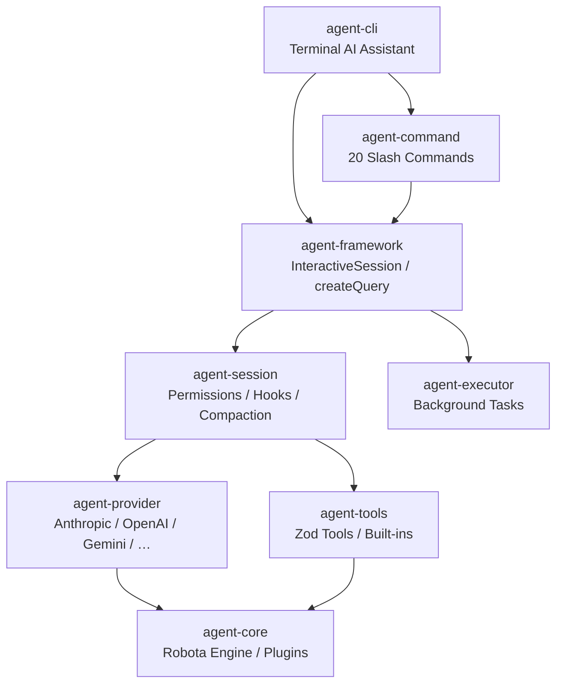

# 웹 디자이너 UX/UI 분석 리포트

작성일: 2026-05-18  
분석 대상: Robota SDK 문서 사이트(VitePress), agent-web(플레이그라운드/모니터), blog(Astro)

---

## 1. 현재 디자인 상태 요약

### 1-1. 문서 사이트 (robota.io)

- **기술 스택**: VitePress + DefaultTheme (거의 무커스터마이즈)
- **테마 커스터마이즈**: `style.css` 단 8줄 — 브랜드 컬러 `#3a70ff`(파란색)만 정의
- **홈 페이지**: `layout: home` Frontmatter 없이 일반 마크다운으로 구성. `hero`, `features` 섹션 없음
- **네비게이션**: 6개 항목 (Home / Getting Started / Guide / Examples / Packages / Development) — 플레이그라운드 링크 없음
- **사이드바**: `vite-plugin-vitepress-auto-sidebar`로 자동 생성 — 수동 정보 계층 없음
- **신뢰 신호**: GitHub + npm 소셜 링크 2개뿐, 버전 뱃지·다운로드 수 없음

### 1-2. Playground / Monitor (agent-web)

- **기술 스택**: Next.js App Router + Tailwind CSS v4 + shadcn/ui + React Flow
- **디자인 시스템**: "Studio" 테마 — `#1e1e2e` 다크 배경, violet(`#a78bfa`) 포인트. 독자적으로 상당히 완성도 있음
- **홈**: `redirect('/playground')`로 즉시 리다이렉트 — 진입점 설명 없음
- **폰트**: Space Grotesk(본문) + Fira Code(코드) — 개발자 친화적 조합
- **플레이그라운드**: `PlaygroundApp` 컴포넌트 동적 로딩, `defaultServerUrl` 환경변수 의존

### 1-3. 블로그 (blog.robota.io)

- **기술 스택**: Astro + 수동 CSS
- **디자인**: 미니멀 타이포그래피 블로그. 720px 최대폭, JetBrains Mono + Noto Sans KR
- **포인트 컬러**: `--green` CSS 변수 (블로그만 그린 계열 — 나머지는 블루/바이올렛과 **불일치**)
- **다크/라이트**: 수동 구현 (localStorage 기반) — 기능적으로 동작하나 VitePress/Next.js와 별개 구현
- **언어 전환**: EN/KO 전환 지원

---

## 2. 주요 UX 문제점

### 문제 1. 홈 페이지가 "랜딩"이 아닌 "README 덤프"

README.md가 그대로 홈이 됨. VitePress의 `layout: home` + hero + features 섹션을 전혀 사용하지 않음. Stripe Docs나 Vercel Docs처럼 "5초 안에 무엇인지 파악 가능"한 Hero가 없음.

### 문제 2. 브랜드 컬러 불일치 (3곳이 제각각)

- 문서: `#3a70ff` (파란색)
- Playground: `#a78bfa` (바이올렛)
- 블로그: `--green` (그린)
  단일 SDK임에도 세 곳이 서로 다른 accent 컬러를 사용. 브랜드 인식 분산.

### 문제 3. "어디서 시작해야 하나" 진입점 모호

Getting Started가 상단 nav에 있지만 홈에서 CTA(Call-to-Action) 버튼이 없음. 첫 방문자가 CLI를 써야 하는지, npm 패키지를 써야 하는지, 플레이그라운드를 써야 하는지 즉각 파악 불가.

### 문제 4. 플레이그라운드가 문서 사이트에서 격리됨

`robota.io` 어디에도 "Try it now" 또는 플레이그라운드 링크가 없음. `agent-web`은 독립 앱으로만 존재. 잠재 사용자가 시도해볼 경로가 끊김.

### 문제 5. 코드 블록 — 복사 버튼은 있지만 탭 전환이 없음

Provider 선택(Anthropic/OpenAI/Gemini)에 따라 다른 코드를 보여줘야 하는데, 현재는 모든 예제가 순차 나열됨. Stripe/Vercel처럼 언어/provider 탭 전환 방식이 필요함.

### 문제 6. 아키텍처 다이어그램이 ASCII 텍스트

`README.md`의 아키텍처 섹션이 코드 블록 안 ASCII 화살표로만 표현됨. 시각적으로 이해하기 어려움. Docusaurus Mermaid나 커스텀 SVG가 훨씬 효과적.

### 문제 7. npm 버전 뱃지 없음

Stripe, Prisma 등 주요 OSS 문서는 Hero 바로 아래 `npm version`, `downloads`, `license` 뱃지를 노출. 현재 robota.io에는 이런 신뢰 신호가 전무함.

### 문제 8. 사이드바 자동 생성 — 정보 계층 없음

`AutoSidebar` 플러그인이 파일 이름 기준으로 사이드바를 생성. 사용자 여정(초보 → 고급)에 맞는 수동 정보 계층 없음. Linear Docs처럼 "Basics / Advanced / Reference" 그룹핑 필요.

### 문제 9. 모바일 반응형 처리 미비

VitePress의 기본 모바일 대응만 존재 (nav 오버플로 처리 1줄). 코드 블록 가로 스크롤, 테이블 레이아웃, 아키텍처 블록 가독성이 모바일에서 깨질 가능성 높음.

### 문제 10. Playground 첫 화면 — 빈 로딩만 표시

`/playground` 진입 시 `"Loading Playground…"` 텍스트 외 아무것도 없음. WS 연결 실패 시 사용자가 무엇을 해야 하는지 알 수 없음. 에러 상태 + 온보딩 가이드 없음.

---

## 3. 디자인 개선안

| #   | 개선안                                     | 사용자 임팩트 | 구현 난이도 | 벤치마크                 |
| --- | ------------------------------------------ | ------------- | ----------- | ------------------------ |
| 1   | **VitePress Hero 섹션 구축**               | High          | Easy        | Vercel Docs, Prisma Docs |
| 2   | **브랜드 컬러 통합**                       | High          | Medium      | Linear, Figma            |
| 3   | **코드 탭 전환 컴포넌트**                  | High          | Medium      | Stripe Docs              |
| 4   | **문서 사이트에 Playground 진입 연결**     | High          | Easy        | Clerk Docs               |
| 5   | **사이드바 수동 정보 계층화**              | High          | Easy        | Vercel Docs              |
| 6   | **아키텍처 다이어그램 시각화**             | Mid           | Medium      | Docusaurus               |
| 7   | **npm 뱃지 + 신뢰 신호 섹션**              | Mid           | Easy        | Prisma, Zod              |
| 8   | **Playground 온보딩 및 에러 상태 UI**      | High          | Medium      | StackBlitz, CodeSandbox  |
| 9   | **다크모드 브랜드 최적화**                 | Mid           | Easy        | Shadcn/ui Docs           |
| 10  | **모바일 코드 블록 최적화**                | Mid           | Easy        | MDN Docs                 |
| 11  | **"5-Minute Quick Start" 인터랙티브 스텝** | High          | Hard        | Stripe Elements Tutorial |
| 12  | **패키지 선택 가이드 (Decision Tree UI)**  | Mid           | Medium      | tRPC Docs                |

---

### 개선안 상세

---

#### 개선 1. VitePress Hero 섹션 구축

**임팩트: High / 난이도: Easy**

현재 `content/README.md`는 `layout: home`은 있지만 VitePress hero 데이터 없이 일반 마크다운만 나열됨.

**벤치마크**: Vercel Docs — 간결한 한 줄 tagline + "Get Started" / "View Examples" 두 개 CTA 버튼.

```
적용 방안 (README.md frontmatter 교체):
---
layout: home
hero:
  name: "Robota SDK"
  text: "TypeScript AI Agent Framework"
  tagline: "Multi-provider · Type-safe · Extensible. Build AI agents in minutes."
  image:
    src: /images/cli-demo.png
    alt: Robota CLI Demo
  actions:
    - theme: brand
      text: Get Started
      link: /getting-started/
    - theme: alt
      text: Try Playground
      link: https://play.robota.io
    - theme: alt
      text: View on GitHub
      link: https://github.com/woojubb/robota
features:
  - icon: ⚡
    title: Multi-Provider
    details: Anthropic, OpenAI, Gemini 등 동일 API로 전환
  - icon: 🔧
    title: Type-Safe Tools
    details: Zod 기반 schema validation으로 타입 안전 도구 호출
  - icon: 🔌
    title: Plugin System
    details: lifecycle hooks로 확장 가능한 에이전트 아키텍처
---
```

레이아웃 스케치:

```
┌─────────────────────────────────────────────────────────┐
│  NAV: Robota SDK  |  Getting Started  Guide  Examples   │
├─────────────────────────────────────────────────────────┤
│                                                         │
│    TypeScript AI Agent Framework           [CLI demo    │
│    ─────────────────────────────────        screenshot] │
│    Multi-provider · Type-safe · Extensible              │
│    Build AI agents in minutes.                          │
│                                                         │
│    [Get Started →]  [Try Playground]  [GitHub]          │
│                                                         │
├─────────────────────────────────────────────────────────┤
│  ⚡ Multi-Provider  │  🔧 Type-Safe Tools  │  🔌 Plugins │
└─────────────────────────────────────────────────────────┘
```

---

#### 개선 2. 브랜드 컬러 통합

**임팩트: High / 난이도: Medium**

세 앱의 accent 컬러가 제각각. 토큰 기반 공유 팔레트 수립 필요.

**벤치마크**: Linear — 전 사이트 Purple(`#5E6AD2`) 단일 브랜드 컬러 일관 적용.

제안 팔레트:

```
브랜드 Violet (#7C6BF7) — 문서/블로그/playground 통일
  - Light mode: #7C6BF7 (primary), #EDE9FF (tint)
  - Dark mode:  #A78BFA (primary), #2D2657 (tint)
```

적용 범위:

- VitePress `style.css`: `--vp-c-brand: #7C6BF7`
- 블로그 `global.css`: `--green` → `--brand` (#7C6BF7)
- agent-web `globals.css`: 현재 violet과 유사하므로 미세 조정만 필요

---

#### 개선 3. 코드 탭 전환 컴포넌트

**임팩트: High / 난이도: Medium**

**벤치마크**: Stripe Docs — 언어 선택 시 모든 코드 블록이 동시에 전환. 세션 유지.

Quick Start 섹션을 provider별 탭으로 재구성:

```
레이아웃 스케치:
┌──────────────────────────────────────────────┐
│  [Anthropic] [OpenAI] [Gemini] [DeepSeek]    │  ← 탭
├──────────────────────────────────────────────┤
│  import { AnthropicProvider } from ...        │
│  const agent = new Robota({                  │
│    aiProviders: [provider],                  │
│    ...                                       │
│  })                      [Copy] [Open in →]  │
└──────────────────────────────────────────────┘
```

VitePress 커스텀 컴포넌트 또는 `:::code-group` 내장 문법 활용 가능.

---

#### 개선 4. 문서 사이트 ↔ Playground 진입 연결

**임팩트: High / 난이도: Easy**

**벤치마크**: Clerk Docs — 모든 코드 예제 우측 상단에 "Open in Playground" 버튼.

최소 구현:

- VitePress nav에 "Playground" 항목 추가 (외부 링크)
- Hero CTA 버튼 중 하나로 "Try Playground" 추가
- 코드 예제 블록에 "▶ Run in Playground" 링크 추가 (쿼리 파라미터로 코드 전달)

---

#### 개선 5. 사이드바 수동 정보 계층화

**임팩트: High / 난이도: Easy**

`AutoSidebar` 유지하되, `guide/` 폴더의 순서 배열을 확장하여 명시적 그룹핑.

**벤치마크**: Vercel Docs — "Frameworks / Storage / Functions / Deployment" 명확한 카테고리 그룹.

제안 구조:

```
Getting Started
  ├── Installation
  ├── Quick Start (5분)
  └── First Agent

Guide
  ├── Concepts
  │   ├── Architecture
  │   └── Providers
  ├── Building Agents
  │   ├── Tools & Functions
  │   ├── Sessions & Memory
  │   └── Subagents
  └── Advanced
      ├── Plugin System
      ├── Streaming
      └── CLI Integration

API Reference
  ├── agent-core
  ├── agent-framework
  └── agent-provider
```

---

#### 개선 6. 아키텍처 다이어그램 시각화

**임팩트: Mid / 난이도: Medium**

현재 ASCII 아트 → SVG 또는 Mermaid 플로우차트로 교체.

**벤치마크**: Docusaurus Mermaid 통합 — 마크다운 내 `mermaid` 코드 블록으로 인터랙티브 다이어그램.

블로그는 이미 CDN에서 Mermaid를 로드하고 있음 — VitePress에도 동일 적용 가능.

제안 다이어그램 (Mermaid flowchart):



---

#### 개선 7. npm 뱃지 + 신뢰 신호 섹션

**임팩트: Mid / 난이도: Easy**

**벤치마크**: Prisma, Zod — Hero 바로 아래 뱃지 줄.

```
[npm version] [downloads/month] [MIT License] [TypeScript] [GitHub Stars]
```

shields.io 또는 badgen.net으로 동적 뱃지 삽입:

```markdown
[](https://npmjs.com/...)
[](...)
[](...)
```

---

#### 개선 8. Playground 온보딩 및 에러 상태 UI

**임팩트: High / 난이도: Medium**

현재 WS 연결 실패 시 침묵. 첫 방문자는 `robota serve`를 실행해야 하는지 모름.

**벤치마크**: StackBlitz — 로딩 중 진행 상황 표시, 연결 실패 시 명확한 "Setup Instructions" 안내.

제안 상태별 UI:

```
[연결 중] ──────────────────────────────────────────
  Connecting to Robota server at ws://localhost:7070
  ────────────────────────────────────────────────

[연결 실패] ─────────────────────────────────────────
  ⚠  Could not connect to Robota server.

  To use the playground locally:
  $ npx @robota-sdk/agent-cli serve

  Or try the hosted demo: [Open Demo Playground →]
  ────────────────────────────────────────────────

[첫 연결 성공] ──────────────────────────────────────
  ✓  Connected. Try these starter prompts:
  → "Explain what you can do"
  → "Write a TypeScript function that..."
  → "List files in the current directory"
  ────────────────────────────────────────────────
```

---

#### 개선 9. 다크모드 브랜드 최적화

**임팩트: Mid / 난이도: Easy**

VitePress는 다크/라이트 모두 지원하지만 dark 모드에서 `#3a70ff` 파란색이 너무 어두워 contrast 부족.

**벤치마크**: Shadcn/ui Docs — dark 모드 전용 컬러 스케일 별도 정의.

```css
/* style.css 개선안 */
:root {
  --vp-c-brand-1: #7c6bf7;
  --vp-c-brand-2: #6355e8;
  --vp-c-brand-3: #9380fa;
  --vp-c-brand-soft: rgba(124, 107, 247, 0.14);
}

.dark {
  --vp-c-brand-1: #a78bfa;
  --vp-c-brand-2: #917ef8;
  --vp-c-brand-3: #bda8fc;
  --vp-c-brand-soft: rgba(167, 139, 250, 0.16);
}
```

---

#### 개선 10. 모바일 코드 블록 최적화

**임팩트: Mid / 난이도: Easy**

모바일에서 긴 import 경로 (`@robota-sdk/agent-provider/anthropic`)가 가로 스크롤을 유발.

```css
/* style.css 추가 */
@media (max-width: 768px) {
  .vp-doc div[class*='language-'] pre {
    font-size: 12px;
    padding: 12px;
  }

  .vp-doc div[class*='language-'] pre code {
    white-space: pre-wrap;
    word-break: break-all;
  }
}
```

---

#### 개선 11. "5-Minute Quick Start" 인터랙티브 스텝

**임팩트: High / 난이도: Hard**

**벤치마크**: Stripe Elements Tutorial — 단계별 체크리스트, 완료 시 ✓ 표시, 진행률 바.

VitePress 커스텀 컴포넌트로 구현:

```
레이아웃 스케치:
┌─────────────────────────────────────────────┐
│  Quick Start (5 min)          ████░░ 2/5    │
│                                              │
│  ✓  1. Install: npm install @robota-sdk/... │
│  ✓  2. Set API key: export ANTHROPIC_API_...│
│  →  3. Create your first agent              │
│     4. Add a tool                           │
│     5. Run it                               │
└─────────────────────────────────────────────┘
```

---

#### 개선 12. 패키지 선택 가이드 (Decision Tree UI)

**임팩트: Mid / 난이도: Medium**

11개 패키지 중 무엇을 설치해야 하는지 첫 방문자가 파악하기 어려움.

**벤치마크**: tRPC Docs — "Are you building a...?" 질문 기반 패키지 추천.

```
레이아웃 스케치:
┌──────────────────────────────────────────────────┐
│  What are you building?                          │
│                                                  │
│  ○ Terminal CLI tool        → agent-cli          │
│  ○ Custom agent in code     → agent-core + core  │
│  ○ Web app with AI          → agent-framework    │
│  ○ Just query an LLM        → createQuery()      │
│                                                  │
│  [Show install command]                          │
└──────────────────────────────────────────────────┘
```

---

## 4. 우선순위 실행 로드맵

```
Phase 1 — 빠른 Win (1~2일)
  1. VitePress Hero frontmatter 추가 (개선 1)
  2. npm 뱃지 추가 (개선 7)
  3. nav에 Playground 링크 추가 (개선 4)
  4. dark 모드 컬러 토큰 교체 (개선 9)
  5. 모바일 코드 블록 CSS (개선 10)

Phase 2 — 브랜드 & 구조 (3~5일)
  6. 브랜드 컬러 통합 — 3개 앱 동기화 (개선 2)
  7. 사이드바 수동 계층화 (개선 5)
  8. 코드 탭 전환 컴포넌트 (개선 3)

Phase 3 — 인터랙티브 (1~2주)
  9. Playground 온보딩/에러 UI (개선 8)
  10. 아키텍처 Mermaid 다이어그램 (개선 6)
  11. 패키지 선택 가이드 (개선 12)
  12. 인터랙티브 Quick Start 스텝 (개선 11) ← 가장 복잡
```

---

## 5. 참고 벤치마크 정리

| 사이트             | 참고할 점                                              |
| ------------------ | ------------------------------------------------------ |
| **Stripe Docs**    | 언어/SDK 탭 전환, 우측 고정 코드 패널, 단계별 튜토리얼 |
| **Vercel Docs**    | Hero 없는 간결한 진입, 명확한 nav 카테고리, 검색 중심  |
| **Linear Docs**    | 일관된 보라 브랜드 컬러, 여백 설계, 타이포그래피 계층  |
| **Prisma Docs**    | 뱃지, 패키지 선택 가이드, 다크모드 최적화              |
| **Clerk Docs**     | "Open in Playground" CTA 내장, 사용자 레벨별 분기      |
| **StackBlitz**     | 온보딩 로딩 UI, 연결 실패 안내                         |
| **tRPC Docs**      | "무엇을 만드나요?" Decision Tree 패키지 가이드         |
| **Shadcn/ui Docs** | dark/light 토큰 분리, 컴포넌트 코드 Copy+Preview 탭    |
