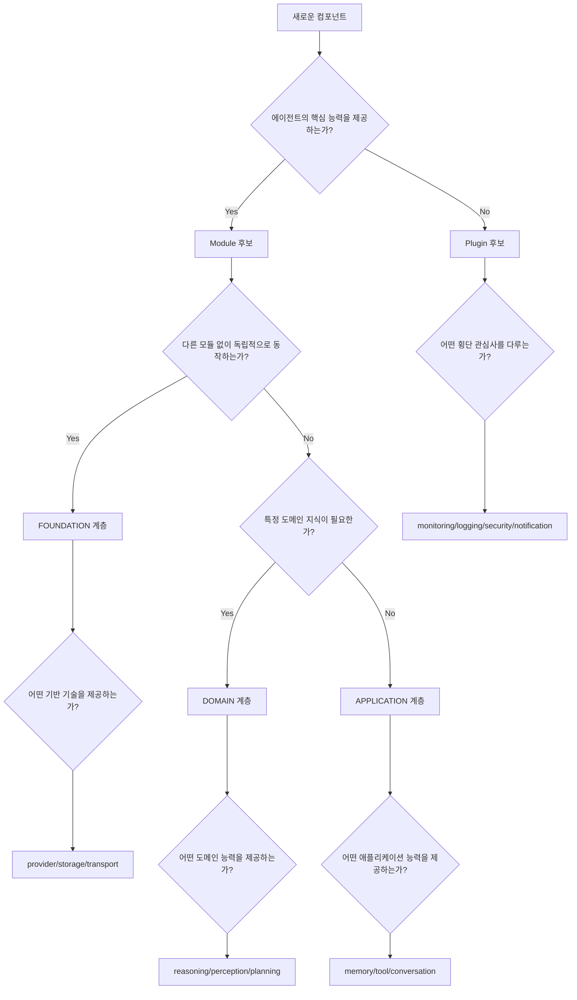

# 실용 가이드

## 모듈 타입 결정 트리

새로운 컴포넌트를 개발할 때 다음 질문들을 통해 Module인지 Plugin인지 결정하세요:

### 결정 트리 다이어그램



### 핵심 판별 질문들

#### 1차 필터: 핵심 능력 vs 부가 기능
```
❓ "이 기능이 없으면 에이전트가 할 수 있는 일이 줄어드나?"
   ✅ Yes → Module 후보
   ❌ No → Plugin 후보
```

#### 2차 필터: 능력 제공 vs 동작 관찰
```
❓ "이 기능이 에이전트의 새로운 능력을 제공하나?"
   ✅ Yes → Module
   ❌ No → "기존 동작을 관찰/보강하나?" 
           ✅ Yes → Plugin
```

#### 3차 필터: 의존성 패턴
```
❓ Module 후보인 경우:
   "다른 시스템들이 이 기능에 의존하나?"
   ✅ Yes → FOUNDATION/PLATFORM 계층
   ❌ No → APPLICATION/DOMAIN 계층
```

### 구체적 분류 기준

#### Module 분류 기준
| 특징 | Foundation | Capability | Enhancement | Integration |
|------|------------|------------|-------------|-------------|
| **역할** | 기반 기술 | 핵심 능력 | 능력 향상 | 모듈 통합 |
| **의존성** | 독립적 | 하위 모듈 필요 | 기존 능력 확장 | 여러 모듈 조합 |
| **예시** | AI Provider, Storage | Memory, Reasoning | Context Awareness | Multi-modal |
| **변경 빈도** | 낮음 | 중간 | 높음 | 중간 |

#### Plugin 분류 기준
| 카테고리 | 목적 | 특징 | 예시 |
|----------|------|------|------|
| **Monitoring** | 실행 관찰 | 성능 영향 최소 | Usage, Performance |
| **Logging** | 기록 관리 | 비동기 처리 | Logging, Error |
| **Notification** | 외부 알림 | 실패 허용 | Webhook, Event |
| **Security** | 보안 제어 | 실행 차단 가능 | Limits, Auth |
| **Storage** | 데이터 보관 | 선택적 저장 | History, Cache |

## 개발자 가이드라인

### Module 개발 가이드

#### 1. 설계 원칙
```typescript
// ✅ 좋은 Module 설계
export class VectorMemoryModule extends BaseModule {
    // 명확한 책임: 벡터 기반 메모리 관리
    async store(key: string, vector: number[], metadata: any): Promise<void>
    async search(query: number[], topK: number): Promise<SearchResult[]>
    async retrieve(key: string): Promise<VectorData | null>
    
    // 능력 명세가 명확함
    getCapabilities(): ModuleCapabilities {
        return {
            vectorDimensions: [512, 1024, 1536],
            similarityMethods: ['cosine', 'euclidean'],
            indexTypes: ['flat', 'ivf', 'hnsw']
        };
    }
}

// ❌ 나쁜 Module 설계
export class UtilityModule extends BaseModule {
    // 책임이 불분명: 유틸리티는 너무 포괄적
    async formatDate(date: Date): Promise<string>
    async sendNotification(message: string): Promise<void> // 이건 Plugin
    async validateInput(input: string): Promise<boolean>
}
```

#### 2. 의존성 관리
```typescript
// ✅ 명확한 의존성 정의
export class ReasoningModule extends BaseModule {
    readonly dependencies = ['memory', 'knowledge-base'];
    
    validateDependencies(): boolean {
        return this.dependencies.every(dep => 
            ModuleTypeRegistry.getType(dep) !== undefined
        );
    }
    
    // 의존 모듈과의 상호작용
    async initialize(config: ReasoningConfig): Promise<void> {
        this.memoryModule = await this.getRequiredModule<MemoryModule>('memory');
        this.knowledgeBase = await this.getRequiredModule<KnowledgeBaseModule>('knowledge-base');
    }
}

// ❌ 순환 의존성
export class ModuleA extends BaseModule {
    readonly dependencies = ['module-b']; // ModuleB도 ModuleA에 의존
}
```

#### 3. 인터페이스 설계
```typescript
// ✅ 표준 인터페이스 구현
export interface MemoryModule {
    store(key: string, value: any, metadata?: any): Promise<void>;
    retrieve(key: string): Promise<any>;
    search(query: string): Promise<any[]>;
    delete(key: string): Promise<boolean>;
}

export class VectorMemoryModule extends BaseModule implements MemoryModule {
    // 표준 인터페이스 구현
    async store(key: string, value: any, metadata?: any): Promise<void> { /* */ }
    async retrieve(key: string): Promise<any> { /* */ }
    async search(query: string): Promise<any[]> { /* */ }
    async delete(key: string): Promise<boolean> { /* */ }
    
    // 확장 기능
    async similaritySearch(vector: number[], topK: number): Promise<any[]> { /* */ }
}
```

### Plugin 개발 가이드

#### 1. 성능 고려사항
```typescript
// ✅ 효율적인 Plugin 설계
export class PerformancePlugin extends BasePlugin {
    private metrics = new Map<string, number>();
    
    async beforeRun(input: string): Promise<void> {
        // 가벼운 측정만 수행
        this.metrics.set('startTime', performance.now());
    }
    
    async afterRun(input: string, output: string): Promise<void> {
        // 비동기로 처리하여 메인 플로우에 영향 없음
        setImmediate(() => {
            this.recordMetrics(input, output);
        });
    }
}

// ❌ 성능에 영향을 주는 Plugin
export class BadPlugin extends BasePlugin {
    async beforeRun(input: string): Promise<void> {
        // 무거운 작업으로 메인 플로우 지연
        await this.heavyAnalysis(input);
        await this.syncToDatabase();
    }
}
```

#### 2. 에러 처리
```typescript
// ✅ 견고한 에러 처리
export class LoggingPlugin extends BasePlugin {
    async afterRun(input: string, output: string): Promise<void> {
        try {
            await this.logConversation(input, output);
        } catch (error) {
            // Plugin 오류는 조용히 처리하고 메인 플로우에 영향 주지 않음
            this.handleError('Failed to log conversation', error);
        }
    }
    
    private handleError(message: string, error: any): void {
        // 내부적으로만 처리하고 외부로 전파하지 않음
        console.error(`${this.name}: ${message}`, error);
        this.incrementErrorCount();
    }
}
```

#### 3. 상태 관리
```typescript
// ✅ 독립적인 상태 관리
export class UsagePlugin extends BasePlugin {
    private usage = {
        totalRequests: 0,
        totalTokens: 0,
        totalCost: 0
    };
    
    // 상태는 격리되고 다른 플러그인과 무관
    getStats(): UsageStats {
        return { ...this.usage }; // 복사본 반환
    }
    
    async afterRun(input: string, output: string): Promise<void> {
        this.usage.totalRequests++;
        this.usage.totalTokens += this.countTokens(input, output);
        this.usage.totalCost += this.calculateCost(this.usage.totalTokens);
    }
}
```

## 실무 적용 시나리오

### 시나리오 1: 새로운 AI Provider 추가

**요구사항**: Anthropic Claude 지원 추가

**분석 과정**:
1. **핵심 능력 제공**: ✅ (AI 대화 능력)
2. **에이전트 능력 확장**: ✅ (새로운 AI 모델 사용 가능)
3. **결론**: Module

**구현**:
```typescript
// 1. 모듈 타입 등록 (선택사항 - 기존 'provider' 타입 재사용 가능)
ModuleTypeRegistry.registerType('anthropic-provider', {
    type: 'anthropic-provider',
    category: ModuleCategory.FOUNDATION,
    layer: ModuleLayer.PLATFORM,
    dependencies: ['http-transport'],
    capabilities: ['text-generation', 'streaming', 'conversation']
});

// 2. Module 구현
export class AnthropicProviderModule extends BaseModule<AnthropicConfig> {
    readonly name = 'anthropic-provider';
    readonly version = '1.0.0';
    readonly dependencies = ['http-transport'];
    
    getModuleType(): ModuleTypeDescriptor {
        return ModuleTypeRegistry.getType('anthropic-provider')!;
    }
    
    // Provider 인터페이스 구현
    async generateResponse(messages: Message[]): Promise<string> { /* */ }
    async generateStream(messages: Message[]): AsyncIterable<string> { /* */ }
}

// 3. 사용
const agent = new RobotaBuilder()
    .addAIProvider(new AnthropicProviderModule())
    .build();
```

### 시나리오 2: 대화 품질 평가 기능 추가

**요구사항**: AI 응답의 품질을 자동으로 평가하고 점수화

**분석 과정**:
1. **핵심 능력 제공**: ❌ (응답 생성은 기존 Provider가 담당)
2. **기존 동작 관찰/보강**: ✅ (생성된 응답을 평가)
3. **결론**: Plugin

**구현**:
```typescript
export class QualityAssessmentPlugin extends BasePlugin<QualityOptions, QualityStats> {
    readonly name = 'quality-assessment';
    readonly version = '1.0.0';
    readonly category = PluginCategory.MONITORING;
    readonly priority = 80;
    
    private qualityScores: number[] = [];
    
    async afterRun(input: string, output: string): Promise<void> {
        // 비동기로 품질 평가 실행
        setImmediate(async () => {
            const score = await this.assessQuality(input, output);
            this.qualityScores.push(score);
            
            if (score < 0.5) {
                await this.flagLowQuality(input, output, score);
            }
        });
    }
    
    getStats(): QualityStats {
        return {
            averageScore: this.qualityScores.reduce((a, b) => a + b, 0) / this.qualityScores.length,
            totalAssessments: this.qualityScores.length,
            lowQualityCount: this.qualityScores.filter(s => s < 0.5).length
        };
    }
}
```

### 시나리오 3: 장기 기억 시스템 구축

**요구사항**: 에이전트가 과거 대화와 학습한 내용을 장기간 기억

**분석 과정**:
1. **핵심 능력 제공**: ✅ (기억 능력)
2. **에이전트 능력 확장**: ✅ (장기 기억 없으면 대화 맥락 유지 불가)
3. **결론**: Module

**구현**:
```typescript
// 1. 새로운 모듈 타입 등록
ModuleTypeRegistry.registerType('episodic-memory', {
    type: 'episodic-memory',
    category: ModuleCategory.CAPABILITY,
    layer: ModuleLayer.APPLICATION,
    dependencies: ['vector-storage', 'embedding-provider'],
    capabilities: ['episodic-storage', 'contextual-retrieval', 'semantic-search']
});

// 2. Module 구현
export class EpisodicMemoryModule extends BaseModule implements MemoryModule {
    readonly name = 'episodic-memory';
    readonly version = '1.0.0';
    readonly dependencies = ['vector-storage', 'embedding-provider'];
    
    async store(key: string, value: any, metadata?: any): Promise<void> {
        // 에피소드 형태로 저장
        const episode = {
            id: key,
            content: value,
            timestamp: Date.now(),
            embedding: await this.generateEmbedding(value),
            metadata
        };
        await this.vectorStorage.store(episode);
    }
    
    async retrieveContext(query: string): Promise<any[]> {
        // 유사한 과거 경험 검색
        const queryEmbedding = await this.generateEmbedding(query);
        return await this.vectorStorage.similaritySearch(queryEmbedding, 5);
    }
}

// 3. 에이전트에 통합
const smartAgent = new RobotaBuilder()
    .addAIProvider(new OpenAIProviderModule())
    .addMemory(new EpisodicMemoryModule())
    .build();
```

### 시나리오 4: 다중 에이전트 협업 시스템

**요구사항**: 여러 에이전트가 협력하여 복잡한 작업 수행

**분석 과정**:
1. **기존 능력 통합**: ✅ (기존 모듈들의 협업 조정)
2. **새로운 협업 능력**: ✅ (에이전트 간 통신 및 작업 분배)
3. **결론**: Integration Module

**구현**:
```typescript
// 1. 통합 모듈 타입 등록
ModuleTypeRegistry.registerType('multi-agent-coordinator', {
    type: 'multi-agent-coordinator',
    category: ModuleCategory.INTEGRATION,
    layer: ModuleLayer.DOMAIN,
    dependencies: ['communication', 'planning', 'task-distribution'],
    capabilities: ['agent-coordination', 'task-splitting', 'result-aggregation']
});

// 2. 통합 모듈 구현
export class MultiAgentCoordinatorModule extends BaseModule {
    readonly name = 'multi-agent-coordinator';
    readonly version = '1.0.0';
    readonly dependencies = ['communication', 'planning', 'task-distribution'];
    
    async coordinateTask(task: ComplexTask, agents: Robota[]): Promise<TaskResult> {
        // 1. 작업 분석 및 분할
        const subtasks = await this.planningModule.divideTask(task);
        
        // 2. 에이전트별 작업 할당
        const assignments = await this.assignTasks(subtasks, agents);
        
        // 3. 병렬 실행 및 결과 수집
        const results = await Promise.all(
            assignments.map(async ({ agent, subtask }) => {
                return await agent.run(subtask.description);
            })
        );
        
        // 4. 결과 통합
        return await this.aggregateResults(results);
    }
}
```

## 마이그레이션 가이드

### 기존 Plugin을 Module로 전환

#### ConversationHistory 예시
```typescript
// 기존 Plugin (AS-IS)
export class ConversationHistoryPlugin extends BasePlugin {
    // 대화 저장은 부가 기능으로 처리
}

// 새로운 Module (TO-BE) - 필요한 경우만
export class ConversationModule extends BaseModule {
    // 대화가 핵심 능력이라면 Module로 승격
    
    getModuleType(): ModuleTypeDescriptor {
        return {
            type: 'conversation',
            category: ModuleCategory.CAPABILITY,
            layer: ModuleLayer.APPLICATION,
            dependencies: ['storage'],
            capabilities: ['conversation-management', 'context-tracking']
        };
    }
}

// 또는 Plugin으로 유지 (권장)
export class ConversationHistoryPlugin extends BasePlugin {
    readonly category = PluginCategory.STORAGE;
    // 단순 저장 기능이므로 Plugin으로 유지하는 것이 적절
}
```

### 새로운 기능 개발 체크리스트

#### Module 개발 체크리스트
- [ ] 에이전트의 핵심 능력을 제공하는가?
- [ ] 의존성이 명확히 정의되었는가?
- [ ] 표준 인터페이스를 구현하는가?
- [ ] 모듈 타입이 적절히 분류되었는가?
- [ ] 능력(capabilities)이 명확히 정의되었는가?
- [ ] 호환성 검사가 구현되었는가?

#### Plugin 개발 체크리스트
- [ ] 메인 플로우에 성능 영향을 주지 않는가?
- [ ] 에러가 발생해도 메인 기능에 영향 없는가?
- [ ] 적절한 카테고리로 분류되었는가?
- [ ] 독립적으로 활성화/비활성화 가능한가?
- [ ] 다른 플러그인과 충돌하지 않는가?
- [ ] 필요한 모듈 의존성이 명시되었는가?

이러한 가이드라인을 따르면 일관성 있고 확장 가능한 Robota 컴포넌트를 개발할 수 있습니다. 