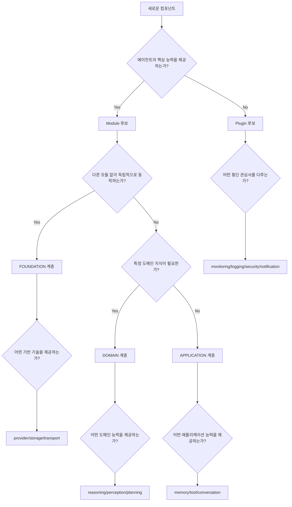

# 실용 가이드

## 모듈 타입 결정 트리

새로운 컴포넌트를 개발할 때 다음 질문들을 통해 Module인지 Plugin인지 결정하세요:

### 결정 트리 다이어그램



### 핵심 판별 질문들 (선택적 확장 원칙)

#### 1차 필터: 선택적 확장 vs 필수 구성요소
```
❓ "이 기능이 없어도 Robota가 기본 텍스트 대화를 에러 없이 할 수 있나?"
   ✅ Yes → Module 또는 Plugin 후보 (선택적 확장)
   ❌ No → 내부 핵심 클래스 (Module/Plugin 불가)
```

#### 2차 필터: LLM 능력 vs 외부 확장
```
❓ "이 기능이 LLM이 할 수 없는 일인가?"
   ✅ Yes → Module 후보 (예: 파일처리, DB연동, 음성처리)
   ❌ No → "기존 동작을 관찰/보강하나?" 
           ✅ Yes → Plugin (예: 로깅, 모니터링, 알림)
           ❌ No → 내부 클래스 (LLM이 이미 잘 하는 일)
```

#### ⚠️ 중요: Module/Plugin 불가능한 경우들
```
❓ "제거하면 에러가 나거나 주요 기능이 동작하지 않나?"
   ✅ Yes → 내부 핵심 클래스 (AI Provider, Tool Execution, Message Processing 등)
   ❌ No → Module 또는 Plugin으로 구현 가능

❓ "LLM이 이미 잘 할 수 있는 일인가?"
   ✅ Yes → 내부 클래스 또는 불필요 (대화, 추론, 텍스트 이해 등)
   ❌ No → Module 후보
```

### 구체적 분류 기준

#### Module 분류 기준 (선택적 확장 기능만)
| 특징 | Foundation | Capability | Integration |
|------|------------|------------|-------------|
| **역할** | 기반 기술 | LLM이 할 수 없는 능력 | 모듈 통합 |
| **의존성** | 독립적 | 기반 모듈 필요 | 여러 모듈 조합 |
| **예시** | Storage, Transport | RAG, 파일처리, DB연동 | Multi-modal API |
| **선택성** | 없어도 메모리/로컬 동작 | 없어도 텍스트 대화 가능 | 없어도 개별 기능 동작 |
| **변경 빈도** | 낮음 | 중간 | 중간 |

#### Plugin 분류 기준
| 카테고리 | 목적 | 특징 | 예시 |
|----------|------|------|------|
| **Monitoring** | 실행 관찰 | 성능 영향 최소 | Usage, Performance |
| **Logging** | 기록 관리 | 비동기 처리 | Logging, Error |
| **Notification** | 외부 알림 | 실패 허용 | Webhook, Event |
| **Security** | 보안 제어 | 실행 차단 가능 | Limits, Auth |
| **Storage** | 데이터 보관 | 선택적 저장 | History, Cache |

## 개발자 가이드라인

### Module 개발 가이드

#### 1. 설계 원칙
```typescript
// ✅ 좋은 Module 설계 (LLM이 할 수 없는 일)
export class VectorSearchModule extends BaseModule {
    // 명확한 책임: 벡터 검색 (LLM이 직접 할 수 없음)
    async addDocument(id: string, text: string, metadata: any): Promise<void>
    async search(query: string, topK: number): Promise<SearchResult[]>
    async embed(text: string): Promise<number[]>
    
    // 능력 명세가 명확함
    getCapabilities(): ModuleCapabilities {
        return {
            vectorDimensions: [512, 1024, 1536],
            similarityMethods: ['cosine', 'euclidean'],
            indexTypes: ['flat', 'ivf', 'hnsw']
        };
    }
}

// ❌ 나쁜 Module 설계 (LLM이 이미 잘 하는 일들)
export class ReasoningModule extends BaseModule {
    // LLM이 이미 추론을 잘 함 - 불필요한 Module
    async analyze(text: string): Promise<Analysis>
    async infer(facts: string[]): Promise<string>
    async explain(conclusion: string): Promise<string>
}

// ❌ 필수 구성요소를 Module로 만든 경우
export class AIProviderModule extends BaseModule {
    // 이것 없으면 대화 자체가 안됨 - 내부 클래스여야 함
    async generateResponse(messages: Message[]): Promise<string>
}
```

#### 2. 의존성 관리
```typescript
// ✅ 명확한 의존성 정의 (실제 필요한 모듈)
export class DatabaseModule extends BaseModule {
    readonly dependencies = ['transport']; // 네트워크 연결 필요
    
    validateDependencies(): boolean {
        return this.dependencies.every(dep => 
            ModuleTypeRegistry.getType(dep) !== undefined
        );
    }
    
    // 의존 모듈과의 상호작용
    async initialize(config: DatabaseConfig): Promise<void> {
        this.transport = await this.getRequiredModule<TransportModule>('transport');
        this.connection = await this.establishConnection(config);
    }
}

// ❌ 순환 의존성
export class ModuleA extends BaseModule {
    readonly dependencies = ['module-b']; // ModuleB도 ModuleA에 의존
}
```

#### 3. 인터페이스 설계
```typescript
// ✅ 표준 인터페이스 구현 (실제 필요한 기능)
export interface FileProcessingModule {
    processImage(buffer: Buffer): Promise<string>;
    processPDF(buffer: Buffer): Promise<string>;
    processAudio(buffer: Buffer): Promise<string>;
    extractMetadata(buffer: Buffer, type: string): Promise<any>;
}

export class LocalFileProcessingModule extends BaseModule implements FileProcessingModule {
    // 표준 인터페이스 구현
    async processImage(buffer: Buffer): Promise<string> { /* OCR 처리 */ }
    async processPDF(buffer: Buffer): Promise<string> { /* PDF 파싱 */ }
    async processAudio(buffer: Buffer): Promise<string> { /* 음성 변환 */ }
    async extractMetadata(buffer: Buffer, type: string): Promise<any> { /* 메타데이터 추출 */ }
    
    // 확장 기능
    async batchProcess(files: Buffer[]): Promise<string[]> { /* 배치 처리 */ }
}
```

### Plugin 개발 가이드

#### 1. 성능 고려사항
```typescript
// ✅ 효율적인 Plugin 설계
export class PerformancePlugin extends BasePlugin {
    private metrics = new Map<string, number>();
    
    async beforeRun(input: string): Promise<void> {
        // 가벼운 측정만 수행
        this.metrics.set('startTime', performance.now());
    }
    
    async afterRun(input: string, output: string): Promise<void> {
        // 비동기로 처리하여 메인 플로우에 영향 없음
        setImmediate(() => {
            this.recordMetrics(input, output);
        });
    }
}

// ❌ 성능에 영향을 주는 Plugin
export class BadPlugin extends BasePlugin {
    async beforeRun(input: string): Promise<void> {
        // 무거운 작업으로 메인 플로우 지연
        await this.heavyAnalysis(input);
        await this.syncToDatabase();
    }
}
```

#### 2. 에러 처리
```typescript
// ✅ 견고한 에러 처리
export class LoggingPlugin extends BasePlugin {
    async afterRun(input: string, output: string): Promise<void> {
        try {
            await this.logConversation(input, output);
        } catch (error) {
            // Plugin 오류는 조용히 처리하고 메인 플로우에 영향 주지 않음
            this.handleError('Failed to log conversation', error);
        }
    }
    
    private handleError(message: string, error: any): void {
        // 내부적으로만 처리하고 외부로 전파하지 않음
        console.error(`${this.name}: ${message}`, error);
        this.incrementErrorCount();
    }
}
```

#### 3. 상태 관리
```typescript
// ✅ 독립적인 상태 관리
export class UsagePlugin extends BasePlugin {
    private usage = {
        totalRequests: 0,
        totalTokens: 0,
        totalCost: 0
    };
    
    // 상태는 격리되고 다른 플러그인과 무관
    getStats(): UsageStats {
        return { ...this.usage }; // 복사본 반환
    }
    
    async afterRun(input: string, output: string): Promise<void> {
        this.usage.totalRequests++;
        this.usage.totalTokens += this.countTokens(input, output);
        this.usage.totalCost += this.calculateCost(this.usage.totalTokens);
    }
}
```

## 실무 적용 시나리오

### 시나리오 1: 새로운 AI Provider 추가

**요구사항**: Anthropic Claude 지원 추가

**분석 과정**:
1. **선택적 확장인가**: ❌ (없으면 대화 자체가 불가능)
2. **LLM이 할 수 없는 일인가**: ❌ (AI Provider는 필수 구성요소)
3. **결론**: 내부 핵심 클래스 (Module 불가)

**올바른 구현** (AI Provider는 내부 클래스로):
```typescript
// ❌ 잘못된 접근: AI Provider를 Module로 만들기
// AI Provider는 필수 구성요소이므로 Module이 될 수 없음

// ✅ 올바른 접근: 내부 클래스로 구현
export class AnthropicProvider implements AIProvider {
    constructor(private config: AnthropicConfig) {}
    
    async generateResponse(messages: Message[]): Promise<string> { /* */ }
    async generateStream(messages: Message[]): AsyncIterable<string> { /* */ }
}

// 사용 (기존 방식 유지)
const agent = new RobotaBuilder()
    .setAIProvider(new AnthropicProvider(config)) // Module이 아닌 내부 클래스
    .build();
```

### 시나리오 2: RAG 문서 검색 기능 추가

**요구사항**: 문서 검색 기반 답변 생성

**분석 과정**:
1. **선택적 확장인가**: ✅ (없어도 일반 대화는 가능)
2. **LLM이 할 수 없는 일인가**: ✅ (실시간 문서 검색은 LLM이 직접 불가)
3. **결론**: Module

**구현**:
```typescript
export class RAGModule extends BaseModule<RAGConfig> {
    readonly name = 'rag-search';
    readonly version = '1.0.0';
    readonly dependencies = ['vector-search', 'storage'];
    
    private vectorSearch?: VectorSearchModule;
    private storage?: StorageModule;
    
    getModuleType(): ModuleTypeDescriptor {
        return {
            type: 'rag-search',
            category: ModuleCategory.CAPABILITY,
            layer: ModuleLayer.APPLICATION,
            dependencies: this.dependencies,
            capabilities: ['document-search', 'context-retrieval', 'rag-generation']
        };
    }
    
    async addDocument(id: string, content: string, metadata?: any): Promise<void> {
        if (!this.vectorSearch) throw new Error('Vector search not available');
        await this.vectorSearch.addDocument(id, content, metadata);
    }
    
    async searchRelevant(query: string, topK: number = 5): Promise<string[]> {
        if (!this.vectorSearch) throw new Error('Vector search not available');
        const results = await this.vectorSearch.search(query, topK);
        return results.map(r => r.content);
    }
    
    async generateAnswer(query: string, context: string[]): Promise<string> {
        // RAG 로직: 검색된 문서를 기반으로 답변 생성 지원
        const contextText = context.join('\n\n');
        return `Based on the following context:\n${contextText}\n\nAnswer: [LLM will generate based on this context]`;
    }
}
```

### 시나리오 3: 대화 품질 평가 기능 추가

**요구사항**: AI 응답의 품질을 자동으로 평가하고 점수화

**분석 과정**:
1. **선택적 확장인가**: ✅ (없어도 대화는 정상 동작)
2. **LLM이 할 수 없는 일인가**: ❌ (기존 동작을 관찰/평가)
3. **결론**: Plugin

**구현**:
```typescript
export class QualityAssessmentPlugin extends BasePlugin<QualityOptions, QualityStats> {
    readonly name = 'quality-assessment';
    readonly version = '1.0.0';
    readonly category = PluginCategory.MONITORING;
    readonly priority = 80;
    
    private qualityScores: number[] = [];
    
    async afterRun(input: string, output: string): Promise<void> {
        // 비동기로 품질 평가 실행 (메인 플로우에 영향 없음)
        setImmediate(async () => {
            const score = await this.assessQuality(input, output);
            this.qualityScores.push(score);
            
            if (score < 0.5) {
                await this.flagLowQuality(input, output, score);
            }
        });
    }
    
    getStats(): QualityStats {
        return {
            averageScore: this.qualityScores.reduce((a, b) => a + b, 0) / this.qualityScores.length,
            totalAssessments: this.qualityScores.length,
            lowQualityCount: this.qualityScores.filter(s => s < 0.5).length
        };
    }
    
    private async assessQuality(input: string, output: string): Promise<number> {
        // 응답 품질 평가 로직 (관찰 기능)
        return Math.random(); // 예시
    }
}
```

### 시나리오 4: 파일 처리 시스템

**요구사항**: PDF, 이미지, 오디오 파일을 처리하여 텍스트로 변환

**분석 과정**:
1. **선택적 확장인가**: ✅ (없어도 텍스트 대화는 가능)
2. **LLM이 할 수 없는 일인가**: ✅ (파일 파싱은 LLM이 직접 불가)
3. **결론**: Module

**구현**:
```typescript
export class FileProcessingModule extends BaseModule<FileProcessingConfig> {
    readonly name = 'file-processing';
    readonly version = '1.0.0';
    readonly dependencies = ['storage'];
    
    getModuleType(): ModuleTypeDescriptor {
        return {
            type: 'file-processing',
            category: ModuleCategory.CAPABILITY,
            layer: ModuleLayer.APPLICATION,
            dependencies: this.dependencies,
            capabilities: ['pdf-parsing', 'image-ocr', 'audio-transcription']
        };
    }
    
    async processFile(buffer: Buffer, type: string): Promise<string> {
        switch (type) {
            case 'pdf':
                return await this.processPDF(buffer);
            case 'image':
                return await this.processImage(buffer);
            case 'audio':
                return await this.processAudio(buffer);
            default:
                throw new Error(`Unsupported file type: ${type}`);
        }
    }
    
    private async processPDF(buffer: Buffer): Promise<string> {
        // PDF 파싱 로직 (LLM이 할 수 없는 파일 처리)
        return 'Extracted text from PDF';
    }
    
    private async processImage(buffer: Buffer): Promise<string> {
        // OCR 처리 로직 (LLM이 할 수 없는 이미지 텍스트 추출)
        return 'Extracted text from image';
    }
    
    private async processAudio(buffer: Buffer): Promise<string> {
        // 음성 인식 로직 (LLM이 할 수 없는 오디오 변환)
        return 'Transcribed text from audio';
    }
}
```

## 마이그레이션 가이드

### 기존 Plugin을 Module로 전환

#### ConversationHistory 예시
```typescript
// 기존 Plugin (AS-IS)
export class ConversationHistoryPlugin extends BasePlugin {
    // 대화 저장은 부가 기능으로 처리
}

// 새로운 Module (TO-BE) - 필요한 경우만
export class ConversationModule extends BaseModule {
    // 대화가 핵심 능력이라면 Module로 승격
    
    getModuleType(): ModuleTypeDescriptor {
        return {
            type: 'conversation',
            category: ModuleCategory.CAPABILITY,
            layer: ModuleLayer.APPLICATION,
            dependencies: ['storage'],
            capabilities: ['conversation-management', 'context-tracking']
        };
    }
}

// 또는 Plugin으로 유지 (권장)
export class ConversationHistoryPlugin extends BasePlugin {
    readonly category = PluginCategory.STORAGE;
    // 단순 저장 기능이므로 Plugin으로 유지하는 것이 적절
}
```

### 새로운 기능 개발 체크리스트

#### Module 개발 체크리스트
- [ ] 이 기능 없이도 Robota가 기본 대화를 할 수 있는가? (선택적 확장)
- [ ] LLM이 직접 할 수 없는 일인가? (외부 시스템/파일/네트워크 등)
- [ ] 의존성이 명확히 정의되었는가?
- [ ] 표준 인터페이스를 구현하는가?
- [ ] 모듈 타입이 적절히 분류되었는가?
- [ ] 능력(capabilities)이 명확히 정의되었는가?
- [ ] 호환성 검사가 구현되었는가?

#### Plugin 개발 체크리스트
- [ ] 메인 플로우에 성능 영향을 주지 않는가?
- [ ] 에러가 발생해도 메인 기능에 영향 없는가?
- [ ] 적절한 카테고리로 분류되었는가?
- [ ] 독립적으로 활성화/비활성화 가능한가?
- [ ] 다른 플러그인과 충돌하지 않는가?
- [ ] 필요한 모듈 의존성이 명시되었는가?

이러한 가이드라인을 따르면 일관성 있고 확장 가능한 Robota 컴포넌트를 개발할 수 있습니다. 