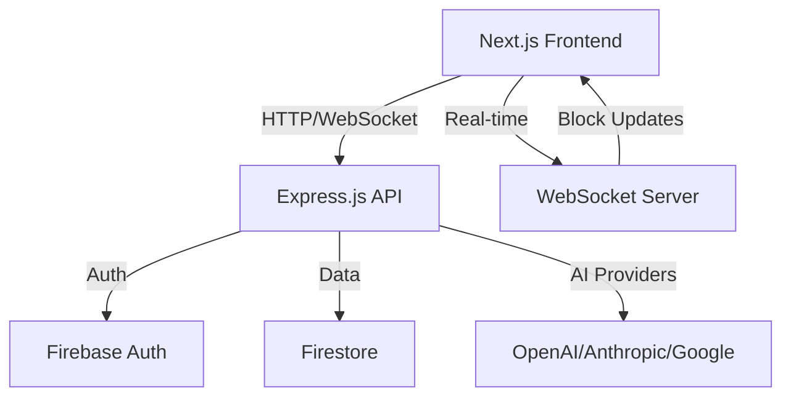

# 기술 스택 및 아키텍처 선택

## 📊 **현재 구현 상태**
- **Frontend**: Next.js 14 + TypeScript ✅
- **Backend**: Express.js + Firebase ✅  
- **UI Framework**: Tailwind CSS + Shadcn/ui ✅
- **Robota SDK Integration**: 100% 준수 ✅

> **상세 아키텍처는 `ARCHITECTURE.md` 참조**

---

## 🛠️ **Frontend Technology Stack**

### **Next.js 14 (App Router)**
```json
{
  "framework": "Next.js 14",
  "rationale": [
    "최신 React Server Components 지원",
    "App Router로 향상된 라우팅",
    "내장 최적화 (이미지, 폰트, 번들링)",
    "Vercel 배포 최적화"
  ],
  "features": [
    "Server-Side Rendering",
    "Static Site Generation", 
    "API Routes",
    "Middleware Support"
  ]
}
```

### **TypeScript**
```json
{
  "language": "TypeScript 5.x",
  "rationale": [
    "컴파일 타임 타입 안전성",
    "Robota SDK와 완벽한 타입 호환성",
    "개발자 경험 향상 (IntelliSense)",
    "대규모 프로젝트 유지보수성"
  ],
  "configuration": {
    "strict": true,
    "noImplicitAny": true,
    "exactOptionalPropertyTypes": true
  }
}
```

### **UI Framework**
```json
{
  "styling": "Tailwind CSS 3.x",
  "components": "Shadcn/ui",
  "rationale": [
    "일관된 디자인 시스템",
    "높은 커스터마이징 가능성",
    "타입 안전한 컴포넌트",
    "접근성 내장 지원"
  ],
  "theme": {
    "darkMode": "class-based",
    "customColors": "brand-specific",
    "responsive": "mobile-first"
  }
}
```

---

## ⚙️ **Backend Technology Stack**

### **Express.js API Server**
```json
{
  "framework": "Express.js 4.x",
  "rationale": [
    "높은 성능과 안정성",
    "풍부한 미들웨어 생태계",
    "WebSocket 지원 (ws)",
    "Robota SDK와 직접 통합"
  ],
  "features": [
    "RESTful API",
    "WebSocket Server",
    "Authentication Middleware",
    "Rate Limiting"
  ]
}
```

### **Firebase Backend Services**
```json
{
  "authentication": "Firebase Auth",
  "database": "Firestore",
  "storage": "Firebase Storage",
  "rationale": [
    "관리형 서비스로 운영 부담 감소",
    "글로벌 CDN 및 스케일링",
    "실시간 동기화 지원",
    "Google Cloud 통합"
  ]
}
```

---

## 🧩 **Robota SDK Integration**

### **Architecture Compliance**
```typescript
// SDK 원칙 100% 준수
interface RobotaIntegrationPrinciples {
  facadePattern: "단순한 인터페이스 제공";
  dependencyInjection: "명시적 의존성 주입";
  singleResponsibility: "각 컴포넌트 단일 책임";
  typeSafety: "완벽한 TypeScript 지원";
}
```

### **Universal Hook System**
```typescript
// 모든 Tool에 일관된 Hook 적용
interface ToolHooks {
  beforeExecute?: (toolName: string, parameters: any) => Promise<void>;
  afterExecute?: (toolName: string, result: any) => Promise<void>;
  onError?: (toolName: string, error: Error) => Promise<void>;
}

// BaseTool Template Method Pattern
abstract class BaseTool<TParams, TResult> {
  async execute(params: TParams): Promise<TResult> {
    await this.hooks?.beforeExecute?.(this.schema.name, params);
    const result = await this.executeImpl(params); // 하위 클래스 구현
    await this.hooks?.afterExecute?.(this.schema.name, result);
    return result;
  }
  
  protected abstract executeImpl(params: TParams): Promise<TResult>;
}
```

---

## 🔗 **System Integration Architecture**

### **Client-Server Communication**


### **Data Flow Architecture**
```typescript
// Frontend → Backend → AI Provider
interface DataFlow {
  userInput: "Chat Interface" → "WebSocket" → "API Server";
  aiProvider: "API Server" → "Remote Executor" → "OpenAI/Anthropic";
  blockTracking: "Tool Hooks" → "Block Collector" → "UI Update";
  realTime: "WebSocket" → "React State" → "Block Visualization";
}
```

---

## 🔧 **Development Tools & Environment**

### **Build & Development**
```json
{
  "packageManager": "pnpm (monorepo 최적화)",
  "bundler": "Next.js built-in (Turbopack)",
  "linting": "ESLint + Prettier",
  "testing": "Vitest + React Testing Library",
  "typeChecking": "TypeScript compiler + tsc"
}
```

### **Deployment & Infrastructure**
```json
{
  "frontend": "Vercel (Next.js 최적화)",
  "backend": "Railway/Render (Express.js)",
  "database": "Firebase (관리형)",
  "cdn": "Vercel Edge Network",
  "monitoring": "Vercel Analytics + Sentry"
}
```

---

## 📊 **Performance & Scalability**

### **Frontend Performance**
- **Bundle Size**: < 500KB (코드 분할)
- **First Load**: < 2초 (SSG + ISR)
- **Block Rendering**: 60fps (React 최적화)
- **Memory Usage**: < 100MB (가비지 컬렉션)

### **Backend Scalability**
- **Concurrent Users**: 1000+ (WebSocket)
- **API Response**: < 200ms (캐싱)
- **Database**: Auto-scaling (Firestore)
- **AI Provider**: Rate-limited (안전성)

---

## 🔐 **Security & Authentication**

### **Authentication Flow**
```typescript
interface AuthFlow {
  step1: "Firebase Auth (Google/GitHub/Email)";
  step2: "JWT Token Generation";
  step3: "API Server Validation";
  step4: "Playground Session";
}
```

### **Security Measures**
- **API Keys**: 서버 측 격리 저장
- **Rate Limiting**: 사용자별 요청 제한
- **CORS**: 명시적 도메인 허용
- **Input Validation**: 모든 입력 검증

---

## 🎯 **Technology Selection Rationale**

### **Why Next.js over Other Frameworks?**
1. **Server Components**: 최신 React 기능 활용
2. **Performance**: 내장 최적화 기능
3. **Ecosystem**: Vercel 생태계 활용
4. **Developer Experience**: 뛰어난 개발 경험

### **Why Express.js over Serverless?**
1. **WebSocket Support**: 실시간 통신 필수
2. **Stateful Connections**: AI Provider 연결 관리
3. **Flexibility**: 복잡한 비즈니스 로직 처리
4. **Cost Efficiency**: 지속적인 연결 비용 최적화

### **Why Firebase over Custom Backend?**
1. **Rapid Development**: 빠른 개발 및 배포
2. **Scalability**: 자동 스케일링
3. **Real-time**: 실시간 데이터 동기화
4. **Maintenance**: 관리 부담 최소화

---

## 🚀 **Future Technology Considerations**

### **Potential Upgrades**
- **React 19**: Concurrent Features 활용
- **Next.js 15**: 추가 성능 최적화
- **WebAssembly**: 복잡한 계산 최적화
- **Edge Computing**: 글로벌 지연 시간 감소

### **Monitoring & Analytics**
- **Performance Monitoring**: Core Web Vitals
- **Error Tracking**: Sentry 통합
- **User Analytics**: Vercel Analytics
- **Business Metrics**: 사용량 추적

**선택된 기술 스택은 혁신적인 Block Coding 시각화를 지원하면서도, 확장성과 유지보수성을 보장합니다.** 🛠️✨ 