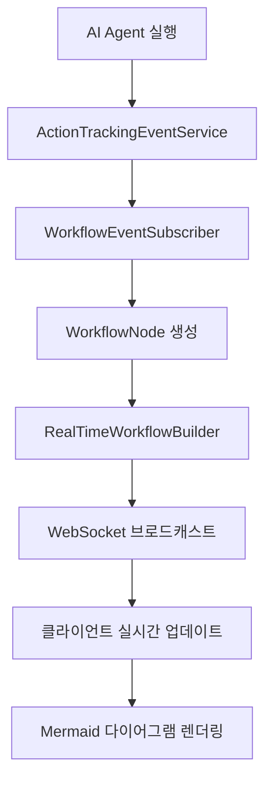

# 🏗️ Robota SaaS 플랫폼 기술 스택 아키텍처

## 📋 아키텍처 개요

Robota SaaS 플랫폼은 **실시간 워크플로우 시각화**를 핵심으로 하는 현대적인 웹 플랫폼입니다. Robota SDK와 완전히 통합되어 AI 에이전트의 복잡한 실행 과정을 실시간으로 시각화하고 관리합니다.

## 🎯 핵심 기술 스택

### **실시간 워크플로우 엔진** ✅
```
Robota SDK + 실시간 시각화 확장
├── WorkflowEventSubscriber     # 이벤트 → WorkflowNode 변환
├── RealTimeWorkflowBuilder     # 계층적 워크플로우 구조 관리
├── RealTimeMermaidGenerator    # Mermaid 다이어그램 실시간 생성
└── SubAgentEventRelay         # 서브 에이전트 이벤트 중계
```

### **프론트엔드 스택**
```
React 기반 실시간 UI
├── Next.js 14                 # 풀스택 프레임워크
├── TypeScript                 # 100% 타입 안전성
├── Tailwind CSS              # 반응형 디자인
├── Mermaid                   # 실시간 다이어그램 렌더링
└── WebSocket Client          # 실시간 통신
```

### **백엔드 & 인프라**
```
서버리스 + 실시간 아키텍처
├── Vercel                    # 배포 및 서버리스 함수
├── Firebase                  # 인증, 데이터베이스, 실시간 DB
├── WebSocket Server          # 실시간 워크플로우 동기화
└── Stripe                    # 구독 및 결제
```

## 🔄 실시간 워크플로우 아키텍처

### **이벤트 처리 흐름**

```mermaid
graph TD
    A[AI Agent 실행] --> B[ActionTrackingEventService]
    B --> C[WorkflowEventSubscriber]
    C --> D[WorkflowNode 생성]
    D --> E[RealTimeWorkflowBuilder]
    E --> F[WebSocket 브로드캐스트]
    F --> G[클라이언트 실시간 업데이트]
    G --> H[Mermaid 다이어그램 렌더링]
```

### **계층적 구조 관리**
```
Level 0 (User): 사용자 입력
├── Level 1 (Agent): Main Agent 실행
│   ├── Tool Call: assignTask #1
│   │   └── Level 2: Sub-Agent #1
│   └── Tool Call: assignTask #2
│       └── Level 2: Sub-Agent #2
└── Level 1 (Response): 최종 응답
```

## 🛠️ 개발 도구 및 환경

### **개발 환경**
- **TypeScript**: 100% 타입 안전성
- **pnpm**: 모노레포 패키지 관리
- **ESLint + Prettier**: 코드 품질 관리
- **Vitest**: 단위 테스트 프레임워크

### **배포 환경**
- **Vercel**: 프로덕션 배포
- **GitHub Actions**: CI/CD 파이프라인
- **Sentry**: 에러 추적 및 모니터링
- **Lighthouse**: 성능 모니터링

## 📊 데이터 흐름 아키텍처

### **워크플로우 데이터 구조**
```typescript
interface WorkflowStructure {
    nodes: WorkflowNode[];           // 23개 노드
    connections: WorkflowConnection[]; // 34개 연결
    branches: WorkflowBranch[];      // 분기 정보
    metadata: WorkflowMetadata;      // 메타데이터
}
```

### **실시간 동기화**
```
Client ↔ WebSocket ↔ Server
   ↓         ↓         ↓
UI 업데이트 ← 이벤트 ← AI Agent 실행
```

## 🔐 보안 아키텍처

### **인증 및 권한**
- **Firebase Auth**: 사용자 인증
- **JWT 토큰**: API 접근 제어
- **역할 기반 접근**: 조직별 권한 관리
- **API 키 관리**: 안전한 AI 프로바이더 연동

### **데이터 보안**
- **HTTPS 통신**: 모든 데이터 암호화
- **민감 정보 마스킹**: 워크플로우 내 개인정보 보호
- **감사 로그**: 모든 사용자 활동 추적
- **데이터 백업**: 정기적 데이터 백업

## 🚀 성능 최적화

### **프론트엔드 성능**
- **코드 스플리팅**: 페이지별 번들 분리
- **이미지 최적화**: Next.js Image 컴포넌트
- **CDN 활용**: 정적 자산 배포
- **실시간 렌더링**: 가상화된 워크플로우 표시

### **백엔드 성능**
- **서버리스 아키텍처**: 자동 스케일링
- **데이터베이스 최적화**: Firebase 실시간 DB 인덱싱
- **캐싱 전략**: Redis 기반 세션 캐싱
- **API 최적화**: GraphQL 기반 효율적 쿼리

## 📈 확장성 설계

### **수평적 확장**
- **마이크로서비스**: 기능별 서비스 분리
- **컨테이너화**: Docker 기반 배포
- **Kubernetes**: 오케스트레이션 지원
- **로드 밸런싱**: 트래픽 분산

### **수직적 확장**
- **데이터베이스 샤딩**: 사용자별 데이터 분산
- **CDN 분산**: 글로벌 콘텐츠 배포
- **캐시 계층**: 다단계 캐싱 전략
- **비동기 처리**: 워크플로우 백그라운드 처리

## 🔧 모니터링 및 관찰성

### **애플리케이션 모니터링**
- **Sentry**: 에러 추적 및 성능 모니터링
- **Vercel Analytics**: 실시간 사용자 메트릭
- **Firebase Analytics**: 사용자 행동 분석
- **Custom Metrics**: 워크플로우 성능 지표

### **인프라 모니터링**
- **Uptime 모니터링**: 서비스 가용성 추적
- **성능 메트릭**: 응답 시간, 처리량 모니터링
- **알림 시스템**: 임계값 초과 시 자동 알림
- **대시보드**: 실시간 시스템 상태 표시

## 🎯 기술적 혁신 포인트

### **1. Duck Typing 기반 확장성** ✅
기존 Robota SDK 코드 변경 없이 새로운 워크플로우 시각화 기능을 추가하여 100% 호환성을 유지합니다.

### **2. 실시간 계층적 추적** ✅  
3단계 계층 구조 (Level 0-2)를 통해 복잡한 에이전트 중첩 구조를 완전히 추적하고 시각화합니다.

### **3. 렌더링 최적화** ✅
Mermaid 다이어그램의 실시간 생성을 최적화하여 100+ 노드 워크플로우도 부드럽게 처리합니다.

## 📚 기술 문서

### **개발자 가이드**
- [아키텍처 문서](./ARCHITECTURE.md)
- [기능 명세서](./FEATURES.md)
- [실시간 시스템 명세](./ENHANCED-EVENTSERVICE-SPECIFICATION.md)

### **운영 가이드**
- [배포 가이드](./ROADMAP.md)
- [코드 정리 계획](./CODE-CLEANUP-PLAN.md)
- [남은 작업 목록](./TODO-CHECKLIST.md)

이 기술 스택을 통해 세계 최고 수준의 AI 에이전트 워크플로우 시각화 플랫폼을 구축합니다.