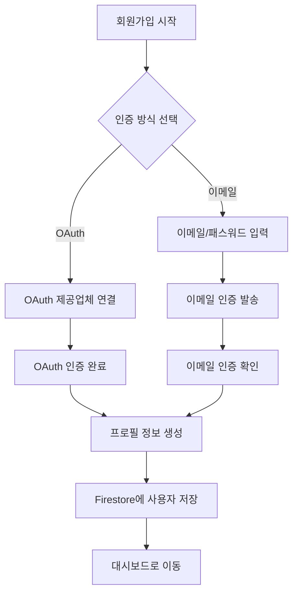
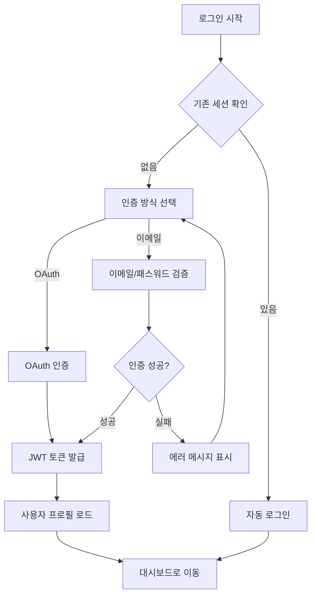
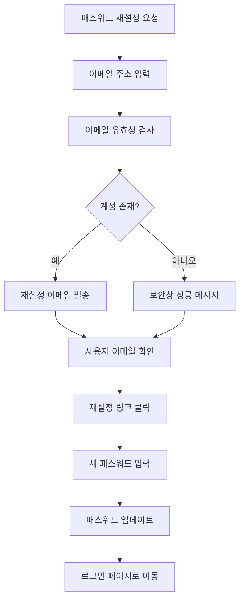

# 인증 시스템 설계

## 인증 아키텍처 개요

### Firebase Authentication 기반 설계
```
┌─────────────────┐    ┌─────────────────┐    ┌─────────────────┐
│   Frontend      │    │   Firebase      │    │   OAuth         │
│   Auth UI       │◄──►│   Auth Service  │◄──►│   Providers     │
└─────────────────┘    └─────────────────┘    └─────────────────┘
         │                       │                       │
         ▼                       ▼                       ▼
┌─────────────────┐    ┌─────────────────┐    ┌─────────────────┐
│   Local State   │    │   JWT Tokens    │    │   GitHub API    │
│   Management    │    │   & Sessions    │    │   Google API    │
└─────────────────┘    └─────────────────┘    └─────────────────┘
```

## 지원 인증 방식

### 1. OAuth 제공업체

#### GitHub OAuth
```typescript
// GitHub 인증 설정
const githubProvider = new GithubAuthProvider();
githubProvider.addScope('user:email');
githubProvider.addScope('read:user');

// 추가 권한 요청 (선택사항)
githubProvider.addScope('repo'); // 리포지토리 접근 (향후 확장)
```

#### Google OAuth
```typescript
// Google 인증 설정
const googleProvider = new GoogleAuthProvider();
googleProvider.addScope('email');
googleProvider.addScope('profile');
googleProvider.addScope('openid');
```

### 2. 이메일/패스워드 인증
```typescript
// 이메일 회원가입
interface EmailSignupData {
  email: string;
  password: string;
  displayName: string;
  acceptTerms: boolean;
  acceptMarketing?: boolean;
}

// 패스워드 요구사항
const PASSWORD_REQUIREMENTS = {
  minLength: 8,
  requireUppercase: true,
  requireLowercase: true,
  requireNumbers: true,
  requireSpecialChars: false,
};
```

## 사용자 데이터 모델

### UserProfile 스키마
```typescript
interface UserProfile {
  // Firebase Auth 기본 정보
  uid: string;
  email: string;
  displayName: string;
  photoURL?: string;
  emailVerified: boolean;
  
  // 추가 프로필 정보
  provider: 'github' | 'google' | 'email';
  createdAt: Timestamp;
  updatedAt: Timestamp;
  lastLoginAt: Timestamp;
  
  // 역할 및 권한
  role: 'user' | 'admin' | 'moderator';
  permissions: Permission[];
  
  // 구독 정보
  subscription: {
    plan: 'free' | 'starter' | 'pro' | 'enterprise';
    status: 'active' | 'canceled' | 'past_due' | 'trialing';
    currentPeriodStart: Timestamp;
    currentPeriodEnd: Timestamp;
  };
  
  // 사용자 설정
  preferences: {
    theme: 'light' | 'dark' | 'system';
    language: 'ko' | 'en';
    notifications: {
      email: boolean;
      browser: boolean;
      marketing: boolean;
    };
  };
  
  // 외부 연결 정보
  connectedAccounts: {
    github?: {
      username: string;
      profileUrl: string;
      connectedAt: Timestamp;
    };
    google?: {
      email: string;
      connectedAt: Timestamp;
    };
  };
}
```

### Permission 시스템
```typescript
enum PermissionType {
  // API 권한
  API_READ = 'api:read',
  API_WRITE = 'api:write',
  API_ADMIN = 'api:admin',
  
  // 프로젝트 권한
  PROJECT_CREATE = 'project:create',
  PROJECT_READ = 'project:read',
  PROJECT_WRITE = 'project:write',
  PROJECT_DELETE = 'project:delete',
  PROJECT_SHARE = 'project:share',
  
  // 팀 권한
  TEAM_CREATE = 'team:create',
  TEAM_INVITE = 'team:invite',
  TEAM_MANAGE = 'team:manage',
  
  // 관리자 권한
  ADMIN_USERS = 'admin:users',
  ADMIN_BILLING = 'admin:billing',
  ADMIN_SYSTEM = 'admin:system',
}

interface Permission {
  type: PermissionType;
  resource?: string; // 특정 리소스 ID (선택적)
  grantedAt: Timestamp;
  grantedBy: string; // 권한을 부여한 사용자 ID
}
```

## 인증 플로우

### 1. 회원가입 플로우


### 2. 로그인 플로우


### 3. 패스워드 재설정 플로우


## 보안 구현 사항

### 1. JWT 토큰 관리
```typescript
// JWT 토큰 인터페이스
interface CustomClaims {
  role: string;
  permissions: string[];
  subscriptionPlan: string;
  emailVerified: boolean;
}

// 토큰 갱신 로직
class AuthTokenManager {
  private refreshThreshold = 5 * 60 * 1000; // 5분 전 갱신
  
  async getValidToken(): Promise<string> {
    const user = firebase.auth().currentUser;
    if (!user) throw new Error('User not authenticated');
    
    const tokenResult = await user.getIdTokenResult();
    const expirationTime = new Date(tokenResult.expirationTime).getTime();
    const now = Date.now();
    
    if (expirationTime - now < this.refreshThreshold) {
      // 토큰 갱신 필요
      return user.getIdToken(true);
    }
    
    return tokenResult.token;
  }
}
```

### 2. 세션 관리
```typescript
// 세션 상태 관리
interface AuthState {
  user: User | null;
  profile: UserProfile | null;
  loading: boolean;
  error: string | null;
}

// 세션 지속성 설정
const auth = getAuth();
setPersistence(auth, browserLocalPersistence);

// 세션 만료 처리
onAuthStateChanged(auth, async (user) => {
  if (user) {
    // 사용자 로그인 상태
    const profile = await loadUserProfile(user.uid);
    updateAuthState({ user, profile, loading: false, error: null });
  } else {
    // 사용자 로그아웃 상태
    updateAuthState({ user: null, profile: null, loading: false, error: null });
  }
});
```

### 3. API 요청 인증
```typescript
// API 클라이언트 인터셉터
const apiClient = axios.create({
  baseURL: process.env.NEXT_PUBLIC_API_BASE_URL,
});

apiClient.interceptors.request.use(async (config) => {
  const token = await authTokenManager.getValidToken();
  config.headers.Authorization = `Bearer ${token}`;
  return config;
});

// 401 에러 처리
apiClient.interceptors.response.use(
  (response) => response,
  async (error) => {
    if (error.response?.status === 401) {
      // 토큰 만료 또는 무효
      await signOut(auth);
      window.location.href = '/login';
    }
    return Promise.reject(error);
  }
);
```

## Firebase Rules 설정

### Firestore Security Rules
```javascript
rules_version = '2';
service cloud.firestore {
  match /databases/{database}/documents {
    // 사용자 프로필 접근 규칙
    match /users/{userId} {
      allow read, write: if request.auth != null && request.auth.uid == userId;
      allow read: if request.auth != null && 
        resource.data.role in ['admin', 'moderator'];
    }
    
    // 프로젝트 접근 규칙
    match /projects/{projectId} {
      allow read, write: if request.auth != null && 
        request.auth.uid == resource.data.ownerId;
      allow read: if request.auth != null && 
        request.auth.uid in resource.data.collaborators;
    }
    
    // API 키 접근 규칙
    match /apiKeys/{keyId} {
      allow read, write: if request.auth != null && 
        request.auth.uid == resource.data.userId;
    }
    
    // 관리자만 접근 가능한 컬렉션
    match /admin/{document} {
      allow read, write: if request.auth != null && 
        request.auth.token.role == 'admin';
    }
  }
}
```

### Firebase Storage Rules
```javascript
rules_version = '2';
service firebase.storage {
  match /b/{bucket}/o {
    // 사용자 프로필 이미지
    match /profiles/{userId}/{allPaths=**} {
      allow read, write: if request.auth != null && 
        request.auth.uid == userId;
    }
    
    // 프로젝트 파일
    match /projects/{projectId}/{allPaths=**} {
      allow read, write: if request.auth != null;
      // TODO: 프로젝트 소유권 확인 로직 추가
    }
  }
}
```

## 계정 연결 및 해제

### 계정 연결 (Account Linking)
```typescript
// GitHub 계정 연결
async function linkGitHubAccount() {
  const user = auth.currentUser;
  if (!user) throw new Error('User not authenticated');
  
  const provider = new GithubAuthProvider();
  provider.addScope('user:email');
  
  try {
    const result = await linkWithPopup(user, provider);
    const credential = GithubAuthProvider.credentialFromResult(result);
    
    // 연결된 계정 정보 저장
    await updateDoc(doc(db, 'users', user.uid), {
      'connectedAccounts.github': {
        username: result.user.reloadUserInfo.screenName,
        profileUrl: `https://github.com/${result.user.reloadUserInfo.screenName}`,
        connectedAt: serverTimestamp(),
      },
      updatedAt: serverTimestamp(),
    });
    
    return result;
  } catch (error) {
    if (error.code === 'auth/account-exists-with-different-credential') {
      // 이미 다른 방식으로 연결된 계정
      throw new Error('이 GitHub 계정은 이미 다른 방식으로 연결되어 있습니다.');
    }
    throw error;
  }
}
```

### 계정 해제 (Account Unlinking)
```typescript
// 계정 연결 해제
async function unlinkProvider(providerId: string) {
  const user = auth.currentUser;
  if (!user) throw new Error('User not authenticated');
  
  // 마지막 남은 인증 방식인지 확인
  if (user.providerData.length <= 1) {
    throw new Error('최소 하나의 인증 방식은 유지되어야 합니다.');
  }
  
  try {
    await unlink(user, providerId);
    
    // Firestore에서 연결 정보 제거
    const updateData: any = {
      updatedAt: serverTimestamp(),
    };
    
    if (providerId === 'github.com') {
      updateData['connectedAccounts.github'] = deleteField();
    } else if (providerId === 'google.com') {
      updateData['connectedAccounts.google'] = deleteField();
    }
    
    await updateDoc(doc(db, 'users', user.uid), updateData);
  } catch (error) {
    throw new Error('계정 연결 해제에 실패했습니다.');
  }
}
```

## 이메일 인증 및 알림

### 이메일 템플릿 설정
```typescript
// Firebase 이메일 템플릿 커스터마이징
const actionCodeSettings: ActionCodeSettings = {
  url: `${process.env.NEXT_PUBLIC_APP_URL}/verify-email`,
  handleCodeInApp: true,
  iOS: {
    bundleId: 'com.robota.app',
  },
  android: {
    packageName: 'com.robota.app',
    installApp: true,
    minimumVersion: '12',
  },
  dynamicLinkDomain: 'robota.page.link',
};

// 이메일 인증 발송
async function sendEmailVerification(user: User) {
  await sendEmailVerification(user, actionCodeSettings);
}

// 패스워드 재설정 이메일 발송
async function sendPasswordReset(email: string) {
  await sendPasswordResetEmail(auth, email, actionCodeSettings);
}
```

### 이메일 인증 처리
```typescript
// 이메일 인증 완료 처리
async function handleEmailVerification(actionCode: string) {
  try {
    await applyActionCode(auth, actionCode);
    
    // 사용자 프로필 업데이트
    const user = auth.currentUser;
    if (user) {
      await updateDoc(doc(db, 'users', user.uid), {
        emailVerified: true,
        updatedAt: serverTimestamp(),
      });
    }
    
    return { success: true };
  } catch (error) {
    return { success: false, error: error.message };
  }
}
```

## 보안 모니터링

### 의심스러운 활동 감지
```typescript
// 로그인 이상 패턴 감지
interface LoginAttempt {
  userId: string;
  ipAddress: string;
  userAgent: string;
  timestamp: Timestamp;
  success: boolean;
  location?: {
    country: string;
    city: string;
  };
}

// 로그인 시도 로깅
async function logLoginAttempt(attempt: LoginAttempt) {
  await addDoc(collection(db, 'loginAttempts'), attempt);
  
  // 의심스러운 패턴 체크
  const recentAttempts = await getDocs(
    query(
      collection(db, 'loginAttempts'),
      where('userId', '==', attempt.userId),
      where('timestamp', '>', new Date(Date.now() - 24 * 60 * 60 * 1000)),
      orderBy('timestamp', 'desc')
    )
  );
  
  const failedAttempts = recentAttempts.docs.filter(doc => !doc.data().success);
  
  if (failedAttempts.length >= 5) {
    // 계정 임시 잠금 또는 알림 발송
    await notifySecurityTeam(attempt.userId, 'Multiple failed login attempts');
  }
}
```

### Rate Limiting
```typescript
// 로그인 시도 제한
class AuthRateLimiter {
  private attempts: Map<string, number[]> = new Map();
  private readonly maxAttempts = 5;
  private readonly windowMs = 15 * 60 * 1000; // 15분
  
  isBlocked(identifier: string): boolean {
    const attemptTimes = this.attempts.get(identifier) || [];
    const now = Date.now();
    
    // 윈도우 시간 내의 시도만 필터링
    const recentAttempts = attemptTimes.filter(time => now - time < this.windowMs);
    
    return recentAttempts.length >= this.maxAttempts;
  }
  
  recordAttempt(identifier: string): void {
    const attempts = this.attempts.get(identifier) || [];
    attempts.push(Date.now());
    this.attempts.set(identifier, attempts);
  }
}
``` 