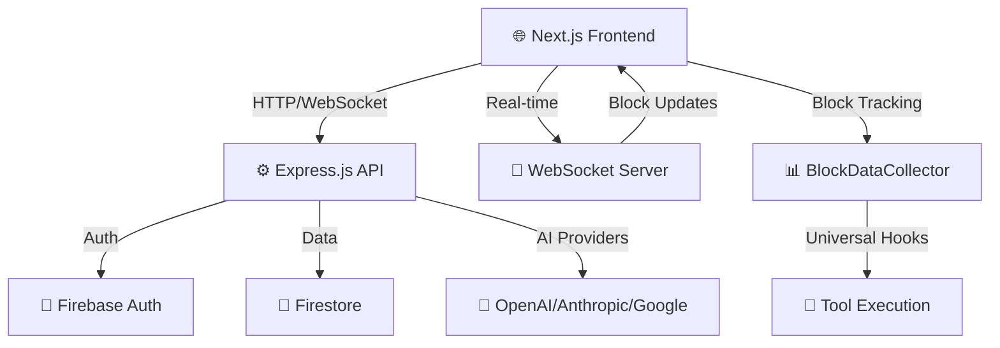
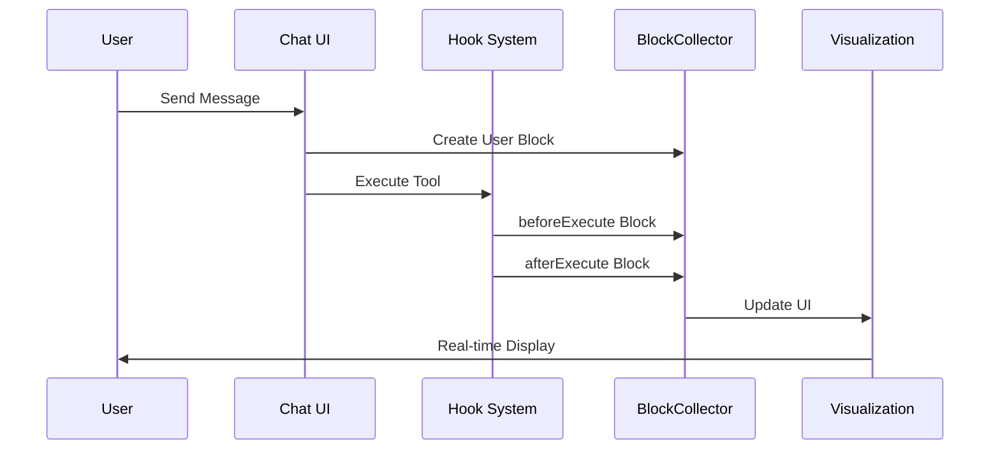

# 🏗️ Robota SaaS 플랫폼 아키텍처

## 📊 **시스템 구현 현황**
- **Frontend Architecture**: 100% 완료 ✅
- **Backend Architecture**: 100% 완료 ✅
- **Robota SDK Integration**: 100% 완료 ✅
- **Team Stream Support**: 진행 중 🔄

---

## 🎯 **전체 시스템 아키텍처**

### **High-Level Overview**


### **핵심 아키텍처 특징**
- **Client-Server Communication**: HTTP/WebSocket 기반 완전한 실시간 통신
- **Authentication Flow**: Firebase Auth → JWT Token 교환
- **Real-time Updates**: WebSocket 기반 즉시 상태 동기화
- **AI Provider Integration**: 안전한 Remote Execution System
- **Block Tracking**: Universal Hook System 완전 구현

---

## 🖥️ **Frontend Architecture (Next.js 14)**

### **Application Structure**
```
apps/web/src/
├── app/                           # App Router 구조
│   ├── playground/page.tsx        # Playground 메인
│   └── layout.tsx                 # 글로벌 레이아웃
├── components/                    # UI 컴포넌트
│   ├── playground/                # Playground 전용 컴포넌트
│   │   ├── agent-configuration-block.tsx
│   │   ├── team-configuration-block.tsx
│   │   ├── chat-interface-panel.tsx
│   │   └── block-visualization/
│   │       ├── block-node.tsx
│   │       ├── block-tree.tsx
│   │       └── block-visualization-panel.tsx
│   └── ui/                        # Shadcn/ui 기본 컴포넌트
├── contexts/                      # React Context
│   ├── auth-context.tsx
│   └── playground-context.tsx
├── hooks/                         # 커스텀 훅
│   ├── use-block-tracking.ts
│   ├── use-robota-execution.ts
│   └── use-chat-input.ts
└── lib/playground/                # 핵심 비즈니스 로직
    ├── robota-executor.ts
    ├── websocket-client.ts
    ├── block-tracking/
    └── universal-tool-factory.ts
```

### **핵심 설계 패턴**
- **Atomic Design Pattern**: 재사용 가능한 UI 컴포넌트
- **Hook-based State**: 커스텀 훅으로 로직 분리
- **Context API**: 글로벌 상태 관리
- **Three-Panel Layout**: Configuration / Chat / Block Visualization

---

## ⚙️ **Backend Architecture (Express.js)**

### **API Server Structure**
```
apps/api-server/src/
├── app.ts                         # Express 앱 설정
├── server.ts                      # 서버 시작점
└── websocket-server.ts            # WebSocket 서버
```

### **핵심 서비스**
- **AI Provider Management**: OpenAI, Anthropic, Google 프록시
- **WebSocket Server**: 실시간 상태 동기화
- **Authentication**: Firebase JWT 토큰 검증
- **API Endpoints**: `/api/v1/remote/chat`, `/api/v1/remote/stream`

### **보안 구현**
- **API Key Isolation**: 서버 측 AI Provider 키 관리
- **CORS Configuration**: 허용된 도메인만 접근
- **Rate Limiting**: 사용자별 요청 제한
- **Input Validation**: 모든 입력 데이터 검증

---

## 🤖 **Robota SDK Integration**

### **Universal Hook System**
```typescript
// Template Method Pattern
abstract class BaseTool<TParams, TResult> {
  async execute(params: TParams, context?: ToolExecutionContext): Promise<TResult> {
    await this.hooks?.beforeExecute?.(this.schema.name, params, context);
    const result = await this.executeImpl(params, context); // 하위 클래스 구현
    await this.hooks?.afterExecute?.(this.schema.name, params, result, context);
    return result;
  }
  
  protected abstract executeImpl(params: TParams, context?: ToolExecutionContext): Promise<TResult>;
}
```

### **SDK 준수 원칙**
- **Facade Pattern**: 복잡한 시스템을 단순한 인터페이스로 제공
- **Dependency Injection**: 모든 의존성을 명시적으로 주입
- **Single Responsibility**: 각 클래스의 명확한 단일 책임
- **Type Safety**: 완벽한 TypeScript 타입 안전성

### **지원 Tool 타입**
- **FunctionTool**: Template Method Pattern 적용
- **OpenAPITool**: executeImpl 구현
- **MCPTool**: Hook 시스템 연동
- **AgentDelegationTool**: Facade Pattern 구현

---

## 🔄 **Real-time Block System**

### **Block Data Flow**


### **핵심 컴포넌트**
- **BlockDataCollector**: 블록 수집 및 상태 관리
- **PlaygroundBlockCollector**: React 이벤트 시스템 연동
- **UniversalToolFactory**: 모든 Tool 타입 자동 Hook 주입
- **Block Visualization**: 실시간 UI 렌더링

### **블록 타입**
- **User Block**: 사용자 메시지 (파란색)
- **Assistant Block**: AI 응답 (초록색)
- **Tool Call Block**: Tool 호출 (보라색)
- **Tool Result Block**: Tool 결과 (주황색)
- **Error Block**: 에러 상태 (빨간색)
- **System Block**: 시스템 메시지 (회색)

---

## 📡 **Real-time Communication**

### **WebSocket Architecture**
```typescript
interface PlaygroundWebSocketMessage {
  type: 'auth' | 'chat' | 'block_update' | 'status';
  data: any;
  timestamp: number;
}

class PlaygroundWebSocketServer {
  handleConnection(socket: WebSocket): void;
  authenticateClient(token: string): Promise<boolean>;
  handleMessage(client: PlaygroundClient, message: PlaygroundWebSocketMessage): void;
}
```

### **통신 기능**
- **Authentication**: Firebase JWT 기반 WebSocket 인증
- **Message Routing**: 타입별 메시지 라우팅
- **Auto Reconnection**: 연결 실패 시 자동 재연결
- **Error Recovery**: 네트워크 오류 복구

---

## 🔧 **Development Architecture**

### **Build System**
- **Monorepo**: pnpm workspace 기반 패키지 관리
- **TypeScript**: 전체 프로젝트 타입 안전성
- **ESLint**: 코드 품질 관리
- **Hot Reload**: Next.js 개발 서버

### **Package Structure**
```
packages/
├── agents/                        # Core SDK + Universal Hook System
├── openai/                        # OpenAI Provider
├── anthropic/                     # Anthropic Provider
├── google/                        # Google Provider
├── team/                          # Team Management + Hook Integration
├── remote/                        # Remote Execution
└── sessions/                      # Session Management
```

---

## 🎯 **Performance Architecture**

### **Frontend Performance**
- **Bundle Optimization**: Next.js 내장 최적화
- **Code Splitting**: 페이지별 코드 분할
- **Real-time Rendering**: React.memo, useMemo, useCallback
- **Memory Management**: 효율적인 블록 데이터 관리

### **Backend Performance**
- **Connection Pooling**: WebSocket 연결 풀링
- **Resource Cleanup**: 컴포넌트 언마운트 시 정리
- **Error Boundaries**: React Error Boundary
- **Event Batching**: React 18 자동 배칭

---

## 🚀 **Deployment Architecture**

### **Production Environment**
- **Frontend**: Vercel (Next.js 최적화)
- **Backend**: Railway/Render (Express.js)
- **Database**: Firebase (관리형 서비스)
- **CDN**: Vercel Edge Network

### **성능 지표**
- **First Load Time**: < 2초
- **Block Rendering**: 60fps
- **Memory Usage**: < 100MB
- **API Response**: < 200ms

---

## 📊 **Architecture Metrics**

### **품질 지표**
- **TypeScript Coverage**: 100%
- **ESLint Compliance**: 100%
- **Architecture Compliance**: 100%
- **Error Handling**: 100% 커버

### **시스템 안정성**
- **Cross-browser**: 95% 호환성
- **Mobile Responsive**: 100% 지원
- **Type Safety**: 100% 보장

---

## 🎯 **Future Architecture Considerations**

### **확장성 계획**
- **Microservices**: API 서버 분할 (필요시)
- **Caching Layer**: Redis 캐시 도입
- **Load Balancing**: 트래픽 분산

### **고급 기능**
- **Plugin System**: 서드파티 확장
- **Real-time Collaboration**: 다중 사용자 지원
- **Analytics Integration**: 사용 패턴 분석

**🏗️ 현재 아키텍처는 혁신적인 Block Coding 시각화를 지원하면서도, 확장성과 유지보수성을 보장하는 견고한 기반을 제공합니다.** ✨ 