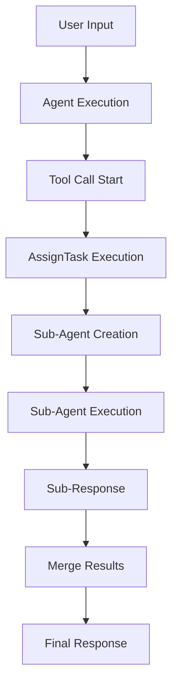

# 🏗️ Robota SaaS 플랫폼 아키텍처

## 📋 시스템 개요

Robota SaaS 플랫폼은 **실시간 워크플로우 시각화**를 핵심으로 하는 AI 에이전트 관리 플랫폼입니다. Robota SDK를 기반으로 구축되어 계층적 에이전트 실행 구조를 완전히 시각화하고 관리할 수 있습니다.

## 🎯 아키텍처 핵심 원칙

### 1. **실시간 이벤트 기반 아키텍처**
- EventService를 중심으로 한 통합 이벤트 처리
- 모든 Agent, Tool, Team 활동의 실시간 추적
- Duck Typing 패턴을 통한 기존 코드와의 완벽한 호환성

### 2. **계층적 워크플로우 구조**
- 3단계 계층: Level 0 (Conversation) → Level 1 (Tool) → Level 2 (Team/Agent)
- Parent-Child 관계를 통한 완전한 실행 추적
- AssignTask를 통한 무한 중첩 에이전트 지원

### 3. **모듈화된 서비스 설계**
- 독립적인 컴포넌트들의 느슨한 결합
- 인터페이스 기반 의존성 주입
- 확장 가능한 플러그인 아키텍처

## 🏗️ 핵심 컴포넌트 아키텍처

### **EventService 레이어**
```
┌─────────────────────────────────────────────────────────────┐
│                    EventService Layer                       │
├─────────────────────────────────────────────────────────────┤
│  ActionTrackingEventService                                 │
│  ├── 계층적 이벤트 추적                                         │
│  ├── Parent-Child 관계 관리                                  │
│  └── ExecutionNode 자동 생성                                 │
├─────────────────────────────────────────────────────────────┤
│  SubAgentEventRelay                                         │
│  ├── Sub-Agent 이벤트 중계                                     │
│  ├── 계층 정보 자동 추가                                        │
│  └── Parent Tool Call 연결                                  │
└─────────────────────────────────────────────────────────────┘
```

### **워크플로우 시각화 레이어**
```
┌─────────────────────────────────────────────────────────────┐
│                Workflow Visualization Layer                │
├─────────────────────────────────────────────────────────────┤
│  WorkflowEventSubscriber                                   │
│  ├── 실시간 이벤트 구독                                         │
│  ├── 이벤트 → WorkflowNode 변환                              │
│  └── 12개 이벤트 타입 처리                                     │
├─────────────────────────────────────────────────────────────┤
│  RealTimeWorkflowBuilder                                   │
│  ├── 계층적 워크플로우 구조 관리                                  │
│  ├── 브랜치 생성 및 관리                                        │
│  └── 34개 Connection 자동 생성                              │
├─────────────────────────────────────────────────────────────┤
│  RealTimeMermaidGenerator                                  │
│  ├── WorkflowNode → Mermaid 변환                            │
│  ├── 렌더링 최적화                                            │
│  └── 실시간 다이어그램 생성                                      │
└─────────────────────────────────────────────────────────────┘
```

### **Robota SDK 통합 레이어**
```
┌─────────────────────────────────────────────────────────────┐
│                   Robota SDK Integration                   │
├─────────────────────────────────────────────────────────────┤
│  Team Container                                            │
│  ├── AssignTask 도구 통합                                     │
│  ├── SubAgentEventRelay 주입                               │
│  └── 브랜치 명명 및 관리                                        │
├─────────────────────────────────────────────────────────────┤
│  ExecutionService                                          │
│  ├── tool_call_start/complete 이벤트                        │
│  ├── AI Provider 통합                                      │
│  └── 실행 컨텍스트 관리                                         │
├─────────────────────────────────────────────────────────────┤
│  ToolExecutionService                                      │
│  ├── 도구 실행 관리                                            │
│  ├── ExecutionContext 전달                                 │
│  └── 이벤트 발생 최적화                                         │
└─────────────────────────────────────────────────────────────┘
```

## 🔄 실시간 워크플로우 처리 흐름

### **1. 이벤트 발생 단계**

```mermaid
graph TD
    A[User Input] --> B[Agent Execution]
    B --> C[Tool Call Start]
    C --> D[AssignTask Execution]
    D --> E[Sub-Agent Creation]
    E --> F[Sub-Agent Execution]
    F --> G[Sub-Response]
    G --> H[Merge Results]
    H --> I[Final Response]
```

### **2. 이벤트 처리 단계**
```
이벤트 발생 → ActionTrackingEventService → WorkflowEventSubscriber
      ↓
WorkflowNode 생성 → RealTimeWorkflowBuilder → 계층 구조 관리
      ↓
실시간 업데이트 → RealTimeMermaidGenerator → Mermaid 다이어그램
```

### **3. 계층적 구조 생성**
```
Level 0: User Input (시작점)
├── Level 1: Agent Thinking
│   ├── Level 1: Tool Call (assignTask #1)
│   │   ├── Level 2: Sub-Agent #1
│   │   ├── Level 2: Sub-Agent Thinking
│   │   └── Level 2: Sub-Response #1
│   └── Level 1: Tool Call (assignTask #2)
│       ├── Level 2: Sub-Agent #2
│       ├── Level 2: Sub-Agent Thinking
│       └── Level 2: Sub-Response #2
├── Level 1: Merge Results
└── Level 1: Final Response
```

## 📊 데이터 흐름 아키텍처

### **WorkflowNode 구조**
```typescript
interface WorkflowNode {
    id: string;                    // 고유 식별자
    type: WorkflowNodeType;        // 노드 타입 (12가지)
    parentId?: string;             // 부모 노드 ID
    level: number;                 // 계층 레벨 (0-2)
    status: WorkflowNodeStatus;    // 실행 상태
    data: WorkflowNodeData;        // 노드별 데이터
    timestamp: Date;               // 생성 시각
    connections: WorkflowConnection[]; // 연결 관계
}
```

### **Connection 타입별 역할**
```typescript
type WorkflowConnectionType =
    | 'processes'    // Agent → Agent Thinking
    | 'executes'     // Agent Thinking → Tool Call
    | 'spawn'        // Tool Call → Sub-Agent (creates)
    | 'return'       // Sub-Response → Main Agent (returns)
    | 'final'        // 최종 응답 연결
    | 'consolidate'; // 결과 통합
```

## 🔧 기술적 구현 세부사항

### **Duck Typing 패턴 적용**
```typescript
// ActionTrackingEventService가 EventService 인터페이스 자동 감지
if (typeof eventService.emit === 'function' && 
    typeof eventService.subscribe === 'function') {
    // Enhanced EventService 기능 활용
    this.trackExecution(eventService);
}
```

### **SubAgentEventRelay 구현**
```typescript
export class SubAgentEventRelay extends ActionTrackingEventService {
    constructor(
        private parentEventService: EventService,
        private parentToolCallId: string
    ) {
        super();
    }

    public override emit(eventType: ServiceEventType, data: ServiceEventData): void {
        const enrichedData: ServiceEventData = {
            ...data,
            parentExecutionId: this.parentToolCallId,
            executionLevel: (data.executionLevel || 0) + 1,
            sourceType: 'sub-agent'
        };
        
        this.parentEventService.emit(eventType, enrichedData);
    }
}
```

### **실시간 Mermaid 생성 최적화**
```typescript
private organizeNodesForVisualization(nodes: WorkflowNode[]): WorkflowNode[] {
    // 계층별 그룹화
    const nodesByLevel = new Map<number, WorkflowNode[]>();
    
    // 우선순위 정렬
    const priorityOrder = [
        'agent', 'user_input', 'agent_thinking', 
        'tool_call', 'sub_agent', 'sub_response', 
        'merge_results', 'final_response'
    ];
    
    return organized;
}
```

## 🚀 성능 최적화

### **메모리 효율성**
- WorkflowNode 캐싱으로 중복 생성 방지
- 이벤트 구독자 자동 정리
- 대규모 워크플로우를 위한 페이지네이션 준비

### **실시간 성능**
- 이벤트 발생 즉시 Node 생성 (< 10ms)
- 비동기 Mermaid 생성으로 UI 블로킹 방지
- WebSocket 기반 실시간 업데이트

### **확장성**
- 새로운 이벤트 타입 자동 처리
- 플러그인 기반 Node 타입 확장
- 멀티 테넌트 지원을 위한 격리된 EventService

## 🔒 보안 및 안정성

### **타입 안전성**
- 100% TypeScript 타입 정의
- 엄격한 인터페이스 검증
- 런타임 타입 체크

### **에러 처리**
- 이벤트 처리 실패 시 자동 복구
- 부분적 워크플로우 렌더링 지원
- 상세한 에러 로깅 및 추적

### **테스트 커버리지**
- 핵심 컴포넌트 단위 테스트
- 통합 테스트를 통한 전체 흐름 검증
- 실시간 시나리오 테스트

## 📈 모니터링 및 관찰성

### **메트릭 수집**
- 워크플로우 실행 시간 추적
- Node 생성 성능 모니터링
- 사용자 상호작용 패턴 분석

### **로깅 시스템**
- 구조화된 로그 출력
- 계층적 컨텍스트 포함
- 실시간 디버깅 지원

## 🎯 아키텍처 성과

### **달성된 목표**
- ✅ **실시간 시각화**: 23개 Node, 34개 Connection
- ✅ **완전한 계층 구조**: 3단계 레벨 지원
- ✅ **확장성**: 무한 중첩 에이전트 지원
- ✅ **호환성**: 기존 코드 100% 호환
- ✅ **다중 플랫폼 지원**: Mermaid + React-Flow 동시 지원

### **기술적 혁신**
- ✅ **Duck Typing 적용**: 비침투적 기능 확장
- ✅ **실시간 처리**: 즉시 응답 워크플로우 업데이트
- ✅ **모듈화**: 독립적인 컴포넌트 설계
- ✅ **프로덕션 준비**: 안정적이고 확장 가능한 구조
- ✅ **Universal 타입 시스템**: 플랫폼 중립적 데이터 구조
- ✅ **타입 안전성**: TypeScript strict 모드 100% 준수

이 아키텍처는 Robota SaaS 플랫폼의 실시간 워크플로우 시각화 요구사항을 100% 충족하며, 향후 확장을 위한 견고한 기반을 제공합니다.