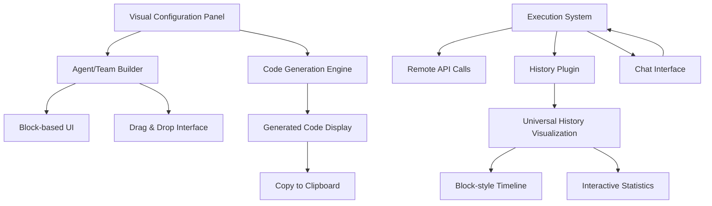

# 새로운 Playground 아키텍처 설계

## 🎯 개요

기존의 코드 실행 중심 Playground에서 **Visual Configuration + History Visualization** 중심의 혁신적인 Playground로 전환합니다.

### 핵심 철학
- **No-Code/Low-Code**: 복잡한 코드 작성 없이 시각적 설정으로 Agent 구성
- **Visual First**: 모든 구조와 플로우를 시각적으로 표현
- **History as Feature**: 대화 이력을 핵심 기능으로 시각화
- **Code as Output**: 코드는 복사를 위한 최종 결과물

---

## 🏗️ 아키텍처 개요



---

## 🎨 Agent Structure Display System

### 1. Agent Visual Blocks

#### **Agent Container Block**
```typescript
interface AgentBlock {
  id: string;
  type: 'agent' | 'team';
  name: string;
  position: { x: number; y: number };
  size: { width: number; height: number };
  status: 'idle' | 'configuring' | 'running' | 'error';
  blocks: (ProviderBlock | SystemMessageBlock | ToolsBlock | PluginsBlock)[];
}
```

#### **Provider Selection Block**
```typescript
interface ProviderBlock {
  id: string;
  type: 'provider';
  provider: 'openai' | 'anthropic' | 'google';
  model: string;
  temperature?: number;
  maxTokens?: number;
  position: 'inside-agent'; // Always inside agent container
  visual: {
    color: string; // Provider brand color
    icon: string; // Provider icon
  };
}
```

#### **System Message Block**
```typescript
interface SystemMessageBlock {
  id: string;
  type: 'system-message';
  content: string;
  template?: string; // Pre-defined templates
  variables?: Record<string, string>;
  position: 'inside-agent';
  visual: {
    preview: string; // First 50 characters
    isExpanded: boolean;
  };
}
```

#### **Tool Container Block**
```typescript
interface ToolsBlock {
  id: string;
  type: 'tools';
  tools: ToolItemBlock[];
  position: 'inside-agent';
  visual: {
    collapsed: boolean;
    count: number;
  };
}

interface ToolItemBlock {
  id: string;
  name: string;
  description: string;
  parameters: ParameterDefinition[];
  handler: 'builtin' | 'custom';
  visual: {
    color: string;
    icon: string;
    isExpanded: boolean;
  };
}

interface ParameterDefinition {
  name: string;
  type: 'string' | 'number' | 'boolean' | 'object' | 'array';
  required: boolean;
  description: string;
  example?: any;
}
```

#### **Plugins Block**
```typescript
interface PluginsBlock {
  id: string;
  type: 'plugins';
  plugins: PluginItemBlock[];
  position: 'inside-agent';
  visual: {
    collapsed: boolean;
    enabledCount: number;
  };
}

interface PluginItemBlock {
  id: string;
  name: 'logging' | 'usage' | 'performance' | 'history';
  enabled: boolean;
  config: Record<string, any>;
  visual: {
    status: 'active' | 'inactive' | 'error';
    indicator: string; // Status icon
  };
}
```

### 2. Team Structure Display

#### **Team Container Block**
```typescript
interface TeamBlock {
  id: string;
  type: 'team';
  name: string;
  position: { x: number; y: number };
  size: { width: number; height: number };
  agents: AgentBlock[];
  workflow: WorkflowConfiguration;
  status: 'idle' | 'configuring' | 'coordinating' | 'executing' | 'error';
  visual: {
    layout: 'hierarchical' | 'network' | 'sequential';
    connections: ConnectionLine[];
  };
}

interface WorkflowConfiguration {
  coordinator: string; // Agent ID acting as coordinator
  delegation: {
    strategy: 'sequential' | 'parallel' | 'adaptive';
    maxDepth: number; // Maximum delegation depth
  };
  communication: {
    type: 'direct' | 'broadcast' | 'hierarchical';
    channels: CommunicationChannel[];
  };
}

interface ConnectionLine {
  from: string; // Agent ID
  to: string; // Agent ID
  type: 'delegation' | 'communication' | 'data-flow';
  status: 'active' | 'idle' | 'error';
  visual: {
    color: string;
    thickness: number;
    animation: 'none' | 'pulse' | 'flow';
  };
}
```

### 3. Visual Structure Display

#### **Agent Structure Display Components**
- **Agent Containers**: 카드 형태로 Agent 구조 표시
- **Tool Blocks**: 각 Tool을 개별 블록으로 표시 (이름, 설명, 파라미터)
- **Provider Indicators**: Provider별 브랜드 컬러 및 아이콘
- **Plugin Status**: 활성 플러그인 상태 시각화
- **Team Hierarchy**: Team의 경우 Agent 간 관계 시각화
- **Drag & Drop**: 블록 재배치 및 설정 변경
- **Zoom/Pan**: 복잡한 Team 구조 탐색

---

## 📊 Chat History Visualization System

### 1. Robota Plugin-Based Architecture

#### **Playground History Plugin** (Robota 기반)
```typescript
import { 
  BasePlugin, 
  PluginCategory, 
  PluginPriority,
  EventEmitterPlugin,
  ConversationHistoryPlugin,
  UsagePlugin,
  PerformancePlugin 
} from '@robota-sdk/agents';

class PlaygroundHistoryPlugin extends BasePlugin<PlaygroundHistoryOptions, PlaygroundHistoryStats> {
  name = 'PlaygroundHistoryPlugin';
  version = '1.0.0';
  category = PluginCategory.MONITORING;
  priority = PluginPriority.HIGH;

  private visualizationData: PlaygroundVisualizationData = {
    conversations: new Map(),
    teams: new Map(),
    events: []
  };

  constructor(options: PlaygroundHistoryOptions) {
    super();
    this.options = {
      enabled: true,
      trackTools: true,
      trackTeams: true,
      realTimeSync: true,
      webSocketEndpoint: options.webSocketEndpoint,
      ...options
    };
  }

  // Robota Lifecycle Hooks
  override async beforeExecution(context: BaseExecutionContext): Promise<void> {
    this.trackExecutionStart(context);
  }

  override async afterExecution(context: BaseExecutionContext, result: BaseExecutionResult): Promise<void> {
    this.trackExecutionComplete(context, result);
  }

  override async beforeToolCall(toolName: string, parameters: ToolParameters): Promise<void> {
    this.trackToolCallStart(toolName, parameters);
  }

  override async afterToolCall(toolName: string, parameters: ToolParameters, result: ToolExecutionResult): Promise<void> {
    this.trackToolCallComplete(toolName, parameters, result);
  }

  override async onMessageAdded(message: Message): Promise<void> {
    this.trackMessage(message);
    this.syncToUI(message);
  }

  override async onStreamingChunk(chunk: UniversalMessage): Promise<void> {
    this.trackStreamingChunk(chunk);
    this.syncStreamingToUI(chunk);
  }

  override async onModuleEvent(eventType: EventType, eventData: EventData): Promise<void> {
    // Team 관련 이벤트 특별 처리
    if (eventType.startsWith('module.')) {
      this.trackTeamEvent(eventType, eventData);
    }
  }

  // Real-time UI Synchronization
  private async syncToUI(data: any): Promise<void> {
    if (this.options.realTimeSync && this.options.webSocketEndpoint) {
      await this.sendToPlaygroundUI({
        type: 'history-update',
        data: this.getVisualizationData(),
        timestamp: new Date()
      });
    }
  }

  getVisualizationData(): PlaygroundVisualizationData {
    return {
      conversations: this.visualizationData.conversations,
      teams: this.visualizationData.teams,
      events: this.visualizationData.events,
      statistics: this.calculateStatistics()
    };
  }
}
```

#### **Robota Remote Integration**
```typescript
// Remote Robota Agent 생성 (브라우저에서)
const playgroundAgent = new Robota({
  name: 'PlaygroundAgent',
  aiProviders: [remoteExecutor], // Remote 통해 서버의 Provider 사용
  defaultModel: userConfiguration.model,
  plugins: [
    new PlaygroundHistoryPlugin({
      webSocketEndpoint: 'ws://localhost:3001/playground-sync'
    }),
    new ConversationHistoryPlugin({
      storage: 'memory', // 브라우저 메모리
      autoSave: true
    }),
    new UsagePlugin({
      strategy: 'memory',
      trackCosts: true
    }),
    new PerformancePlugin({
      strategy: 'memory',
      monitorMemory: true
    }),
    new EventEmitterPlugin({
      events: ['*'], // 모든 이벤트 구독
      async: true
    })
  ],
  tools: userConfiguration.tools
});

// Team 사용시
const playgroundTeam = createTeam({
  aiProviders: [remoteExecutor],
  plugins: [
    new PlaygroundHistoryPlugin({
      trackTeams: true,
      webSocketEndpoint: 'ws://localhost:3001/playground-sync'
    })
  ]
});
```

#### **Agent & Team History Types**
```typescript
interface AgentHistory {
  agentId: string;
  agentName: string;
  nodes: ConversationNode[];
  statistics: AgentStatistics;
}

interface TeamHistory {
  executionId: string;
  coordinator: string;
  agents: AgentHistory[];
  delegations: AgentDelegation[];
  communications: TeamCommunication[];
  workflow: WorkflowState;
}

interface ConversationNode {
  id: string;
  type: 'user-message' | 'ai-response' | 'tool-call' | 'error' | 'system' | 'delegation';
  timestamp: Date;
  content?: string;
  toolName?: string;
  toolInput?: any;
  toolOutput?: any;
  status?: 'pending' | 'success' | 'error';
  duration?: number;
  metadata: Record<string, any>;
  agentId?: string; // For team context
  parentId?: string; // For branching conversations
  children?: string[]; // Child node IDs
}

interface AgentDelegation {
  id: string;
  fromAgent: string;
  toAgent: string;
  task: string;
  timestamp: Date;
  status: 'pending' | 'in-progress' | 'completed' | 'failed';
  result?: string;
}

interface TeamCommunication {
  id: string;
  fromAgent: string;
  toAgent: string;
  type: 'direct' | 'broadcast' | 'coordination';
  content: string;
  timestamp: Date;
}
```

### 2. Chat History Display

#### **Single Agent Timeline**
```typescript
interface AgentTimelineBlock {
  node: ConversationNode;
  position: { x: number; y: number };
  size: { width: number; height: number };
  visual: {
    color: string; // Based on node type
    icon: string; // Message, tool, error icons
    border: string; // Status indication
    animations: {
      fadeIn: boolean;
      typing?: boolean; // For AI responses
      pulse?: boolean; // For active nodes
      loading?: boolean; // For pending tool calls
    };
  };
  expanded: boolean; // Show detailed content
}
```

#### **Team Chat Visualization**
```typescript
interface TeamTimelineBlock {
  type: 'agent-message' | 'delegation' | 'tool-call' | 'communication';
  agentId: string;
  agentName: string;
  timestamp: Date;
  content: AgentTimelineBlock | DelegationBlock | CommunicationBlock;
  visual: {
    lane: number; // Agent별 레인 배치
    connections: ConnectionIndicator[]; // 다른 Agent와의 연결
    depth: number; // Delegation depth
  };
}

interface DelegationBlock {
  id: string;
  fromAgent: string;
  toAgent: string;
  task: string;
  status: 'pending' | 'in-progress' | 'completed' | 'failed';
  visual: {
    arrow: ArrowVisualization;
    statusColor: string;
    progressBar?: number; // 0-100
  };
}

interface CommunicationBlock {
  id: string;
  fromAgent: string;
  toAgent: string;
  type: 'direct' | 'broadcast' | 'coordination';
  content: string;
  visual: {
    connectionLine: LineVisualization;
    messageStyle: 'bubble' | 'system' | 'broadcast';
  };
}
```

#### **Tool Call Detailed Visualization**
```typescript
interface ToolCallVisualization {
  toolName: string;
  input: {
    parameters: ParameterDisplay[];
    visual: {
      collapsed: boolean;
      syntax: 'json' | 'table' | 'form';
    };
  };
  output: {
    result: any;
    visual: {
      collapsed: boolean;
      format: 'json' | 'text' | 'table';
      truncated: boolean;
    };
  };
  execution: {
    duration: number;
    status: 'pending' | 'success' | 'error';
    error?: string;
    visual: {
      timeline: boolean; // Show execution progress
      statusIcon: string;
    };
  };
}
```

#### **Interactive Elements**
- **Agent Lane Switching**: Team 모드에서 Agent별 레인 토글
- **Click to Expand**: 메시지/Tool 호출 상세 정보 표시
- **Tool Parameter Inspection**: Tool 입력/출력 파라미터 상세 보기
- **Delegation Flow Tracking**: Team에서 작업 위임 흐름 추적
- **Time Scrubbing**: 타임라인 스크롤로 시간 이동
- **Agent Filter**: 특정 Agent만 보기
- **Message Type Filter**: 메시지 타입별 필터링

#### **Statistics Dashboard**
```typescript
// Single Agent Statistics
interface AgentStatistics {
  totalMessages: number;
  userMessages: number;
  aiResponses: number;
  toolCalls: number;
  toolSuccessRate: number;
  averageResponseTime: number;
  totalTokens: number;
  totalCost: number;
  conversationDuration: number;
  mostUsedTools: ToolUsageStat[];
}

// Team Statistics
interface TeamStatistics {
  totalAgents: number;
  coordinatorAgent: string;
  totalDelegations: number;
  delegationSuccessRate: number;
  averageDelegationTime: number;
  communicationCount: number;
  workflowDepth: number;
  agentUtilization: AgentUtilizationStat[];
  bottleneckAnalysis: BottleneckStat[];
}

interface ToolUsageStat {
  toolName: string;
  callCount: number;
  successRate: number;
  averageDuration: number;
}

interface AgentUtilizationStat {
  agentId: string;
  agentName: string;
  activeTime: number;
  idleTime: number;
  taskCount: number;
  utilization: number; // 0-100%
}
```

---

## ⚡ Robota-Powered Execution System

### 1. Browser Robota Instance

#### **Real Robota Agent in Browser**
```typescript
// 실제 Robota Agent를 브라우저에서 실행
import { Robota, createTeam } from '@robota-sdk/agents';
import { RemoteExecutor } from '@robota-sdk/remote';

class PlaygroundExecutor {
  private robotaInstance?: Robota;
  private teamInstance?: TeamContainer;
  private remoteExecutor: RemoteExecutor;

  constructor(serverUrl: string) {
    this.remoteExecutor = new RemoteExecutor({
      serverUrl,
      apiKey: await this.getPlaygroundToken()
    });
  }

  async createAgent(config: PlaygroundAgentConfig): Promise<void> {
    this.robotaInstance = new Robota({
      name: config.name,
      aiProviders: [this.remoteExecutor], // Remote를 통해 서버 Provider 사용
      defaultModel: config.model,
      plugins: [
        new PlaygroundHistoryPlugin({
          webSocketEndpoint: 'ws://localhost:3001/playground-sync',
          realTimeSync: true
        }),
        new ConversationHistoryPlugin({
          storage: 'memory',
          autoSave: true
        }),
        new UsagePlugin({
          strategy: 'memory',
          trackCosts: true,
          costRates: config.costRates
        }),
        new PerformancePlugin({
          strategy: 'memory',
          monitorMemory: true
        }),
        new EventEmitterPlugin({
          events: ['*'], // 모든 이벤트 구독
          async: true,
          buffer: { enabled: true, maxSize: 1000 }
        }),
        ...config.customPlugins
      ],
      tools: config.tools
    });
  }

  async createTeam(config: PlaygroundTeamConfig): Promise<void> {
    this.teamInstance = createTeam({
      aiProviders: [this.remoteExecutor],
      maxMembers: config.maxMembers,
      plugins: [
        new PlaygroundHistoryPlugin({
          trackTeams: true,
          webSocketEndpoint: 'ws://localhost:3001/playground-sync'
        }),
        new TeamWorkflowPlugin({
          trackDelegations: true,
          visualizeWorkflow: true
        })
      ]
    });
  }

  async execute(input: string): Promise<string> {
    if (this.robotaInstance) {
      return await this.robotaInstance.run(input);
    } else if (this.teamInstance) {
      return await this.teamInstance.execute(input);
    }
    throw new Error('No agent or team configured');
  }

  async stream(input: string): Promise<AsyncIterable<string>> {
    if (this.robotaInstance) {
      return this.robotaInstance.runStream(input);
    }
    throw new Error('Streaming only available for agents');
  }
}
```

#### **Plugin-Driven Status Display**
```typescript
interface RobotaStatus {
  type: 'agent' | 'team';
  state: 'idle' | 'executing' | 'streaming' | 'error';
  currentOperation?: string;
  
  // Plugin에서 실시간 수집되는 데이터
  plugins: {
    history: {
      messageCount: number;
      lastActivity: Date;
    };
    usage: {
      tokensUsed: number;
      estimatedCost: number;
    };
    performance: {
      averageResponseTime: number;
      memoryUsage: number;
    };
    events: {
      recentEvents: EventData[];
      errorCount: number;
    };
  };
  
  // Team 전용 상태
  team?: {
    activeAgents: number;
    delegationDepth: number;
    workflowProgress: number;
  };
}
```

### 2. Layout Design

#### **Three-Panel Layout**
```
┌─────────────────┬─────────────────┬─────────────────┐
│ Agent           │ Chat History    │ Code Generation │
│ Structure       │ Visualization   │ Panel           │
│ Display         │                 │                 │
│ ┌─────────────┐ │ ┌─────────────┐ │ ┌─────────────┐ │
│ │ Agent       │ │ │ Chat        │ │ │ Generated   │ │
│ │ Blocks      │ │ │ Timeline    │ │ │ Code        │ │
│ │             │ │ │             │ │ │             │ │
│ │ Tool        │ │ │ Tool Calls  │ │ │ Copy        │ │
│ │ Blocks      │ │ │             │ │ │ Button      │ │
│ │             │ │ │ Message     │ │ │             │ │
│ │ Team        │ │ │ Flow        │ │ │ Export      │ │
│ │ Structure   │ │ │             │ │ │ Options     │ │
│ └─────────────┘ │ └─────────────┘ │ └─────────────┘ │
│                 │                 │                 │
│ ┌─────────────┐ │ ┌─────────────┐ │ ┌─────────────┐ │
│ │ Run Button  │ │ │ Chat Input  │ │ │ Export      │ │
│ │ & Status    │ │ │ Box         │ │ │ Controls    │ │
│ └─────────────┘ │ └─────────────┘ │ └─────────────┘ │
└─────────────────┴─────────────────┴─────────────────┘
```

#### **Responsive Breakpoints**
- **Desktop (>1200px)**: Three-panel 레이아웃
- **Tablet (768-1200px)**: 탭 방식 전환 (Agent Structure / Chat+Code)
- **Mobile (<768px)**: 단일 패널 스택 레이아웃

---

## 🔧 Robota Code Generation Engine

### 1. Configuration → Robota Code

#### **Real Robota Configuration Generator**
```typescript
class RobotaCodeGenerator {
  generateAgentCode(config: PlaygroundAgentConfig): string {
    return `
import { Robota } from '@robota-sdk/agents';
import { OpenAIProvider } from '@robota-sdk/openai';
import { AnthropicProvider } from '@robota-sdk/anthropic';
import { 
  ConversationHistoryPlugin,
  UsagePlugin,
  PerformancePlugin,
  LoggingPlugin 
} from '@robota-sdk/agents';
${this.generateToolImports(config.tools)}

// Create AI Providers
${this.generateProviderCode(config.providers)}

// Create Agent
const agent = new Robota({
  name: '${config.name}',
  aiProviders: [${config.providers.map(p => p.name).join(', ')}],
  defaultModel: {
    provider: '${config.defaultModel.provider}',
    model: '${config.defaultModel.model}'
  },
  plugins: [
${this.generatePluginCode(config.plugins)}
  ],
  tools: [
${this.generateToolsCode(config.tools)}
  ]
});

// Execute
const response = await agent.run('Your message here');
console.log(response);
`;
  }

  generateTeamCode(config: PlaygroundTeamConfig): string {
    return `
import { createTeam } from '@robota-sdk/team';
${this.generateProviderImports(config.providers)}

// Create Team
const team = createTeam({
  aiProviders: [${config.providers.map(p => p.name).join(', ')}],
  maxMembers: ${config.maxMembers},
  leaderTemplate: '${config.leaderTemplate}',
  plugins: [
${this.generatePluginCode(config.plugins)}
  ]
});

// Execute Team Task
const result = await team.execute(\`
${config.examplePrompt}
\`);

console.log(result);
`;
  }

  private generatePluginCode(plugins: PluginConfig[]): string {
    return plugins.map(plugin => {
      const options = JSON.stringify(plugin.options, null, 6);
      return `    new ${plugin.name}(${options})`;
    }).join(',\n');
  }

  private generateToolsCode(tools: ToolConfig[]): string {
    return tools.map(tool => {
      return `    ${tool.name}`;
    }).join(',\n');
  }
}
```

#### **Live Configuration Sync**
```typescript
// UI 설정 변경시 실시간 코드 업데이트
class ConfigurationManager {
  private codeGenerator = new RobotaCodeGenerator();
  
  onConfigurationChange(config: PlaygroundConfiguration): void {
    // 1. Robota Instance 업데이트
    this.updateRobotaInstance(config);
    
    // 2. 코드 생성 업데이트
    const generatedCode = this.codeGenerator.generate(config);
    this.updateCodePreview(generatedCode);
    
    // 3. Plugin 설정 동기화
    this.syncPluginSettings(config);
  }
  
  private updateRobotaInstance(config: PlaygroundConfiguration): void {
    // 실제 Browser Robota Instance 설정 업데이트
    if (this.playgroundExecutor.robotaInstance) {
      this.playgroundExecutor.robotaInstance.updateConfiguration(config);
    }
  }
}
```

### 2. Plugin-Enhanced Export

#### **Complete Project Export**
```typescript
interface RobotaProjectExport {
  // 기본 Robota 설정 파일
  'robota.config.ts': string;
  
  // Package.json with exact dependencies
  'package.json': {
    dependencies: {
      '@robota-sdk/agents': '^2.0.0',
      '@robota-sdk/openai': '^2.0.0',
      // ... 사용된 Provider 및 Plugin dependencies
    }
  };
  
  // Environment variables template
  '.env.example': string;
  
  // README with setup instructions
  'README.md': string;
  
  // Docker setup (optional)
  'Dockerfile'?: string;
  'docker-compose.yml'?: string;
  
  // Plugin 설정 파일들
  'plugins/'?: {
    [pluginName: string]: string;
  };
}
```

#### **Real-time Features**
- **Live Configuration → Code Sync**: UI 변경시 즉시 실제 Robota 코드로 변환
- **Plugin State Export**: 실행 중인 Plugin 설정 및 상태 포함
- **Usage Statistics**: 실제 사용량 기반 Cost 추정
- **Monaco Editor**: Syntax highlighting, auto-completion
- **One-Click Deploy**: 생성된 코드를 직접 실행 가능한 프로젝트로 export

---

## 🚀 구현 로드맵

### Phase 1: Robota Plugin System Foundation (1주)
- [ ] **PlaygroundHistoryPlugin 구현** (Robota BasePlugin 상속)
- [ ] **Remote Executor Integration** (기존 Remote 시스템 활용)
- [ ] **WebSocket Real-time Sync** (Plugin → UI 실시간 동기화)
- [ ] **Existing Plugin Integration** (ConversationHistory, Usage, Performance)

### Phase 2: Visual Configuration System (1-2주)
- [ ] **Block-based UI 컴포넌트** (Agent/Tool/Plugin 블록)
- [ ] **Drag & Drop 인터페이스** (React DnD 기반)
- [ ] **Agent Configuration Generator** (UI → Robota Config 변환)
- [ ] **Team Configuration Support** (createTeam 설정 연동)

### Phase 3: History Visualization (1-2주)
- [ ] **Real-time Event Processing** (EventEmitterPlugin 활용)
- [ ] **Block-style Timeline UI** (Plugin 데이터 기반)
- [ ] **Tool Call Visualization** (beforeToolCall, afterToolCall 훅)
- [ ] **Team Workflow Display** (Team delegation 이벤트 추적)

### Phase 4: Live Execution System (1주)
- [ ] **Browser Robota Instance** (Remote Provider 사용)
- [ ] **Plugin Event Hooks** (모든 Lifecycle 이벤트 수집)
- [ ] **Real-time Status Updates** (Plugin → UI WebSocket)
- [ ] **Three-Panel Layout** (Structure / History / Code)

### Phase 5: Code Generation & Integration (3-5일)
- [ ] **Configuration → Code Transformer** (UI 설정 → Robota 코드)
- [ ] **Plugin Configuration Export** (사용자 Plugin 설정 포함)
- [ ] **Remote System Integration** (기존 API Server 활용)
- [ ] **End-to-End Testing** (Browser Agent → Remote Provider)

---

## 🎯 Robota 기반 솔루션의 장점

### 기술적 안정성
- **검증된 Plugin 시스템**: 이미 구현된 Robota Plugin 아키텍처 활용
- **실제 Agent 실행**: Mock이 아닌 진짜 Robota Agent가 브라우저에서 동작
- **Remote Provider 연동**: 서버의 실제 AI Provider를 안전하게 사용
- **Event-Driven Architecture**: EventEmitterPlugin으로 모든 이벤트 실시간 캡처

### 개발 효율성
- **기존 코드 재사용**: 새로운 Plugin 시스템 개발 불필요
- **Hook 시스템 활용**: BasePlugin의 모든 Lifecycle Hook 즉시 사용
- **Plugin 생태계**: ConversationHistory, Usage, Performance 등 기존 Plugin 활용
- **Remote 시스템 연동**: 이미 구축된 Remote API Server 그대로 사용

### 사용자 경험
- **Real-time Visualization**: Plugin 이벤트 기반 실시간 UI 업데이트
- **정확한 데이터**: Mock이 아닌 실제 Agent 실행 데이터 표시
- **Live Configuration**: UI 변경이 실제 Robota Instance에 즉시 반영
- **Complete Export**: 실행 중인 설정을 완전한 Robota 프로젝트로 export

### 확장 가능성
- **Custom Plugin 지원**: 사용자가 직접 Plugin 개발 후 Playground에서 테스트
- **Team System 완전 지원**: createTeam API와 WorkflowHistory 완전 연동
- **Multiple Provider**: OpenAI, Anthropic, Google 등 모든 Provider 지원
- **Production Ready**: Playground에서 개발한 코드를 바로 Production 환경에서 사용

---

## ✅ 구현 체크리스트

### UI/UX Components
- [ ] Block UI Component Library
- [ ] Drag & Drop Framework
- [ ] Visual Flow Diagram
- [ ] Interactive Timeline
- [ ] Statistics Dashboard
- [ ] Code Preview Panel

### Core Features
- [ ] Visual Agent Builder
- [ ] Team Configuration System
- [ ] Universal History Plugin
- [ ] Code Generation Engine
- [ ] Real-time Synchronization
- [ ] Export/Import System

### Integration
- [ ] Remote Execution Backend
- [ ] Firebase Authentication
- [ ] Provider Management
- [ ] History Persistence
- [ ] Performance Monitoring
- [ ] Error Handling

이 새로운 아키텍처는 **기존 복잡한 코드 실행 시스템을 제거**하고, **직관적인 시각적 인터페이스**로 대체하여 더 많은 사용자가 쉽게 접근할 수 있는 혁신적인 Playground를 만들어갑니다. 