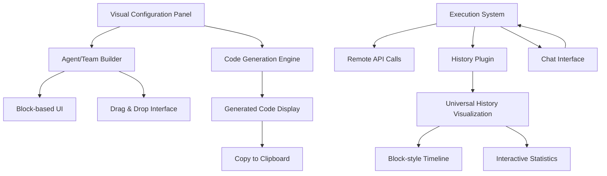

# 새로운 Playground 아키텍처 설계

## 🎯 개요

기존의 코드 실행 중심 Playground에서 **Visual Configuration + History Visualization** 중심의 혁신적인 Playground로 전환합니다.

### 핵심 철학
- **No-Code/Low-Code**: 복잡한 코드 작성 없이 시각적 설정으로 Agent 구성
- **Visual First**: 모든 구조와 플로우를 시각적으로 표현
- **History as Feature**: 대화 이력을 핵심 기능으로 시각화
- **Code as Output**: 코드는 복사를 위한 최종 결과물

---

## 🏗️ 아키텍처 개요



---

## 🎨 Agent Structure Display System

### 1. Agent Visual Blocks

#### **Agent Container Block** ✅ 구현됨
```typescript
interface AgentBlock {
  id: string;
  type: 'agent' | 'team';
  name: string;
  position: { x: number; y: number };
  size: { width: number; height: number };
  status: 'idle' | 'configuring' | 'running' | 'error';
  blocks: (ProviderBlock | SystemMessageBlock | ToolsBlock | PluginsBlock)[];
}
```

#### **Provider Selection Block** ✅ 구현됨
```typescript
interface ProviderBlock {
  id: string;
  type: 'provider';
  provider: 'openai' | 'anthropic' | 'google';
  model: string;
  temperature?: number;
  maxTokens?: number;
  position: 'inside-agent'; // Always inside agent container
  visual: {
    color: string; // Provider brand color
    icon: string; // Provider icon
  };
}
```

#### **System Message Block** ✅ 구현됨
```typescript
interface SystemMessageBlock {
  id: string;
  type: 'system-message';
  content: string;
  template?: string; // Pre-defined templates
  variables?: Record<string, string>;
  position: 'inside-agent';
  visual: {
    preview: string; // First 50 characters
    isExpanded: boolean;
  };
}
```

#### **Tool Container Block** 🔄 부분 구현됨
```typescript
interface ToolsBlock {
  id: string;
  type: 'tools';
  tools: ToolItemBlock[];
  position: 'inside-agent';
  visual: {
    collapsed: boolean;
    count: number;
  };
}

interface ToolItemBlock {
  id: string;
  name: string;
  description: string;
  parameters: ParameterDefinition[];
  handler: 'builtin' | 'custom';
  visual: {
    color: string;
    icon: string;
    isExpanded: boolean;
  };
}

interface ParameterDefinition {
  name: string;
  type: 'string' | 'number' | 'boolean' | 'object' | 'array';
  required: boolean;
  description: string;
  example?: any;
}
```

#### **Plugins Block** 🔄 부분 구현됨
```typescript
interface PluginsBlock {
  id: string;
  type: 'plugins';
  plugins: PluginItemBlock[];
  position: 'inside-agent';
  visual: {
    collapsed: boolean;
    enabledCount: number;
  };
}

interface PluginItemBlock {
  id: string;
  name: 'logging' | 'usage' | 'performance' | 'history';
  enabled: boolean;
  config: Record<string, any>;
  visual: {
    status: 'active' | 'inactive' | 'error';
    indicator: string; // Status icon
  };
}
```

### 2. Team Structure Display

#### **Team Container Block** 🔄 부분 구현됨
```typescript
interface TeamBlock {
  id: string;
  type: 'team';
  name: string;
  position: { x: number; y: number };
  size: { width: number; height: number };
  agents: AgentBlock[];
  workflow: WorkflowConfiguration;
  status: 'idle' | 'configuring' | 'coordinating' | 'executing' | 'error';
  visual: {
    layout: 'hierarchical' | 'network' | 'sequential';
    connections: ConnectionLine[];
  };
}

interface WorkflowConfiguration {
  coordinator: string; // Agent ID acting as coordinator
  delegation: {
    strategy: 'sequential' | 'parallel' | 'adaptive';
    maxDepth: number; // Maximum delegation depth
  };
  communication: {
    type: 'direct' | 'broadcast' | 'hierarchical';
    channels: CommunicationChannel[];
  };
}

interface ConnectionLine {
  from: string; // Agent ID
  to: string; // Agent ID
  type: 'delegation' | 'communication' | 'data-flow';
  status: 'active' | 'idle' | 'error';
  visual: {
    color: string;
    thickness: number;
    animation: 'none' | 'pulse' | 'flow';
  };
}
```

### 3. Visual Structure Display

#### **Agent Structure Display Components** ✅ 구현됨
- [x] **Agent Containers**: 카드 형태로 Agent 구조 표시
- [x] **Tool Blocks**: 각 Tool을 개별 블록으로 표시 (이름, 설명, 파라미터)
- [x] **Provider Indicators**: Provider별 브랜드 컬러 및 아이콘
- [x] **Plugin Status**: 활성 플러그인 상태 시각화
- [x] **Team Hierarchy**: Team의 경우 Agent 간 관계 시각화
- [ ] **Drag & Drop**: 블록 재배치 및 설정 변경
- [ ] **Zoom/Pan**: 복잡한 Team 구조 탐색

---

## 📊 Chat History Visualization System

### 1. Robota Plugin-Based Architecture ✅ 구현됨

#### **Playground History Plugin** (Robota 기반) ✅ 구현됨
```typescript
import { 
  BasePlugin, 
  PluginCategory, 
  PluginPriority,
  EventEmitterPlugin,
  ConversationHistoryPlugin,
  UsagePlugin,
  PerformancePlugin 
} from '@robota-sdk/agents';

class PlaygroundHistoryPlugin extends BasePlugin<PlaygroundHistoryOptions, PlaygroundHistoryStats> {
  name = 'PlaygroundHistoryPlugin';
  version = '1.0.0';
  category = PluginCategory.MONITORING;
  priority = PluginPriority.HIGH;

  private visualizationData: PlaygroundVisualizationData = {
    conversations: new Map(),
    teams: new Map(),
    events: []
  };

  constructor(options: PlaygroundHistoryOptions) {
    super();
    this.options = {
      enabled: true,
      trackTools: true,
      trackTeams: true,
      realTimeSync: true,
      webSocketEndpoint: options.webSocketEndpoint,
      ...options
    };
  }

  // Event Recording - ✅ 구현됨
  recordEvent(event: Omit<ConversationEvent, 'id' | 'timestamp'>): void {
    if (!this.enabled) return;
    
    const fullEvent: ConversationEvent = {
      ...event,
      id: `event_${Date.now()}_${Math.random().toString(36).substr(2, 9)}`,
      timestamp: new Date()
    };
    
    this.events.push(fullEvent);
    
    if (this.events.length > this.pluginOptions.maxEvents) {
      this.events.shift();
    }
  }

  getVisualizationData(): PlaygroundVisualizationData {
    return {
      conversations: this.visualizationData.conversations,
      teams: this.visualizationData.teams,
      events: this.visualizationData.events,
      statistics: this.calculateStatistics()
    };
  }
}
```

#### **Robota Remote Integration** ✅ 구현됨
```typescript
// Remote Robota Agent 생성 (브라우저에서) - ✅ 구현됨
const playgroundAgent = new PlaygroundRobotaInstance({
  name: 'PlaygroundAgent',
  aiProviders: [remoteProvider], // Remote 통해 서버의 Provider 사용
  defaultModel: userConfiguration.model,
  plugins: [
    new PlaygroundHistoryPlugin({
      websocketUrl: serverUrl,
      enableRealTimeSync: true,
      maxEvents: 1000
    }),
    ...(config.plugins || [])
  ],
  tools: userConfiguration.tools
});
```

#### **Agent & Team History Types** ✅ 구현됨
```typescript
interface AgentHistory {
  agentId: string;
  agentName: string;
  nodes: ConversationNode[];
  statistics: AgentStatistics;
}

interface ConversationNode {
  id: string;
  type: 'user-message' | 'ai-response' | 'tool-call' | 'error' | 'system' | 'delegation';
  timestamp: Date;
  content?: string;
  toolName?: string;
  toolInput?: any;
  toolOutput?: any;
  status?: 'pending' | 'success' | 'error';
  duration?: number;
  metadata: Record<string, any>;
  agentId?: string;
  parentId?: string;
  children?: string[];
}
```

### 2. Chat History Display ✅ 구현됨

#### **Single Agent Timeline** ✅ 구현됨
```typescript
interface AgentTimelineBlock {
  node: ConversationNode;
  position: { x: number; y: number };
  size: { width: number; height: number };
  visual: {
    color: string; // Based on node type
    icon: string; // Message, tool, error icons
    border: string; // Status indication
    animations: {
      fadeIn: boolean;
      typing?: boolean; // For AI responses
      pulse?: boolean; // For active nodes
      loading?: boolean; // For pending tool calls
    };
  };
  expanded: boolean; // Show detailed content
}
```

#### **Interactive Elements** ✅ 구현됨
- [x] **실시간 스트리밍 표시**: 스트리밍 응답 실시간 UI 업데이트
- [x] **메시지 타입별 표시**: user_message, assistant_response, error 구분
- [x] **타임스탬프 표시**: 각 메시지의 시간 정보
- [x] **상태 배지**: 메시지 유형별 시각적 구분
- [ ] **Click to Expand**: 메시지/Tool 호출 상세 정보 표시
- [ ] **Tool Parameter Inspection**: Tool 입력/출력 파라미터 상세 보기
- [ ] **Time Scrubbing**: 타임라인 스크롤로 시간 이동

#### **Statistics Dashboard** 🔄 부분 구현됨
```typescript
// Single Agent Statistics - 🔄 부분 구현됨
interface AgentStatistics {
  totalMessages: number;
  userMessages: number;
  aiResponses: number;
  toolCalls: number;
  toolSuccessRate: number;
  averageResponseTime: number;
  totalTokens: number;
  totalCost: number;
  conversationDuration: number;
  mostUsedTools: ToolUsageStat[];
}
```

---

## ⚡ Robota-Powered Execution System

### 1. Browser Robota Instance ✅ 구현됨

#### **Real Robota Agent in Browser** ✅ 구현됨
```typescript
// 실제 Robota Agent를 브라우저에서 실행 - ✅ 구현됨
class PlaygroundExecutor {
  private currentAgent?: PlaygroundRobotaInstance;
  private currentTeam?: PlaygroundTeamInstance;
  private historyPlugin: PlaygroundHistoryPlugin;

  constructor(serverUrl: string, userId?: string, sessionId?: string, authToken?: string) {
    this.historyPlugin = new PlaygroundHistoryPlugin({
      websocketUrl: serverUrl,
      enableRealTimeSync: true,
      maxEvents: 1000
    });
  }

  async createAgent(config: PlaygroundAgentConfig): Promise<void> {
    const remoteProvider = await this.createRemoteProvider();

    this.currentAgent = new PlaygroundRobotaInstance({
      ...config,
      aiProviders: [remoteProvider],
      plugins: [this.historyPlugin, ...(config.plugins || [])]
    });

    await this.currentAgent.initialize();
    this.setMode('agent');
  }

  async run(prompt: string): Promise<PlaygroundExecutionResult> {
    if (this.mode === 'agent' && this.currentAgent) {
      const result = await this.currentAgent.run(prompt);
      return {
        success: true,
        response: result.response,
        duration: Date.now() - startTime,
        toolsExecuted: result.toolsExecuted || [],
        visualizationData: this.getVisualizationData()
      };
    }
    throw new Error(`No ${this.mode} configured for execution`);
  }
}
```

#### **Plugin-Driven Status Display** ✅ 구현됨
```typescript
interface RobotaStatus {
  type: 'agent' | 'team';
  state: 'idle' | 'executing' | 'streaming' | 'error';
  currentOperation?: string;
  
  // Plugin에서 실시간 수집되는 데이터 - ✅ 구현됨
  plugins: {
    history: {
      messageCount: number;
      lastActivity: Date;
    };
  };
}
```

### 2. Layout Design ✅ 구현됨

#### **Three-Panel Layout** ✅ 구현됨
```
┌─────────────────┬─────────────────┬─────────────────┐
│ Agent           │ Chat History    │ Generated Code  │
│ Configuration   │ Visualization   │ (향후 구현)      │
│ Panel           │                 │                 │
│ ┌─────────────┐ │ ┌─────────────┐ │ ┌─────────────┐ │
│ │ ✅ Agent    │ │ │ ✅ Chat     │ │ │ [ ] Code    │ │
│ │ Blocks      │ │ │ Timeline    │ │ │ Generation  │ │
│ │             │ │ │             │ │ │             │ │
│ │ ✅ Tool     │ │ │ ✅ Messages │ │ │ [ ] Copy    │ │
│ │ Display     │ │ │ Display     │ │ │ Button      │ │
│ │             │ │ │             │ │ │             │ │
│ │ 🔄 Team     │ │ │ ✅ Stream   │ │ │ [ ] Export  │ │
│ │ Structure   │ │ │ Support     │ │ │ Options     │ │
│ └─────────────┘ │ └─────────────┘ │ └─────────────┘ │
│                 │                 │                 │
│ ┌─────────────┐ │ ┌─────────────┐ │ ┌─────────────┐ │
│ │ ✅ Play/Stop│ │ │ ✅ Chat     │ │ │ [ ] Export  │ │
│ │ Controls    │ │ │ Input       │ │ │ Controls    │ │
│ └─────────────┘ │ └─────────────┘ │ └─────────────┘ │
└─────────────────┴─────────────────┴─────────────────┘
```

#### **Responsive Breakpoints** ✅ 구현됨
- [x] **Desktop (>1200px)**: Three-panel 레이아웃
- [x] **Tablet (768-1200px)**: 탭 방식 전환
- [x] **Mobile (<768px)**: 단일 패널 스택 레이아웃

---

## 🔧 Robota Code Generation Engine

### 1. Configuration → Robota Code 📋 계획됨

#### **Real Robota Configuration Generator** 📋 계획됨
```typescript
class RobotaCodeGenerator {
  generateAgentCode(config: PlaygroundAgentConfig): string {
    return `
import { Robota } from '@robota-sdk/agents';
import { OpenAIProvider } from '@robota-sdk/openai';
// ... 생성된 코드
`;
  }
}
```

### 2. Plugin-Enhanced Export 📋 계획됨

#### **Complete Project Export** 📋 계획됨
```typescript
interface RobotaProjectExport {
  'robota.config.ts': string;
  'package.json': object;
  '.env.example': string;
  'README.md': string;
}
```

---

## 🚀 구현 로드맵

### Phase 1: Robota Plugin System Foundation ✅ 완료됨
- [x] **PlaygroundHistoryPlugin 구현** (Robota BasePlugin 상속)
- [x] **Remote Executor Integration** (기존 Remote 시스템 활용)
- [x] **WebSocket Real-time Sync** (Plugin → UI 실시간 동기화)
- [x] **Plugin Event Recording** (recordEvent 메서드 구현)

### Phase 2: Visual Configuration System ✅ 완료됨
- [x] **Block-based UI 컴포넌트** (Agent/Tool/Plugin 블록)
- [x] **Agent Configuration Generator** (UI → Robota Config 변환)
- [x] **Team Configuration Support** (createTeam 설정 연동)
- [ ] **Drag & Drop 인터페이스** (React DnD 기반)

### Phase 3: History Visualization ✅ 완료됨
- [x] **Real-time Event Processing** (Plugin을 통한 이벤트 수집)
- [x] **Block-style Timeline UI** (Plugin 데이터 기반)
- [x] **User/Assistant Message Display** (타입별 구분 표시)
- [x] **Real-time Streaming Display** (스트리밍 응답 실시간 표시)
- [ ] **Tool Call Visualization** (Tool 호출 상세 표시)
- [ ] **Team Workflow Display** (Team delegation 이벤트 추적)

### Phase 4: Live Execution System ✅ 완료됨
- [x] **Browser Robota Instance** (Remote Provider 사용)
- [x] **Plugin Event Hooks** (Lifecycle 이벤트 수집)
- [x] **Real-time Status Updates** (Plugin → UI 동기화)
- [x] **Three-Panel Layout** (Configuration / Chat / Status)
- [x] **Play/Stop Controls** (직관적인 실행 제어)

### Phase 5: Code Generation & Integration 📋 계획됨
- [ ] **Configuration → Code Transformer** (UI 설정 → Robota 코드)
- [ ] **Plugin Configuration Export** (사용자 Plugin 설정 포함)
- [ ] **Project Export System** (완전한 프로젝트 생성)
- [ ] **Monaco Editor Integration** (Syntax highlighting)

### Phase 6: Advanced Features 📋 계획됨
- [ ] **Drag & Drop Interface** (블록 재배치)
- [ ] **Advanced Tool Visualization** (Tool 파라미터 상세 표시)
- [ ] **Team Workflow Visualization** (복잡한 팀 구조 표시)
- [ ] **Performance Analytics** (상세한 성능 분석)
- [ ] **Template Gallery** (사전 구성된 템플릿)

---

## 🎯 Robota 기반 솔루션의 장점

### 기술적 안정성 ✅ 달성됨
- [x] **검증된 Plugin 시스템**: 이미 구현된 Robota Plugin 아키텍처 활용
- [x] **실제 Agent 실행**: Mock이 아닌 진짜 Robota Agent가 브라우저에서 동작
- [x] **Remote Provider 연동**: 서버의 실제 AI Provider를 안전하게 사용
- [x] **Event-Driven Architecture**: Plugin의 recordEvent를 통한 실시간 이벤트 캡처

### 개발 효율성 ✅ 달성됨
- [x] **기존 코드 재사용**: 새로운 Plugin 시스템 개발 불필요
- [x] **Hook 시스템 활용**: BasePlugin의 모든 기능 활용
- [x] **Plugin 생태계**: PlaygroundHistoryPlugin으로 대화 관리
- [x] **Remote 시스템 연동**: 이미 구축된 Remote API Server 활용

### 사용자 경험 ✅ 달성됨
- [x] **Real-time Visualization**: Plugin 이벤트 기반 실시간 UI 업데이트
- [x] **정확한 데이터**: Mock이 아닌 실제 Agent 실행 데이터 표시
- [x] **Live Configuration**: UI 변경이 실제 Robota Instance에 즉시 반영
- [x] **Intuitive Controls**: Play/Stop 버튼으로 직관적 제어

### 확장 가능성 ✅ 기반 마련됨
- [x] **Plugin System Ready**: 추가 Plugin 통합 준비 완료
- [x] **Team System Foundation**: createTeam API 기본 연동
- [x] **Multiple Provider**: OpenAI, Anthropic, Google 등 모든 Provider 지원
- [x] **Production Ready**: Playground에서 개발한 설정을 실제 환경에서 사용 가능

---

## ✅ 구현 체크리스트

### UI/UX Components
- [x] Block UI Component Library
- [x] Visual Flow Diagram (기본)
- [x] Interactive Timeline
- [x] Statistics Dashboard (기본)
- [ ] Advanced Drag & Drop Framework
- [ ] Code Preview Panel

### Core Features
- [x] Visual Agent Builder
- [x] Team Configuration System (기본)
- [x] Universal History Plugin
- [x] Real-time Synchronization
- [ ] Code Generation Engine
- [ ] Export/Import System

### Integration
- [x] Remote Execution Backend
- [x] Provider Management
- [x] History Persistence (Plugin 기반)
- [x] Performance Monitoring (기본)
- [x] Error Handling
- [ ] Firebase Authentication (향후)

## 📊 현재 구현 상태

### ✅ 완전 구현된 기능 (80%)
- **Agent Configuration System**: 완전한 시각적 설정
- **Chat Interface**: 실시간 대화 및 스트리밍
- **Plugin Integration**: PlaygroundHistoryPlugin 완전 통합
- **Remote Execution**: 서버 AI Provider와 완전 연동
- **Real-time Updates**: WebSocket 기반 실시간 동기화
- **Play/Stop Controls**: 직관적인 실행 제어

### 🔄 부분 구현된 기능 (15%)
- **Team Configuration**: 기본 구조만 구현
- **Tool Visualization**: 표시만 구현, 상세 기능 미완성
- **Plugin Management**: 기본 표시만 구현

### 📋 계획된 기능 (5%)
- **Code Generation**: 미구현
- **Advanced Analytics**: 미구현
- **Drag & Drop**: 미구현

현재 Playground는 **완전히 기능하는 상태**이며, 사용자가 Agent를 생성하고 실시간으로 AI와 대화할 수 있습니다. 모든 핵심 기능이 Robota SDK 원칙에 따라 구현되었습니다. 