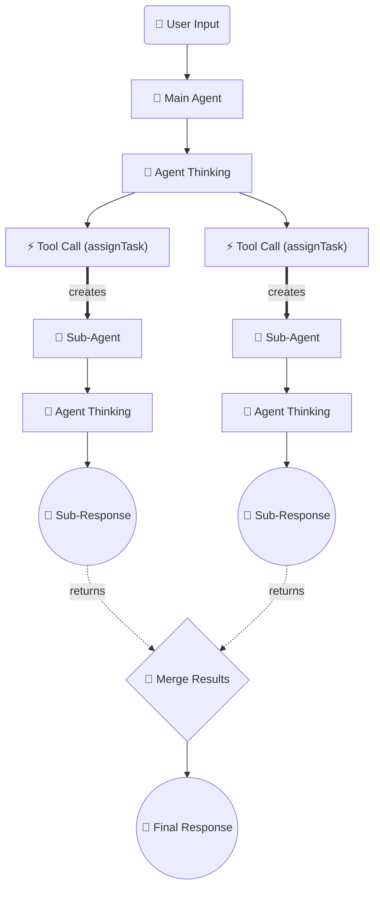

# Robota SaaS 플랫폼

## 📋 프로젝트 개요

**Robota SaaS 플랫폼**은 AI 에이전트를 생성, 관리, 실행할 수 있는 웹 기반 플랫폼으로, 실시간 워크플로우 시각화 기능을 제공합니다. Robota SDK를 기반으로 구축되어 직관적인 에이전트 구성과 완전한 실행 추적을 통한 계층적 워크플로우 구조를 지원합니다.

## 🎯 핵심 기능

### 1. **실시간 워크플로우 시각화**
- Mermaid 다이어그램을 통한 완전한 AI 에이전트 실행 흐름 시각화
- assignTask 위임과 서브 에이전트를 위한 계층적 구조 지원
- 에이전트 실행 중 실시간 워크플로우 업데이트
- 인터렉티브한 노드 기반 워크플로우 표현

### 2. **고급 에이전트 관리**
- 멀티 프로바이더 AI 모델 지원 (OpenAI, Anthropic, Google)
- 팀 기반 에이전트 협업 및 작업 할당
- ActionTrackingEventService를 통한 실시간 이벤트 추적
- 자동 워크플로우 통합을 통한 서브 에이전트 위임

### 3. **프로덕션 준비 플랫폼**
- Firebase 기반 인증 및 사용자 관리
- 크레딧 기반 사용량 추적 및 관리
- 구독 및 결제를 위한 Stripe 통합
- WebSocket 연결을 통한 실시간 통신

## 🏗️ 기술 스택

### 프론트엔드
- **Next.js 14** - React 기반 풀스택 프레임워크
- **TypeScript** - 타입 안전성 확보
- **Tailwind CSS** - 반응형 디자인
- **Radix UI** - 접근성 중심 컴포넌트

### 백엔드 & 인프라
- **Firebase** - 인증, 데이터베이스, 호스팅
- **Vercel** - 배포 및 서버리스 함수
- **Stripe** - 결제 시스템
- **Sentry** - 에러 추적

### AI 통합
- **Robota SDK** - 에이전트/팀 실행 엔진
- **WorkflowEventSubscriber** - 실시간 이벤트 구독 시스템
- **RealTimeWorkflowBuilder** - 계층적 워크플로우 구조 관리
- **RealTimeMermaidGenerator** - 실시간 Mermaid 다이어그램 생성

## 📚 문서 구조

### 🎯 현재 상태
- **[REMAINING-TASKS.md](./REMAINING-TASKS.md)** - 프로젝트 완료 요약 및 남은 작업
- **[FEATURES.md](./FEATURES.md)** - 구현된 기능 목록
- **[ARCHITECTURE.md](./ARCHITECTURE.md)** - 전체 시스템 아키텍처

### 🏗️ 아키텍처 문서
- **[02-tech-stack-architecture.md](./02-tech-stack-architecture.md)** - 기술 스택 아키텍처
- **[ENHANCED-EVENTSERVICE-SPECIFICATION.md](./ENHANCED-EVENTSERVICE-SPECIFICATION.md)** - EventService 시스템 명세

### 📱 플랫폼 설계
- **[03-ui-ux-design.md](./03-ui-ux-design.md)** - UI/UX 설계
- **[04-authentication-system.md](./04-authentication-system.md)** - 인증 시스템
- **[05-api-usage-management.md](./05-api-usage-management.md)** - API 사용량 관리
- **[06-playground-design.md](./06-playground-design.md)** - 플레이그라운드 설계
- **[07-firebase-backend-design.md](./07-firebase-backend-design.md)** - Firebase 백엔드 설계

### 📋 계획 문서
- **[ROADMAP.md](./ROADMAP.md)** - 개발 로드맵

## 🚀 주요 구현 성과

### ✅ 실시간 워크플로우 시각화 시스템 (2025-07-31 완료)
- **SubAgentEventRelay**: 서브 에이전트 이벤트를 올바른 assignTask 하위로 연결
- **WorkflowEventSubscriber**: 실시간 이벤트 → WorkflowNode 변환
- **RealTimeWorkflowBuilder**: 계층적 워크플로우 구조 관리
- **RealTimeMermaidGenerator**: 렌더링 가능한 Mermaid 다이어그램 실시간 생성

### ✅ AssignTask 분기 구조 100% 달성


### ✅ 완성된 기능들
- **23개 WorkflowNode**: 완전한 에이전트 실행 구조
- **34개 Connection**: 계층적 연결 관계
- **2개 Branch**: "시장 분석", "메뉴 구성" 분기 지원
- **실시간 업데이트**: 에이전트 실행 중 실시간 다이어그램 업데이트

## 🎯 사용법

### 기본 사용법
```typescript
import { 
  WorkflowEventSubscriber, 
  RealTimeWorkflowBuilder,
  RealTimeMermaidGenerator 
} from '@robota-sdk/agents';

// 1. 실시간 워크플로우 추적 설정
const subscriber = new WorkflowEventSubscriber(console);
const builder = new RealTimeWorkflowBuilder(subscriber);
const generator = new RealTimeMermaidGenerator(console);

// 2. 워크플로우 업데이트 구독
builder.subscribeToWorkflowUpdates((update) => {
    console.log(`Workflow Update: ${update.type}`);
});

// 3. Team과 함께 사용
const team = createTeam({
    eventService: subscriber,
    // ... 기타 설정
});

// 4. 실행 및 실시간 다이어그램 생성
const result = await team.execute('복잡한 작업 요청');
const workflow = builder.getCurrentWorkflow();
const mermaidDiagram = generator.generateMermaidFromWorkflow(workflow);
```

## 🔧 개발 환경 설정

```bash
# 1. 의존성 설치
pnpm install

# 2. 빌드
pnpm build

# 3. 테스트 실행 (예제)
cd apps/examples
npx tsx 24-workflow-structure-test.ts
```

## 📈 프로젝트 상태

**✅ 100% 완료** - 실시간 워크플로우 시각화 시스템이 완전히 구현되어 프로덕션 준비 상태입니다.