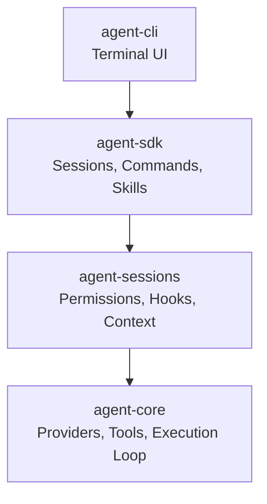

## "Could I build this myself?"

> Could I build a CLI like Claude Code using my own AI agent library?

Ten months ago, I published `Robota SDK` to npm — an AI agent library with multi-provider support, tools, plugins, and team agents.

While using Claude Code recently, I discovered `AGENTS.md` and got curious: could I build a coding agent CLI with my own SDK?

### Robota SDK Structure

| Layer          | Packages                           | Role                                   |
| -------------- | ---------------------------------- | -------------------------------------- |
| Core libraries | `agent-core, sessions, tools, sdk` | Execution loop, conversation, plugins  |
| AI providers   | `anthropic / openai / google`      | Claude, GPT-4, Gemini                  |
| Plugins (9)    | `agent-plugin-*`                   | Logging, analytics, errors, perf, etc. |
| DAG (8)        | `dag-core ~ dag-worker`            | Workflow execution engine              |
| Other          | `team, remote, mcp`                | Multi-agent, remote, MCP               |

## What is AGENTS.md?

> It's a set of instructions injected into the system prompt at the start of a conversation

When Claude Code finds an `AGENTS.md` file, the agent follows those rules throughout the session. It turned out to be a markdown file that lays out project-level rules as a directive.

Files like `AGENTS.md` and `CLAUDE.md` are discovered from the project root and injected into the system prompt. The LLM treats this content as project rules and follows them accordingly.

### How it works

- When a conversation starts, the contents of `AGENTS.md` are placed into the system prompt
- If the document links to other `.md` files, they're remembered and loaded on demand
- The LLM follows these rules while calling tools, receiving results, and making further decisions

At its core, a coding agent comes down to three things: `system prompt` + `tools` + `execution loop`.

## Project Structure the Agent Reads

> Drop files in the right folders and the agent picks them up automatically

A coding agent scans specific directories from the project root to automatically load skills, hooks, and configuration.

| Path                    | Contents                                               |
| ----------------------- | ------------------------------------------------------ |
| `.agents/skills/`       | Project-specific skills — invokable via slash commands |
| `.agents/rules/`        | Project rules — referenced from `AGENTS.md`            |
| `.agents/tasks/`        | Backlog and in-progress task tracking                  |
| `.claude/settings.json` | Hook configuration, permission allow/deny lists        |
| `.claude/commands/`     | Custom Claude Code commands                            |

## The Core Toolset

> The agent's hands — these 6 tools handle reading, writing, and running code

I expected to need dozens of tools, but it turned out that 6 tools were enough to handle nearly every coding task.

| Tool    | Role                 | Example                       |
| ------- | -------------------- | ----------------------------- |
| `Bash`  | Run shell commands   | pnpm test, git status, ls     |
| `Read`  | Read files           | Browse source code and config |
| `Write` | Create files         | Write new files               |
| `Edit`  | Edit parts of a file | Fix a single function         |
| `Glob`  | Search for files     | \*_/_.ts pattern matching     |
| `Grep`  | Search file contents | Find a function name in code  |

The LLM freely combines and calls these tools — reading files, making edits, running tests, checking results. It's exactly what a developer does in the terminal.

## The Execution Loop

> Repeat: call LLM → run tool → feed result back

I assumed calling the LLM once would give you an answer. In reality, it loops: call a tool, return the result, make another judgment — over and over.

| Step | Action                                                     |
| ---- | ---------------------------------------------------------- |
| 1    | Send a message to the LLM                                  |
| 2    | If the response includes tool calls, execute the tools     |
| 3    | Add the results to the conversation and call the LLM again |
| 4    | If there are no tool calls, output the final response      |

In each round, the LLM response streams token by token in real time. The user watches the AI reason through the problem live.

## Tool Execution Permissions

> A structure for deciding which tools to allow and which to block

The agent modifies files and executes shell commands. Every tool call is evaluated for permission before it runs.

### Three-stage evaluation

- deny list — explicitly blocked patterns (e.g., rm -rf /)
- allow list — pre-approved patterns (e.g., pnpm test:\*)
- mode policy — everything else is decided by the current mode

### Four permission modes

| Mode              | Behavior                                              |
| ----------------- | ----------------------------------------------------- |
| plan              | Read-only; all writes blocked                         |
| default           | Dangerous tools require user confirmation             |
| acceptEdits       | File edits auto-approved; shell commands still prompt |
| bypassPermissions | Everything auto-approved (dangerous)                  |

## Hooks

> Intercept key moments: tool execution, session start/end, user input

Custom logic can be inserted at various points in the coding agent's flow — not just before and after tool use, but also at session start/end and immediately after user input.

| Hook Event         | When             | Example use                         |
| ------------------ | ---------------- | ----------------------------------- |
| `PreToolUse`       | Before tool runs | Branch protection, block risky cmds |
| `PostToolUse`      | After tool runs  | Auto-formatting, run linter         |
| `SessionStart`     | Session starts   | Load context, check state           |
| `Stop`             | Session ends     | Save logs, cleanup                  |
| `UserPromptSubmit` | After user input | Pre-process input, validate         |

Hooks can be implemented as shell commands, HTTP calls, prompts, or sub-agent executions.

## Checkpoints and Undo

> Automatically track file changes and roll back to any previous state

File state is automatically snapshotted after every prompt. Only files modified by the `Write` and `Edit` tools are tracked — files changed by Bash commands (rm, mv, etc.) are not.

### Undo options

| Option              | Behavior                                                      |
| ------------------- | ------------------------------------------------------------- |
| Restore code + chat | Rolls back both files and conversation to that point          |
| Restore chat only   | Rolls back the conversation but keeps current files           |
| Restore code only   | Rolls back files but keeps the conversation                   |
| Summarize from here | Compresses the conversation after this point (no file change) |

Checkpoints are for fast, session-scoped recovery. They are not a replacement for Git.

## Skills

> Drop a skill file in the folder and invoke it with a slash command

### Skill file structure

```yaml
---
name: commit
description: Commit changes
context: fork
---
Skill prompt content...
```

- `name` — the slash command name (/commit)
- `description` — shown in the command menu
- `context: fork` — runs in a separate session (sub-agent)

Skills are configured per project. Repetitive tasks like code review, commit, test, and doc generation become one-liner slash commands.

## The Context Management Problem

> The longer the conversation, the more the AI forgets

It took a single prompt with 10 tool calls filling half the context window for me to realize this was a real problem.

AI models have a cap on context size. Sonnet 4.5 supports 200K tokens, Opus 4.6 supports 1M. That sounds like a lot — but a coding agent burns through context fast.

### Why it's a problem

- Not just conversation — tool execution logs, file contents, and command output all pile into the context
- Every time a tool reads a file, that content gets appended to the conversation
- Ten tool calls in one prompt means ten results all occupying context space
- When the context exceeds the model's limit, the API returns an error

### What a coding agent needs to handle

- Track how full the context is
- Compress earlier conversation when approaching the limit
- Preserve the system prompt (`AGENTS.md`, etc.) without compressing it
- Truncate tool output when it's too large

## Building the CLI

> Assembled the execution loop, tools, and permissions on top of the existing agent

Once I understood all of this, I was confident I could build it with my SDK. Wiring up `AGENTS.md` and the execution loop was enough to get something that behaved like Claude Code. The key was the six core tools (`Bash, Read, Write, Edit, Glob, Grep`). And this architecture isn't tied to Anthropic's API — it would work the same way with OpenAI's API.

I layered it on top of the existing Robota SDK:



## Feature List

> You have to build all of it eventually

Anyone migrating from Claude Code will expect familiar features. Each one was tedious to implement, but none could be skipped.

### Terminal UI

- React-based TUI (Ink)
- Streaming markdown rendering + debounce
- Real-time tool execution display + Edit Diff
- CJK (Korean) input support

### Sessions and input

- Resume / fork / name sessions
- Slash commands + Tab autocomplete
- Multi-line paste
- Interrupt (ESC, Ctrl+C) + prompt queue

### System

- 4-mode permission system, hook system
- Sub-agent execution
- Non-interactive mode (Headless Transport)
- Model selection, language settings, first-run setup

## Challenges Along the Way (Part 1)

> Korean input in the terminal was not straightforward

### CJK Input

- Problem — Korean IME didn't work correctly in terminal raw mode. Characters dropped, last character missing, Korean dropped on spacebar.
- Cause — React `useState` batches asynchronously, but IME sends keystrokes synchronously
- Fix — Dropped `ink-text-input` and wrote `CjkTextInput` from scratch. Used `useRef` for immediate updates; `useState` only for render triggers

### Mac Terminal.app Crash (SIGSEGV)

- Problem — Typing Korean in Terminal.app crashed the terminal application itself
- Cause — When there's no empty space below the input box, the cursor points to a position that doesn't exist; when the IME queries that position, it triggers a segmentation fault
- Fix — Added an empty line below the input box. Giving the cursor room to move prevents the IME from accessing an invalid memory location

## Challenges Along the Way (Part 2)

> Fixing the data structure unlocked everything else

### Context Overflow

- Problem — Tool results accumulating in real time caused the context to balloon, causing the LLM to error out
- Fix — When the threshold is exceeded, insert a message saying "omitted due to context limits." The LLM sees this and recovers naturally

### Expanding the History Model

The original agent only stored the chat messages needed for API calls. But managing sessions in a CLI required recording not just conversation, but also tool executions, skill calls, events, and more.

I added an `IHistoryEntry` type to `agent-core` and refactored everything to put all information on a single timeline:

- **append-only, read-only** rule — no edits or deletes. Missing data means a bug, not a fallback
- **transparent storage** — loaded as-is on resume. If transformation is needed, fix the storage logic

This structure made session resumption, history display, and event tracking all simpler.

## Context Compression — How I Implemented It

> Five strategies for managing context

| Strategy               | Description                                                   |
| ---------------------- | ------------------------------------------------------------- |
| Early detection        | Estimate tokens before each round (chars/2). Warn above 83.5% |
| Auto-compress          | `/compact` or automatic. AI summarizes earlier messages       |
| Preserve system prompt | Keep `AGENTS.md` and similar content intact                   |
| Cap tool output        | Auto-truncate at 30K characters                               |
| Skip tool results      | Above 80%: skip remaining results + notify LLM of omission    |

**Key insight:** One compression pass saves 40–60% of tokens. The tradeoff is losing fine-grained context.

## Plugin Compatibility with Claude Code

> Without ecosystem compatibility, it's a tool only you will use

### Plugin commands

```
/plugin marketplace add owner/repo    ← register a marketplace
/plugin install name@marketplace      ← install a plugin
```

You can register a marketplace and install or remove plugins from it. The same path structure as Claude Code is supported.

### Sub-agents

Sub-agent support is implemented. If a skill file's frontmatter includes `context: fork`, it runs in a separate session isolated from the main conversation. It's not perfect yet.

## So, Is It Usable?

> I've used it for real coding work — it handles day-to-day development

Yes, it works. Robota can now be developed using the Robota CLI itself.

- Same toolset as Claude Code (Bash, Read, Write, Edit, Glob, Grep)
- Compatible with the skill/plugin ecosystem
- Permission system and hook system implemented
- Context compression for long sessions
- Resume sessions across multiple days
- Delegate parallel work to sub-agents
- Streaming markdown rendering
- CJK (Korean) input support
- Since `agent-sdk` is a standalone package, any project can import the SDK and set up the same coding assistant

That said, there are a few caveats:

- Claude Code is still more stable
- Pay-per-use API costs may exceed a subscription plan
- Requires an API key, which is a barrier for non-developers

On the other hand, since it runs on my own library, swapping providers, customizing behavior, and extending it is entirely open.

## Closing Thoughts

385 commits and 53 npm releases over 9 days. Building it gave me a much sharper understanding of how agents actually work.

Now I keep thinking of things I want to build on top of this. I plan to tackle them one by one.

If you have questions or feedback, feel free to leave them on [GitHub](https://github.com/woojubb/robota).

```
# https://robota.io

$ npm install -g @robota-sdk/agent-cli
$ robota
```
