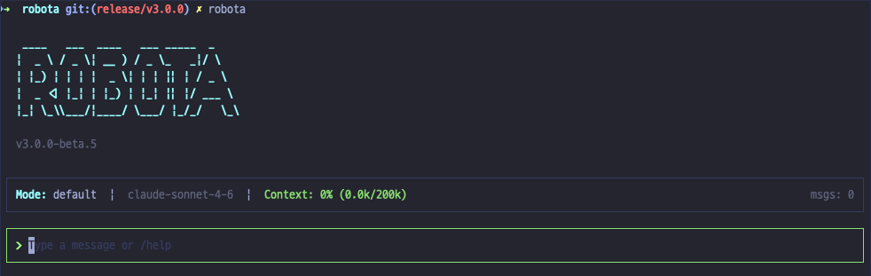

# Robota SDK

A TypeScript framework for building AI agents with multi-provider support, tool calling, and extensible plugin architecture.



## Overview

Robota SDK ships three layers you can use independently or together:

- **CLI** (`agent-cli`) — A ready-to-use AI coding assistant in your terminal. Install and run immediately, no code required.
- **Assembly Layer** (`agent-sdk`) — A programmable interface for embedding the same assistant capabilities into your own scripts, tools, or workflows.
- **Agent Library** (`agent-core`, `agent-tools`, `agent-sessions`, and providers) — Low-level building blocks for constructing any AI agent system from scratch.

The CLI is built on top of the Assembly Layer. The Assembly Layer is assembled from the Agent Library. You can enter at any layer.

## Quick Start

### Build an Agent (agent-core)

```typescript
import { Robota } from '@robota-sdk/agent-core';
import { AnthropicProvider } from '@robota-sdk/agent-provider-anthropic';

const provider = new AnthropicProvider({ apiKey: process.env.ANTHROPIC_API_KEY });

const agent = new Robota({
  name: 'MyAgent',
  aiProviders: [provider],
  defaultModel: {
    provider: 'anthropic',
    model: 'claude-sonnet-4-6',
    systemMessage: 'You are a helpful assistant.',
  },
});

const response = await agent.run('Explain TypeScript generics.');
console.log(response);
```

### Add Tools

```typescript
import { Robota } from '@robota-sdk/agent-core';
import { createZodFunctionTool } from '@robota-sdk/agent-tools';
import { z } from 'zod';

const calculatorTool = createZodFunctionTool({
  name: 'calculator',
  description: 'Perform arithmetic calculations',
  schema: z.object({
    expression: z.string().describe('Math expression to evaluate'),
  }),
  handler: async ({ expression }) => {
    // WARNING: eval() is used here for brevity only. Do not use in production.
    return { data: String(eval(expression)) }; // eslint-disable-line no-eval
  },
});

const agent = new Robota({
  name: 'ToolAgent',
  aiProviders: [provider],
  defaultModel: { provider: 'anthropic', model: 'claude-sonnet-4-6' }, // see CLAUDE_MODELS for available model IDs
  tools: [calculatorTool],
});

const response = await agent.run('What is 42 * 17?');
```

### Use the SDK (agent-sdk)

```typescript
import { query } from '@robota-sdk/agent-sdk';

// One-shot query with automatic config/context loading
const response = await query('List all TypeScript files in src/');
```

### Use the CLI (agent-cli)

```bash
npm install -g @robota-sdk/agent-cli
robota                              # Interactive TUI
robota -p "Explain this project"    # Print mode
```

## Why Robota SDK?

- **Type-Safe**: Strict TypeScript with zero `any` in production code
- **Multi-Provider**: Anthropic Claude, OpenAI, Google — same API, seamless switching
- **Tool Calling**: Zod-based schema validation for type-safe function calls
- **Plugin System**: Extensible lifecycle hooks for logging, analytics, error handling
- **Streaming**: Real-time text delta streaming from all providers
- **CLI Ready**: Built-in coding assistant CLI with permission system and context management

## Architecture

```
agent-cli              ← Interactive terminal AI coding assistant
  ↓
agent-sdk              ← Assembly layer: config, context, session factory, query()
  ↓
agent-sessions         ← Session lifecycle: permissions, hooks, compaction
agent-tools            ← Tool infrastructure + 8 built-in tools
agent-provider-*       ← AI provider implementations (anthropic, openai, google)
  ↓ (all three depend on)
agent-core             ← Foundation: Robota engine, abstractions, plugins
```

## Packages

| Package                                                                        | Description                                            |
| ------------------------------------------------------------------------------ | ------------------------------------------------------ |
| [`@robota-sdk/agent-core`](./packages/agent-core/)                             | Core agent runtime, abstractions, and plugin system    |
| [`@robota-sdk/agent-tools`](./packages/agent-tools/)                           | Tool registry, FunctionTool, and 8 built-in tools      |
| [`@robota-sdk/agent-sessions`](./packages/agent-sessions/)                     | Session with permissions, hooks, and compaction        |
| [`@robota-sdk/agent-sdk`](./packages/agent-sdk/)                               | Assembly layer with config/context loading and query() |
| [`@robota-sdk/agent-provider-anthropic`](./packages/agent-provider-anthropic/) | Anthropic Claude provider                              |
| [`@robota-sdk/agent-cli`](./packages/agent-cli/)                               | Interactive terminal AI coding assistant               |

## Documentation

- [Getting Started](./getting-started/) — Installation and first steps
- [Guide](./guide/) — Architecture, building agents, SDK, CLI
- [Examples](./examples/) — Working code samples
- [Development](./development/) — Contributing and monorepo setup

## Installation

```bash
# Core — build custom agents
npm install @robota-sdk/agent-core

# Provider
npm install @robota-sdk/agent-provider-anthropic @anthropic-ai/sdk
# npm install @robota-sdk/agent-provider-openai openai        # not yet published
# npm install @robota-sdk/agent-provider-google @google/generative-ai  # not yet published

# Tools — FunctionTool, Zod tools, built-in CLI tools
npm install @robota-sdk/agent-tools

# SDK — assembly layer with query() and createSession()
npm install @robota-sdk/agent-sdk

# CLI — terminal AI coding assistant
npm install -g @robota-sdk/agent-cli
```

## License

MIT
